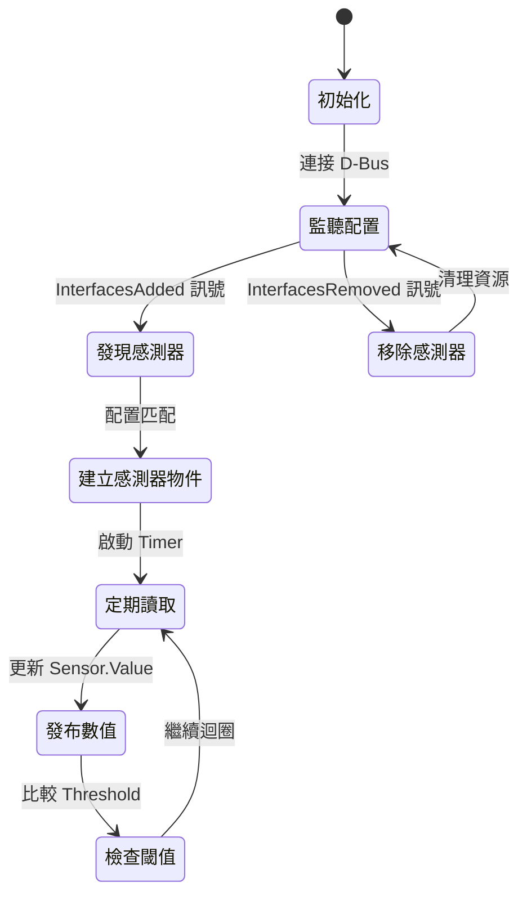

# dbus-sensors 架構概述

## 簡介

dbus-sensors 是 OpenBMC 中的感測器讀取應用程式集合，採用模組化設計，每種感測器類型由獨立的守護程式處理。此架構提供了高度的隔離性和可維護性。

---

## 設計理念

### 核心設計目標

| 目標 | 說明 |
|------|------|
| **隔離性** | 每種感測器類型在獨立守護程式中運行，單一感測器錯誤不影響其他感測器 |
| **執行時期配置** | 透過 D-Bus 從 Entity-Manager 動態接收配置 |
| **非同步架構** | 使用 Boost.Asio + sdbusplus 實現單執行緒非同步處理 |
| **多資料來源** | 支援 hwmon、D-Bus、直接驅動程式存取 |

### Reactor 模式

dbus-sensors 守護程式是 [Entity-Manager](../entity-manager/Home.md) 的 **Reactor**（反應器），動態建立和更新感測器配置：

```
┌─────────────────────────────────────────────────────────────────┐
│                     Entity-Manager                               │
│  ┌─────────────┐    ┌─────────────┐    ┌─────────────┐          │
│  │ JSON 配置檔 │───▶│ Probe 匹配  │───▶│ 發布到 D-Bus │          │
│  └─────────────┘    └─────────────┘    └─────────────┘          │
└────────────────────────────┬────────────────────────────────────┘
                             │ Configuration.<Type> 介面
                             ▼
┌─────────────────────────────────────────────────────────────────┐
│                      dbus-sensors                                │
│  ┌──────────────┐  ┌──────────────┐  ┌──────────────┐           │
│  │ ADCSensor    │  │ HwmonTemp    │  │ PSUSensor    │  ...      │
│  │ 守護程式     │  │ 守護程式     │  │ 守護程式     │           │
│  └──────────────┘  └──────────────┘  └──────────────┘           │
└─────────────────────────────────────────────────────────────────┘
```

---

## 守護程式架構

### 守護程式列表

| 守護程式 | 服務名稱 | 監聽的配置類型 | 資料來源 |
|----------|----------|----------------|----------|
| ADCSensor | `xyz.openbmc_project.ADCSensor` | ADC | hwmon (IIO) |
| HwmonTempSensor | `xyz.openbmc_project.HwmonTempSensor` | TMP75, TMP441, LM75A 等 | hwmon |
| PSUSensor | `xyz.openbmc_project.PSUSensor` | pmbus, INA219, ADM1275 等 | hwmon |
| FanSensor | `xyz.openbmc_project.FanSensor` | AspeedFan, I2CFan, NuvotonFan | hwmon |
| CPUSensor | `xyz.openbmc_project.CPUSensor` | XeonCPU | PECI |
| NVMeSensor | `xyz.openbmc_project.NVMeSensor` | NVME1000 | SMBus |
| ExternalSensor | `xyz.openbmc_project.ExternalSensor` | ExternalSensor | D-Bus |
| IpmbSensor | `xyz.openbmc_project.IpmbSensor` | IpmbSensor | IPMB |
| IntrusionSensor | `xyz.openbmc_project.IntrusionSensor` | ChassisIntrusionSensor | GPIO/I2C |
| ExitAirTempSensor | `xyz.openbmc_project.ExitAirTempSensor` | ExitAirTempSensor, CFMSensor | 計算值 |

### 單一守護程式生命週期



---

## 資料流向

### hwmon 感測器資料路徑

```
┌────────────────┐
│ 硬體裝置       │
│ (I2C/SPI/ADC)  │
└───────┬────────┘
        │ 驅動程式
        ▼
┌────────────────┐
│ Linux Kernel   │
│ hwmon 子系統   │
└───────┬────────┘
        │ sysfs
        ▼
┌────────────────┐     ┌────────────────┐
│ /sys/class/    │     │ dbus-sensors   │
│ hwmon/hwmonX/  │────▶│ 守護程式       │
│ temp1_input    │     └───────┬────────┘
└────────────────┘             │ D-Bus
                               ▼
                 ┌────────────────────────┐
                 │ /xyz/openbmc_project/  │
                 │ sensors/temperature/X  │
                 └────────────────────────┘
```

### 感測器檔案對應

| hwmon 檔案 | 感測器類型 | D-Bus 路徑 |
|------------|------------|------------|
| `tempX_input` | temperature | `/xyz/openbmc_project/sensors/temperature/<name>` |
| `inX_input` | voltage | `/xyz/openbmc_project/sensors/voltage/<name>` |
| `currX_input` | current | `/xyz/openbmc_project/sensors/current/<name>` |
| `powerX_input` | power | `/xyz/openbmc_project/sensors/power/<name>` |
| `fanX_input` | fan_tach | `/xyz/openbmc_project/sensors/fan_tach/<name>` |

---

## 核心類別

### Sensor 基礎類別

所有感測器類型繼承自 `Sensor` 基礎類別，提供：

- D-Bus 物件管理
- 閾值檢查邏輯
- 數值更新機制
- `PropertiesChanged` 訊號發送

```cpp
// include/sensor.hpp
class Sensor
{
  public:
    // D-Bus 屬性
    double value;
    double maxValue;
    double minValue;
    
    // 閾值
    std::optional<double> warningHigh;
    std::optional<double> warningLow;
    std::optional<double> criticalHigh;
    std::optional<double> criticalLow;
    
    // 更新數值並檢查閾值
    void updateValue(double newValue);
};
```

### Thresholds 類別

閾值處理模組，支援：

- Warning（警告）等級
- Critical（嚴重）等級
- Hysteresis（遲滯）機制
- 告警訊號發送

---

## 建置與依賴

### 主要依賴

| 依賴 | 版本 | 說明 |
|------|------|------|
| Boost | ≥1.88.0 | Asio、容器、JSON |
| sdbusplus | - | D-Bus C++ 綁定 |
| phosphor-logging | - | 日誌記錄 |
| nlohmann_json | - | JSON 解析 |
| libgpiodcxx | - | GPIO 存取 |
| libi2c | - | I2C 存取 |
| liburing | - | io_uring 支援 |

### Meson 建置選項

```bash
# 建置所有感測器守護程式
meson setup build
meson compile -C build

# 執行測試
meson test -C build
```

---

## 設計考量

### 為何採用多守護程式架構？

1. **故障隔離**：單一守護程式崩潰不影響其他感測器
2. **獨立更新**：可單獨修改和部署個別感測器類型
3. **資源控制**：每個守護程式有獨立的資源限制
4. **模組化測試**：便於單元測試和整合測試

### 為何使用非同步架構？

1. **效能**：避免多執行緒的同步開銷
2. **簡化**：單執行緒避免競態條件
3. **資源**：降低記憶體使用（嵌入式環境限制）
4. **整合**：與 sdbusplus 原生整合

---

## 相關文件

- [感測器類型總覽](SensorTypes.md) - 支援的感測器類型
- [D-Bus API](DBusAPI.md) - D-Bus 介面定義
- [Entity-Manager 整合](EntityManagerIntegration.md) - Reactor 模式詳解
- [Entity-Manager 架構](../entity-manager/Architecture.md) - 配置管理架構
