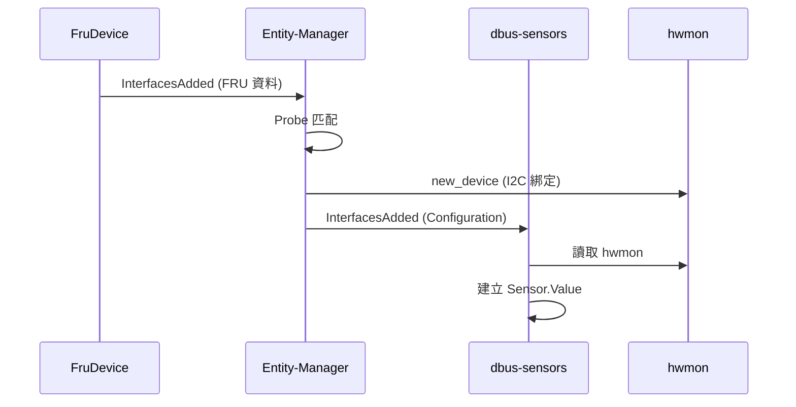

# Entity-Manager 整合

## 簡介

dbus-sensors 守護程式是 Entity-Manager 的 **Reactor**（反應器），它監聽 Entity-Manager 發布的配置介面，並據此動態建立和管理感測器。

---

## Reactor 模式

```
                    Entity-Manager
                         │
                         │ Configuration.<Type> 介面
                         ▼
    ┌─────────────────────────────────────────────────┐
    │                  D-Bus                           │
    │  /xyz/openbmc_project/inventory/system/board/X  │
    └─────────────────────────────────────────────────┘
                         │
         ┌───────────────┼───────────────┐
         │               │               │
         ▼               ▼               ▼
    ┌─────────┐    ┌─────────┐    ┌─────────┐
    │ ADC     │    │ Hwmon   │    │ PSU     │
    │ Sensor  │    │ Temp    │    │ Sensor  │
    └─────────┘    └─────────┘    └─────────┘
```

---

## 配置介面

Entity-Manager 為每個 Exposes 記錄建立 D-Bus 物件，介面名稱格式：

```
xyz.openbmc_project.Configuration.<Type>
```

例如：
- `xyz.openbmc_project.Configuration.ADC`
- `xyz.openbmc_project.Configuration.TMP75`
- `xyz.openbmc_project.Configuration.pmbus`

---

## 監聽機制

dbus-sensors 守護程式使用以下機制監聽配置：

### InterfacesAdded 訊號

當 Entity-Manager 發布新配置時：

```cpp
// 監聯 InterfacesAdded 訊號
conn->async_method_call(
    [&](sdbusplus::message::message& msg) {
        sdbusplus::message::object_path path;
        std::map<std::string, std::map<...>> interfaces;
        msg.read(path, interfaces);
        
        // 檢查是否為感興趣的介面
        if (interfaces.contains("xyz.openbmc_project.Configuration.TMP75")) {
            createSensor(path, interfaces);
        }
    },
    ...
);
```

### GetManagedObjects

啟動時取得現有配置：

```bash
busctl call xyz.openbmc_project.EntityManager \
    /xyz/openbmc_project/inventory \
    org.freedesktop.DBus.ObjectManager GetManagedObjects
```

---

## 配置屬性讀取

從 D-Bus 介面讀取感測器參數：

```bash
$ busctl introspect xyz.openbmc_project.EntityManager \
    /xyz/openbmc_project/inventory/system/board/Baseboard/Inlet_Temp

xyz.openbmc_project.Configuration.TMP75  interface
.Address                                 property  t  72
.Bus                                     property  t  1
.Name                                    property  s  "Inlet Temp"
.Type                                    property  s  "TMP75"
```

---

## 生命週期管理

### 感測器建立

1. Entity-Manager 發布 `Configuration.<Type>` 介面
2. dbus-sensors 收到 `InterfacesAdded` 訊號
3. 讀取配置屬性
4. 綁定硬體驅動程式（I2C 裝置）
5. 建立 `Sensor.Value` 物件
6. 開始定期讀取

### 感測器移除

1. Entity-Manager 移除配置（移除 FRU 後）
2. dbus-sensors 收到 `InterfacesRemoved` 訊號
3. 停止讀取
4. 移除 D-Bus 物件
5. 解除硬體綁定

---

## I2C 裝置綁定

Entity-Manager 負責綁定 I2C 裝置：

```bash
# Entity-Manager 執行的操作
echo "tmp75 0x48" > /sys/bus/i2c/devices/i2c-1/new_device
```

dbus-sensors 守護程式等待 hwmon 裝置出現後開始讀取。

---

## 配置路徑結構

```
/xyz/openbmc_project/inventory/system/board/
├── Baseboard/
│   ├── Inlet_Temp        (Configuration.TMP75)
│   ├── Outlet_Temp       (Configuration.TMP75)
│   └── P12V              (Configuration.ADC)
├── PCIe_Card_5/
│   └── Card_Temp         (Configuration.TMP441)
└── PSU1/
    ├── PSU1_VIN          (Configuration.pmbus)
    └── PSU1_IOUT         (Configuration.pmbus)
```

---

## 監控配置變更

```bash
# 監聽 Entity-Manager 介面變更
busctl monitor xyz.openbmc_project.EntityManager \
    --match "type='signal',interface='org.freedesktop.DBus.ObjectManager'"
```

---

## 偵測 → 配置 → 感測器 流程



---

## 配置範例對應

**JSON 配置：**

```json
{
    "Exposes": [
        {
            "Address": "0x48",
            "Bus": 1,
            "Name": "Inlet Temp",
            "Type": "TMP75"
        }
    ],
    "Probe": "TRUE"
}
```

**Entity-Manager D-Bus 輸出：**

```
/xyz/openbmc_project/inventory/system/board/X/Inlet_Temp
  xyz.openbmc_project.Configuration.TMP75
    .Address = 72
    .Bus = 1
    .Name = "Inlet Temp"
    .Type = "TMP75"
```

**dbus-sensors D-Bus 輸出：**

```
/xyz/openbmc_project/sensors/temperature/Inlet_Temp
  xyz.openbmc_project.Sensor.Value
    .Value = 32.5
```

---

## 除錯技巧

### 檢查配置是否發布

```bash
busctl tree xyz.openbmc_project.EntityManager | grep Configuration
```

### 確認感測器守護程式是否收到配置

```bash
journalctl -u xyz.openbmc_project.hwmontempsensor.service
```

### 驗證配置介面內容

```bash
busctl introspect xyz.openbmc_project.EntityManager \
    /xyz/openbmc_project/inventory/system/board/X/Y
```

---

## 相關文件

- [架構概述](Architecture.md)
- [設定指南](ConfigurationGuide.md)
- [Entity-Manager 架構](../entity-manager/Architecture.md)
- [Entity-Manager 核心概念](../entity-manager/CoreConcepts.md)
