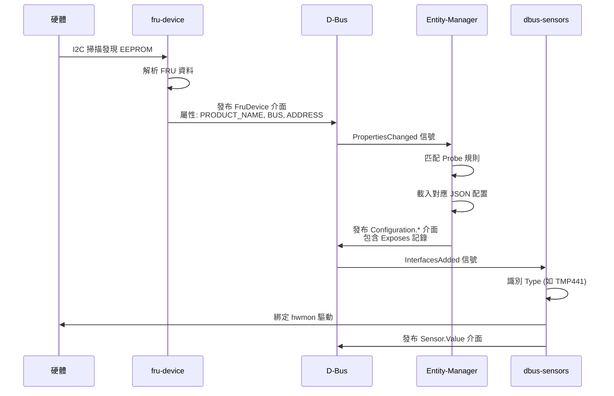
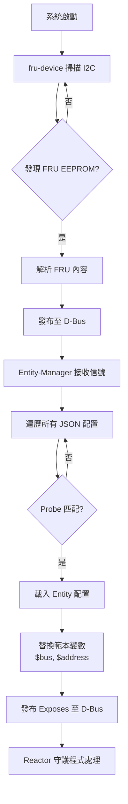

# 架構概述

## 簡介

Entity-Manager 是 OpenBMC 生態系統中的核心元件，負責在執行時期動態管理系統硬體配置。它採用 JSON 驅動的設定方式，能夠自動偵測硬體變更並相應地更新 D-Bus 上的資源表示。

## 設計目標

根據官方設計文件，Entity-Manager 有以下三個主要目標：

### 1. 最小化移植時間

```
傳統方式                          Entity-Manager 方式
┌─────────────────┐              ┌─────────────────┐
│ 為每個平台編寫   │              │ 編寫 JSON 配置   │
│ 獨立程式碼      │              │ 檔案即可        │
│                 │              │                 │
│ 需要重新編譯    │              │ 無需重新編譯    │
│ 除錯困難        │              │ 配置即文件      │
└─────────────────┘              └─────────────────┘
```

### 2. 減少平台間程式碼差異

- 共用同一套 Entity-Manager 程式碼
- 平台差異僅體現在 JSON 配置檔中
- 便於維護和更新

### 3. 長期可維護性

- 支援數百個平台和元件
- 元件間最大程度地互通
- 統一的配置格式降低學習曲線

---

## 系統架構

### 三層式架構

Entity-Manager 生態系統由三個主要層次組成：

```
                    ┌─────────────────────────────────────────┐
                    │            應用層 Application           │
                    │  ┌─────────┐ ┌─────────┐ ┌───────────┐ │
                    │  │ bmcweb  │ │  IPMI   │ │  其他應用  │ │
                    │  │(Redfish)│ │ Handler │ │           │ │
                    │  └────┬────┘ └────┬────┘ └─────┬─────┘ │
                    └───────┼───────────┼───────────┼───────┘
                            │           │           │
                            ▼           ▼           ▼
┌───────────────────────────────────────────────────────────────┐
│                         D-Bus 匯流排                           │
│  xyz.openbmc_project.Configuration.*                          │
│  xyz.openbmc_project.Sensor.*                                 │
│  xyz.openbmc_project.FruDevice                                │
└───────────────────────────────────────────────────────────────┘
        ▲               ▲                       ▲
        │               │                       │
┌───────┴───────┐ ┌─────┴─────┐ ┌───────────────┴───────────────┐
│   Reactor     │ │  Entity-  │ │      Detection Daemon          │
│   Daemon      │ │  Manager  │ │                                │
│               │ │           │ │ ┌───────────┐ ┌─────────────┐  │
│ ┌───────────┐ │ │ JSON 配置  │ │ │fru-device │ │ peci-pcie   │  │
│ │dbus-sensor│ │ │ 解析與發布 │ │ │(I2C 掃描) │ │ (CPU PCIe)  │  │
│ │(hwmon)    │ │ │           │ │ └───────────┘ └─────────────┘  │
│ └───────────┘ │ │           │ │ ┌───────────┐                  │
│               │ │           │ │ │smbios-mdr │                  │
│               │ │           │ │ │(BIOS 表格)│                  │
└───────────────┘ └───────────┘ │ └───────────┘                  │
                                └────────────────────────────────┘
```

### 元件說明

#### 偵測守護程式 (Detection Daemon)

偵測守護程式負責在執行時期發現硬體元件並將資訊發布到 D-Bus。主要包括：

| 守護程式 | 功能 | D-Bus 服務名稱 |
|---------|------|---------------|
| **fru-device** | 掃描 I2C 匯流排，讀取 IPMI FRU EEPROM | `xyz.openbmc_project.FruDevice` |
| **peci-pcie** | 透過 CPU PECI 匯流排讀取 PCIe 裝置清單 | `xyz.openbmc_project.PCIe` |
| **smbios-mdr** | 解析 x86 SMBIOS 表格取得系統資訊 | `xyz.openbmc_project.Smbios.MDR_V2` |

#### Entity-Manager

Entity-Manager 是核心配置引擎：

1. **監聽 D-Bus**：持續監聽偵測守護程式發布的介面
2. **匹配 Probe**：根據 JSON 配置中的 Probe 規則進行匹配
3. **載入配置**：當 Probe 匹配成功時，載入對應的 Entity 配置
4. **發布 Exposes**：將 Entity 中的 Exposes 記錄發布到 D-Bus
5. **持久化**：產生 `system.json` 檔案保存目前配置狀態

#### 反應器守護程式 (Reactor Daemon)

反應器守護程式監聽 Entity-Manager 發布的配置，並根據配置執行實際功能：

| 守護程式 | 功能 | 監聽的 Type |
|---------|------|-------------|
| **hwmontempsensor** | 讀取 hwmon 溫度感測器 | `TMP75`, `TMP421`, `TMP441` 等 |
| **adcsensor** | 讀取 ADC 電壓感測器 | `ADC` |
| **fansensor** | 讀取風扇轉速 | `AspeedFan`, `NuvotonFan` |
| **psusensor** | 讀取電源供應器感測器 | `pmbus` 相關類型 |

---

## 資料流程

### 完整偵測流程



### 配置載入流程



---

## 目錄結構

### Entity-Manager 專案結構

```
entity-manager/
├── configurations/          # JSON 配置檔案目錄
│   ├── baseboard.json      # 主機板配置範例
│   ├── chassis.json        # 機箱配置範例
│   └── ...                 # 更多平台配置
├── docs/                   # 文件
│   ├── entity_manager_dbus_api.md
│   ├── my_first_sensors.md
│   └── associations.md
├── schemas/                # JSON Schema 定義
│   └── legacy.json
├── src/                    # 原始碼
│   ├── entity_manager.cpp  # 主程式
│   ├── fru_device.cpp      # FRU 裝置守護程式
│   └── ...
├── scripts/                # 輔助腳本
│   ├── autojson.py
│   └── generate_config_list.sh
└── meson.build             # 建置系統
```

---

## D-Bus 命名空間

Entity-Manager 使用以下 D-Bus 命名空間：

### 服務名稱

| 服務 | 名稱 |
|-----|------|
| Entity-Manager | `xyz.openbmc_project.EntityManager` |
| FruDevice | `xyz.openbmc_project.FruDevice` |

### 物件路徑

```
/xyz/openbmc_project/
├── EntityManager           # Entity-Manager 根節點
├── inventory/
│   └── system/
│       └── board/          # 主機板類型實體
│           ├── {BoardName}/
│           │   ├── {SensorName1}
│           │   └── {SensorName2}
│           └── ...
└── FruDevice/              # FRU 裝置節點
    ├── {ProductName}
    └── {ProductName}_0
```

### 介面命名

| 介面 | 用途 |
|-----|------|
| `xyz.openbmc_project.Configuration.{Type}` | Entity-Manager 發布的配置 |
| `xyz.openbmc_project.FruDevice` | FRU 裝置資訊 |
| `xyz.openbmc_project.Inventory.Item.*` | 庫存項目類型 |

---

## 重新偵測機制

Entity-Manager 支援多次偵測，在以下情況會觸發重新掃描：

- **主機電源狀態變更**：開機/關機時
- **熱插拔事件**：硬碟、PSU 插拔
- **I2C Mux 變更**：新增 I2C 多工器時

### 最小化變更原則

當重新偵測時，Entity-Manager 只會：

1. ✅ 新增新發現的元件配置
2. ✅ 移除不再存在的元件配置
3. ❌ 不會影響未改變的配置

```
重新偵測流程：
┌──────────────────────────────────────────────────────┐
│ 目前狀態: [板卡A] [板卡B] [PSU1]                       │
└──────────────────────────────────────────────────────┘
                    │
                    ▼ 偵測到 PSU2 熱插入
┌──────────────────────────────────────────────────────┐
│ 新狀態: [板卡A] [板卡B] [PSU1] [PSU2 新增]            │
└──────────────────────────────────────────────────────┘
                    │
                    ▼ 偵測到 PSU1 移除
┌──────────────────────────────────────────────────────┐
│ 新狀態: [板卡A] [板卡B] [PSU2]                        │
└──────────────────────────────────────────────────────┘
```

---

## 設計限制

### 明確排除的範圍

根據設計文件，以下功能**不在** Entity-Manager 的範圍內：

1. **不直接參與裝置偵測**
   - Entity-Manager 依賴其他 D-Bus 應用程式發布可偵測的介面
   - 例如：fru-device 負責 I2C 掃描

2. **不直接管理特定裝置**
   - Entity-Manager 只負責配置發布
   - 實際裝置管理由 Reactor 守護程式處理
   - 這確保 Entity-Manager 保持小巧且對所有使用者有效

---

## 下一步

- 了解 [核心概念](CoreConcepts.md) 中 Entity、Exposes、Probe 的詳細定義
- 查看 [D-Bus API](DBusAPI.md) 了解介面規格
- 閱讀 [設定指南](ConfigurationGuide.md) 開始編寫配置檔

---

> 📖 **延伸閱讀**：[OpenBMC 架構文件](https://github.com/openbmc/docs/blob/master/architecture)
