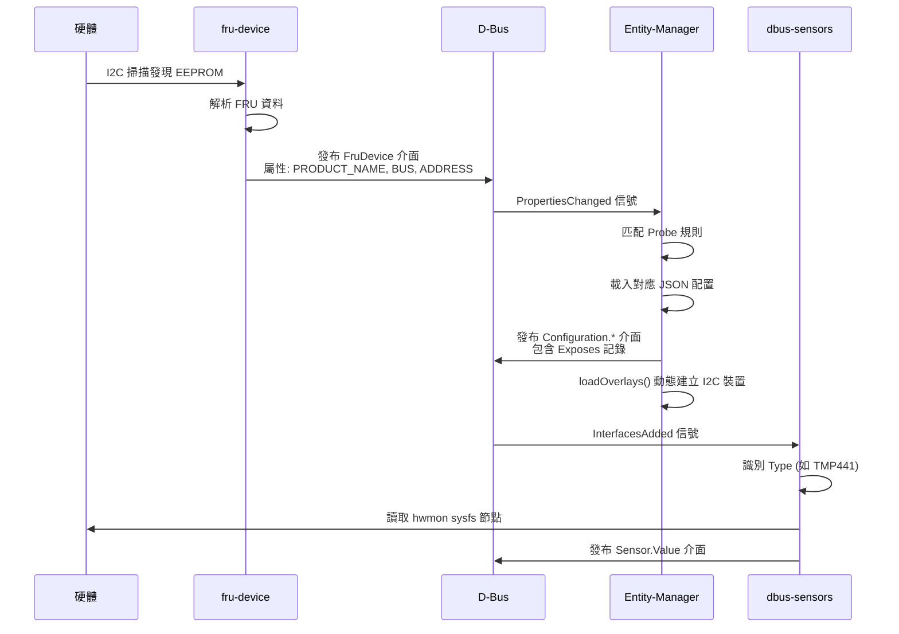
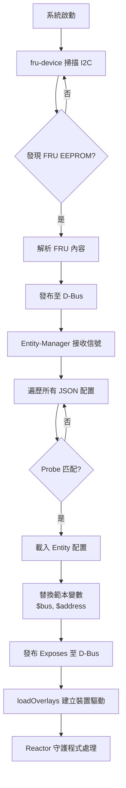

# 架構概述

## 簡介

Entity-Manager 是 OpenBMC 生態系統中的核心元件，負責在執行時期動態管理系統硬體配置。它採用 JSON 驅動的設定方式，能夠自動偵測硬體變更並相應地更新 D-Bus 上的資源表示。

## 設計目標

根據官方設計文件（[README.md](https://github.com/openbmc/entity-manager/blob/master/README.md)），Entity-Manager 有以下三個主要目標：

### 1. 最小化移植時間

```
傳統方式                          Entity-Manager 方式
┌─────────────────┐              ┌─────────────────┐
│ 為每個平台編寫   │              │ 編寫 JSON 配置   │
│ 獨立程式碼      │              │ 檔案即可        │
│                 │              │                 │
│ 需要重新編譯    │              │ 無需重新編譯    │
│ 除錯困難        │              │ 配置即文件      │
└─────────────────┘              └─────────────────┘
```

### 2. 減少平台間程式碼差異

- 共用同一套 Entity-Manager 程式碼
- 平台差異僅體現在 JSON 配置檔中
- 便於維護和更新

### 3. 長期可維護性

- 支援數百個平台和元件
- 元件間最大程度地互通
- 統一的配置格式降低學習曲線

---

## 系統架構

### 三層式架構

Entity-Manager 生態系統由三個主要層次組成：

```
                    ┌─────────────────────────────────────────┐
                    │            應用層 Application           │
                    │  ┌─────────┐ ┌─────────┐ ┌───────────┐ │
                    │  │ bmcweb  │ │  IPMI   │ │  其他應用  │ │
                    │  │(Redfish)│ │ Handler │ │           │ │
                    │  └────┬────┘ └────┬────┘ └─────┬─────┘ │
                    └───────┼───────────┼───────────┼───────┘
                            │           │           │
                            ▼           ▼           ▼
┌───────────────────────────────────────────────────────────────┐
│                         D-Bus 匯流排                           │
│  xyz.openbmc_project.Configuration.*                          │
│  xyz.openbmc_project.Sensor.*                                 │
│  xyz.openbmc_project.FruDevice                                │
└───────────────────────────────────────────────────────────────┘
        ▲               ▲                       ▲
        │               │                       │
┌───────┴───────┐ ┌─────┴─────┐ ┌───────────────┴───────────────┐
│   Reactor     │ │  Entity-  │ │      Detection Daemon          │
│   Daemon      │ │  Manager  │ │                                │
│               │ │           │ │ ┌───────────┐ ┌─────────────┐  │
│ ┌───────────┐ │ │ JSON 配置  │ │ │fru-device │ │ peci-pcie   │  │
│ │dbus-sensor│ │ │ 解析與發布 │ │ │(I2C 掃描) │ │ (CPU PCIe)  │  │
│ │(hwmon)    │ │ │           │ │ └───────────┘ └─────────────┘  │
│ └───────────┘ │ │ Overlay   │ │ ┌───────────┐ ┌─────────────┐  │
│               │ │  裝置建立  │ │ │smbios-mdr │ │gpio-presence│  │
│               │ │ Topology  │ │ │(BIOS 表格)│ │ (GPIO 偵測) │  │
│               │ │  關聯建模  │ │ └───────────┘ └─────────────┘  │
└───────────────┘ └───────────┘ │ ┌─────────────────────────┐    │
                                │ │devicetree-vpd-parser    │    │
                                │ │(裝置樹 VPD 解析)        │    │
                                │ └─────────────────────────┘    │
                                └────────────────────────────────┘
```

### 元件說明

#### 偵測守護程式 (Detection Daemon)

偵測守護程式負責在執行時期發現硬體元件並將資訊發布到 D-Bus。主要包括：

| 守護程式                  | 功能                                   | D-Bus 服務名稱                      | Source Code                  |
| ------------------------- | -------------------------------------- | ----------------------------------- | ---------------------------- |
| **fru-device**            | 掃描 I2C 匯流排，讀取 IPMI FRU EEPROM  | `xyz.openbmc_project.FruDevice`     | `src/fru_device/`            |
| **gpio-presence**         | 透過 GPIO 腳位偵測裝置是否存在         | `xyz.openbmc_project.gpiopresence`  | `src/gpio-presence/`         |
| **peci-pcie**             | 透過 CPU PECI 匯流排讀取 PCIe 裝置清單 | `xyz.openbmc_project.PCIe`          | 獨立 repo                    |
| **smbios-mdr**            | 解析 x86 SMBIOS 表格取得系統資訊       | `xyz.openbmc_project.Smbios.MDR_V2` | 獨立 repo                    |
| **devicetree-vpd-parser** | 從裝置樹讀取 VPD (Vital Product Data)  | —                                   | `src/devicetree_vpd_parser/` |

> ⚠️ **簡化說明**：上表的 peci-pcie 和 smbios-mdr 的 D-Bus 服務名稱為常見配置，實際名稱可能因部署而異。

> 💡 **補充**：根據 README.md，在大型資料中心場景中，偵測守護程式可以被替換為與上層庫存管理系統通訊的自訂守護程式，不一定要使用 fru-device。此時硬體配置是「驗證」而非「偵測」。

#### Entity-Manager

Entity-Manager 是核心配置引擎，由 `src/entity_manager/` 下的 25 個原始碼檔案組成。其核心職責包括：

1. **監聽 D-Bus**：透過 `initFilters()` 註冊 `InterfacesAdded`、`InterfacesRemoved` 和 `PropertiesChanged` 信號的 match rule
2. **匹配 Probe**：`PerformScan::run()` 遍歷所有 JSON 配置，交由 `doProbe()` 進行 D-Bus 介面匹配
3. **載入配置**：匹配成功後，`updateSystemConfiguration()` 將配置合併至系統配置
4. **發布 Exposes**：`postToDbus()` → `postBoardToDBus()` → `postExposesRecordsToDBus()` 將 Exposes 記錄發布到 D-Bus
5. **動態裝置建立**：`loadOverlays()` 透過 sysfs 的 `new_device`/`delete_device` 介面動態綁定/解綁 I2C 裝置驅動（如 EEPROM、hwmon 感測器、I2C Mux 等）
6. **拓撲關聯建模**：`Topology` 類別基於 Exposes 中的 Port 定義，自動建立 Entity 之間的 `containing`/`contained_by`、`powering`/`powered_by`、`probing`/`probed_by` 等 D-Bus Association
7. **持久化**：產生 `/var/configuration/system.json` 檔案保存目前配置狀態

> ⚠️ **簡化說明**：上述第 2 步的 Probe 匹配流程在 source code 中更為複雜，涉及 `PerformProbe` 的解構子觸發（RAII pattern）和非同步 D-Bus 呼叫。詳見 [Probe 語法](ProbeSyntax.md) 和 [SourceCodeWalkthrough](SourceCodeWalkthrough.md)（待新增）。

#### 反應器守護程式 (Reactor Daemon)

反應器守護程式監聽 Entity-Manager 發布的配置，並根據配置執行實際功能：

| 守護程式            | 功能                  | 監聽的 Type                    |
| ------------------- | --------------------- | ------------------------------ |
| **hwmontempsensor** | 讀取 hwmon 溫度感測器 | `TMP75`, `TMP421`, `TMP441` 等 |
| **adcsensor**       | 讀取 ADC 電壓感測器   | `ADC`                          |
| **fansensor**       | 讀取風扇轉速          | `AspeedFan`, `NuvotonFan`      |
| **psusensor**       | 讀取電源供應器感測器  | `pmbus` 相關類型               |

> 💡 **補充**：根據 README.md，「在某些情況下，一個守護程式可以同時是偵測守護程式和反應器」。例如，熱插拔背板守護程式既會對背板被偵測到做出反應，也會建立該背板上插著哪些硬碟的偵測記錄。

---

## 資料流程

### 完整偵測流程



> **逐步說明：**
>
> 1. **I2C 掃描**：`fru-device` 守護程式啟動後，列舉所有 `/dev/i2c-*` 裝置，對每個 I2C 匯流排的可能位址發起讀取操作（`getBusFRUs()` 函數）
> 2. **FRU 解析**：若 EEPROM 內容符合 IPMI FRU 格式（第一個 byte 為 `0x01`），`fru_utils.cpp` 中的函數解析出 Product Name、Manufacturer 等欄位
> 3. **D-Bus 發布**：`fru-device` 將解析結果以 `xyz.openbmc_project.FruDevice` 介面發布到 D-Bus，物件路徑為 `/xyz/openbmc_project/FruDevice/{ProductName}`
> 4. **信號通知**：D-Bus 自動廣播 `PropertiesChanged` 信號，Entity-Manager 的 `propertiesChangedCallback()` 被觸發
> 5. **Probe 匹配**：Entity-Manager 啟動一次 `PerformScan`，對每一個已載入的 JSON 配置呼叫 `doProbe()` 比對 D-Bus 上的介面和屬性
> 6. **載入配置**：Probe 匹配成功時，`updateSystemConfiguration()` 將對應的 Entity 配置（含替換過的範本變數如 `$bus`、`$address`）合併進系統配置
> 7. **發布 Exposes**：`postToDbus()` 將系統配置中的 Exposes 記錄，以 `xyz.openbmc_project.Configuration.{Type}` 介面發布到 D-Bus
> 8. **動態建立裝置**：`loadOverlays()` 函數遍歷配置，對有匹配的 `ExportTemplate`（定義在 `devices.hpp`）的 Type，透過寫入 sysfs 的 `new_device` 檔案來動態綁定 I2C 裝置驅動（如 `echo "24c02 0x50" > /sys/bus/i2c/devices/i2c-18/new_device`），此時 hwmon 子目錄隨之建立
> 9. **感測器偵測**：Reactor 守護程式（如 `hwmontempsensor`）收到 `InterfacesAdded` 信號後，識別出 Type（如 `TMP441`），到 sysfs 的 hwmon 目錄下讀取感測器值
> 10. **感測器發布**：Reactor 將讀取到的值以 `xyz.openbmc_project.Sensor.Value` 介面發布到 D-Bus，供上層應用（bmcweb/Redfish、IPMI）使用
>
> **白話總結**：整個流程就像「偵探（fru-device）發現新角色 → 經理（Entity-Manager）查名冊（JSON 配置）確認身分 → 經理安排工位（建立 I2C 裝置驅動和 D-Bus 介面） → 管理員（dbus-sensors）開始定期巡查回報」。

### 配置載入流程



> **逐步說明：**
>
> 1. **系統啟動**：`main.cpp` 建立 `EntityManager` 物件，初始設定時載入 `configurationDirectories`（通常為 `/usr/share/entity-manager/configurations` 和 `/etc/entity-manager/configurations`）下所有 JSON 配置
> 2. **I2C 掃描**：`fru-device` 守護程式平行啟動，掃描所有可用的 I2C 匯流排
> 3. **FRU 偵測與解析**：在每個匯流排的預設地址範圍內嘗試讀取 EEPROM，若 Common Header 合法（version = `0x01`）則解析各 Area 欄位
> 4. **D-Bus 發布**：解析成功的 FRU 資訊發布到 D-Bus
> 5. **信號接收**：Entity-Manager 透過 `initFilters()` 預先註冊的 match rule 收到信號
> 6. **遍歷配置**：`PerformScan::run()` 從 `missingConfigurations`（尚未被匹配的配置列表）中逐一取出，解析其 Probe 欄位
> 7. **Probe 匹配**：`doProbe()` 把 Probe 字串解析為 D-Bus 介面名稱和屬性條件，對照快取的 `dbusProbeObjects` 進行匹配
> 8. **載入配置**：匹配成功後，`updateSystemConfiguration()` 將這筆配置加入 `systemConfiguration`
> 9. **範本替換**：`$bus` → 實際匯流排編號，`$address` → 實際裝置位址，`$index` → 自動遞增索引
> 10. **發布 Exposes**：`postToDbus()` 建立 D-Bus 物件和介面
> 11. **建立裝置驅動**：`loadOverlays()` 檢查 Exposes 的 Type 是否在 `devices.hpp` 的 `exportTemplates` 陣列中，若有則透過 sysfs 動態綁定驅動
> 12. **Reactor 處理**：Reactor 守護程式（如 dbus-sensors）監聽到新的 Configuration 介面後，開始執行對應功能
>
> **白話總結**：就像「海關（fru-device）掃描入境旅客 → 查驗官（Entity-Manager）翻閱名冊（JSON）比對護照 → 配發通行證（D-Bus 介面）和安排住宿（建立裝置驅動） → 服務人員（Reactor）根據通行證提供服務」。

---

## 目錄結構

### Entity-Manager 專案結構

以下結構基於 source code（`/data/leo/src/entity-manager`）實際目錄：

```
entity-manager/
├── configurations/              # JSON 配置檔案目錄
│   ├── VENDORS.md              # 供應商列表說明
│   ├── intel/                  # Intel 平台配置
│   ├── meta/                   # Meta (Facebook) 平台配置
│   ├── nvidia/                 # NVIDIA 平台配置
│   └── ...                     # 共 24 個供應商子目錄
├── docs/                       # 官方文件
│   ├── address_size_detection_modes.md  # EEPROM 位址大小偵測
│   ├── associations.md                  # 實體關聯機制
│   ├── blacklist_configuration.md       # 黑名單配置
│   ├── entity_manager_dbus_api.md       # D-Bus API 參考
│   └── my_first_sensors.md              # 入門教學
├── schemas/                    # JSON Schema 定義
│   ├── README.md               # Schema 文件
│   ├── global.json             # 全域 Schema（Entity 結構）
│   ├── exposes_record.json     # Exposes 記錄 Schema
│   ├── legacy.json             # 相容舊格式之大型 Schema
│   ├── pid.json                # PID 控制參數 Schema
│   ├── topology.json           # 拓撲/Port 定義 Schema
│   └── ...                     # 共 24 個 Schema 檔案
├── src/                        # 原始碼
│   ├── entity_manager/         # Entity-Manager 核心（25 個檔案）
│   │   ├── main.cpp            # 程式進入點
│   │   ├── entity_manager.cpp  # EntityManager 類別（711 行）
│   │   ├── entity_manager.hpp  # EntityManager 標頭
│   │   ├── perform_scan.cpp    # PerformScan 類別（719 行）— 核心掃描邏輯
│   │   ├── perform_probe.cpp   # PerformProbe 類別（246 行）— Probe 匹配
│   │   ├── configuration.cpp   # JSON 配置載入與 Schema 驗證
│   │   ├── dbus_interface.cpp  # D-Bus 介面建立與管理
│   │   ├── overlay.cpp         # sysfs 裝置動態建立（312 行）
│   │   ├── topology.cpp        # Association 拓撲建模（275 行）
│   │   ├── devices.hpp         # 37 種支援的裝置 ExportTemplate
│   │   ├── expression.cpp      # 數學表達式求值
│   │   ├── power_status_monitor.cpp  # 電源狀態監控
│   │   └── utils.cpp/hpp       # 共用工具函數
│   ├── fru_device/             # FRU 裝置守護程式（8 個檔案）
│   │   ├── fru_device.cpp      # 主程式（1501 行）— I2C 掃描與 D-Bus 發布
│   │   ├── fru_utils.cpp       # FRU 解析工具（58208 bytes）
│   │   ├── fru_utils.hpp       # FRU 解析標頭
│   │   ├── fru_reader.cpp/hpp  # FRU 讀取抽象層
│   │   └── gzip_utils.cpp/hpp  # gzip 壓縮工具
│   ├── gpio-presence/          # GPIO 在位偵測守護程式（9 個檔案）
│   │   ├── main.cpp            # 程式進入點
│   │   ├── gpio_presence_manager.cpp  # GPIO 管理主邏輯
│   │   ├── device_presence.cpp        # 裝置在位狀態處理
│   │   └── config_provider.cpp        # 配置提供者
│   ├── devicetree_vpd_parser/  # 裝置樹 VPD 解析器（4 個檔案）
│   ├── utils.cpp/hpp           # 跨模組共用工具
│   └── variant_visitors.hpp    # D-Bus Variant 訪問者
├── service_files/              # systemd 服務定義
│   ├── xyz.openbmc_project.EntityManager.service
│   ├── xyz.openbmc_project.FruDevice.service
│   ├── xyz.openbmc_project.gpiopresence.service
│   └── devicetree-vpd-parser.service
├── scripts/                    # 輔助腳本
│   ├── autojson.py             # JSON 格式化工具
│   └── generate_config_list.sh # 產生配置檔清單
├── test/                       # 測試
├── CONFIG_FORMAT.md            # 配置檔格式規範
├── README.md                   # 專案 README
└── meson.build                 # Meson 建置系統
```

---

## Entity-Manager 內部子系統

### Overlay 子系統 (`overlay.cpp`)

Entity-Manager 不僅發布配置到 D-Bus，還負責透過 sysfs 動態建立或移除 I2C 裝置驅動。此功能由 `overlay.cpp` 中的 `loadOverlays()` 函數實現。

**運作原理**：

1. 遍歷 `systemConfiguration` 中所有 Exposes 記錄
2. 對每個記錄的 Type，在 `devices.hpp` 的 `exportTemplates` 陣列中查找匹配項
3. 若找到匹配，呼叫 `buildDevice()` 或 `exportDevice()` 透過寫入 sysfs 建立裝置

**支援的裝置類型**（摘自 `devices.hpp` 中的 `exportTemplates` 陣列）：

| 類別        | Type 範例                                | 是否建立 hwmon | 說明                          |
| ----------- | ---------------------------------------- | -------------- | ----------------------------- |
| EEPROM      | `EEPROM_24C02`, `EEPROM_24C64`, ...      | 否             | 9 種容量的 I2C EEPROM         |
| I2C Mux     | `PCA9542Mux`~`PCA9849Mux`                | 否             | 12 種 NXP PCA 系列 I2C 多工器 |
| 電源管理 IC | `MAX34440`, `SIC450`, `INA226`, `INA233` | 是             | 電壓/電流監控                 |
| ADC         | `ADS1015`, `ADS7828`                     | 否             | 類比數位轉換器                |
| 風扇控制    | `MAX31790`                               | 是             | 風扇轉速控制器                |
| GPIO 擴展   | `PCA9537`, `Gpio`                        | 否             | GPIO 擴展器                   |

> ⚠️ **簡化說明**：完整列表共 37 種裝置類型，上表僅列出代表性範例。完整清單請參考 [devices.hpp](../../src/entity-manager/src/entity_manager/devices.hpp)。

### Topology 子系統 (`topology.cpp`)

Topology 子系統負責在 Entity 之間自動建立 D-Bus Association，用於描述硬體拓撲關係。

**支援的 Association 類型**（定義在 `topology.cpp` 開頭）：

| Association  | 反向 Association | 上游允許的 Type          | 下游允許的 Type                   |
| ------------ | ---------------- | ------------------------ | --------------------------------- |
| `containing` | `contained_by`   | `Chassis`                | `Board`, `Chassis`, `PowerSupply` |
| `powering`   | `powered_by`     | `Chassis`, `PowerSupply` | `Board`, `Chassis`, `PowerSupply` |
| `probing`    | `probed_by`      | （任意）                 | （任意）                          |

**觸發機制**：當 JSON 配置的 Exposes 中包含以下 Type 時，Topology 會自動建模：

- **`DownstreamPort`**：定義「下游」連接關係，需指定 `ConnectsToType` 和可選的 `PowerPort`
- **`Port`**：定義配置化的 Port，需指定 `Name` 和 `PortType`
- **`*Port`**（以 "Port" 結尾的自訂類型）：遺留的 upstream port 格式

詳見 [關聯性](Associations.md)。

### GPIO Presence 子系統 (`src/gpio-presence/`)

`gpio-presence` 是一個獨立的偵測守護程式，透過讀取 GPIO 腳位的高/低電位來判斷裝置是否實際存在（在位偵測）。

**典型使用場景**：

- PSU 電源供應器的在位偵測
- 擴充卡/Riser card 的安裝偵測
- 背板的連接偵測

> ⚠️ **簡化說明**：`gpio-presence` 的詳細運作邏輯（如 `GpioPresenceManager` 如何監控 GPIO 事件並更新 D-Bus 狀態）未在此展開，需要時可另行深入。

---

## D-Bus 命名空間

Entity-Manager 使用以下 D-Bus 命名空間：

### 服務名稱

| 服務           | 名稱                                | 定義位置         |
| -------------- | ----------------------------------- | ---------------- |
| Entity-Manager | `xyz.openbmc_project.EntityManager` | `main.cpp` L20   |
| FruDevice      | `xyz.openbmc_project.FruDevice`     | `fru_device.cpp` |
| GPIO Presence  | `xyz.openbmc_project.gpiopresence`  | service file     |

### 物件路徑

```
/xyz/openbmc_project/
├── EntityManager           # Entity-Manager 根節點（提供 ReScan 方法）
├── inventory/
│   └── system/
│       ├── board/          # Board 類型實體
│       │   ├── {BoardName}/
│       │   │   ├── {ExposeName1}    # Exposes 子物件
│       │   │   └── {ExposeName2}
│       │   └── ...
│       ├── chassis/        # Chassis 類型實體
│       └── ...
└── FruDevice/              # FRU 裝置節點
    ├── {ProductName}
    └── {ProductName}_0
```

> ⚠️ **簡化說明**：物件路徑中的 `{BoardName}` 和 `{ExposeName}` 會經過非法字元替換（`illegalDbusPathRegex` 定義在 `entity_manager.cpp`），所有非 `[A-Za-z0-9_.]` 的字元會被替換為 `_`。

### 介面命名

| 介面                                          | 用途                                                |
| --------------------------------------------- | --------------------------------------------------- |
| `xyz.openbmc_project.Configuration.{Type}`    | Entity-Manager 發布的配置（Type 如 `TMP75`、`ADC`） |
| `xyz.openbmc_project.FruDevice`               | FRU 裝置資訊                                        |
| `xyz.openbmc_project.Inventory.Item.*`        | 庫存項目類型                                        |
| `xyz.openbmc_project.Association.Definitions` | Topology 建立的關聯定義                             |

---

## 重新偵測機制

Entity-Manager 支援多次偵測，在以下情況會觸發重新掃描：

- **主機電源狀態變更**：開機/關機時（由 `PowerStatusMonitor` 監控）
- **熱插拔事件**：硬碟、PSU 插拔
- **I2C Mux 變更**：新增 I2C 多工器時
- **手動觸發**：透過 D-Bus 呼叫 `EntityManager.ReScan()` 方法

### 最小化變更原則

根據 `propertiesChangedCallback()` 的實作（`entity_manager.cpp` L508-575），當重新偵測時，Entity-Manager 透過比較新舊 `systemConfiguration` 的 JSON 差異，只會：

1. ✅ 新增新發現的元件配置
2. ✅ 移除不再存在的元件配置（透過 `startRemovedTimer()` 延遲 10 秒後移除）
3. ❌ 不會影響未改變的配置

```
重新偵測流程：
┌──────────────────────────────────────────────────────┐
│ 目前狀態: [板卡A] [板卡B] [PSU1]                       │
└──────────────────────────────────────────────────────┘
                    │
                    ▼ 偵測到 PSU2 熱插入
┌──────────────────────────────────────────────────────┐
│ 新狀態: [板卡A] [板卡B] [PSU1] [PSU2 新增]            │
└──────────────────────────────────────────────────────┘
                    │
                    ▼ 偵測到 PSU1 移除
┌──────────────────────────────────────────────────────┐
│ 新狀態: [板卡A] [板卡B] [PSU2]                        │
└──────────────────────────────────────────────────────┘
```

> ⚠️ **簡化說明**：移除的延遲機制（`startRemovedTimer`）使用 `boost::asio::steady_timer`，實際延遲約 10 秒。在此期間如果裝置重新出現，移除操作會被取消。這個設計是為了避免瞬間的 I2C 通訊失敗被誤判為裝置移除。

---

## Entity-Manager 啟動流程

根據 `main.cpp` 和 `EntityManager` 建構子（`entity_manager.cpp` L53-80），啟動順序如下：

1. **設定配置目錄**：`PACKAGE_DIR/configurations` 和 `SYSCONF_DIR/configurations`
2. **建立 D-Bus 連線**：`sdbusplus::asio::connection`，並宣告服務名稱 `xyz.openbmc_project.EntityManager`
3. **建立 EntityManager 物件**：
   - 初始化 `object_server`（跳過 ObjectManager，見建構子 `skipManager=true`）
   - 載入所有 JSON 配置和 Schema（`Configuration` 類別）
   - 建立 `/xyz/openbmc_project/EntityManager` 物件，註冊 `ReScan` 方法
   - 呼叫 `initFilters()` 註冊 D-Bus 信號 match rule
4. **觸發初始掃描**：`boost::asio::post(io, [&]() { em.propertiesChangedCallback(); })`
5. **載入已有配置**：`handleCurrentConfigurationJson()` 讀取 `/var/configuration/system.json`（若存在）
6. **進入事件迴圈**：`io.run()` 等待 D-Bus 信號

---

## 設計限制

### 明確排除的範圍

根據 README.md 的 "Explicitly out of scope" 章節，以下功能**不在** Entity-Manager 的範圍內：

1. **不直接參與裝置偵測**
   - Entity-Manager 依賴其他 D-Bus 應用程式發布可偵測的介面
   - 例如：fru-device 負責 I2C 掃描，gpio-presence 負責 GPIO 偵測

2. **不直接管理特定裝置**
   - Entity-Manager 只負責配置發布和裝置驅動綁定
   - 實際裝置管理（如讀取感測器值）由 Reactor 守護程式處理
   - 這確保 Entity-Manager 保持小巧且對所有使用者有效

---

## 下一步

- 了解 [核心概念](CoreConcepts.md) 中 Entity、Exposes、Probe 的詳細定義
- 查看 [D-Bus API](DBusAPI.md) 了解介面規格
- 閱讀 [設定指南](ConfigurationGuide.md) 開始編寫配置檔
- 閱讀 [Probe 語法](ProbeSyntax.md) 了解匹配引擎的完整邏輯

---

> 📖 **延伸閱讀**：[OpenBMC 架構文件](https://github.com/openbmc/docs/blob/master/architecture)
