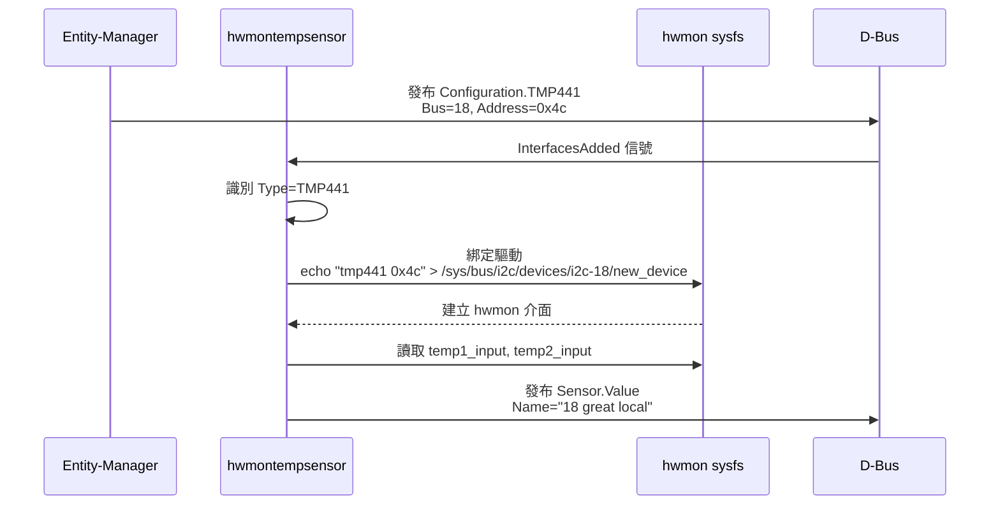

# dbus-sensors 整合

## 概述

**dbus-sensors** 是一組守護程式，負責讀取各種感測器的數值並發布到 D-Bus。這些守護程式作為 **Reactor**（反應器）運作，監聽 Entity-Manager 發布的配置，並據此建立和管理感測器。

---

## 架構關係

```
┌─────────────────────────────────────────────────────────────────────┐
│                        Entity-Manager                                │
│  ┌─────────────────────────────────────────────────────────────────┐ │
│  │ 發布配置: xyz.openbmc_project.Configuration.TMP441              │ │
│  │         xyz.openbmc_project.Configuration.ADC                   │ │
│  │         xyz.openbmc_project.Configuration.AspeedFan             │ │
│  └─────────────────────────────────────────────────────────────────┘ │
└─────────────────────────────────────────────────────────────────────┘
                                 │
                                 │ D-Bus InterfacesAdded 信號
                                 ▼
┌─────────────────────────────────────────────────────────────────────┐
│                         dbus-sensors                                 │
│  ┌───────────────┐ ┌───────────────┐ ┌───────────────┐             │
│  │hwmontempsensor│ │   adcsensor   │ │   fansensor   │   ...       │
│  │ (TMP75, TMP441│ │    (ADC)      │ │ (AspeedFan)   │             │
│  │  等溫度感測器) │ │    電壓感測器  │ │   風扇轉速     │             │
│  └───────────────┘ └───────────────┘ └───────────────┘             │
└─────────────────────────────────────────────────────────────────────┘
                                 │
                                 │ D-Bus 發布感測器數值
                                 ▼
┌─────────────────────────────────────────────────────────────────────┐
│              xyz.openbmc_project.Sensor.Value                        │
│              xyz.openbmc_project.Sensor.Threshold.*                  │
└─────────────────────────────────────────────────────────────────────┘
```

---

## dbus-sensors 守護程式列表

| 守護程式            | 監聽的 Type                      | 功能                  |
| ------------------- | -------------------------------- | --------------------- |
| `hwmontempsensor`   | TMP75, TMP421, TMP441, TMP461 等 | hwmon 溫度感測器      |
| `adcsensor`         | ADC                              | ADC 電壓感測器        |
| `fansensor`         | AspeedFan, NuvotonFan 等         | 風扇轉速 (Tach)       |
| `psusensor`         | PMBus 相關類型                   | 電源供應器感測器      |
| `cpusensor`         | XeonCPU 等                       | CPU 溫度（透過 PECI） |
| `nvmesensor`        | NVMe                             | NVMe SSD 溫度         |
| `ipmb sensor`       | IPMB 相關                        | IPMB 感測器           |
| `intrusionsensor`   | Intrusion                        | 機箱入侵偵測          |
| `exitairtempsensor` | CFM 相關                         | 出風口溫度計算        |

---

## hwmontempsensor 詳解

### 運作流程



> **逐步說明：**
>
> 1. **配置發布**：Entity-Manager 將 Probe 匹配成功的 Exposes 記錄以 `xyz.openbmc_project.Configuration.TMP441` 介面發布到 D-Bus，包含 Bus、Address、Name 等屬性
> 2. **信號通知**：D-Bus 的 `InterfacesAdded` 信號通知所有訂閱者（包括 hwmontempsensor）
> 3. **類型識別**：hwmontempsensor 檢查新增介面的 `Type` 屬性，確認是否為自己支援的類型（如 TMP441）
> 4. **驅動綁定**：hwmontempsensor 向 `/sys/bus/i2c/devices/i2c-{Bus}/new_device` 寫入驅動名稱和位址，觸發 Linux kernel 載入對應的 hwmon 驅動
> 5. **hwmon 建立**：kernel 驅動會在 `/sys/class/hwmon/` 下建立對應的 hwmon 介面
> 6. **數值讀取**：hwmontempsensor 定期從 `/sys/class/hwmon/hwmon*/temp{N}_input` 讀取感測器數值
> 7. **D-Bus 發布**：讀取到的數值以 `xyz.openbmc_project.Sensor.Value` 介面發布到 D-Bus
>
> **白話總結**：整個流程就像一條「供應鏈」— Entity-Manager 是「訂單中心」告訴感測器服務「哪裡有什麼東西」，感測器服務再去「安裝驅動程式」連接硬體，最後持續把讀到的數值「上架」到 D-Bus 讓其他應用使用。

### 支援的感測器類型

| Type    | Linux 驅動 | 通道數 |
| ------- | ---------- | ------ |
| TMP75   | tmp75      | 1      |
| TMP175  | tmp75      | 1      |
| TMP275  | tmp75      | 1      |
| TMP421  | tmp421     | 2      |
| TMP441  | tmp441     | 2      |
| TMP461  | tmp461     | 2      |
| EMC1403 | emc1403    | 3      |
| LM75    | lm75       | 1      |

### 多通道感測器命名

對於多通道感測器，使用 `Name`, `Name1`, `Name2` 等屬性：

| JSON 屬性 | hwmon 對應  | 說明                     |
| --------- | ----------- | ------------------------ |
| `Name`    | temp1_input | 通道 0（通常是本地溫度） |
| `Name1`   | temp2_input | 通道 1（遠端溫度 1）     |
| `Name2`   | temp3_input | 通道 2（遠端溫度 2）     |

---

## 感測器 D-Bus 介面

### 物件路徑

```
/xyz/openbmc_project/sensors/{感測器類型}/{感測器名稱}
```

**範例**：

```
/xyz/openbmc_project/sensors/temperature/18_great_local
/xyz/openbmc_project/sensors/voltage/P12V
/xyz/openbmc_project/sensors/fan_tach/Fan_1
```

### xyz.openbmc_project.Sensor.Value

**屬性**：

| 屬性       | 類型   | 說明                           |
| ---------- | ------ | ------------------------------ |
| `Value`    | double | 目前感測器數值                 |
| `MaxValue` | double | 最大允許值                     |
| `MinValue` | double | 最小允許值                     |
| `Unit`     | string | 單位（如 "DegreesC", "Volts"） |

### xyz.openbmc_project.Sensor.Threshold.\*

**介面**：

- `xyz.openbmc_project.Sensor.Threshold.Critical`
- `xyz.openbmc_project.Sensor.Threshold.Warning`

**屬性**：

| 屬性                | 類型   | 說明         |
| ------------------- | ------ | ------------ |
| `CriticalHigh`      | double | 嚴重上限     |
| `CriticalLow`       | double | 嚴重下限     |
| `WarningHigh`       | double | 警告上限     |
| `WarningLow`        | double | 警告下限     |
| `CriticalAlarmHigh` | bool   | 超過嚴重上限 |
| `CriticalAlarmLow`  | bool   | 低於嚴重下限 |
| `WarningAlarmHigh`  | bool   | 超過警告上限 |
| `WarningAlarmLow`   | bool   | 低於警告下限 |

---

## ADC 感測器

### 配置範例

```json
{
  "Name": "P12V",
  "Type": "ADC",
  "Index": 0,
  "ScaleFactor": 6.8,
  "PowerState": "Always",
  "Thresholds": [
    {
      "Direction": "greater than",
      "Name": "upper critical",
      "Severity": 1,
      "Value": 13.2
    },
    {
      "Direction": "less than",
      "Name": "lower critical",
      "Severity": 1,
      "Value": 10.8
    }
  ]
}
```

### 屬性說明

| 屬性          | 說明                                  |
| ------------- | ------------------------------------- |
| `Index`       | ADC 通道索引（對應 in{Index}\_input） |
| `ScaleFactor` | 縮放因子（用於分壓電阻計算）          |
| `PowerState`  | 電源狀態條件                          |

### 計算公式

```
實際電壓 = 原始 ADC 值 × ScaleFactor / 1000
```

---

## 風扇感測器

### 配置範例

```json
{
  "Name": "System Fan 1",
  "Type": "AspeedFan",
  "Index": 0,
  "Connector": {
    "Name": "Fan Connector 1",
    "Pwm": 0,
    "Tachs": [0, 1]
  },
  "Thresholds": [
    {
      "Direction": "less than",
      "Name": "lower critical",
      "Severity": 1,
      "Value": 1000
    }
  ]
}
```

### 屬性說明

| 屬性              | 說明           |
| ----------------- | -------------- |
| `Index`           | 風扇索引       |
| `Connector.Pwm`   | PWM 控制通道   |
| `Connector.Tachs` | 轉速計通道陣列 |

---

## PowerState 屬性

控制感測器在不同電源狀態下的行為：

| 值           | 說明               | 使用場景             |
| ------------ | ------------------ | -------------------- |
| `"Always"`   | 始終輪詢（預設）   | 環境溫度、電壓       |
| `"On"`       | 僅主機開機時輪詢   | CPU 溫度、記憶體溫度 |
| `"BiosPost"` | BIOS POST 期間輪詢 | 特定 POST 感測器     |
| `"Chassis"`  | 機箱電源開啟時     | 機箱相關感測器       |

---

## 操作範例

### 查看感測器列表

```bash
# 溫度感測器
busctl tree xyz.openbmc_project.HwmonTempSensor

# ADC 感測器
busctl tree xyz.openbmc_project.ADCSensor

# 風扇感測器
busctl tree xyz.openbmc_project.FanSensor
```

### 查看感測器數值

```bash
busctl introspect --no-pager xyz.openbmc_project.HwmonTempSensor \
    /xyz/openbmc_project/sensors/temperature/18_great_local
```

**輸出範例**：

```
NAME                                TYPE      SIGNATURE RESULT/VALUE  FLAGS
xyz.openbmc_project.Sensor.Value    interface -         -             -
.MaxValue                           property  d         127           emits-change
.MinValue                           property  d         -128          emits-change
.Value                              property  d         31.938        emits-change writable
xyz.openbmc_project.Sensor.Threshold.Critical interface -  -          -
.CriticalHigh                       property  d         100           emits-change
.CriticalLow                        property  d         0             emits-change
```

### 讀取目前溫度

```bash
busctl get-property xyz.openbmc_project.HwmonTempSensor \
    /xyz/openbmc_project/sensors/temperature/18_great_local \
    xyz.openbmc_project.Sensor.Value \
    Value

# 輸出: d 31.938
```

---

## 配置到感測器的映射

### 完整流程範例

**Entity-Manager 配置**：

```json
{
  "Name": "$bus great local",
  "Name1": "$bus great ext",
  "Type": "TMP441",
  "Bus": "$bus",
  "Address": "0x4c"
}
```

**發布的 D-Bus 配置物件**：

```
路徑: /xyz/openbmc_project/inventory/system/board/18_Great_Card/18_great_local
介面: xyz.openbmc_project.Configuration.TMP441
    Address = 76 (0x4c)
    Bus = 18
    Name = "18 great local"
    Name1 = "18 great ext"
    Type = "TMP441"
```

**hwmontempsensor 建立的感測器**：

```
/xyz/openbmc_project/sensors/temperature/18_great_local  (temp1)
/xyz/openbmc_project/sensors/temperature/18_great_ext    (temp2)
```

---

## 故障排除

### 感測器未出現

1. **檢查 Entity-Manager 配置**：

   ```bash
   busctl tree xyz.openbmc_project.EntityManager
   busctl introspect xyz.openbmc_project.EntityManager \
       /xyz/openbmc_project/inventory/system/board/{BoardName}/{SensorName}
   ```

2. **檢查 hwmon 驅動**：

   ```bash
   ls /sys/class/hwmon/
   cat /sys/class/hwmon/hwmon*/name
   ```

3. **檢查感測器服務**：

   ```bash
   systemctl status xyz.openbmc_project.hwmontempsensor.service
   journalctl -u xyz.openbmc_project.hwmontempsensor.service
   ```

### 感測器數值異常

1. **直接讀取 hwmon**：

   ```bash
   cat /sys/class/hwmon/hwmon*/temp1_input
   ```

2. **檢查 ScaleFactor**（ADC 感測器）

3. **確認電源狀態**（PowerState 設定）

### 門檻值未生效

確認 JSON 配置中的 Thresholds 格式正確：

```json
{
  "Thresholds": [
    {
      "Direction": "greater than", // 必須小寫
      "Name": "upper critical", // 必須符合規範
      "Severity": 1, // 0 或 1
      "Value": 100 // 數值
    }
  ]
}
```

---

## 效能考量

### 輪詢間隔

dbus-sensors 使用非同步輪詢，預設間隔通常為 1 秒。可在編譯時調整。

### 資源使用

- 每個感測器服務作為獨立程序運行
- 使用 sdbusplus 進行非同步 D-Bus 通訊
- 事件驅動架構最小化 CPU 使用

---

## 下一步

- 了解 [關聯性](Associations.md) 建立感測器與硬體的關係
- 查看 [故障排除](Troubleshooting.md) 解決整合問題
- 閱讀 [相容軟體](CompatibleSoftware.md) 了解如何透過 Redfish/IPMI 存取感測器

---

> 📖 **參考**：[dbus-sensors 儲存庫](https://github.com/openbmc/dbus-sensors)
