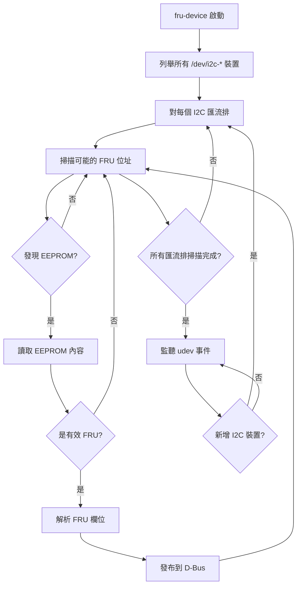

# FruDevice 守護程式

## 概述

**fru-device** 是 Entity-Manager 生態系統中的核心偵測守護程式，負責掃描 I2C 匯流排上的 IPMI FRU EEPROM 裝置，解析 FRU 內容，並將資訊發布到 D-Bus 供 Entity-Manager 進行 Probe 匹配。

---

## 功能特點

- 🔍 **自動掃描**：無需預先配置，自動掃描所有可用 I2C 匯流排
- 📖 **FRU 解析**：解析符合 IPMI FRU 規範的 EEPROM 內容
- 📡 **D-Bus 發布**：將解析結果發布到 D-Bus
- 🔄 **動態更新**：監聽 I2C 變更（如 Mux 掛載），自動重新掃描
- 💾 **持久化支援**：支援 FRU 寫入功能

---

## D-Bus 服務資訊

| 項目 | 值 |
|-----|---|
| **服務名稱** | `xyz.openbmc_project.FruDevice` |
| **systemd 服務** | `xyz.openbmc_project.FruDevice.service` |
| **根路徑** | `/xyz/openbmc_project/FruDevice` |

---

## 運作原理

### 掃描流程



### 核心函數

1. **rescanBusses()**：執行初始掃描和重新掃描
2. **isDevice16Bit()**：判斷 EEPROM 是 8 位元還是 16 位元位址
3. **parseFRU()**：解析 IPMI FRU 格式資料

---

## IPMI FRU 格式

### FRU 區域結構

```
┌──────────────────────────────────────┐
│         Common Header                │ 8 bytes
├──────────────────────────────────────┤
│         Internal Use Area            │ 可選
├──────────────────────────────────────┤
│         Chassis Info Area            │ 可選
├──────────────────────────────────────┤
│         Board Info Area              │ 可選
├──────────────────────────────────────┤
│         Product Info Area            │ 可選
├──────────────────────────────────────┤
│         Multi-Record Area            │ 可選
└──────────────────────────────────────┘
```

### Common Header 格式

| 位元組 | 欄位 | 說明 |
|-------|------|------|
| 0 | Format Version | 格式版本（目前為 0x01） |
| 1 | Internal Use Offset | 內部使用區偏移 |
| 2 | Chassis Info Offset | 機箱資訊區偏移 |
| 3 | Board Info Offset | 電路板資訊區偏移 |
| 4 | Product Info Offset | 產品資訊區偏移 |
| 5 | Multi-Record Offset | 多記錄區偏移 |
| 6 | PAD | 填充（0x00） |
| 7 | Checksum | 校驗和 |

---

## D-Bus 介面與屬性

### 物件路徑

```
/xyz/openbmc_project/FruDevice/{ProductName}
/xyz/openbmc_project/FruDevice/{ProductName}_0
/xyz/openbmc_project/FruDevice/{ProductName}_1
```

物件路徑基於 FRU 中最顯著的名稱欄位，重複裝置會加上數字後綴。

### 介面：xyz.openbmc_project.FruDevice

**核心屬性**：

| 屬性 | 類型 | 說明 |
|-----|------|------|
| `BUS` | uint32 | I2C 匯流排編號 |
| `ADDRESS` | uint32 | I2C 裝置位址 |

**產品資訊欄位**：

| 屬性 | 說明 |
|-----|------|
| `PRODUCT_PRODUCT_NAME` | 產品名稱 |
| `PRODUCT_MANUFACTURER` | 製造商 |
| `PRODUCT_PART_NUMBER` | 料號 |
| `PRODUCT_SERIAL_NUMBER` | 序號 |
| `PRODUCT_VERSION` | 版本 |
| `PRODUCT_ASSET_TAG` | 資產標籤 |
| `PRODUCT_FRU_VERSION_ID` | FRU 版本 ID |

**電路板資訊欄位**：

| 屬性 | 說明 |
|-----|------|
| `BOARD_PRODUCT_NAME` | 電路板名稱 |
| `BOARD_MANUFACTURER` | 電路板製造商 |
| `BOARD_PART_NUMBER` | 電路板料號 |
| `BOARD_SERIAL_NUMBER` | 電路板序號 |

**機箱資訊欄位**：

| 屬性 | 說明 |
|-----|------|
| `CHASSIS_TYPE` | 機箱類型 |
| `CHASSIS_PART_NUMBER` | 機箱料號 |
| `CHASSIS_SERIAL_NUMBER` | 機箱序號 |

---

## 操作範例

### 查看已發現的 FRU

```bash
# 列出所有 FruDevice 物件
busctl tree --no-pager xyz.openbmc_project.FruDevice
```

**輸出範例**：

```
`-/xyz
  `-/xyz/openbmc_project
    `-/xyz/openbmc_project/FruDevice
      |-/xyz/openbmc_project/FruDevice/Super_Great
      |-/xyz/openbmc_project/FruDevice/Super_Great_0
      `-/xyz/openbmc_project/FruDevice/My_Baseboard
```

### 查看 FRU 詳細資訊

```bash
busctl introspect --no-pager xyz.openbmc_project.FruDevice \
    /xyz/openbmc_project/FruDevice/Super_Great
```

**輸出範例**：

```
NAME                                TYPE      SIGNATURE RESULT/VALUE        FLAGS
xyz.openbmc_project.FruDevice       interface -         -                   -
.ADDRESS                            property  u         80                  emits-change
.BUS                                property  u         18                  emits-change
.Common_Format_Version              property  s         "1"                 emits-change
.PRODUCT_MANUFACTURER               property  s         "Awesome"           emits-change
.PRODUCT_PART_NUMBER                property  s         "12345"             emits-change
.PRODUCT_PRODUCT_NAME               property  s         "Super Great"       emits-change
.PRODUCT_SERIAL_NUMBER              property  s         "12312490840"       emits-change
.PRODUCT_VERSION                    property  s         "0A"                emits-change
```

### 讀取特定屬性

```bash
busctl get-property xyz.openbmc_project.FruDevice \
    /xyz/openbmc_project/FruDevice/My_Baseboard \
    xyz.openbmc_project.FruDevice \
    PRODUCT_PRODUCT_NAME

# 輸出: s "My Server Baseboard"
```

### 觸發重新掃描

```bash
# 呼叫 rescan 方法（如可用）
busctl call xyz.openbmc_project.FruDevice \
    /xyz/openbmc_project/FruDevice \
    xyz.openbmc_project.FruDevice \
    ReScan
```

---

## 裝置樹配置

### I2C EEPROM 配置範例

若要讓 fru-device 能夠讀取 EEPROM，需確保 I2C 控制器已正確配置：

```dts
// 裝置樹範例
&i2c0 {
    status = "okay";
    // fru-device 會自動掃描此匯流排
};

&i2c1 {
    status = "okay";
    
    // I2C Mux 配置
    i2c-switch@71 {
        compatible = "nxp,pca9546";
        reg = <0x71>;
        #address-cells = <1>;
        #size-cells = <0>;
        
        i2c@0 {
            #address-cells = <1>;
            #size-cells = <0>;
            reg = <0>;
            // 此通道上的 EEPROM 也會被掃描
        };
    };
};
```

### 注意事項

- **不需要在裝置樹中宣告 EEPROM**：fru-device 會自動探測
- **I2C Mux 支援**：當新增 Mux 通道時，fru-device 會自動掃描

---

## EEPROM 位址大小偵測

fru-device 需要判斷 EEPROM 使用 8 位元還是 16 位元位址：

### MODE-1（傳統方式）

讀取 8 個連續位元組，如果值相同則判斷為 8 位元，不同則為 16 位元。

**問題**：某些 16 位元 EEPROM（如 ONSEMI）在前 8 個位置有相同資料時會被誤判。

### MODE-2（改進方式）

使用禁止 STOP 條件的 2 位元組寫入操作，更準確地偵測位址大小。

詳見 [EEPROM 偵測](EEPROMDetection.md)。

---

## 與 Entity-Manager 的互動

### 資料流

```
┌─────────────────┐     ┌─────────────────┐     ┌─────────────────┐
│   I2C EEPROM    │────▶│   fru-device    │────▶│ Entity-Manager  │
│   (硬體)        │     │   (D-Bus 發布)   │     │   (Probe 匹配)   │
└─────────────────┘     └─────────────────┘     └─────────────────┘
                              │
                              ▼
                        D-Bus 物件：
               xyz.openbmc_project.FruDevice
                   ├─ BUS: 18
                   ├─ ADDRESS: 80
                   └─ PRODUCT_PRODUCT_NAME: "Super Great"
                              │
                              ▼
                    Entity-Manager Probe 匹配：
              "xyz.openbmc_project.FruDevice(
                 {'PRODUCT_PRODUCT_NAME': 'Super Great'})"
```

### 範本變數提取

Entity-Manager 從 FruDevice 物件提取這些變數供配置使用：

| 變數 | 來源屬性 |
|-----|---------|
| `$bus` | `BUS` |
| `$address` | `ADDRESS` |
| `${PRODUCT_PRODUCT_NAME}` | `PRODUCT_PRODUCT_NAME` |
| `${PRODUCT_MANUFACTURER}` | `PRODUCT_MANUFACTURER` |

---

## 故障排除

### 常見問題

#### FRU 未被偵測

1. **檢查 I2C 匯流排**：

   ```bash
   # 列出可用的 I2C 匯流排
   ls /dev/i2c-*
   
   # 掃描特定匯流排
   i2cdetect -y 1
   ```

2. **檢查 EEPROM 位址**：

   ```bash
   # 確認位址上有裝置
   i2cget -y 1 0x50
   ```

3. **檢查 FRU 格式**：FRU 必須符合 IPMI 規範，Common Header 第一個位元組應為 0x01

#### FRU 解析錯誤

1. **校驗和錯誤**：檢查 FRU 資料完整性
2. **位址大小誤判**：嘗試不同的偵測模式

#### fru-device 服務狀態

```bash
# 檢查服務狀態
systemctl status xyz.openbmc_project.FruDevice.service

# 查看日誌
journalctl -u xyz.openbmc_project.FruDevice.service
```

---

## 手動寫入 FRU

### 使用 dd 寫入

```bash
# 寫入 FRU 資料到 EEPROM（需謹慎）
dd if=my_fru.bin of=/sys/bus/i2c/devices/1-0050/eeprom
```

### 使用 ipmitool 驗證

```bash
# 顯示 FRU 資訊
ipmitool fru print
```

---

## 下一步

- 了解 [EEPROM 偵測](EEPROMDetection.md) 的詳細演算法
- 查看 [Probe 語法](ProbeSyntax.md) 了解如何匹配 FRU 資料
- 閱讀 [dbus-sensors 整合](DbusSensorsIntegration.md) 了解後續處理

---

> 📖 **參考**：
> - [IPMI FRU 規範](https://www.intel.com/content/dam/www/public/us/en/documents/specification-updates/ipmi-platform-mgt-fru-info-storage-def-v1-0-rev-1-3-spec-update.pdf)
> - [Entity-Manager fru_device.cpp](https://github.com/openbmc/entity-manager/blob/master/src/fru_device.cpp)
