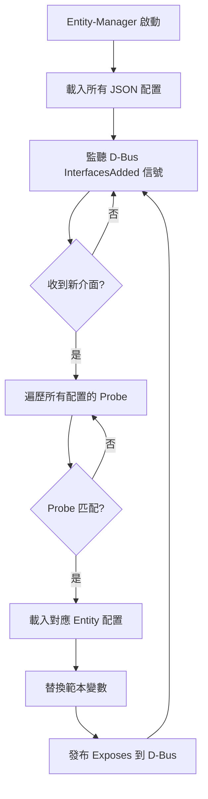

# Probe 語法參考

## 概述

Probe 是 Entity-Manager 用於偵測硬體實體的規則定義。當 Probe 規則匹配成功時，對應的 Entity 配置就會被載入。Probe 通常以 D-Bus 介面定義的形式表達。

---

## 基本語法

### 格式

```
介面名稱({'屬性名稱': '屬性值', ...})
```

### 組成部分

```
xyz.openbmc_project.FruDevice({'PRODUCT_PRODUCT_NAME': 'Super Great'})
└─────────────┬─────────────┘ └─────────────────┬──────────────────┘
         介面名稱                          屬性條件字典
```

---

## 簡單 Probe

### 單一屬性匹配

```json
{
    "Probe": "xyz.openbmc_project.FruDevice({'PRODUCT_PRODUCT_NAME': 'Super Great'})"
}
```

這會匹配任何在 D-Bus 上有 `FruDevice` 介面，且 `PRODUCT_PRODUCT_NAME` 屬性值為 `"Super Great"` 的物件。

### 無屬性匹配

```json
{
    "Probe": "xyz.openbmc_project.FruDevice"
}
```

這會匹配任何有 `FruDevice` 介面的物件（不檢查屬性值）。

---

## 複合 Probe

### AND 運算（單一陳述中的多屬性）

在同一個 Probe 陳述中指定多個屬性時，它們之間是 **AND** 關係：

```json
{
    "Probe": "xyz.openbmc_project.FruDevice({'BOARD_PRODUCT_NAME': 'Management Board', 'PRODUCT_PRODUCT_NAME': 'Yosemite V4'})"
}
```

等同於邏輯運算：

```
BOARD_PRODUCT_NAME == 'Management Board' AND PRODUCT_PRODUCT_NAME == 'Yosemite V4'
```

### OR 運算（陣列形式）

使用陣列可以表達 **OR** 邏輯：

```json
{
    "Probe": [
        "xyz.openbmc_project.FruDevice({'PRODUCT_PRODUCT_NAME': 'Super Great'})",
        "xyz.openbmc_project.FruDevice({'PRODUCT_PRODUCT_NAME': 'Ultra Great'})"
    ]
}
```

等同於邏輯運算：

```
PRODUCT_PRODUCT_NAME == 'Super Great' OR PRODUCT_PRODUCT_NAME == 'Ultra Great'
```

---

## 進階 Probe 語法

### 複合 AND/OR 運算

可以使用關鍵字明確指定邏輯運算：

```json
{
    "Probe": "xyz.openbmc_project.FruDevice({'PRODUCT_MANUFACTURER': 'Intel'}) AND xyz.openbmc_project.FruDevice({'PRODUCT_PRODUCT_NAME': 'Baseboard'})"
}
```

### TRUE Probe

特殊值 `TRUE` 表示始終匹配（通常用於除錯或強制載入）：

```json
{
    "Probe": "TRUE"
}
```

> ⚠️ **警告**：不建議在生產環境使用 `TRUE`，因為會無條件載入配置。

---

## 常用 Probe 介面

### xyz.openbmc_project.FruDevice

最常用的 Probe 介面，用於匹配 FRU EEPROM 資訊：

```json
{
    "Probe": "xyz.openbmc_project.FruDevice({'PRODUCT_PRODUCT_NAME': 'MyBoard'})"
}
```

**常用屬性**：

| 屬性 | 說明 | 範例值 |
|-----|------|-------|
| `PRODUCT_PRODUCT_NAME` | 產品名稱 | `"Server Board"` |
| `PRODUCT_MANUFACTURER` | 製造商 | `"Intel"` |
| `PRODUCT_PART_NUMBER` | 料號 | `"S2600WF"` |
| `BOARD_PRODUCT_NAME` | 電路板名稱 | `"Baseboard"` |
| `BOARD_MANUFACTURER` | 電路板製造商 | `"Supermicro"` |

### xyz.openbmc_project.Inventory.Item.PCIeDevice

用於匹配 PCIe 裝置：

```json
{
    "Probe": "xyz.openbmc_project.Inventory.Item.PCIeDevice({'DeviceType': 'GPU'})"
}
```

### SMBIOS 相關介面

用於匹配 SMBIOS 表格資訊：

```json
{
    "Probe": "xyz.openbmc_project.Inventory.Item.Cpu"
}
```

---

## Probe 匹配流程



---

## 範本變數提取

### 自動變數

當 Probe 匹配成功後，以下變數會從匹配物件自動提取：

| 變數 | 來源屬性 | 說明 |
|-----|---------|------|
| `$bus` | `BUS` | I2C 匯流排編號 |
| `$address` | `ADDRESS` | I2C 裝置位址 |
| `$index` | 匹配順序 | 多重匹配時的索引 |

### 任意屬性提取

可以使用 `${屬性名}` 語法提取任意屬性：

```json
{
    "Name": "${PRODUCT_MANUFACTURER} Board",
    "Probe": "xyz.openbmc_project.FruDevice({'PRODUCT_PRODUCT_NAME': 'MyBoard'})"
}
```

如果 `PRODUCT_MANUFACTURER` 是 "Intel"，則 Name 變為 "Intel Board"。

---

## 多重匹配處理

### 情境

當系統中有多個相同類型的裝置時（例如兩張相同的 PCIe 卡），Probe 會匹配多次。

### 自動處理

Entity-Manager 會為每個匹配建立獨立的 Entity 實例，使用 `$index` 或 `$bus` 區分：

```json
{
    "Name": "$bus Great Card",
    "Probe": "xyz.openbmc_project.FruDevice({'PRODUCT_PRODUCT_NAME': 'Super Great'})"
}
```

**結果**：

```
/xyz/openbmc_project/inventory/system/board/18_Great_Card
/xyz/openbmc_project/inventory/system/board/19_Great_Card
```

---

## 已知限制

### OR 解析問題

> ⚠️ **已知問題**：GitHub Issue #24

目前 Entity-Manager 的解析器在處理包含 "OR" 字串的 Probe 時可能會誤判。如果屬性值中包含 "OR" 字元序列，可能會被錯誤解析。

**問題範例**：

```json
{
    "Probe": "xyz.openbmc_project.FruDevice({'VENDOR_ID': 'VENDOR_OR_PARTNER'})"
}
```

`VENDOR_OR_PARTNER` 中的 "OR" 可能被誤認為邏輯運算子。

**建議**：

1. 避免在屬性值中使用 "OR"、"AND" 等保留字
2. 如果必須使用，考慮使用其他匹配策略

### 巢狀屬性限制

Probe 無法直接匹配巢狀 D-Bus 屬性：

```json
// ❌ 不支援
{
    "Probe": "xyz.openbmc_project.FruDevice({'Nested': {'Key': 'Value'}})"
}
```

---

## 除錯技巧

### 確認 D-Bus 介面存在

```bash
# 列出 FruDevice 服務的物件
busctl tree xyz.openbmc_project.FruDevice

# 查看特定物件的屬性
busctl introspect xyz.openbmc_project.FruDevice \
    /xyz/openbmc_project/FruDevice/My_Device
```

### 確認屬性值

```bash
# 取得特定屬性值
busctl get-property xyz.openbmc_project.FruDevice \
    /xyz/openbmc_project/FruDevice/My_Device \
    xyz.openbmc_project.FruDevice \
    PRODUCT_PRODUCT_NAME
```

### 啟用除錯日誌

較新版本的 Entity-Manager 支援除錯日誌，可查看 Probe 匹配過程。

---

## Probe 範例集

### 基本主機板偵測

```json
{
    "Probe": "xyz.openbmc_project.FruDevice({'PRODUCT_PRODUCT_NAME': 'Server Baseboard'})"
}
```

### 依製造商偵測

```json
{
    "Probe": "xyz.openbmc_project.FruDevice({'PRODUCT_MANUFACTURER': 'Intel'})"
}
```

### 組合條件（AND）

```json
{
    "Probe": "xyz.openbmc_project.FruDevice({'PRODUCT_MANUFACTURER': 'Intel', 'PRODUCT_PART_NUMBER': 'S2600WF'})"
}
```

### 多型號支援（OR）

```json
{
    "Probe": [
        "xyz.openbmc_project.FruDevice({'PRODUCT_PART_NUMBER': 'S2600WF'})",
        "xyz.openbmc_project.FruDevice({'PRODUCT_PART_NUMBER': 'S2600WFT'})"
    ]
}
```

### PSU 偵測

```json
{
    "Probe": "xyz.openbmc_project.FruDevice({'PRODUCT_PRODUCT_NAME': 'PSU', 'PRODUCT_MANUFACTURER': 'Delta'})"
}
```

### PCIe 裝置偵測

```json
{
    "Probe": "xyz.openbmc_project.Inventory.Item.PCIeDevice({'Manufacturer': 'NVIDIA'})"
}
```

---

## 最佳實踐

### ✅ 建議

1. **使用精確匹配**：盡可能使用多個條件確保唯一識別
2. **優先使用 PRODUCT_PRODUCT_NAME**：這是最常用且可靠的識別欄位
3. **測試所有變體**：確保 Probe 能匹配所有預期的硬體變體
4. **記錄 Probe 邏輯**：使用註解說明 Probe 的設計意圖

### ❌ 避免

1. **過於寬鬆的 Probe**：可能意外匹配非目標裝置
2. **在屬性值中使用保留字**：如 "OR"、"AND"
3. **使用 TRUE**：除非用於除錯

---

## 下一步

- 查看 [設定範例](ExampleConfigurations.md) 了解完整配置
- 閱讀 [FruDevice](FruDevice.md) 了解 FRU 掃描如何提供 Probe 資料
- 參考 [故障排除](Troubleshooting.md) 解決匹配問題

---

> 📖 **參考**：[Entity-Manager README](https://github.com/openbmc/entity-manager/blob/master/README.md)
