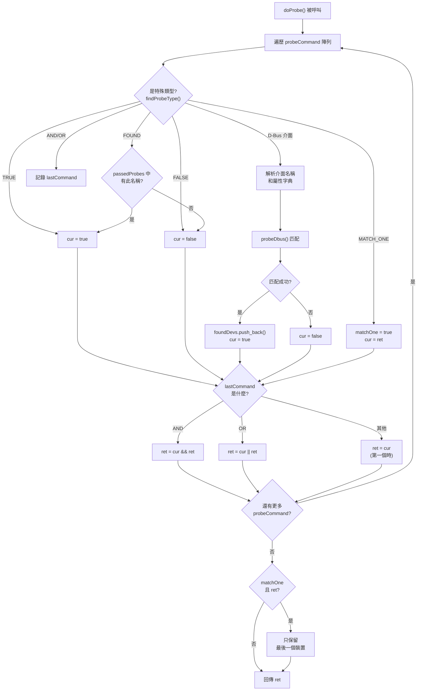
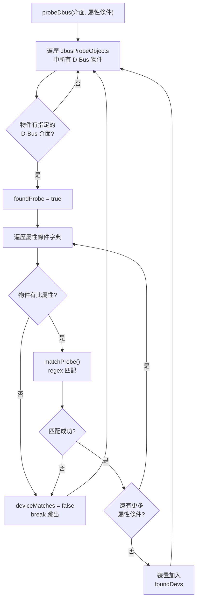

# Probe 語法參考

## 概述

Probe 是 Entity-Manager 用於偵測硬體實體的規則定義。當 Probe 規則匹配成功時，對應的 Entity 配置就會被載入。

Probe 的核心解析邏輯位於 [`perform_probe.cpp`](file:///data/leo/src/entity-manager/src/entity_manager/perform_probe.cpp) 中的 `doProbe()` 函數（L64-199）和 `probeDbus()` 函數（L15-60）。

---

## 基本語法

### 格式

```
介面名稱({'屬性名稱': '屬性值', ...})
```

### 組成部分

```
xyz.openbmc_project.FruDevice({'PRODUCT_PRODUCT_NAME': 'Super Great'})
└─────────────┬─────────────┘ └─────────────────┬──────────────────┘
         介面名稱                          屬性條件字典
```

**屬性值支援正則表達式**：`probeDbus()` 內部使用 `matchProbe()` 函數，當屬性值為字串類型時，會以 regex 方式進行匹配。例如 `'.*WFT'` 可匹配任何以 "WFT" 結尾的字串。

---

## Probe 類型總覽

根據 `findProbeType()` 函數（`perform_probe.cpp` L221-243），Entity-Manager 支援以下 6 種 Probe 類型：

| 類型               | 用途       | 說明                                        |
| ------------------ | ---------- | ------------------------------------------- |
| **D-Bus 介面匹配** | 主要用法   | `xyz.openbmc_project.FruDevice({...})` 格式 |
| `TRUE`             | 始終匹配   | 無條件載入配置                              |
| `FALSE`            | 始終不匹配 | 用於暫時停用配置                            |
| `AND`              | 邏輯 AND   | 連接多個 Probe 條件                         |
| `OR`               | 邏輯 OR    | 任一條件匹配即可                            |
| `FOUND`            | 依賴匹配   | 檢查另一個 Probe 名稱是否已經匹配成功       |
| `MATCH_ONE`        | 單一匹配   | 即使多個裝置匹配，也只取最後一個            |

---

## 簡單 Probe

### 單一屬性匹配

```json
{
  "Probe": "xyz.openbmc_project.FruDevice({'PRODUCT_PRODUCT_NAME': 'Super Great'})"
}
```

這會匹配任何在 D-Bus 上有 `FruDevice` 介面，且 `PRODUCT_PRODUCT_NAME` 屬性值為 `"Super Great"` 的物件。

### 正則匹配

```json
{
  "Probe": "xyz.openbmc_project.FruDevice({'BOARD_PRODUCT_NAME' : '.*WFT'})"
}
```

這會匹配 `BOARD_PRODUCT_NAME` 屬性值以 "WFT" 結尾的任何物件。

### 無屬性匹配

```json
{
  "Probe": "xyz.openbmc_project.FruDevice"
}
```

> ⚠️ **注意**：根據 source code，若 Probe 字串中找不到 `(` 字元，`doProbe()` 會回傳 `false`（L153-157）。因此，無屬性匹配的正確方式是使用空字典 `xyz.openbmc_project.FruDevice({})`，或者讓 Probe 介面名稱本身在 `findProbeType()` 中被辨識（如 `TRUE`）。

> ⚠️ **簡化說明**：上述行為可能因版本不同而有差異，建議使用帶明確屬性條件的 Probe 以確保相容性。

---

## 複合 Probe

### AND 運算（單一陳述中的多屬性）

在同一個 Probe 陳述中指定多個屬性時，它們之間是 **AND** 關係。這由 `probeDbus()` 函數中的迴圈實現（L36-50）：

```cpp
// probeDbus() L36-50 的邏輯：
for (const auto& [matchProp, matchJSON] : matches)
{
    // 每個屬性都必須匹配，否則 deviceMatches 設為 false
    deviceMatches = deviceMatches && matchProbe(matchJSON, deviceValue->second);
}
```

```json
{
  "Probe": "xyz.openbmc_project.FruDevice({'BOARD_PRODUCT_NAME': 'Management Board', 'PRODUCT_PRODUCT_NAME': 'Yosemite V4'})"
}
```

等同於邏輯運算：

```
BOARD_PRODUCT_NAME == 'Management Board' AND PRODUCT_PRODUCT_NAME == 'Yosemite V4'
```

### AND/OR 關鍵字（多個 Probe 陳述）

使用陣列形式和 `AND`/`OR` 關鍵字可以組合多個獨立的 Probe 陳述：

```json
{
  "Probe": [
    "xyz.openbmc_project.FruDevice({'PRODUCT_MANUFACTURER': 'Intel'})",
    "AND",
    "xyz.openbmc_project.FruDevice({'PRODUCT_PRODUCT_NAME': 'Baseboard'})"
  ]
}
```

**Source code 中的實現**（`doProbe()` L164-173）：

```cpp
// AND 和 OR 是「延遲生效」的 — 它們影響的是「下一個」Probe 的結果如何與前一個合併
if (lastCommand == probe::probe_type_codes::AND)
{
    ret = cur && ret;
}
else if (lastCommand == probe::probe_type_codes::OR)
{
    ret = cur || ret;
}
```

> 💡 **關鍵行為**：`AND`/`OR` 的合併是「延遲」的。也就是說，`doProbe()` 先執行當前 Probe，然後根據 `lastCommand`（上一個類型碼）來決定如何合併結果。第一個 Probe 的結果直接賦值給 `ret`（L175-179）。

### OR 運算（陣列簡寫）

JSON 陣列中的多個 Probe **預設**也是 OR 語義：

```json
{
  "Probe": [
    "xyz.openbmc_project.FruDevice({'PRODUCT_PRODUCT_NAME': 'Super Great'})",
    "xyz.openbmc_project.FruDevice({'PRODUCT_PRODUCT_NAME': 'Ultra Great'})"
  ]
}
```

> ⚠️ **注意**：根據 `doProbe()` 的邏輯，當兩個 D-Bus Probe 之間沒有明確的 `AND`/`OR` 關鍵字時，`lastCommand` 保持前一個值。若是第一個 Probe 後直接接第二個，`lastCommand` 為當時的 `probeType` 值（`std::nullopt` → default `FALSE_T`），此時第二個 Probe 的結果會**覆蓋** `ret`（因為不進入 AND/OR 分支且不是 first）。

> ⚠️ **簡化說明**：上述陣列 OR 行為的描述來自 README.md 的文件說明。source code 中的實際控制流較複雜，建議使用明確的 `OR` 關鍵字以確保預期行為。

---

## 特殊 Probe 類型

### TRUE Probe

特殊值 `TRUE` 表示始終匹配（`doProbe()` L88-92）：

```json
{
  "Probe": "TRUE"
}
```

> ⚠️ **警告**：不建議在生產環境使用 `TRUE`，因為會無條件載入配置。

### FALSE Probe

`FALSE` 表示始終不匹配（`doProbe()` L83-87）。用於暫時停用配置而不刪除檔案：

```json
{
  "Probe": "FALSE"
}
```

### FOUND Probe

`FOUND` 檢查某個 Probe 名稱是否已經在**先前的掃描**中匹配成功（`doProbe()` L107-122）。這用於建立配置之間的依賴關係：

```json
{
  "Probe": "FOUND('My Baseboard')"
}
```

**Source code 邏輯**：

```cpp
// doProbe() L107-122
case probe::probe_type_codes::FOUND:
{
    // 解析括號中的名稱
    std::string commandStr = *(match.begin() + 1);
    replaceAll(commandStr, "'", "");
    // 檢查 passedProbes 列表中是否包含此名稱
    cur = (std::find(scan->passedProbes.begin(),
                     scan->passedProbes.end(), commandStr) !=
           scan->passedProbes.end());
    break;
}
```

**白話解釋**：就像說「只有在 'My Baseboard' 這張主機板已經被偵測到的情況下，才載入這個配置」。這在配置依賴關係中非常有用 — 例如，只有在主機板被偵測到後，才載入連接在該主機板上的子卡配置。

### MATCH_ONE Probe

`MATCH_ONE` 修改匹配行為：即使有多個裝置匹配 Probe 條件，也只保留**最後一個**（`doProbe()` L93-100, L190-197）：

```json
{
  "Probe": [
    "MATCH_ONE",
    "xyz.openbmc_project.FruDevice({'PRODUCT_PRODUCT_NAME': 'Super Great'})"
  ]
}
```

**Source code 邏輯**：

```cpp
// doProbe() L93-100 — 設定 matchOne 旗標
case probe::probe_type_codes::MATCH_ONE:
{
    cur = ret;      // 不影響當前結果
    matchOne = true; // 啟用 "只保留一個" 模式
    break;
}

// doProbe() L190-197 — 在函數結尾，若 matchOne 為 true
if (matchOne && ret)
{
    auto last = foundDevs.back();
    foundDevs.clear();
    foundDevs.emplace_back(std::move(last));
}
```

**白話解釋**：假設系統中有多張相同的網路卡，正常情況下 Entity-Manager 會為每一張都建立一個 Entity 實例。但如果你只想偵測**是否存在**這種卡（不管幾張），就可以用 `MATCH_ONE`，只會建立一個 Entity 實例。

---

## 常用 Probe 介面

### xyz.openbmc_project.FruDevice

最常用的 Probe 介面，由 `fru-device` 守護程式提供，用於匹配 FRU EEPROM 資訊：

```json
{
  "Probe": "xyz.openbmc_project.FruDevice({'PRODUCT_PRODUCT_NAME': 'MyBoard'})"
}
```

**常用屬性**：

| 屬性                   | 說明         | 範例值           |
| ---------------------- | ------------ | ---------------- |
| `PRODUCT_PRODUCT_NAME` | 產品名稱     | `"Server Board"` |
| `PRODUCT_MANUFACTURER` | 製造商       | `"Intel"`        |
| `PRODUCT_PART_NUMBER`  | 料號         | `"S2600WF"`      |
| `BOARD_PRODUCT_NAME`   | 電路板名稱   | `"Baseboard"`    |
| `BOARD_MANUFACTURER`   | 電路板製造商 | `"Supermicro"`   |

### xyz.openbmc_project.Inventory.Item.PCIeDevice

用於匹配 PCIe 裝置（由 `peci-pcie` 守護程式提供）：

```json
{
  "Probe": "xyz.openbmc_project.Inventory.Item.PCIeDevice({'DeviceType': 'GPU'})"
}
```

### SMBIOS 相關介面

用於匹配 SMBIOS 表格資訊（由 `smbios-mdr` 守護程式提供）：

```json
{
  "Probe": "xyz.openbmc_project.Inventory.Item.Cpu"
}
```

---

## Probe 匹配流程



> **逐步說明：**
>
> 1. **入口點**：`doProbe()` 函數接收一個 `probeCommand` 字串陣列，代表解析後的 Probe 陳述
> 2. **遍歷**：逐一處理陣列中的每個元素（L76）
> 3. **類型判斷**：`findProbeType()` 嘗試在字串中搜尋 `TRUE`、`FALSE`、`AND`、`OR`、`FOUND`、`MATCH_ONE` 等關鍵字（L221-243）
> 4. **特殊類型處理**：
>    - `TRUE`：直接設 `cur = true`
>    - `FALSE`：直接設 `cur = false`
>    - `FOUND('名稱')`：在 `scan->passedProbes` 列表中搜尋該名稱，找到則 `cur = true`
>    - `MATCH_ONE`：設定 `matchOne = true`，且 `cur = ret`（不影響結果）
>    - `AND`/`OR`：作為 no-op 記錄到 `lastCommand`（L180）
> 5. **D-Bus 匹配**：若不是特殊類型，則解析括號內的 JSON 屬性字典，呼叫 `probeDbus()` 在 `dbusProbeObjects` 的快取中搜尋匹配
> 6. **結果合併**（L164-179）：
>    - 若 `lastCommand` 是 `AND`：`ret = cur && ret`
>    - 若 `lastCommand` 是 `OR`：`ret = cur || ret`
>    - 若是第一個 Probe：`ret = cur`（直接賦值）
> 7. **更新 lastCommand**：`lastCommand = probeType`（L180）
> 8. **MATCH_ONE 後處理**（L190-197）：若 `matchOne` 為 true 且整體結果成功，清除 `foundDevs` 只保留最後一個匹配的裝置
> 9. **回傳**：最終回傳 `ret` 布林值
>
> **白話總結**：`doProbe()` 就像一個判讀機 — 讀取一串「偵測指令」，遇到 `TRUE`/`FALSE` 直接理解為是/否，遇到 D-Bus 介面就去資料庫（`dbusProbeObjects`）裡查，然後用 `AND`/`OR` 把各段結果組合起來。最後如果指定了 `MATCH_ONE`，就只留下最後一個偵測到的裝置，以避免重複建立 Entity。

---

## probeDbus() 匹配邏輯

`probeDbus()` 函數（L15-60）的核心匹配邏輯：



> **逐步說明：**
>
> 1. **遍歷**：遍歷 `dbusProbeObjects`（這是 `PerformScan` 預先從 D-Bus 收集的所有物件和介面的快取）
> 2. **介面存在檢查**：檢查每個 D-Bus 物件是否擁有 Probe 指定的介面名稱（L25-29）
> 3. **屬性逐一匹配**：對 Probe 中指定的每個屬性條件（L36-50）：
>    - 先檢查裝置是否有該屬性
>    - 若有，用 `matchProbe()` 進行匹配（字串類型使用 regex，其他類型使用值比較）
>    - 若任一屬性不匹配或不存在，立即跳出（**AND 語義**）
> 4. **成功匹配**：若所有屬性條件都通過，將此裝置的介面資料和 D-Bus 路徑加入 `foundDevs`
>
> **白話總結**：就像海關檢查護照 — 拿到一張「條件清單」（如製造商=Intel, 產品=Baseboard），然後逐一比對每個通關者（D-Bus 物件）的證件，所有項目都符合才放行。

---

## 範本變數提取

### 自動變數

當 Probe 匹配成功後，以下變數會從匹配物件自動提取：

| 變數       | 來源屬性                        | 說明                 |
| ---------- | ------------------------------- | -------------------- |
| `$bus`     | `BUS`                           | I2C 匯流排編號       |
| `$address` | `ADDRESS`                       | I2C 裝置位址         |
| `$index`   | `PerformScan::run()` 中的計數器 | 多重匹配時的遞增索引 |

### 任意屬性提取

可以使用 `${屬性名}` 語法提取匹配物件的任意屬性：

```json
{
  "Name": "${PRODUCT_MANUFACTURER} Board",
  "Probe": "xyz.openbmc_project.FruDevice({'PRODUCT_PRODUCT_NAME': 'MyBoard'})"
}
```

如果 `PRODUCT_MANUFACTURER` 是 "Intel"，則 Name 變為 "Intel Board"。

---

## 多重匹配處理

### 情境

當系統中有多個相同類型的裝置時（例如兩張相同的 PCIe 卡），Probe 會匹配多次。

### 自動處理

Entity-Manager 會為每個匹配建立獨立的 Entity 實例，使用 `$index` 或 `$bus` 區分：

```json
{
  "Name": "$bus Great Card",
  "Probe": "xyz.openbmc_project.FruDevice({'PRODUCT_PRODUCT_NAME': 'Super Great'})"
}
```

**結果**：

```
/xyz/openbmc_project/inventory/system/board/18_Great_Card
/xyz/openbmc_project/inventory/system/board/19_Great_Card
```

### 使用 MATCH_ONE 限制為單一匹配

若只想偵測「是否存在」而不關心數量：

```json
{
  "Probe": [
    "MATCH_ONE",
    "xyz.openbmc_project.FruDevice({'PRODUCT_PRODUCT_NAME': 'Super Great'})"
  ]
}
```

此時只會建立一個 Entity 實例。

---

## 已知限制

### OR 解析問題

> ⚠️ **已知問題**：GitHub Issue #24

`findProbeType()` 函數（L221-243）使用 `probe.find(probeType->first)` 搜尋子字串。這意味著如果 Probe 字串中**任何位置**包含 "OR"、"AND" 等關鍵字，都可能被誤識別為邏輯運算子。

**問題範例**：

```json
{
  "Probe": "xyz.openbmc_project.FruDevice({'VENDOR_ID': 'VENDOR_OR_PARTNER'})"
}
```

`VENDOR_OR_PARTNER` 中的 "OR" 會被 `findProbeType()` 誤識別為 `OR` 類型，導致此 Probe 不會被當作 D-Bus 介面匹配處理。

**建議**：

1. 避免在 Probe 字串（含屬性值）中使用 "OR"、"AND"、"TRUE"、"FALSE"、"FOUND"、"MATCH_ONE" 等保留字
2. 如果屬性值不可避免地包含這些字串，目前無官方的轉義機制

### 巢狀屬性限制

Probe 無法直接匹配巢狀 D-Bus 屬性：

```json
// ❌ 不支援
{
  "Probe": "xyz.openbmc_project.FruDevice({'Nested': {'Key': 'Value'}})"
}
```

---

## 除錯技巧

### 確認 D-Bus 介面存在

```bash
# 列出 FruDevice 服務的物件
busctl tree xyz.openbmc_project.FruDevice

# 查看特定物件的屬性
busctl introspect xyz.openbmc_project.FruDevice \
    /xyz/openbmc_project/FruDevice/My_Device
```

### 確認屬性值

```bash
# 取得特定屬性值
busctl get-property xyz.openbmc_project.FruDevice \
    /xyz/openbmc_project/FruDevice/My_Device \
    xyz.openbmc_project.FruDevice \
    PRODUCT_PRODUCT_NAME
```

### 啟用除錯日誌

Entity-Manager 使用 `lg2::debug` 記錄匹配結果。啟用 `phosphor-logging` 的 debug 級別即可看到：

```
Found probe match on /xyz/openbmc_project/FruDevice/MyBoard xyz.openbmc_project.FruDevice
```

---

## Probe 範例集

### 基本主機板偵測

```json
{
  "Probe": "xyz.openbmc_project.FruDevice({'PRODUCT_PRODUCT_NAME': 'Server Baseboard'})"
}
```

### 正則匹配（多型號支援）

```json
{
  "Probe": "xyz.openbmc_project.FruDevice({'BOARD_PRODUCT_NAME' : '.*WFT'})"
}
```

### 組合條件（AND）

```json
{
  "Probe": "xyz.openbmc_project.FruDevice({'PRODUCT_MANUFACTURER': 'Intel', 'PRODUCT_PART_NUMBER': 'S2600WF'})"
}
```

### 多型號支援（或 - 使用 OR 關鍵字）

```json
{
  "Probe": [
    "xyz.openbmc_project.FruDevice({'PRODUCT_PART_NUMBER': 'S2600WF'})",
    "OR",
    "xyz.openbmc_project.FruDevice({'PRODUCT_PART_NUMBER': 'S2600WFT'})"
  ]
}
```

### 依賴其他實體（FOUND）

```json
{
  "Probe": "FOUND('WFP Baseboard')"
}
```

這只有在 "WFP Baseboard" 已被偵測到後才會匹配。

### 限制單一匹配（MATCH_ONE）

```json
{
  "Probe": [
    "MATCH_ONE",
    "xyz.openbmc_project.FruDevice({'PRODUCT_PRODUCT_NAME': 'PSU'})"
  ]
}
```

即使有多個相同的 PSU，也只建立一個 Entity 實例。

---

## 最佳實踐

### ✅ 建議

1. **使用精確匹配**：盡可能使用多個條件確保唯一識別
2. **優先使用 PRODUCT_PRODUCT_NAME**：這是最常用且可靠的識別欄位
3. **使用 FOUND 建立依賴**：當配置依賴其他實體存在時，使用 `FOUND('Entity Name')` 而非假設偵測順序
4. **使用 MATCH_ONE 避免重複**：當只需要偵測存在性而不關心數量時
5. **使用明確的 AND/OR**：避免依賴陣列的隱含語義

### ❌ 避免

1. **過於寬鬆的 Probe**：可能意外匹配非目標裝置
2. **在屬性值中使用保留字**：如 "OR"、"AND"、"TRUE"、"FALSE"、"FOUND"、"MATCH_ONE"
3. **在生產環境使用 TRUE**：除非用於除錯
4. **依賴隱含的陣列 OR 語義**：使用明確的 `OR` 關鍵字更清晰

---

## 下一步

- 查看 [設定範例](ExampleConfigurations.md) 了解完整配置
- 閱讀 [FruDevice](FruDevice.md) 了解 FRU 掃描如何提供 Probe 資料
- 參考 [故障排除](Troubleshooting.md) 解決匹配問題

---

> 📖 **參考**：
>
> - [Entity-Manager README](https://github.com/openbmc/entity-manager/blob/master/README.md)
> - [perform_probe.cpp](file:///data/leo/src/entity-manager/src/entity_manager/perform_probe.cpp)
