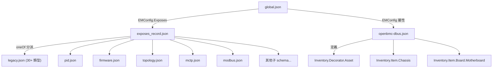

# JSON Schema 驗證機制

## 概述

Entity-Manager 使用 [JSON Schema Draft-07](https://json-schema.org/) 來驗證配置檔的格式正確性。Schema 檔案位於 `schemas/` 目錄下，共 **24 個檔案**，涵蓋所有支援的 Expose 類型和 D-Bus 介面定義。

**驗證庫**：[valijson](https://github.com/tristanpenman/valijson)

📍 驗證邏輯位於 [configuration.cpp](../../src/entity-manager/src/entity_manager/configuration.cpp) L46-64, L129-138

> ⚠️ **簡化說明**：Runtime 驗證受 Meson 編譯選項 `validate-json` 控制（對應 `ENABLE_RUNTIME_VALIDATE_JSON` 常數）。若未啟用，配置檔僅做 JSON 語法解析，不做 schema 驗證。

---

## Schema 檔案清單

### 核心 Schema

| 檔案                                                                        | 大小   | 職責                                                              |
| --------------------------------------------------------------------------- | ------ | ----------------------------------------------------------------- |
| [global.json](../../src/entity-manager/schemas/global.json)                 | 7.0 KB | **頂層 schema** — 定義 `EMConfig` 結構（Name/Type/Probe/Exposes） |
| [exposes_record.json](../../src/entity-manager/schemas/exposes_record.json) | 6.9 KB | Exposes 陣列元素的 `oneOf` 分派 — 引用所有子 schema               |
| [openbmc-dbus.json](../../src/entity-manager/schemas/openbmc-dbus.json)     | 8.9 KB | D-Bus 介面屬性定義（Inventory.Decorator.Asset 等）                |

### 功能性 Schema

| 檔案                                                                        | 大小    | 定義的型別                                                                                 |
| --------------------------------------------------------------------------- | ------- | ------------------------------------------------------------------------------------------ |
| [legacy.json](../../src/entity-manager/schemas/legacy.json)                 | 44.2 KB | **最大的 schema** — 含 30+ 類型：ADC、TempSensor、AspeedFan、EEPROM、PSUSensor、XeonCPU 等 |
| [pid.json](../../src/entity-manager/schemas/pid.json)                       | 3.9 KB  | PID 溫控配置                                                                               |
| [pid_zone.json](../../src/entity-manager/schemas/pid_zone.json)             | 1.0 KB  | PID Zone 配置                                                                              |
| [stepwise.json](../../src/entity-manager/schemas/stepwise.json)             | 2.3 KB  | 階梯式溫控配置                                                                             |
| [firmware.json](../../src/entity-manager/schemas/firmware.json)             | 6.5 KB  | 韌體定義：I2CVRFirmware、EEPROMDeviceFirmware、TPMFirmware、BIOS                           |
| [virtual_sensor.json](../../src/entity-manager/schemas/virtual_sensor.json) | 2.8 KB  | 虛擬感測器（計算型感測器）                                                                 |
| [topology.json](../../src/entity-manager/schemas/topology.json)             | 1.1 KB  | Port 定義（containing/powering 拓撲）                                                      |
| [mctp.json](../../src/entity-manager/schemas/mctp.json)                     | 1.7 KB  | MCTP I2C/I3C Target 定義                                                                   |
| [modbus.json](../../src/entity-manager/schemas/modbus.json)                 | 12.2 KB | Modbus RTU 偵測與裝置定義                                                                  |

### 硬體特定 Schema

| 檔案                                                        | 大小   | 定義的型別                                            |
| ----------------------------------------------------------- | ------ | ----------------------------------------------------- |
| [ibm.json](../../src/entity-manager/schemas/ibm.json)       | 5.9 KB | IBM 專用：PowerMode、CompatibleSystem、CFFPSConnector |
| [intel.json](../../src/entity-manager/schemas/intel.json)   | 1.0 KB | Intel 專用：FanConnector                              |
| [nvidia.json](../../src/entity-manager/schemas/nvidia.json) | 0.9 KB | NVIDIA 專用：NvidiaMctpVdm                            |

### 元件 Schema

| 檔案                                                                                    | 大小   | 定義的型別          |
| --------------------------------------------------------------------------------------- | ------ | ------------------- |
| [cpld.json](../../src/entity-manager/schemas/cpld.json)                                 | 1.5 KB | CPLDFirmware        |
| [gpio_presence.json](../../src/entity-manager/schemas/gpio_presence.json)               | 1.3 KB | GPIODeviceDetect    |
| [leak_detector.json](../../src/entity-manager/schemas/leak_detector.json)               | 1.5 KB | GPIOLeakDetector    |
| [satellite_controller.json](../../src/entity-manager/schemas/satellite_controller.json) | 1.2 KB | SatelliteController |
| [spdm_endpoint.json](../../src/entity-manager/schemas/spdm_endpoint.json)               | 1.4 KB | SpdmTcpEndpoint     |
| [usb_port.json](../../src/entity-manager/schemas/usb_port.json)                         | 1.8 KB | USBPort             |
| [valve.json](../../src/entity-manager/schemas/valve.json)                               | 1.8 KB | GPIOValve           |

---

## Schema 層級結構



> **逐步說明：**
>
> 1. **global.json** 是頂層 schema，定義了 `EMConfig` 結構，要求四個必填欄位：`Name`、`Type`、`Probe`、`Exposes`
> 2. **Exposes 陣列** 中每個元素透過 `exposes_record.json` 做 `oneOf` 分派，根據元素的 `Type` 值找到對應的子 schema
> 3. **每個子 schema**（如 `legacy.json` 中的 `ADC`、`TempSensor`）定義該類型允許的屬性、型別和限制
> 4. **openbmc-dbus.json** 定義頂層配置可以攜帶的標準 D-Bus 介面屬性（如 Asset、Revision、Slot 等）

---

## global.json 詳解

### EMConfig 必填欄位

```json
{
  "required": ["Exposes", "Name", "Probe", "Type"]
}
```

### Type 允許值

📍 [global.json](../../src/entity-manager/schemas/global.json) L44-52

```json
{
  "Type": {
    "enum": ["Board", "Chassis", "NVMe", "PowerSupply", "Cpu", "Cable", "Valve"]
  }
}
```

> 📝 **注意**：Schema 嚴格限制了頂層 `Type` 只能是這 7 個值。其他自訂值會在 schema 驗證時失敗。

### Probe 格式

Probe 可以是單一字串或字串陣列：

```json
{
  "Probe": {
    "anyOf": [
      { "type": "string" },
      { "type": "array", "items": { "type": "string" } }
    ]
  }
}
```

### 可選的 D-Bus 介面屬性

頂層配置可以攜帶以下標準 D-Bus 介面（全部可選）：

| 屬性名（JSON key）                                     | 引用                | 用途                     |
| ------------------------------------------------------ | ------------------- | ------------------------ |
| `xyz.openbmc_project.Common.UUID`                      | `openbmc-dbus.json` | 唯一識別碼               |
| `xyz.openbmc_project.Inventory.Decorator.Asset`        | `openbmc-dbus.json` | 資產資訊（廠商、型號等） |
| `xyz.openbmc_project.Inventory.Decorator.AssetTag`     | `openbmc-dbus.json` | 資產標籤                 |
| `xyz.openbmc_project.Inventory.Decorator.Compatible`   | `openbmc-dbus.json` | 相容性列表               |
| `xyz.openbmc_project.Inventory.Decorator.Replaceable`  | `openbmc-dbus.json` | 是否可更換               |
| `xyz.openbmc_project.Inventory.Decorator.Slot`         | `openbmc-dbus.json` | 插槽資訊                 |
| `xyz.openbmc_project.Inventory.Item.Board.Motherboard` | `openbmc-dbus.json` | 主機板標記               |
| `xyz.openbmc_project.Inventory.Item.Chassis`           | `openbmc-dbus.json` | 機箱標記                 |

---

## EMExposesElement 詳解

### 分派機制

📍 [exposes_record.json](../../src/entity-manager/schemas/exposes_record.json) L182-200

```json
{
  "EMExposesElement": {
    "allOf": [
      { "$ref": "#/$defs/ConfigSchema" },
      { "required": ["Name"] },
      { "required": ["Type"] }
    ]
  }
}
```

每個 Expose 元素**必須**有 `Name` 和 `Type`，然後根據 `Type` 值透過 `ConfigSchema` 的 `oneOf` 匹配到具體的子 schema。

### 目前支援的 Expose 類型（完整清單）

透過 `ConfigSchema` 的 `oneOf` 引用，共支援 **55+** 種類型。以下列出主要分類：

| 分類       | 來源 schema           | 類型數量 | 範例                                                   |
| ---------- | --------------------- | -------- | ------------------------------------------------------ |
| 溫度感測器 | `legacy.json`         | ~10      | TMP75, TMP441, EMC1403 等（定義在 `TempSensor`）       |
| ADC        | `legacy.json`         | 1        | ADC                                                    |
| 風扇       | `legacy.json`         | 4        | AspeedFan, NuvotonFan, I2CFan, HPEFan                  |
| CPU        | `legacy.json`         | 1        | XeonCPU                                                |
| PSU        | `legacy.json`         | 1        | PSUSensor                                              |
| EEPROM     | `legacy.json`         | 1        | EEPROM                                                 |
| NVMe       | `legacy.json`         | 1        | NVME1000                                               |
| PID 控制   | `pid.json`            | 1        | Pid                                                    |
| PID Zone   | `pid_zone.json`       | 1        | Pid.Zone                                               |
| 階梯控制   | `stepwise.json`       | 1        | Stepwise                                               |
| 拓撲 Port  | `topology.json`       | 1        | Port                                                   |
| MCTP       | `mctp.json`           | 2        | MCTPI2CTarget, MCTPI3CTarget                           |
| 韌體       | `firmware.json`       | 4        | I2CVRFirmware, EEPROMDeviceFirmware, TPMFirmware, BIOS |
| 虛擬感測器 | `virtual_sensor.json` | 1        | VirtualSensor                                          |
| Modbus     | `modbus.json`         | 2        | ModbusRTUDetect, ModbusRTUDevice                       |
| GPIO       | `legacy.json` + 專用  | 4        | Gpio, GPIODeviceDetect, GPIOLeakDetector, GPIOValve    |
| 其他       | 各 schema             | ~10      | BMC, I2CMux, SatelliteController, SpdmTcpEndpoint 等   |

---

## 驗證流程

### Source Code 中的驗證

📍 [configuration.cpp](../../src/entity-manager/src/entity_manager/configuration.cpp) L46-85

```cpp
// loadConfigurations() 中的驗證流程：
if constexpr (ENABLE_RUNTIME_VALIDATE_JSON)
{
    std::ifstream schemaStream(schemaDirectory / "global.json");
    schema = nlohmann::json::parse(schemaStream, ...);
}

for (auto& jsonPath : jsonPaths)
{
    auto data = nlohmann::json::parse(jsonStream, nullptr, false, true);

    if (ENABLE_RUNTIME_VALIDATE_JSON && !validateJson(schema, data))
    {
        lg2::error("Error validating {PATH}", "PATH", jsonPath.string());
        continue;  // ← 跳過驗證失敗的檔案
    }

    configurations.emplace_back(data);
}
```

**注意事項**：

- 驗證失敗的檔案會被**靜默跳過**（僅記錄一條 error log）
- 其他檔案的載入不受影響

### 手動驗證

可以使用外部工具進行離線驗證：

```bash
# 使用 Python jsonschema（需安裝）
pip install jsonschema
python3 -c "
import json, jsonschema
schema = json.load(open('/usr/share/entity-manager/schemas/global.json'))
config = json.load(open('my_config.json'))
jsonschema.validate(config, schema)
print('Valid!')
"
```

---

## 新增自訂 Expose 類型的步驟

當需要新增自訂的 `Exposes` 類型時，按照以下步驟：

### 1. 建立子 schema 檔案

在 `schemas/` 目錄下建立新的 `.json` schema（檔名使用 `lower_snake_case`）：

```json
{
  "$schema": "http://json-schema.org/draft-07/schema#",
  "$defs": {
    "MyCustomSensor": {
      "title": "My Custom Sensor",
      "type": "object",
      "additionalProperties": false,
      "properties": {
        "Name": { "type": "string" },
        "Type": { "const": "MyCustomSensor" },
        "Bus": { "type": "integer" },
        "Address": { "type": "string" }
      },
      "required": ["Name", "Type", "Bus", "Address"]
    }
  }
}
```

### 2. 在 exposes_record.json 中引用

在 `ConfigSchema` 的 `oneOf` 陣列中加入新引用：

```json
{
  "$ref": "my_custom_sensor.json#/$defs/MyCustomSensor"
}
```

### 3. 若需要新的 D-Bus 介面

在 `openbmc-dbus.json` 中加入對應的介面定義。

### 4. 在 meson.build 中註冊

📍 [schemas/meson.build](../../src/entity-manager/schemas/meson.build)

將新的 schema 檔案加入安裝清單。

---

## 下一步

- 了解 [設定指南](ConfigurationGuide.md) 學習如何編寫配置檔
- 查看 [Source Code 走讀](SourceCodeWalkthrough.md) 了解驗證在啟動流程中的位置
- 閱讀 [設定範例](ExampleConfigurations.md) 參考實際的配置寫法

---

> 📖 **參考**：
>
> - [schemas/README.md](https://github.com/openbmc/entity-manager/blob/master/schemas/README.md)
> - [JSON Schema Draft-07](https://json-schema.org/draft-07/json-schema-release-notes)
> - [valijson 驗證庫](https://github.com/tristanpenman/valijson)
