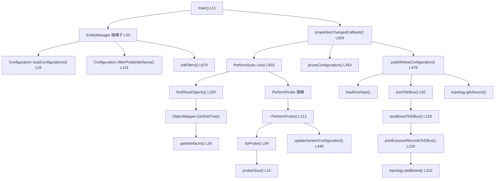
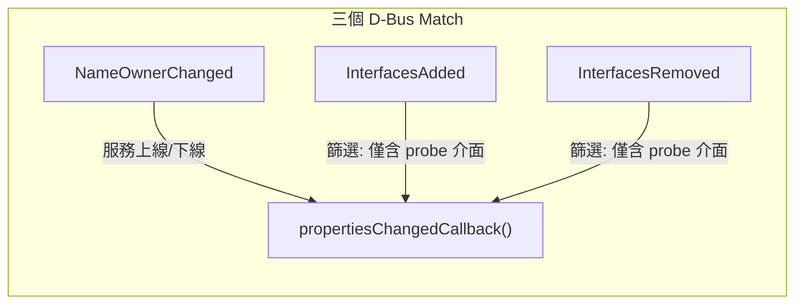
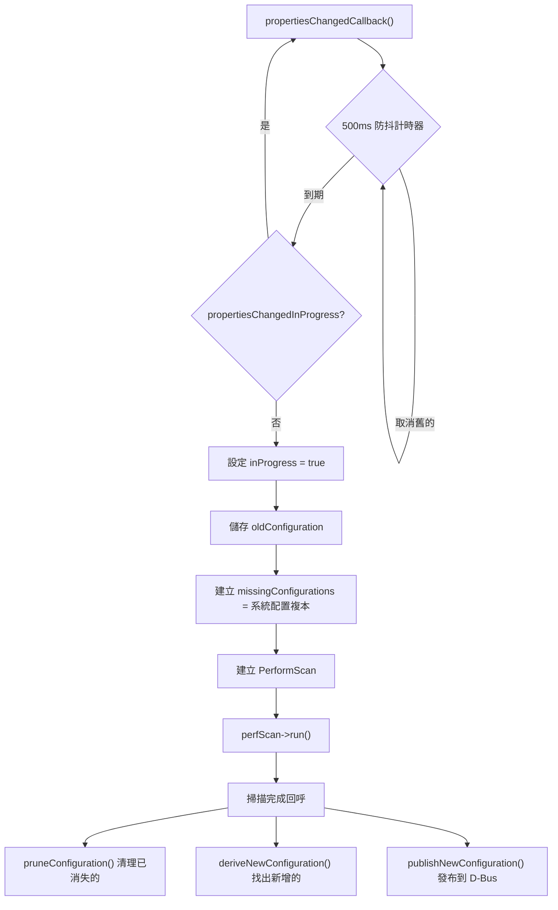
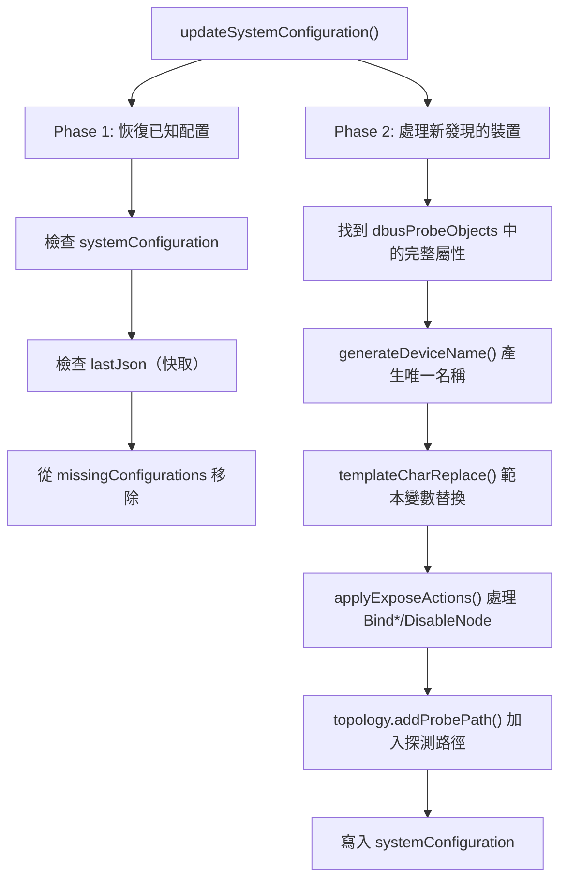

# Entity-Manager Source Code 深度走讀

## 概述

本文件深入追蹤 Entity-Manager 的主要程式碼流程，從 `main()` 到配置發布至 D-Bus 的完整呼叫鏈。所有行號均基於 source code 目錄 `src/entity_manager/`。

> ⚠️ **簡化說明**：本文件聚焦於主要邏輯流程，省略了部分錯誤處理、日誌輸出和邊界條件。完整實作請參閱 source code。

---

## 原始碼檔案總覽

| 檔案                                                                                   | 行數 | 核心職責                                                 |
| -------------------------------------------------------------------------------------- | ---- | -------------------------------------------------------- |
| [`main.cpp`](../../src/entity-manager/src/entity_manager/main.cpp)                     | 31   | 入口點：初始化 io_context、D-Bus 連線、EntityManager     |
| [`entity_manager.cpp`](../../src/entity-manager/src/entity_manager/entity_manager.cpp) | 711  | 核心邏輯：D-Bus 信號處理、配置發布、topology 管理        |
| [`perform_scan.cpp`](../../src/entity-manager/src/entity_manager/perform_scan.cpp)     | 719  | 掃描邏輯：Probe 解析、ObjectMapper 查詢、配置更新        |
| [`perform_probe.cpp`](../../src/entity-manager/src/entity_manager/perform_probe.cpp)   | 246  | 探測邏輯：`doProbe()` 邏輯運算、`probeDbus()` D-Bus 匹配 |
| [`configuration.cpp`](../../src/entity-manager/src/entity_manager/configuration.cpp)   | 213  | 配置載入：JSON 讀取、Schema 驗證、Probe 介面提取         |
| [`topology.cpp`](../../src/entity-manager/src/entity_manager/topology.cpp)             | ~275 | 拓撲建模：Port 匹配、Association 建立                    |

---

## 完整呼叫鏈總覽



> **逐步說明：**
>
> 1. **啟動**：`main()` 建立 D-Bus 連線、EntityManager 物件，然後 post `propertiesChangedCallback()` 到 io_context
> 2. **配置載入**：EntityManager 建構子中，`Configuration` 類別載入所有 JSON 配置檔並提取需要探測的 D-Bus 介面
> 3. **信號過濾**：`initFilters()` 註冊三個 D-Bus match：`NameOwnerChanged`、`InterfacesAdded`、`InterfacesRemoved`
> 4. **首次掃描**：500ms 防抖後，建立 `PerformScan` 物件並呼叫 `run()`
> 5. **D-Bus 查詢**：`run()` 透過 ObjectMapper 的 `GetSubTree()` 取得所有擁有目標介面的物件路徑
> 6. **屬性收集**：`getInterfaces()` 對每個物件呼叫 `Properties.GetAll()` 收集所有屬性
> 7. **Probe 評估**：當所有 `PerformProbe` 物件銷毀時（引用計數歸零），到解構子觸發 `doProbe()` 和 `probeDbus()`
> 8. **配置更新**：匹配成功後，`updateSystemConfiguration()` 執行範本替換和 Expose Actions
> 9. **清理舊資源**：`pruneConfiguration()` 移除不再匹配的配置
> 10. **發布到 D-Bus**：`publishNewConfiguration()` 依序執行 Overlay 載入、JSON 快取寫入、D-Bus 物件建立

---

## 階段一：啟動與初始化

### main() — 入口點

📍 [`main.cpp`](../../src/entity-manager/src/entity_manager/main.cpp) L11-30

```cpp
int main()
{
    const std::vector<std::filesystem::path> configurationDirectories = {
        PACKAGE_DIR "configurations", SYSCONF_DIR "configurations"};
    const std::filesystem::path schemaDirectory(PACKAGE_DIR "schemas");

    boost::asio::io_context io;
    auto systemBus = std::make_shared<sdbusplus::asio::connection>(io);
    systemBus->request_name("xyz.openbmc_project.EntityManager");
    EntityManager em(systemBus, io, configurationDirectories, schemaDirectory);

    boost::asio::post(io, [&]() { em.propertiesChangedCallback(); });
    em.handleCurrentConfigurationJson();
    io.run();
}
```

**關鍵點**：

| 步驟 | 行號   | 說明                                             |
| ---- | ------ | ------------------------------------------------ |
| 1    | L13-14 | 定義兩個配置搜尋路徑                             |
| 2    | L19-20 | 建立 D-Bus 連線並請求服務名稱                    |
| 3    | L21    | 建構 EntityManager（觸發配置載入和信號註冊）     |
| 4    | L23    | **post 首次掃描** — 延遲到 io_context 啟動後執行 |
| 5    | L25    | 處理上次快取的配置（韌體版本相同時重用）         |
| 6    | L27    | `io.run()` — 啟動事件迴圈                        |

### EntityManager 建構子

📍 [`entity_manager.cpp`](../../src/entity-manager/src/entity_manager/entity_manager.cpp) L53-80

```cpp
EntityManager::EntityManager(...) :
    systemBus(systemBus),
    objServer(sdbusplus::asio::object_server(systemBus, /*skipManager=*/true)),
    configuration(configurationDirectories, schemaDirectory),  // ← 載入 JSON
    ...
{
    objServer.add_manager("/xyz/openbmc_project/inventory");

    entityIface = objServer.add_interface("/xyz/openbmc_project/EntityManager",
                                          "xyz.openbmc_project.EntityManager");
    entityIface->register_method("ReScan", [this]() {
        propertiesChangedCallback();
    });

    initFilters(configuration.probeInterfaces);  // ← 註冊 D-Bus 信號
}
```

**關鍵點**：

1. **`configuration(...)` 初始化列表**：觸發 `Configuration::Configuration()`，載入所有 JSON 配置並提取 Probe 介面
2. **`add_manager()`**：在 `/xyz/openbmc_project/inventory` 上建立 ObjectManager，使 `InterfacesAdded/Removed` 信號由此路徑發出
3. **`ReScan` 方法**：允許外部程式透過 D-Bus 呼叫觸發重新掃描
4. **`initFilters()`**：使用已提取的 Probe 介面列表來過濾 D-Bus 信號

---

## 階段二：配置載入與驗證

### Configuration 類別

📍 [`configuration.cpp`](../../src/entity-manager/src/entity_manager/configuration.cpp) L18-26

```cpp
Configuration::Configuration(...) : schemaDirectory(schemaDirectory), ...
{
    loadConfigurations();     // 載入所有 JSON
    filterProbeInterfaces();  // 從 Probe 提取 D-Bus 介面
}
```

### loadConfigurations()

📍 [`configuration.cpp`](../../src/entity-manager/src/entity_manager/configuration.cpp) L28-108

核心流程：

```
1. findFiles(configurationDirectories, ".*\.json") — 搜尋所有 .json 檔
2. 若 ENABLE_RUNTIME_VALIDATE_JSON：
   a. 開啟 schemas/global.json
   b. 解析為 JSON schema
3. 遍歷每個 JSON 檔案：
   a. 解析 JSON（允許 C-style 註解）
   b. 若啟用驗證：validateJson(schema, data)
   c. 若頂層是陣列，展平加入 configurations
   d. 否則整個物件加入 configurations
```

**重要**：`nlohmann::json::parse(jsonStream, nullptr, false, true)` — 最後一個 `true` 表示**允許 C-style 註解**。

### validateJson()

📍 [`configuration.cpp`](../../src/entity-manager/src/entity_manager/configuration.cpp) L129-138

使用 **valijson** 函式庫進行 JSON Schema Draft-07 驗證：

```cpp
bool validateJson(const nlohmann::json& schemaFile, const nlohmann::json& input)
{
    valijson::Schema schema;
    valijson::SchemaParser parser;
    valijson::adapters::NlohmannJsonAdapter schemaAdapter(schemaFile);
    parser.populateSchema(schemaAdapter, schema);
    valijson::Validator validator;
    valijson::adapters::NlohmannJsonAdapter targetAdapter(input);
    return validator.validate(schema, targetAdapter, nullptr);
}
```

### filterProbeInterfaces()

📍 [`configuration.cpp`](../../src/entity-manager/src/entity_manager/configuration.cpp) L141-189

從所有配置的 `Probe` 欄位中提取 D-Bus 介面名稱：

```
遍歷每個 configuration：
  找到 "Probe" 欄位
  將 Probe 標準化為陣列
  遍歷每個 probe 字串：
    若是保留字（TRUE/FALSE/AND/OR 等）→ 跳過
    否則取 "(" 之前的部分作為 D-Bus 介面名稱
    加入 probeInterfaces 集合
```

**輸出**：`probeInterfaces`（`std::unordered_set<std::string>`）— 所有配置中引用的 D-Bus 介面名稱集合。

---

## 階段三：D-Bus 信號監聽

### initFilters()

📍 [`entity_manager.cpp`](../../src/entity-manager/src/entity_manager/entity_manager.cpp) L670-710



> **逐步說明：**
>
> 1. **NameOwnerChanged**（L673-687）：當任何 well-known name 的擁有者改變時觸發（服務啟動或退出）。忽略 unique-name（以 `:` 開頭）的連線
> 2. **InterfacesAdded**（L691-699）：新介面出現時，先用 `iaContainsProbeInterface()` 檢查是否包含 Probe 感興趣的介面，**僅在包含時**才觸發回呼
> 3. **InterfacesRemoved**（L701-709）：介面移除時，同樣做過濾

**設計意義**：這個過濾機制避免了 Entity-Manager 對**所有** D-Bus 變化都做出反應，只關注與 Probe 相關的介面變化。

---

## 階段四：掃描與探測

### propertiesChangedCallback() — 核心調度器

📍 [`entity_manager.cpp`](../../src/entity-manager/src/entity_manager/entity_manager.cpp) L509-575

這是整個系統的**心臟**，負責協調掃描、探測、清理和發布：



> **逐步說明：**
>
> 1. **防抖機制**（L515）：500ms 計時器，短時間內多次觸發只執行最後一次
> 2. **重入保護**（L532-536）：若正在掃描中，重新排程而非同時執行
> 3. **快照**（L541-543）：儲存當前配置快照，用於稍後比較差異
> 4. **`missingConfigurations`**（L542）：初始化為當前系統配置的完整複本，掃描過程中會逐步從中移除「仍然存在」的項目，**掃描結束後剩餘的就是已消失的配置**
> 5. **建立 PerformScan**（L545-546）：傳入 EntityManager 引用、missingConfigurations、所有配置檔
> 6. **完成回呼**（L547-572）：掃描完成後執行：
>    - `pruneConfiguration()` — 移除已消失配置的 D-Bus 物件
>    - `deriveNewConfiguration()` — 從新配置中**移除已存在**的，留下真正新增的
>    - `publishNewConfiguration()` — 發布新配置

### PerformScan::run() — 掃描引擎

📍 [`perform_scan.cpp`](../../src/entity-manager/src/entity_manager/perform_scan.cpp) L603-701

```
run() 的工作：
1. 遍歷所有 _configurations：
   a. 驗證有 "Probe" 和 "Name" 欄位
   b. 跳過已通過的 Probe（在 passedProbes 中）
   c. 解析 Probe 命令為字串陣列
   d. 建立 PerformProbe 物件（shared_ptr）
   e. 從 probe 命令中提取 D-Bus 介面名稱
2. 呼叫 findDbusObjects() 開始非同步查詢
```

**關鍵設計 — 引用計數觸發探測**：

```cpp
auto probePointer = std::make_shared<probe::PerformProbe>(
    recordRef, probeCommand, *probeName, thisRef);  // L677-678
```

- 每個 `PerformProbe` 是 `shared_ptr`，被加入 `dbusProbePointers` 向量
- 當 `findDbusObjects()` 完成所有非同步 `GetAll` 呼叫後，`dbusProbePointers` 超出作用域
- **所有** `PerformProbe` 的引用計數歸零 → 觸發 `~PerformProbe()`
- `~PerformProbe()` 中呼叫 `doProbe()` 做實際探測

### PerformScan 的迭代設計

📍 [`perform_scan.cpp`](../../src/entity-manager/src/entity_manager/perform_scan.cpp) L703-718

```cpp
scan::PerformScan::~PerformScan()
{
    if (_passed)  // 本輪有任何 Probe 通過
    {
        // 建立新的 PerformScan 繼續掃描
        auto nextScan = std::make_shared<PerformScan>(...);
        nextScan->passedProbes = std::move(passedProbes);
        nextScan->dbusProbeObjects = std::move(dbusProbeObjects);
        boost::asio::post(_em.io, [nextScan]() { nextScan->run(); });
    }
    else  // 沒有新的 Probe 通過 → 掃描完成
    {
        _callback();
    }
}
```

> ⚠️ **簡化說明**：PerformScan 的迭代設計允許**依賴鏈**：當 Probe A 通過後，其 Exposes 可能建立新的 D-Bus 物件，進而讓 Probe B 也通過。`~PerformScan()` 在解構時判斷 `_passed`，若有新通過的 Probe，就建立新的 PerformScan 再跑一輪。等到沒有新 Probe 通過，才呼叫最終回呼。

---

## 階段五：Probe 評估

### doProbe() — Probe 邏輯引擎

📍 [`perform_probe.cpp`](../../src/entity-manager/src/entity_manager/perform_probe.cpp) L64-199

此函數遍歷 `probeCommand` 陣列，對每個元素判斷類型並處理：

| 類型            | 行為                               | 行號               |
| --------------- | ---------------------------------- | ------------------ |
| `FALSE`         | `cur = false`                      | L83-86             |
| `TRUE`          | `cur = true`                       | L88-91             |
| `MATCH_ONE`     | `cur = ret; matchOne = true`       | L93-99             |
| `FOUND('名稱')` | 在 `passedProbes` 中搜尋           | L107-122           |
| `AND` / `OR`    | **延遲生效**：記錄在 `lastCommand` | L101-106, L166-173 |
| D-Bus 介面      | 呼叫 `probeDbus()` 做實際匹配      | L130-162           |

**邏輯運算的延遲生效機制**：

```cpp
// L166-173: AND/OR 在「下一個」probe 結果出來後才運算
if (lastCommand == probe::probe_type_codes::AND)
    ret = cur && ret;
else if (lastCommand == probe::probe_type_codes::OR)
    ret = cur || ret;

if (first) { ret = cur; first = false; }
lastCommand = probeType.value_or(probe::probe_type_codes::FALSE_T);
```

### probeDbus() — D-Bus 屬性匹配

📍 [`perform_probe.cpp`](../../src/entity-manager/src/entity_manager/perform_probe.cpp) L15-60

```
遍歷 scan->dbusProbeObjects 中的所有 [path, interfaces]：
  找到目標 interfaceName 的屬性集合
  foundProbe = true（介面存在）
  遍歷每個 [matchProp, matchJSON]：
    在介面屬性中找 matchProp
    若找到 → matchProbe(matchJSON, deviceValue) 做值比對
    若找不到 → deviceMatches = false，跳到下一個 path
  若所有條件都匹配 → 加入 foundDevs，foundMatch = true
```

---

## 階段六：配置更新

### updateSystemConfiguration()

📍 [`perform_scan.cpp`](../../src/entity-manager/src/entity_manager/perform_scan.cpp) L449-601

當 `doProbe()` 回傳 `true` 時，此函數處理匹配到的裝置：



> **逐步說明：**
>
> 1. **Phase 1 — 恢復已知裝置**（L462-486）：
>    - 遍歷 `foundDevices`
>    - 為每個裝置生成 `recordName`（含 hash）
>    - 先查 `systemConfiguration`（當前），再查 `lastJson`（快取）
>    - 若找到 → 恢復配置，從 `missingConfigurations` 移除，從 `foundDevices` 移除
> 2. **Phase 2 — 處理新裝置**（L494-600）：
>    - 對每個新發現的裝置：
>      - 取得完整的 D-Bus 屬性（`dbusProbeObjects`）
>      - `generateDeviceName()` — 做 `$index` 替換，避免名稱重複
>      - `templateCharReplace()` — 替換 `$bus`、`$address`、`${PROPERTY}` 等範本變數
>      - `applyExposeActions()` — 處理 `Bind*` 和 `DisableNode`
>      - `topology.addProbePath()` — 記錄 probing 關聯

---

## 階段七：D-Bus 發布

### publishNewConfiguration()

📍 [`entity_manager.cpp`](../../src/entity-manager/src/entity_manager/entity_manager.cpp) L479-506

```cpp
void EntityManager::publishNewConfiguration(...)
{
    loadOverlays(newConfiguration, io);           // 1. 載入 Device Tree Overlay

    boost::asio::post(io, [this]() {
        writeJsonFiles(systemConfiguration);      // 2. 快取寫入 /var/configuration/
    });

    boost::asio::post(io, [this, ...] {
        postToDbus(newConfiguration);              // 3. 發布到 D-Bus
        if (count == instance) {
            startRemovedTimer(timer, ...);         // 4. 啟動移除計時器
        }
    });
}
```

### postToDbus()

📍 [`entity_manager.cpp`](../../src/entity-manager/src/entity_manager/entity_manager.cpp) L82-118

```
遍歷 newConfiguration 中的每個 [boardId, boardConfig]：
  postBoardToDBus() — 建立 Entity + Exposes 的 D-Bus 物件

遍歷 topology.getAssocs() 取得拓撲關聯：
  建立 xyz.openbmc_project.Association.Definitions 介面
  設定 "Associations" 屬性
```

### postBoardToDBus()

📍 [`entity_manager.cpp`](../../src/entity-manager/src/entity_manager/entity_manager.cpp) L120-216

建立一個 Entity（Board/Chassis 等）的 D-Bus 物件：

| 步驟 | 行號     | 建立的 D-Bus 介面                                                         |
| ---- | -------- | ------------------------------------------------------------------------- |
| 1    | L159-160 | 計算路徑：`/xyz/openbmc_project/inventory/system/{boardType}/{boardName}` |
| 2    | L162-166 | `xyz.openbmc_project.Inventory.Item`                                      |
| 3    | L168-174 | `xyz.openbmc_project.Inventory.Item.{BoardType}`                          |
| 4    | L183-195 | Board 層級的物件屬性（非 Exposes）                                        |
| 5    | L208-213 | 遍歷 `Exposes[]` → `postExposesRecordsToDBus()`                           |

### postExposesRecordsToDBus()

📍 [`entity_manager.cpp`](../../src/entity-manager/src/entity_manager/entity_manager.cpp) L218-311

建立每個 Expose 記錄的 D-Bus 物件：

| 步驟 | 行號     | 說明                                                                           |
| ---- | -------- | ------------------------------------------------------------------------------ |
| 1    | L234-242 | 檢查 `Status`：若為 `"disabled"` → 跳過                                        |
| 2    | L258-260 | 計算路徑：`{boardPath}/{itemName}`                                             |
| 3    | L262-285 | 特殊類型處理：`BMC` → `Inventory.Item.Bmc`、`System` → `Inventory.Item.System` |
| 4    | L287-299 | 遍歷 Expose 的子屬性 → `postConfigurationRecord()`                             |
| 5    | L301-308 | 建立 `xyz.openbmc_project.Configuration.{Type}` 介面                           |
| 6    | L310     | `topology.addBoard()` — 將此 Entity 加入拓撲模型                               |

---

## 重要設計模式

### 1. 防抖（Debounce）

```
propertiesChangedCallback() 使用 500ms 計時器防抖。
短時間內多個 D-Bus 信號只觸發一次掃描。
```

### 2. 引用計數觸發（RAII Probe）

```
PerformProbe 透過 shared_ptr 引用計數：
- 建立時加入 dbusProbePointers
- findDbusObjects() 完成後 vector 銷毀
- 所有 GetAll 呼叫完成後 PerformProbe 引用歸零
- ~PerformProbe() 在正確時機觸發 doProbe()
```

### 3. 迭代掃描（Iterative Scan）

```
~PerformScan() 檢查 _passed：
- 若有新 Probe 通過 → 建立新 PerformScan 再跑一輪
- 若無新通過 → 呼叫 _callback() 結束掃描
這允許「依賴鏈」：A 的 Exposes 可觸發 B 的 Probe
```

### 4. 可設定屬性（Settable Interfaces）

📍 [`entity_manager.cpp`](../../src/entity-manager/src/entity_manager/entity_manager.cpp) L39-40

```cpp
static constexpr std::array<const char*, 6> settableInterfaces = {
    "FanProfile", "Pid", "Pid.Zone", "Stepwise", "Thresholds", "Polling"};
```

只有這 6 種介面的 D-Bus 屬性是 **readWrite**，其餘都是 **readOnly**。

---

## 下一步

- 了解 [架構概述](Architecture.md) 理解系統整體設計
- 查看 [Probe 語法](ProbeSyntax.md) 了解 Probe 匹配細節
- 閱讀 [JSON Schema 驗證](Schemas.md) 了解配置驗證機制

---

> 📖 **Source Code**：[entity-manager/src/entity_manager/](https://github.com/openbmc/entity-manager/tree/master/src/entity_manager)
