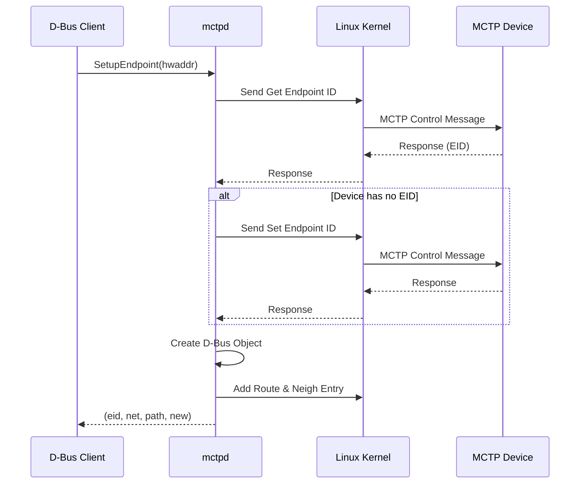
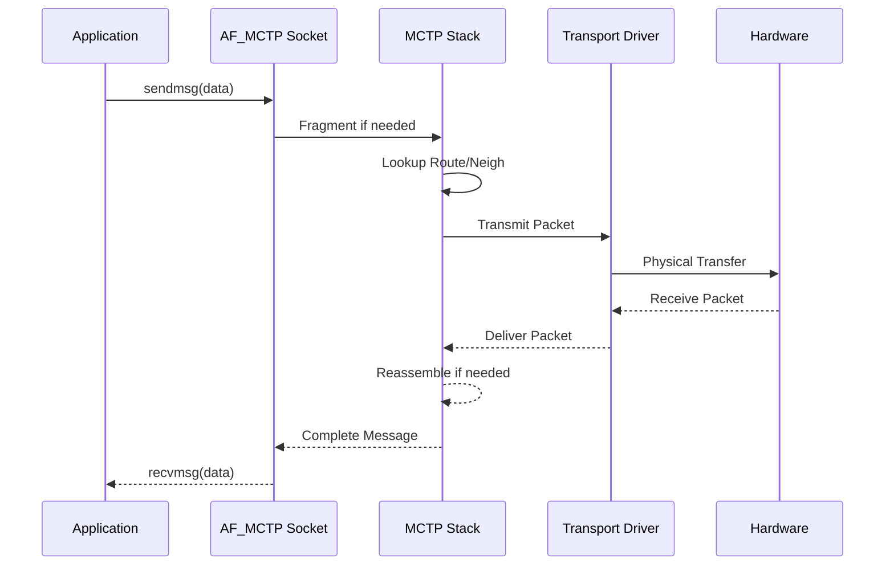

# 架構概述 (Architecture)

本文說明 CodeConstruct/mctp 的系統架構，包含元件關係、資料流程和與 Linux 核心的互動方式。

---

## 系統架構圖

```
┌─────────────────────────────────────────────────────────────────────────────┐
│                            使用者空間 (Userspace)                            │
├─────────────────────────────────────────────────────────────────────────────┤
│                                                                             │
│  ┌─────────────┐     ┌─────────────────────────────────────────────────┐   │
│  │   mctp CLI  │     │                    mctpd                        │   │
│  │             │     │  ┌───────────────────────────────────────────┐  │   │
│  │ • link      │     │  │           MCTP Control Protocol           │  │   │
│  │ • address   │     │  │  • Get Endpoint ID                        │  │   │
│  │ • route     │     │  │  • Set Endpoint ID                        │  │   │
│  │ • neigh     │     │  │  • Get Endpoint UUID                      │  │   │
│  │             │     │  │  • Get Message Type Support               │  │   │
│  └──────┬──────┘     │  └───────────────────────────────────────────┘  │   │
│         │            │                        │                         │   │
│         │            │  ┌───────────────────────────────────────────┐  │   │
│         │            │  │              D-Bus Service                 │  │   │
│         │            │  │  au.com.codeconstruct.MCTP1               │  │   │
│         │            │  │                                           │  │   │
│         │            │  │  Objects:                                 │  │   │
│         │            │  │  • /au/com/codeconstruct/mctp1            │  │   │
│         │            │  │  • .../interfaces/<name>                  │  │   │
│         │            │  │  • .../networks/<net>/endpoints/<eid>     │  │   │
│         │            │  └───────────────────────────────────────────┘  │   │
│         │            └──────────────────┬──────────────────────────────┘   │
│         │                               │                                   │
│         │ Netlink                       │ AF_MCTP Socket                    │
│         ▼                               ▼                                   │
├─────────────────────────────────────────────────────────────────────────────┤
│                             核心空間 (Kernel)                               │
├─────────────────────────────────────────────────────────────────────────────┤
│                                                                             │
│  ┌─────────────────────────────────────────────────────────────────────┐   │
│  │                     Linux MCTP Stack (net/mctp/)                    │   │
│  │                                                                     │   │
│  │  ┌──────────────┐  ┌──────────────┐  ┌─────────────────────────┐   │   │
│  │  │  Route Table │  │ Neigh Table  │  │   Message Assembly/     │   │   │
│  │  │              │  │              │  │   Fragmentation         │   │   │
│  │  └──────────────┘  └──────────────┘  └─────────────────────────┘   │   │
│  │                                                                     │   │
│  └─────────────────────────────────────────────────────────────────────┘   │
│                               │                                             │
│  ┌─────────────────────────────────────────────────────────────────────┐   │
│  │                    MCTP Transport Drivers                           │   │
│  │                                                                     │   │
│  │  ┌────────────┐  ┌────────────┐  ┌────────────┐  ┌────────────┐    │   │
│  │  │ mctp-i2c   │  │ mctp-serial│  │ mctp-pcie  │  │ mctp-usb   │    │   │
│  │  │ (mctpi2c*) │  │            │  │            │  │            │    │   │
│  │  └────────────┘  └────────────┘  └────────────┘  └────────────┘    │   │
│  │                                                                     │   │
│  └─────────────────────────────────────────────────────────────────────┘   │
│                               │                                             │
└───────────────────────────────┼─────────────────────────────────────────────┘
                                │
                                ▼
┌─────────────────────────────────────────────────────────────────────────────┐
│                              硬體層 (Hardware)                              │
│                                                                             │
│  ┌────────────┐  ┌────────────┐  ┌────────────┐  ┌────────────┐            │
│  │   I2C/     │  │   Serial   │  │   PCIe     │  │    USB     │            │
│  │   SMBus    │  │   UART     │  │   VDM      │  │            │            │
│  └────────────┘  └────────────┘  └────────────┘  └────────────┘            │
│                                                                             │
└─────────────────────────────────────────────────────────────────────────────┘
```

---

## 元件說明

### mctp 命令行工具

`mctp` 是一個輕量級的命令行工具，用於管理 Linux 核心 MCTP 堆疊的狀態：

| 子命令 | 功能 |
|--------|------|
| `mctp link` | 管理 MCTP 網路介面（啟用/停用、設定 MTU、網路 ID） |
| `mctp address` | 管理本地 EID 地址 |
| `mctp route` | 管理 MCTP 路由表 |
| `mctp neigh` | 管理鄰居表（EID 到實體地址映射） |

**實作檔案**：`src/mctp.c`

### mctpd 守護程式

`mctpd` 是核心元件，實作 MCTP 控制協議（MCTP Control Protocol）：

```
┌────────────────────────────────────────────────────────────────┐
│                         mctpd                                  │
├────────────────────────────────────────────────────────────────┤
│                                                                │
│  ┌──────────────────────┐  ┌──────────────────────┐           │
│  │   Bus-Owner Mode     │  │   Endpoint Mode      │           │
│  │                      │  │                      │           │
│  │ • 分配 EID           │  │ • 接受 EID 分配      │           │
│  │ • 發現端點           │  │ • 回應控制命令       │           │
│  │ • 管理路由           │  │ • 參與發現流程       │           │
│  └──────────────────────┘  └──────────────────────┘           │
│                                                                │
│  ┌──────────────────────────────────────────────────────────┐ │
│  │                   D-Bus Service                          │ │
│  │                                                          │ │
│  │  Bus name: au.com.codeconstruct.MCTP1                    │ │
│  │                                                          │ │
│  │  ┌────────────────────────────────────────────────────┐  │ │
│  │  │ Interface Objects                                  │  │ │
│  │  │ • au.com.codeconstruct.MCTP.Interface1             │  │ │
│  │  │ • au.com.codeconstruct.MCTP.BusOwner1              │  │ │
│  │  └────────────────────────────────────────────────────┘  │ │
│  │                                                          │ │
│  │  ┌────────────────────────────────────────────────────┐  │ │
│  │  │ Endpoint Objects                                   │  │ │
│  │  │ • xyz.openbmc_project.MCTP.Endpoint                │  │ │
│  │  │ • xyz.openbmc_project.Common.UUID                  │  │ │
│  │  │ • au.com.codeconstruct.MCTP.Endpoint1              │  │ │
│  │  └────────────────────────────────────────────────────┘  │ │
│  │                                                          │ │
│  └──────────────────────────────────────────────────────────┘ │
│                                                                │
│  ┌──────────────────────────────────────────────────────────┐ │
│  │              Configuration (mctpd.conf)                  │ │
│  │                                                          │ │
│  │  mode = "bus-owner" | "endpoint"                         │ │
│  │  [mctp] message_timeout_ms = 30                          │ │
│  │  [bus-owner] dynamic_eid_range = [8, 254]                │ │
│  │  [bus-owner] endpoint_poll_ms = 0                        │ │
│  └──────────────────────────────────────────────────────────┘ │
│                                                                │
└────────────────────────────────────────────────────────────────┘
```

**實作檔案**：`src/mctpd.c`

---

## 資料流程

### 端點發現流程



### 訊息傳輸流程



---

## 核心資料結構

### mctpd 內部結構

```c
// 全域上下文
struct ctx {
    sd_event *event;          // systemd 事件迴圈
    sd_bus *bus;              // D-Bus 連線
    mctp_nl *nl;              // Netlink 連線
    
    enum endpoint_role default_role;  // 預設角色
    
    struct peer **peers;      // 已發現的端點
    size_t num_peers;
    
    struct net **nets;        // MCTP 網路
    size_t num_nets;
    
    mctp_eid_t dyn_eid_min;   // 動態 EID 範圍
    mctp_eid_t dyn_eid_max;
    
    uint64_t mctp_timeout;    // 訊息逾時（微秒）
    uint8_t uuid[16];         // 本機 UUID
};

// 端點（Peer）
struct peer {
    uint32_t net;             // 網路 ID
    mctp_eid_t eid;           // 端點 ID
    
    enum { REMOTE, LOCAL } state;
    
    dest_phys phys;           // 實體地址
    
    bool published;           // 是否已發布到 D-Bus
    char *path;               // D-Bus 物件路徑
    
    uint8_t *message_types;   // 支援的訊息類型
    size_t num_message_types;
    
    uint8_t *uuid;            // 端點 UUID
    
    bool degraded;            // 連接狀態
    uint32_t mtu;             // 路由 MTU
};

// MCTP 網路
struct net {
    struct ctx *ctx;
    uint32_t net;             // 網路 ID
    
    struct peer *peers[256];  // EID 到 peer 的映射
    
    char *path;               // D-Bus 物件路徑
};
```

---

## 與 OpenBMC 的整合

```
┌─────────────────────────────────────────────────────────────────┐
│                        OpenBMC System                           │
├─────────────────────────────────────────────────────────────────┤
│                                                                 │
│  ┌─────────────────┐  ┌─────────────────┐  ┌─────────────────┐ │
│  │    pldmd        │  │    nvmed        │  │   spdmd         │ │
│  │  (PLDM Daemon)  │  │  (NVMe-MI)      │  │  (SPDM Daemon)  │ │
│  │                 │  │                 │  │                 │ │
│  └────────┬────────┘  └────────┬────────┘  └────────┬────────┘ │
│           │                    │                    │           │
│           │    xyz.openbmc_project.MCTP.Endpoint    │           │
│           └────────────────────┼────────────────────┘           │
│                                │                                │
│                                ▼                                │
│  ┌──────────────────────────────────────────────────────────┐  │
│  │                        mctpd                              │  │
│  │                                                           │  │
│  │  D-Bus: au.com.codeconstruct.MCTP1                        │  │
│  │                                                           │  │
│  │  Endpoints exposed via:                                   │  │
│  │  • xyz.openbmc_project.MCTP.Endpoint                      │  │
│  │  • xyz.openbmc_project.Common.UUID                        │  │
│  │                                                           │  │
│  └──────────────────────────────────────────────────────────┘  │
│                                │                                │
│                                ▼                                │
│  ┌──────────────────────────────────────────────────────────┐  │
│  │                    Linux Kernel                           │  │
│  │                    MCTP Stack                             │  │
│  └──────────────────────────────────────────────────────────┘  │
│                                                                 │
└─────────────────────────────────────────────────────────────────┘
```

---

## 原始碼結構

```
mctp/
├── src/
│   ├── mctp.c              # mctp 命令行工具主程式
│   ├── mctp.h              # mctp 工具公共標頭
│   ├── mctpd.c             # mctpd 守護程式主程式
│   ├── mctp-netlink.c      # Netlink 通訊層
│   ├── mctp-netlink.h      # Netlink 通訊層標頭
│   ├── mctp-util.c         # 通用工具函式
│   ├── mctp-util.h         # 工具函式標頭
│   ├── mctp-ops.c          # SD event 操作抽象層
│   ├── mctp-ops.h          # 操作抽象層標頭
│   ├── mctp-control-spec.h # MCTP 控制協議規範定義
│   ├── mctp-req.c          # 測試工具：發送請求
│   ├── mctp-echo.c         # 測試工具：回應伺服器
│   ├── mctp-bench.c        # 效能測試工具
│   └── mctp-client.c       # MCTP 客戶端工具
├── conf/
│   ├── mctpd.conf          # mctpd 配置範例
│   ├── mctpd.service       # Systemd 服務定義
│   ├── mctpd-dbus.conf     # D-Bus 存取控制配置
│   ├── mctp.target         # Systemd target
│   └── mctp-local.target   # 本地 MCTP 配置 target
├── docs/
│   ├── mctpd.md            # mctpd D-Bus 文件
│   └── endpoint-recovery.md # 端點恢復機制文件
├── tests/
│   ├── conftest.py         # pytest 配置
│   ├── test_mctp.py        # mctp 工具測試
│   ├── test_mctpd.py       # mctpd 基本測試
│   ├── test_mctpd_endpoint.py # mctpd 端點測試
│   ├── mctp_test_utils.py  # 測試工具函式
│   ├── mctp-ops-test.c     # C 語言操作層測試
│   ├── test-proto.h        # 測試協議定義
│   ├── pytest.ini          # pytest 配置
│   ├── requirements.txt    # Python 相依性
│   ├── ruff.toml           # Python linter 配置
│   └── mctpenv/            # mctpd mock 測試環境
│       └── __init__.py     # 可獨立運行的 mock 環境
├── lib/
│   └── tomlc99/            # TOML 解析器
├── meson.build             # Meson 構建配置
└── meson_options.txt       # Meson 構建選項
```

---

## 相關文件

- [MCTPOverview](MCTPOverview.md) - MCTP 協議概述
- [KernelStack](KernelStack.md) - Linux 核心 MCTP 堆疊
- [DBusOverview](DBusOverview.md) - D-Bus 介面總覽

---

[← 返回首頁](Home.md)
