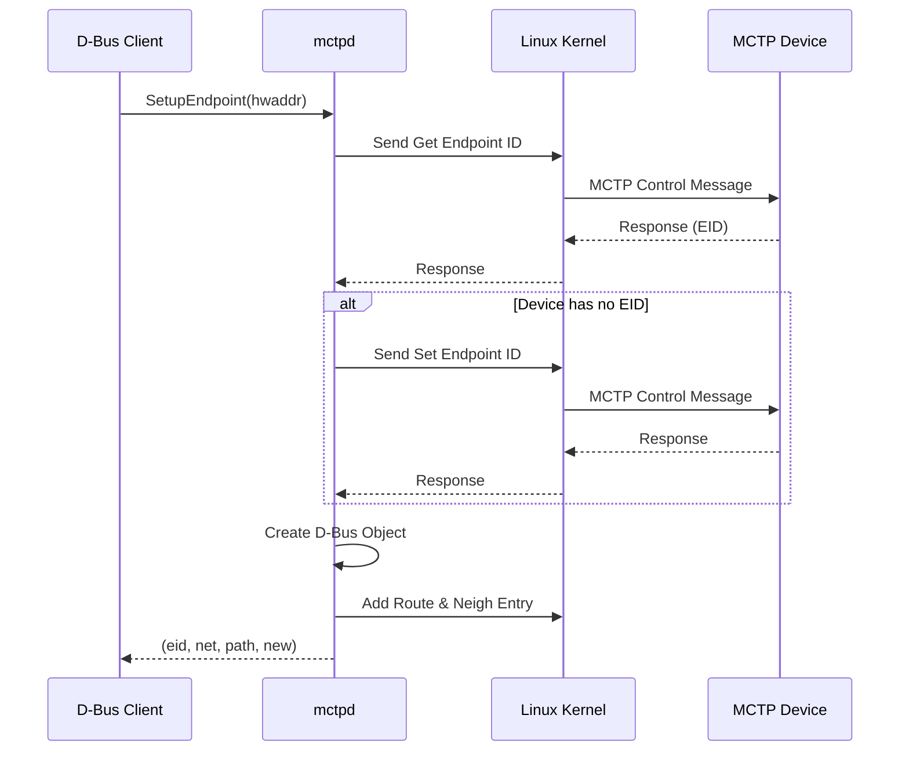
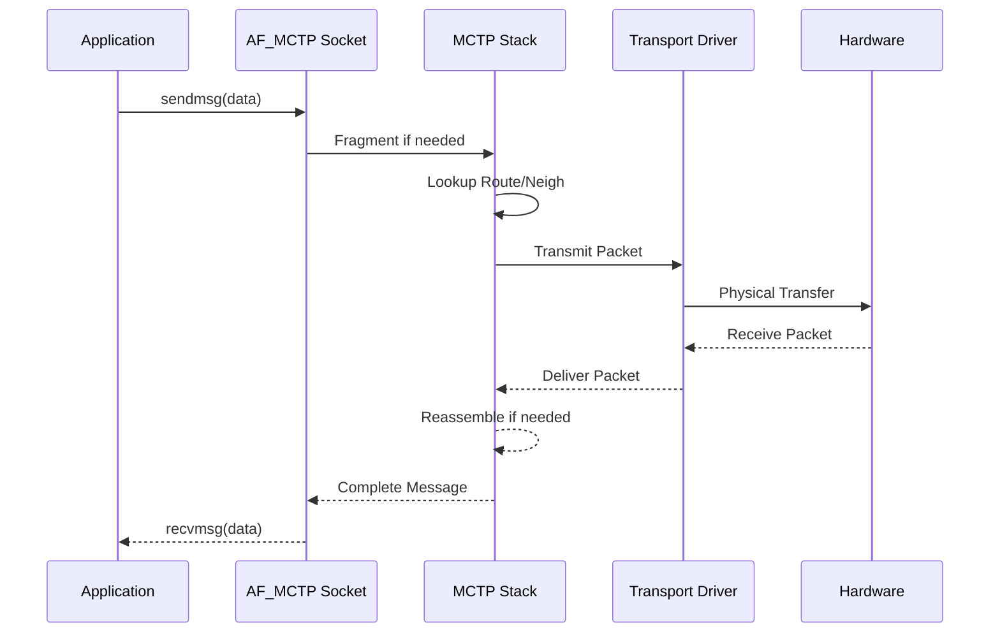

# 架構概述 (Architecture)

本文說明 CodeConstruct/mctp 的系統架構，包含元件關係、資料流程和與 Linux 核心的互動方式。

---

## 系統架構圖

```
┌─────────────────────────────────────────────────────────────────────────────┐
│                            使用者空間 (Userspace)                            │
├─────────────────────────────────────────────────────────────────────────────┤
│                                                                             │
│  ┌─────────────┐     ┌─────────────────────────────────────────────────┐   │
│  │   mctp CLI  │     │                    mctpd                        │   │
│  │             │     │  ┌───────────────────────────────────────────┐  │   │
│  │ • link      │     │  │           MCTP Control Protocol           │  │   │
│  │ • address   │     │  │  • Get Endpoint ID                        │  │   │
│  │ • route     │     │  │  • Set Endpoint ID                        │  │   │
│  │ • neigh     │     │  │  • Get Endpoint UUID                      │  │   │
│  │             │     │  │  • Get Message Type Support               │  │   │
│  └──────┬──────┘     │  └───────────────────────────────────────────┘  │   │
│         │            │                        │                         │   │
│         │            │  ┌───────────────────────────────────────────┐  │   │
│         │            │  │              D-Bus Service                 │  │   │
│         │            │  │  au.com.codeconstruct.MCTP1               │  │   │
│         │            │  │                                           │  │   │
│         │            │  │  Objects:                                 │  │   │
│         │            │  │  • /au/com/codeconstruct/mctp1            │  │   │
│         │            │  │  • .../interfaces/<name>                  │  │   │
│         │            │  │  • .../networks/<net>/endpoints/<eid>     │  │   │
│         │            │  └───────────────────────────────────────────┘  │   │
│         │            └──────────────────┬──────────────────────────────┘   │
│         │                               │                                   │
│         │ Netlink                       │ AF_MCTP Socket                    │
│         ▼                               ▼                                   │
├─────────────────────────────────────────────────────────────────────────────┤
│                             核心空間 (Kernel)                               │
├─────────────────────────────────────────────────────────────────────────────┤
│                                                                             │
│  ┌─────────────────────────────────────────────────────────────────────┐   │
│  │                     Linux MCTP Stack (net/mctp/)                    │   │
│  │                                                                     │   │
│  │  ┌──────────────┐  ┌──────────────┐  ┌─────────────────────────┐   │   │
│  │  │  Route Table │  │ Neigh Table  │  │   Message Assembly/     │   │   │
│  │  │              │  │              │  │   Fragmentation         │   │   │
│  │  └──────────────┘  └──────────────┘  └─────────────────────────┘   │   │
│  │                                                                     │   │
│  └─────────────────────────────────────────────────────────────────────┘   │
│                               │                                             │
│  ┌─────────────────────────────────────────────────────────────────────┐   │
│  │                    MCTP Transport Drivers                           │   │
│  │                                                                     │   │
│  │  ┌────────────┐  ┌────────────┐  ┌────────────┐  ┌────────────┐    │   │
│  │  │ mctp-i2c   │  │ mctp-serial│  │ mctp-pcie  │  │ mctp-usb   │    │   │
│  │  │ (mctpi2c*) │  │            │  │            │  │            │    │   │
│  │  └────────────┘  └────────────┘  └────────────┘  └────────────┘    │   │
│  │                                                                     │   │
│  └─────────────────────────────────────────────────────────────────────┘   │
│                               │                                             │
└───────────────────────────────┼─────────────────────────────────────────────┘
                                │
                                ▼
┌─────────────────────────────────────────────────────────────────────────────┐
│                              硬體層 (Hardware)                              │
│                                                                             │
│  ┌────────────┐  ┌────────────┐  ┌────────────┐  ┌────────────┐            │
│  │   I2C/     │  │   Serial   │  │   PCIe     │  │    USB     │            │
│  │   SMBus    │  │   UART     │  │   VDM      │  │            │            │
│  └────────────┘  └────────────┘  └────────────┘  └────────────┘            │
│                                                                             │
└─────────────────────────────────────────────────────────────────────────────┘
```

---

## 元件說明

### mctp 命令行工具

`mctp` 是一個輕量級的命令行工具，用於管理 Linux 核心 MCTP 堆疊的狀態：

| 子命令         | 功能                                               |
| -------------- | -------------------------------------------------- |
| `mctp link`    | 管理 MCTP 網路介面（啟用/停用、設定 MTU、網路 ID） |
| `mctp address` | 管理本地 EID 地址                                  |
| `mctp route`   | 管理 MCTP 路由表                                   |
| `mctp neigh`   | 管理鄰居表（EID 到實體地址映射）                   |

**實作檔案**：`src/mctp.c`

### mctpd 守護程式

`mctpd` 是核心元件，實作 MCTP 控制協議（MCTP Control Protocol）：

```
┌────────────────────────────────────────────────────────────────┐
│                         mctpd                                  │
├────────────────────────────────────────────────────────────────┤
│                                                                │
│  ┌──────────────────────┐  ┌──────────────────────┐           │
│  │   Bus-Owner Mode     │  │   Endpoint Mode      │           │
│  │                      │  │                      │           │
│  │ • 分配 EID           │  │ • 接受 EID 分配      │           │
│  │ • 發現端點           │  │ • 回應控制命令       │           │
│  │ • 管理路由           │  │ • 參與發現流程       │           │
│  └──────────────────────┘  └──────────────────────┘           │
│                                                                │
│  ┌──────────────────────────────────────────────────────────┐ │
│  │                   D-Bus Service                          │ │
│  │                                                          │ │
│  │  Bus name: au.com.codeconstruct.MCTP1                    │ │
│  │                                                          │ │
│  │  ┌────────────────────────────────────────────────────┐  │ │
│  │  │ Interface Objects                                  │  │ │
│  │  │ • au.com.codeconstruct.MCTP.Interface1             │  │ │
│  │  │ • au.com.codeconstruct.MCTP.BusOwner1              │  │ │
│  │  └────────────────────────────────────────────────────┘  │ │
│  │                                                          │ │
│  │  ┌────────────────────────────────────────────────────┐  │ │
│  │  │ Endpoint Objects                                   │  │ │
│  │  │ • xyz.openbmc_project.MCTP.Endpoint                │  │ │
│  │  │ • xyz.openbmc_project.Common.UUID                  │  │ │
│  │  │ • au.com.codeconstruct.MCTP.Endpoint1              │  │ │
│  │  └────────────────────────────────────────────────────┘  │ │
│  │                                                          │ │
│  └──────────────────────────────────────────────────────────┘ │
│                                                                │
│  ┌──────────────────────────────────────────────────────────┐ │
│  │              Configuration (mctpd.conf)                  │ │
│  │                                                          │ │
│  │  mode = "bus-owner" | "endpoint"                         │ │
│  │  [mctp] message_timeout_ms = 30                          │ │
│  │  [bus-owner] dynamic_eid_range = [8, 254]                │ │
│  │  [bus-owner] endpoint_poll_ms = 0                        │ │
│  └──────────────────────────────────────────────────────────┘ │
│                                                                │
└────────────────────────────────────────────────────────────────┘
```

**實作檔案**：`src/mctpd.c`

---

## 資料流程

### 端點發現流程



> **逐步說明：**
>
> 1. **Client 請求發現端點**：D-Bus 程式（如 pldmd）呼叫 `SetupEndpoint`，傳入裝置的硬體位址（如 I2C 地址）。
> 2. **透過 Kernel 查詢裝置**：mctpd 不直接和裝置通訊，而是透過 Linux kernel 的 MCTP 子系統發送「取得端點 ID」的控制訊息。
> 3. **條件處理**：如果裝置還沒有 EID，mctpd 會分配一個新的 EID 並設定給裝置。
> 4. **建立 D-Bus 物件與路由**：在 D-Bus 上建立端點物件（供其他程式查詢），並在 kernel 中建立路由（供實隞通訊使用）。
> 5. **回傳結果**：回傳 EID、網路 ID、D-Bus 路徑、以及是否為新發現的端點。

### 訊息傳輸流程



> **逐步說明：**
>
> 這張圖展示了一筆 MCTP 訊息從應用程式發送到硬體、再從硬體接收回來的完整過程：
>
> **發送方向（上半部）：**
>
> 1. **應用程式發送**：應用程式（如 pldmd）透過 `AF_MCTP` socket 呼叫 `sendmsg(data)` 發送資料。這只是一般的 Linux socket 呼叫，跟用 TCP/UDP 發送資料很類似。
> 2. **分片**：如果資料太大，MCTP stack 會將它切成多個小封包（fragment）。每個封包有自己的序號和 SOM/EOM 標誌。
> 3. **查詢路由**：stack 查詢路由表和鄰居表，決定要從哪個網路介面、發到哪個硬體位址。
> 4. **傳輸到硬體**：驅動程式（如 I2C driver）將封包透過實體線路發出。
>
> **接收方向（下半部）：** 5. **硬體接收**：硬體收到封包，傳給 driver。6. **重組**：如果原始訊息被分片過，stack 會收集所有片段，重新組裝成完整訊息。7. **遞交給應用**：完整訊息透過 socket 遞交給應用程式，應用程式透過 `recvmsg(data)` 讀取。
>
> **白話總結**：整個過程就像寄信：寫信（sendmsg）→ 切成明信片大小（分片）→ 查郵過區號（路由）→ 郵差投遞（傳輸）→ 對方收信（接收）→ 重組明信片（重組）→ 讀信（recvmsg）。

---

## 核心資料結構

### mctpd 內部結構

> 以下結構定義取自 `src/mctpd.c` (upstream)，完整列出所有欄位。

```c
// src/mctpd.c (Upstream)

struct dest_phys {
    int ifindex;                    // 網路介面索引
    uint8_t hwaddr[MAX_ADDR_LEN];  // 硬體地址
    size_t hwaddr_len;             // 硬體地址長度
};

// 全域上下文
struct ctx {
    sd_event *event;                // systemd 事件迴圈
    sd_bus *bus;                    // D-Bus 連線

    char *config_filename;          // 配置檔案路徑

    mctp_nl *nl;                    // Netlink 連線

    enum endpoint_role default_role; // 所有介面的預設角色

    struct peer **peers;            // 已發現的端點（動態陣列，運行中會 realloc）
    size_t num_peers;

    struct net **nets;              // MCTP 網路
    size_t num_nets;

    mctp_eid_t dyn_eid_min;         // 動態 EID 分配範圍下限
    mctp_eid_t dyn_eid_max;         // 動態 EID 分配範圍上限

    uint64_t mctp_timeout;          // MCTP 回應逾時（微秒）

    uint8_t iid;                    // 下一個要使用的 Instance ID

    uint8_t uuid[16];               // 本機 UUID

    struct msg_type_support *supported_msg_types; // 支援的訊息類型及版本
    size_t num_supported_msg_types;

    bool verbose;                   // 是否啟用詳細日誌

    uint8_t max_pool_size;          // Bridge 的最大 EID pool 大小
};

// 端點（Peer）
struct peer {
    uint32_t net;                   // 網路 ID
    mctp_eid_t eid;                 // 端點 ID

    int local_count;                // 同一 EID 的本地介面引用計數

    dest_phys phys;                 // 實體地址（僅 REMOTE 有效）

    enum { REMOTE, LOCAL } state;   // 端點狀態

    // D-Bus 相關
    bool published;                 // 是否已發布到 D-Bus
    sd_bus_slot *slot_obmc_endpoint; // OpenBMC Endpoint 介面 slot
    sd_bus_slot *slot_cc_endpoint;   // CodeConstruct Endpoint 介面 slot
    sd_bus_slot *slot_bridge;        // Bridge 介面 slot
    sd_bus_slot *slot_uuid;          // UUID 介面 slot
    char *path;                     // D-Bus 物件路徑

    bool have_neigh;                // 是否已建立核心鄰居條目
    bool have_route;                // 是否已建立核心路由條目

    uint32_t mtu;                   // 路由 MTU

    uint8_t *message_types;         // 支援的訊息類型（Get Message Type 回應）
    size_t num_message_types;

    uint8_t endpoint_type;          // 端點類型（Get Endpoint ID 回應）
    uint8_t medium_spec;            // 介質規格（Get Endpoint ID 回應）

    uint8_t *uuid;                  // 端點 UUID（malloc 的 16 bytes）

    struct ctx *ctx;                // 反向指標到全域上下文

    // 連接狀態與恢復
    bool degraded;                  // 是否處於降級狀態
    struct {
        uint64_t delay;             // 恢復延遲
        sd_event_source *source;    // 恢復計時器
        int npolls;                 // 輪詢次數
        mctp_eid_t eid;             // 恢復用 EID
        uint8_t endpoint_type;      // 恢復用端點類型
        uint8_t medium_spec;        // 恢復用介質規格
    } recovery;

    // EID Pool（用於 Bridge 場景）
    uint8_t pool_size;              // EID pool 大小
    uint8_t pool_start;             // EID pool 起始值
};

// MCTP 網路
struct net {
    struct ctx *ctx;                // 指向全域上下文
    uint32_t net;                   // 網路 ID

    struct peer *peers[256];        // EID 到 peer 的映射（直接索引）

    sd_bus_slot *slot;              // D-Bus slot
    char *path;                     // D-Bus 物件路徑
};
```

---

## 與 OpenBMC 的整合

```
┌─────────────────────────────────────────────────────────────────┐
│                        OpenBMC System                           │
├─────────────────────────────────────────────────────────────────┤
│                                                                 │
│  ┌─────────────────┐  ┌─────────────────┐  ┌─────────────────┐ │
│  │    pldmd        │  │    nvmed        │  │   spdmd         │ │
│  │  (PLDM Daemon)  │  │  (NVMe-MI)      │  │  (SPDM Daemon)  │ │
│  │                 │  │                 │  │                 │ │
│  └────────┬────────┘  └────────┬────────┘  └────────┬────────┘ │
│           │                    │                    │           │
│           │    xyz.openbmc_project.MCTP.Endpoint    │           │
│           └────────────────────┼────────────────────┘           │
│                                │                                │
│                                ▼                                │
│  ┌──────────────────────────────────────────────────────────┐  │
│  │                        mctpd                              │  │
│  │                                                           │  │
│  │  D-Bus: au.com.codeconstruct.MCTP1                        │  │
│  │                                                           │  │
│  │  Endpoints exposed via:                                   │  │
│  │  • xyz.openbmc_project.MCTP.Endpoint                      │  │
│  │  • xyz.openbmc_project.Common.UUID                        │  │
│  │                                                           │  │
│  └──────────────────────────────────────────────────────────┘  │
│                                │                                │
│                                ▼                                │
│  ┌──────────────────────────────────────────────────────────┐  │
│  │                    Linux Kernel                           │  │
│  │                    MCTP Stack                             │  │
│  └──────────────────────────────────────────────────────────┘  │
│                                                                 │
└─────────────────────────────────────────────────────────────────┘
```

---

## 原始碼結構

```
mctp/
├── src/
│   ├── mctp.c              # mctp 命令行工具主程式
│   ├── mctp.h              # mctp 工具公共標頭
│   ├── mctpd.c             # mctpd 守護程式主程式
│   ├── mctp-netlink.c      # Netlink 通訊層
│   ├── mctp-netlink.h      # Netlink 通訊層標頭
│   ├── mctp-util.c         # 通用工具函式
│   ├── mctp-util.h         # 工具函式標頭
│   ├── mctp-ops.c          # SD event 操作抽象層
│   ├── mctp-ops.h          # 操作抽象層標頭
│   ├── mctp-control-spec.h # MCTP 控制協議規範定義
│   ├── mctp-req.c          # 測試工具：發送請求
│   ├── mctp-echo.c         # 測試工具：回應伺服器
│   ├── mctp-bench.c        # 效能測試工具
│   └── mctp-client.c       # MCTP 客戶端工具
├── conf/
│   ├── mctpd.conf          # mctpd 配置範例
│   ├── mctpd.service       # Systemd 服務定義
│   ├── mctpd-dbus.conf     # D-Bus 存取控制配置
│   ├── mctp.target         # Systemd target
│   └── mctp-local.target   # 本地 MCTP 配置 target
├── docs/
│   ├── mctpd.md            # mctpd D-Bus 文件
│   └── endpoint-recovery.md # 端點恢復機制文件
├── tests/
│   ├── conftest.py         # pytest 配置
│   ├── test_mctp.py        # mctp 工具測試
│   ├── test_mctpd.py       # mctpd 基本測試
│   ├── test_mctpd_endpoint.py # mctpd 端點測試
│   ├── mctp_test_utils.py  # 測試工具函式
│   ├── mctp-ops-test.c     # C 語言操作層測試
│   ├── test-proto.h        # 測試協議定義
│   ├── pytest.ini          # pytest 配置
│   ├── requirements.txt    # Python 相依性
│   ├── ruff.toml           # Python linter 配置
│   └── mctpenv/            # mctpd mock 測試環境
│       └── __init__.py     # 可獨立運行的 mock 環境
├── lib/
│   └── tomlc99/            # TOML 解析器
├── meson.build             # Meson 構建配置
└── meson_options.txt       # Meson 構建選項
```

---

## 相關文件

- [MCTPOverview](MCTPOverview.md) - MCTP 協議概述
- [KernelStack](KernelStack.md) - Linux 核心 MCTP 堆疊
- [DBusOverview](DBusOverview.md) - D-Bus 介面總覽

---

[← 返回首頁](Home.md)
