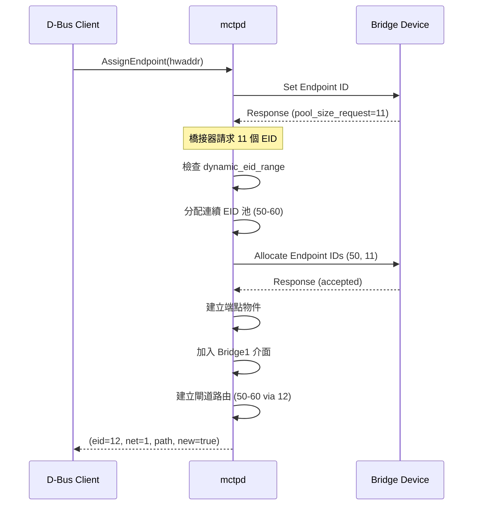

# 橋接器 API (Bridge API)

本文說明 mctpd 的 MCTP 橋接器 D-Bus 介面：`Bridge1`。

---

## 概述

MCTP 橋接器是連接兩個 MCTP 網路的端點，可以為下游端點分配和管理 EID 池。

當 mctpd 發現一個端點是橋接器時（透過 Set Endpoint ID 回應中的 bridge pool request），會為該端點額外建立 `Bridge1` 介面。

---

## 物件路徑

橋接器端點的路徑與一般端點相同：

```
/au/com/codeconstruct/mctp1/networks/<net>/endpoints/<eid>
```

**範例**：

- `/au/com/codeconstruct/mctp1/networks/1/endpoints/12`

---

## au.com.codeconstruct.MCTP.Bridge1

橋接器端點特有的 D-Bus 介面，提供 EID 池資訊。

### 介面定義

```
NAME                                TYPE      SIGNATURE RESULT/VALUE FLAGS
au.com.codeconstruct.MCTP.Bridge1   interface -         -            -
.PoolStart                          property  y         50           const
.PoolEnd                            property  y         60           const
```

---

## 屬性

### PoolStart

| 項目     | 值         |
| -------- | ---------- |
| **型別** | `y` (byte) |
| **存取** | 唯讀       |
| **訊號** | const      |

分配給此橋接器的 EID 池起始值（包含）。

**讀取範例**：

```bash
$ busctl get-property au.com.codeconstruct.MCTP1 \
    /au/com/codeconstruct/mctp1/networks/1/endpoints/12 \
    au.com.codeconstruct.MCTP.Bridge1 PoolStart
y 50
```

### PoolEnd

| 項目     | 值         |
| -------- | ---------- |
| **型別** | `y` (byte) |
| **存取** | 唯讀       |
| **訊號** | const      |

分配給此橋接器的 EID 池結束值（包含）。

**讀取範例**：

```bash
$ busctl get-property au.com.codeconstruct.MCTP1 \
    /au/com/codeconstruct/mctp1/networks/1/endpoints/12 \
    au.com.codeconstruct.MCTP.Bridge1 PoolEnd
y 60
```

---

## 橋接器角色

```
┌─────────────────────────────────────────────────────────────────┐
│                    MCTP 橋接器架構                              │
├─────────────────────────────────────────────────────────────────┤
│                                                                 │
│      Bus Owner (BMC)                                            │
│      EID: 8                                                     │
│      mctpi2c1                                                   │
│           │                                                     │
│           │ I2C Bus                                             │
│           │                                                     │
│      ┌────▼─────┐                                               │
│      │ Bridge   │ ◄─── Bridge1 介面                             │
│      │ EID: 12  │                                               │
│      │ Pool:    │                                               │
│      │ 50-60    │                                               │
│      └────┬─────┘                                               │
│           │                                                     │
│           │ 下游網路（可能是不同傳輸）                           │
│           │                                                     │
│      ┌────┼───────────────────┐                                 │
│      │    │                   │                                 │
│  ┌───▼───┐ ┌───▼───┐ ┌───▼───┐                                  │
│  │ EID:50│ │ EID:51│ │ EID:52│ 下游端點                         │
│  └───────┘ └───────┘ └───────┘                                  │
│                                                                 │
└─────────────────────────────────────────────────────────────────┘
```

---

## EID 池分配流程

### 分配流程



> **逐步說明：**
>
> 1. **Client 呼叫 AssignEndpoint**：傳入橋接器的硬體位址，請 mctpd 設定這個裝置。
> 2. **分配 EID 並發現橋接器身份**：mctpd 發送 `Set Endpoint ID` 給裝置。裝置在回應中透露自己是「橋接器」（endpoint_type=Bridge），同時請求一個 EID 池（pool_size_request=11 表示後面有 11 個下游裝置需要 EID）。
> 3. **從動態範圍分配 EID 池**：mctpd 檢查配置的 `dynamic_eid_range`（例如 [8, 254]），找到連續的 11 個空閒 EID（50-60），透過 `Allocate Endpoint IDs` 分配給橋接器。
> 4. **建立基礎設施**：mctpd 建立 D-Bus 端點物件（含 Bridge1 介面），並在 kernel 設定閘道路由——告訴 kernel「發給 EID 50-60 的封包，都透過 EID 12 轉發」。
> 5. **回傳結果**：回傳橋接器的 EID=12。後續可用 `Network.LearnEndpoint` 逐一發現 EID 50-60 的下游端點。

### 池大小限制

mctpd 會限制橋接器可請求的最大池大小：

```toml
# mctpd.conf
[bus-owner]
max_pool_size = 15
```

如果橋接器請求超過此值，會被截斷。

---

## 使用橋接器

### 設定橋接器

```bash
# 使用 AssignEndpoint 設定橋接器
# （SetupEndpoint 也可以，但 AssignEndpoint 確保 EID 分配）
$ busctl call au.com.codeconstruct.MCTP1 \
    /au/com/codeconstruct/mctp1/interfaces/mctpi2c1 \
    au.com.codeconstruct.MCTP.BusOwner1 \
    AssignEndpoint ay 1 0x1f
yisb 12 1 "/au/com/codeconstruct/mctp1/networks/1/endpoints/12" true
```

### 檢查是否為橋接器

```bash
# 方法 1：檢查 Bridge1 介面是否存在
$ busctl introspect au.com.codeconstruct.MCTP1 \
    /au/com/codeconstruct/mctp1/networks/1/endpoints/12 | grep Bridge1
au.com.codeconstruct.MCTP.Bridge1   interface -         -            -
```

```bash
# 方法 2：嘗試讀取 PoolStart
$ busctl get-property au.com.codeconstruct.MCTP1 \
    /au/com/codeconstruct/mctp1/networks/1/endpoints/12 \
    au.com.codeconstruct.MCTP.Bridge1 PoolStart 2>/dev/null && echo "Is bridge"
```

### 讀取 EID 池資訊

```bash
# 讀取池範圍
start=$(busctl get-property au.com.codeconstruct.MCTP1 \
    /au/com/codeconstruct/mctp1/networks/1/endpoints/12 \
    au.com.codeconstruct.MCTP.Bridge1 PoolStart | cut -d' ' -f2)

end=$(busctl get-property au.com.codeconstruct.MCTP1 \
    /au/com/codeconstruct/mctp1/networks/1/endpoints/12 \
    au.com.codeconstruct.MCTP.Bridge1 PoolEnd | cut -d' ' -f2)

echo "Bridge pool: EID $start - $end"
```

### 發現下游端點

```bash
# 發現橋接器下游的端點
for eid in $(seq $start $end); do
    result=$(busctl call au.com.codeconstruct.MCTP1 \
        /au/com/codeconstruct/mctp1/networks/1 \
        au.com.codeconstruct.MCTP.Network1 \
        LearnEndpoint y $eid 2>/dev/null)
    if [ $? -eq 0 ]; then
        echo "Found downstream endpoint: EID $eid"
    fi
done
```

---

## 路由設定

當 mctpd 設定橋接器時，會自動建立閘道路由：

```bash
$ mctp route show
eid 12: dev mctpi2c1 mtu 0
eid 50-60: gw 12 net 1 mtu 0
```

這表示：

- EID 12 直接透過 mctpi2c1 連接
- EID 50-60 透過 EID 12（閘道）路由

---

## 完整內省範例

```bash
$ busctl introspect au.com.codeconstruct.MCTP1 \
    /au/com/codeconstruct/mctp1/networks/1/endpoints/12
NAME                                   TYPE      SIGNATURE RESULT/VALUE             FLAGS
au.com.codeconstruct.MCTP.Bridge1      interface -         -                        -
.PoolEnd                               property  y         60                       const
.PoolStart                             property  y         50                       const
au.com.codeconstruct.MCTP.Endpoint1    interface -         -                        -
.Recover                               method    -         -                        -
.Remove                                method    -         -                        -
.SetMTU                                method    u         -                        -
.Connectivity                          property  s         "Available"              emits-change
xyz.openbmc_project.Common.UUID        interface -         -                        -
.UUID                                  property  s         "..."                    const
xyz.openbmc_project.MCTP.Endpoint      interface -         -                        -
.EID                                   property  y         12                       const
.NetworkId                             property  u         1                        const
.SupportedMessageTypes                 property  ay        2 0 1                    const
```

---

## 程式範例

### 列出所有橋接器

```python
import dbus

bus = dbus.SystemBus()
om = dbus.Interface(
    bus.get_object('au.com.codeconstruct.MCTP1',
                   '/au/com/codeconstruct/mctp1'),
    'org.freedesktop.DBus.ObjectManager'
)

objects = om.GetManagedObjects()

for path, interfaces in objects.items():
    if 'au.com.codeconstruct.MCTP.Bridge1' in interfaces:
        bridge = interfaces['au.com.codeconstruct.MCTP.Bridge1']
        endpoint = interfaces['xyz.openbmc_project.MCTP.Endpoint']

        eid = endpoint['EID']
        pool_start = bridge['PoolStart']
        pool_end = bridge['PoolEnd']

        print(f"Bridge EID {eid}: Pool {pool_start}-{pool_end}")
```

### 取得橋接器資訊

```python
import dbus

def get_bridge_info(path):
    bus = dbus.SystemBus()
    proxy = bus.get_object('au.com.codeconstruct.MCTP1', path)
    props = dbus.Interface(proxy, 'org.freedesktop.DBus.Properties')

    try:
        pool_start = props.Get('au.com.codeconstruct.MCTP.Bridge1', 'PoolStart')
        pool_end = props.Get('au.com.codeconstruct.MCTP.Bridge1', 'PoolEnd')
        return {'is_bridge': True, 'pool_start': pool_start, 'pool_end': pool_end}
    except dbus.exceptions.DBusException:
        return {'is_bridge': False}

info = get_bridge_info('/au/com/codeconstruct/mctp1/networks/1/endpoints/12')
print(info)
```

---

## 注意事項

> [!WARNING]
> `LearnEndpoint`（Interface.BusOwner1）不適合用於橋接器，因為無法提供 EID 池資訊。應使用 `AssignEndpoint`。

> [!NOTE]
> EID 池分配需要動態範圍有足夠連續的 EID。如果無法分配完整池，只會設定橋接器本身的 EID。

---

## 相關文件

- [DBusOverview](DBusOverview.md) - D-Bus 介面總覽
- [EndpointAPI](EndpointAPI.md) - 端點介面
- [BridgeMode](BridgeMode.md) - 橋接模式詳解
- [Configuration](Configuration.md) - max_pool_size 配置

---

[← 返回首頁](Home.md)
