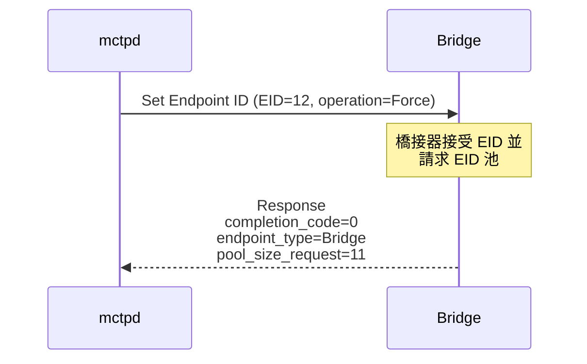
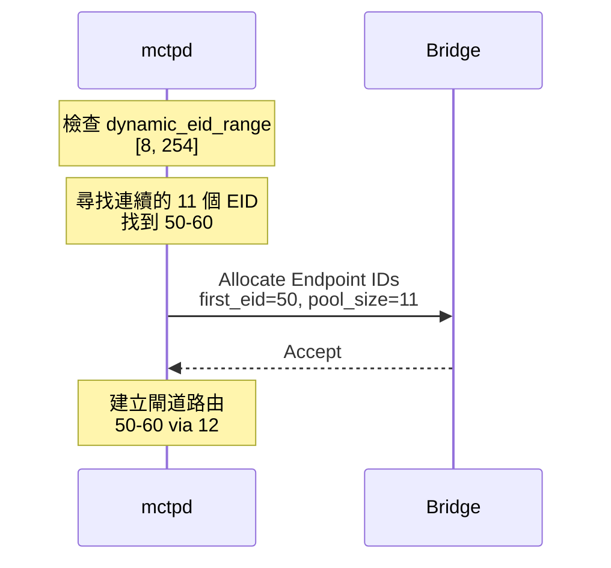
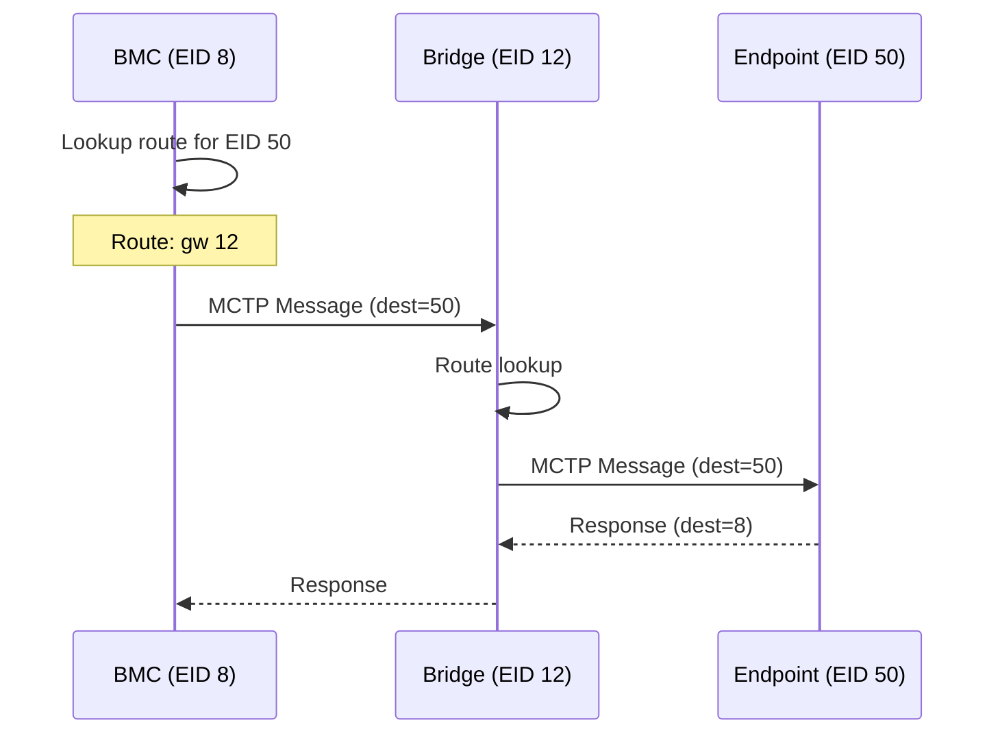

# 橋接模式 (Bridge Mode)

本文說明 MCTP 橋接器的運作原理和 mctpd 的橋接器支援。

---

## 什麼是 MCTP 橋接器？

MCTP 橋接器是連接兩個 MCTP 網路的端點，允許訊息在不同網路之間轉發。

```
┌─────────────────────────────────────────────────────────────────┐
│                    MCTP 橋接器架構                              │
├─────────────────────────────────────────────────────────────────┤
│                                                                 │
│      ┌─────────────────────────────────────────────────────┐   │
│      │              上游網路 (Network 1)                   │   │
│      │                                                     │   │
│      │    Bus Owner (BMC)         Endpoint A              │   │
│      │    EID: 8                  EID: 10                 │   │
│      │         │                      │                   │   │
│      │         └──────────┬───────────┘                   │   │
│      │                    │                               │   │
│      │              ┌─────▼─────┐                         │   │
│      │              │  Bridge   │                         │   │
│      │              │  EID: 12  │                         │   │
│      │              │           │                         │   │
│      │              │ Pool:     │                         │   │
│      │              │ 50-60     │                         │   │
│      │              └─────┬─────┘                         │   │
│      │                    │                               │   │
│      └────────────────────┼───────────────────────────────┘   │
│                           │                                    │
│      ┌────────────────────▼───────────────────────────────┐   │
│      │              下游網路 (Network 2)                   │   │
│      │                                                     │   │
│      │    ┌─────────┐  ┌─────────┐  ┌─────────┐          │   │
│      │    │ EID: 50 │  │ EID: 51 │  │ EID: 52 │          │   │
│      │    │         │  │         │  │         │          │   │
│      │    └─────────┘  └─────────┘  └─────────┘          │   │
│      │                                                     │   │
│      └─────────────────────────────────────────────────────┘   │
│                                                                 │
└─────────────────────────────────────────────────────────────────┘
```

### 橋接器功能

| 功能 | 說明 |
|------|------|
| 訊息轉發 | 在上游和下游網路間轉發 MCTP 訊息 |
| EID 管理 | 管理下游端點的 EID 分配 |
| 路由 | 提供下游端點的路由資訊 |

---

## 橋接器設定流程

### 1. 發現橋接器

使用 `AssignEndpoint` 設定橋接器：

```bash
busctl call au.com.codeconstruct.MCTP1 \
    /au/com/codeconstruct/mctp1/interfaces/mctpi2c1 \
    au.com.codeconstruct.MCTP.BusOwner1 \
    AssignEndpoint ay 1 0x1f
```

### 2. Set Endpoint ID 交換



### 3. EID 池分配

mctpd 從動態範圍分配連續的 EID 池：



### 4. 路由設定

mctpd 自動建立閘道路由：

```bash
$ mctp route show
eid 12: dev mctpi2c1 mtu 0
eid 50-60: gw 12 net 1 mtu 0
```

---

## Bridge1 D-Bus 介面

橋接器端點額外具有 `Bridge1` 介面：

```bash
$ busctl introspect au.com.codeconstruct.MCTP1 \
    /au/com/codeconstruct/mctp1/networks/1/endpoints/12 | grep Bridge
au.com.codeconstruct.MCTP.Bridge1   interface -         -            -
.PoolEnd                            property  y         60           const
.PoolStart                          property  y         50           const
```

### 屬性

| 屬性 | 類型 | 說明 |
|------|------|------|
| PoolStart | byte | EID 池起始值（包含） |
| PoolEnd | byte | EID 池結束值（包含） |

---

## 發現下游端點

### 使用 Network.LearnEndpoint

```bash
# 發現橋接下游的 EID 50-60
for eid in $(seq 50 60); do
    result=$(busctl call au.com.codeconstruct.MCTP1 \
        /au/com/codeconstruct/mctp1/networks/1 \
        au.com.codeconstruct.MCTP.Network1 \
        LearnEndpoint y $eid 2>/dev/null)
    
    if [ $? -eq 0 ]; then
        echo "Found: EID $eid"
    fi
done
```

### 自動發現腳本

```bash
#!/bin/bash
# discover-bridge-endpoints.sh

# 從橋接器物件讀取 EID 池範圍
BRIDGE_PATH="/au/com/codeconstruct/mctp1/networks/1/endpoints/12"

pool_start=$(busctl get-property au.com.codeconstruct.MCTP1 \
    $BRIDGE_PATH au.com.codeconstruct.MCTP.Bridge1 PoolStart | cut -d' ' -f2)
    
pool_end=$(busctl get-property au.com.codeconstruct.MCTP1 \
    $BRIDGE_PATH au.com.codeconstruct.MCTP.Bridge1 PoolEnd | cut -d' ' -f2)

echo "Bridge pool: $pool_start - $pool_end"
echo "Discovering endpoints..."

for eid in $(seq $pool_start $pool_end); do
    result=$(busctl call au.com.codeconstruct.MCTP1 \
        /au/com/codeconstruct/mctp1/networks/1 \
        au.com.codeconstruct.MCTP.Network1 \
        LearnEndpoint y $eid 2>/dev/null)
    
    if [ $? -eq 0 ]; then
        path=$(echo $result | cut -d'"' -f2)
        echo "  EID $eid: $path"
    fi
done
```

---

## 配置選項

### max_pool_size

限制單一橋接器可請求的最大 EID 池大小：

```toml
# /etc/mctpd.conf
[bus-owner]
max_pool_size = 15
```

**說明**：
- 如果橋接器請求超過此值，會被截斷
- 防止單一橋接器耗盡 EID 池
- 預設值 15

### dynamic_eid_range

EID 池從此範圍中分配：

```toml
[bus-owner]
dynamic_eid_range = [8, 254]
```

**分配規則**：
- 需要連續的 EID
- 從範圍中找到足夠大的空閒區塊
- 如果無法找到連續區塊，分配失敗

---

## 多層橋接

MCTP 支援多層橋接器架構：

```
BMC (EID 8)
   │
   └── Bridge A (EID 12, Pool: 50-99)
         │
         ├── Endpoint (EID 50)
         │
         └── Bridge B (EID 51, Pool: 100-149)
               │
               ├── Endpoint (EID 100)
               └── Endpoint (EID 101)
```

### 路由設定

```bash
$ mctp route show
eid 12: dev mctpi2c1 mtu 0
eid 50-99: gw 12 net 1 mtu 0
eid 100-149: gw 12 net 1 mtu 0
```

> [!NOTE]
> mctpd 透過設定閘道路由來支援多層橋接。訊息會透過第一層橋接器轉發到下游。

---

## 訊息流程

### 從 BMC 到下游端點



### 控制訊息

Get Endpoint ID 等控制訊息也透過橋接器轉發：

```bash
# mctpd 發送 Get Endpoint ID 到 EID 50
# 訊息透過 EID 12 橋接器轉發
```

---

## 錯誤處理

### EID 池分配失敗

如果無法分配足夠的連續 EID：

1. 橋接器的 EID 仍會分配
2. 但不會有 Bridge1 介面
3. 下游端點無法被發現

**解決方案**：
- 增加 dynamic_eid_range
- 減少已使用的 EID
- 調整 max_pool_size

### 橋接器連接問題

```bash
# 監控橋接器連接狀態
busctl get-property au.com.codeconstruct.MCTP1 \
    /au/com/codeconstruct/mctp1/networks/1/endpoints/12 \
    au.com.codeconstruct.MCTP.Endpoint1 Connectivity
```

---

## 與 LearnEndpoint 的差異

> [!WARNING]
> Interface.BusOwner1.LearnEndpoint 不適用於橋接器設定。

| 方法 | 適用於橋接器？ | 原因 |
|------|----------------|------|
| AssignEndpoint | ✅ 是 | 執行 Set Endpoint ID，可獲取池請求 |
| SetupEndpoint | ⚠️ 部分 | 如果橋接器已有 EID，無法獲取池 |
| LearnEndpoint | ❌ 否 | 不執行 Set Endpoint ID |

---

## 程式範例

### 檢查端點是否為橋接器

```python
import dbus

def is_bridge(path):
    bus = dbus.SystemBus()
    proxy = bus.get_object('au.com.codeconstruct.MCTP1', path)
    
    try:
        introspection = proxy.Introspect(
            dbus_interface='org.freedesktop.DBus.Introspectable')
        return 'au.com.codeconstruct.MCTP.Bridge1' in introspection
    except:
        return False

# 使用
path = '/au/com/codeconstruct/mctp1/networks/1/endpoints/12'
if is_bridge(path):
    print("This is a bridge endpoint")
```

### 列出所有橋接器

```python
import dbus

bus = dbus.SystemBus()
om = dbus.Interface(
    bus.get_object('au.com.codeconstruct.MCTP1',
                   '/au/com/codeconstruct/mctp1'),
    'org.freedesktop.DBus.ObjectManager'
)

for path, interfaces in om.GetManagedObjects().items():
    if 'au.com.codeconstruct.MCTP.Bridge1' in interfaces:
        bridge = interfaces['au.com.codeconstruct.MCTP.Bridge1']
        endpoint = interfaces['xyz.openbmc_project.MCTP.Endpoint']
        
        print(f"Bridge EID {endpoint['EID']}: "
              f"Pool {bridge['PoolStart']}-{bridge['PoolEnd']}")
```

---

## 相關文件

- [BridgeAPI](BridgeAPI.md) - Bridge1 D-Bus 介面
- [EndpointDiscovery](EndpointDiscovery.md) - 端點發現
- [InterfaceAPI](InterfaceAPI.md) - AssignEndpoint 方法
- [Configuration](Configuration.md) - max_pool_size 配置

---

[← 返回首頁](Home.md)
