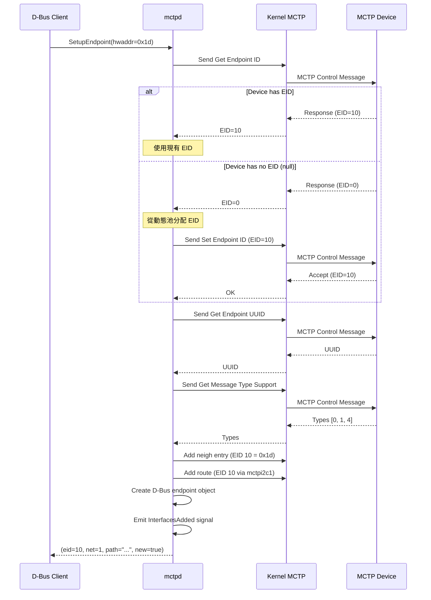
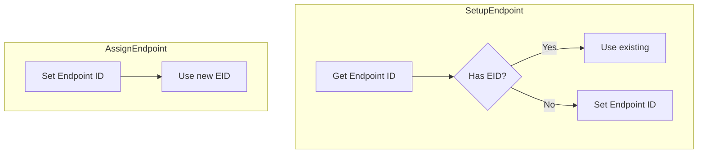
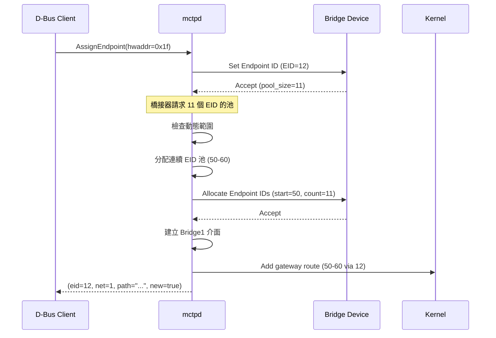
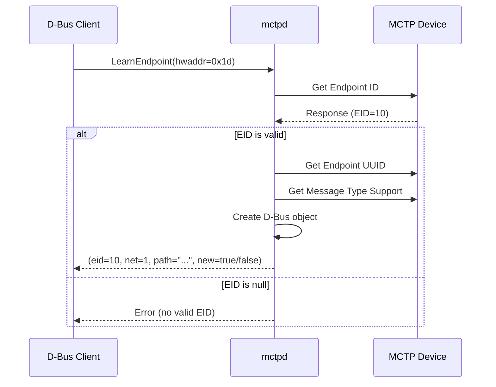
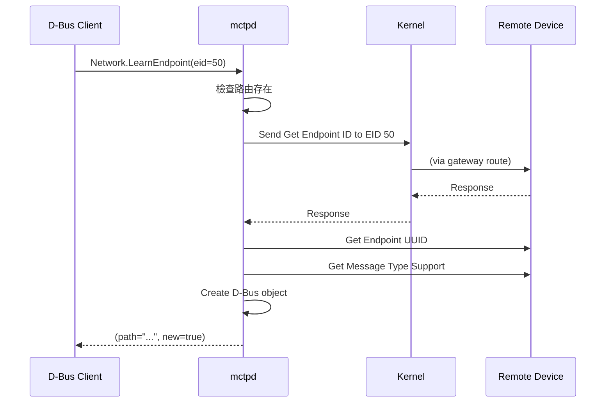
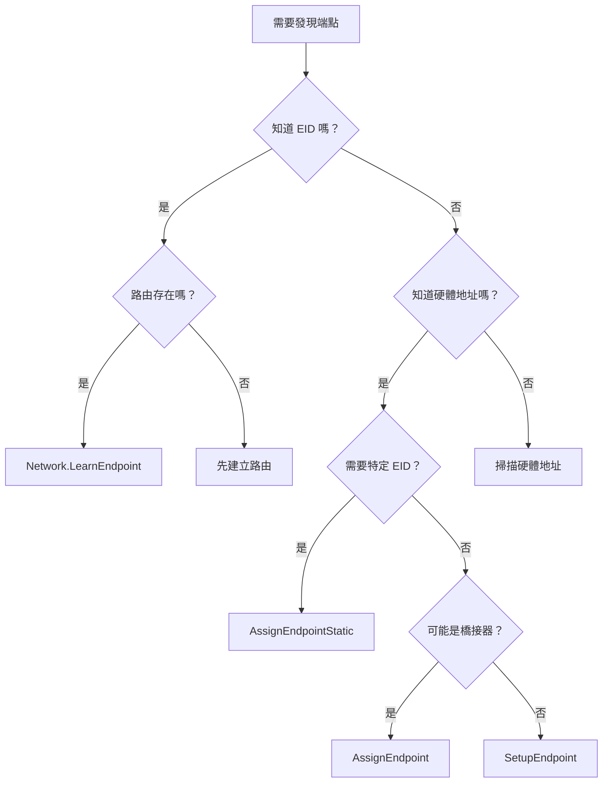

# 端點發現 (Endpoint Discovery)

本文詳細說明 mctpd 的端點發現流程和各種發現方法。

---

## 發現方法概述

mctpd 提供多種端點發現方法：

| 方法                 | 介面      | 位置      | 適用場景           |
| -------------------- | --------- | --------- | ------------------ |
| SetupEndpoint        | BusOwner1 | Interface | 一般發現（最常用） |
| AssignEndpoint       | BusOwner1 | Interface | 橋接器、強制分配   |
| AssignEndpointStatic | BusOwner1 | Interface | 靜態 EID 配置      |
| LearnEndpoint        | BusOwner1 | Interface | 已有 EID 的端點    |
| LearnEndpoint        | Network1  | Network   | 可路由的端點       |

---

## SetupEndpoint 流程

最常用的端點發現方法。

### 流程圖



> **逐步說明：**
>
> 1. **Client 發起請求**：某個 D-Bus 程式（如 pldmd）呼叫 `SetupEndpoint`，傳入硬體位址 `0x1d`（裝置在 I2C bus 上的地址），請 mctpd 幫它連接這個裝置。
> 2. **mctpd 透過 Kernel 問裝置**：mctpd 不直接跟裝置通訊，而是透過 Linux kernel 的 MCTP 子系統發送 `Get Endpoint ID` 控制訊息。Kernel 負責底層傳輸（例如透過 I2C）。
> 3. **（分支 A）裝置已有 EID**：如果裝置回報自己已有 EID=10，mctpd 就直接使用這個 EID，不再分配新的。
> 4. **（分支 B）裝置沒有 EID**：如果裝置回報 EID=0（表示未設定），mctpd 會從自己管理的「動態 EID 池」中取出一個可用的 EID（例如 10），然後透過 `Set Endpoint ID` 命令告訴裝置使用這個 EID。
> 5. **查詢 UUID**：mctpd 詢問裝置的 UUID（全球唯一識別碼），用來區分不同的實體裝置。即使 EID 改了，UUID 不會變。
> 6. **查詢支援的訊息類型**：mctpd 問裝置支援哪些 MCTP 訊息類型。回傳的 `[0, 1, 4]` 表示支援 Type 0（MCTP Control）、Type 1（PLDM）、Type 4（Vendor Defined PCI）。
> 7. **設定 Kernel 路由**：mctpd 在 kernel 中建立兩筆記錄：(a) 鄰居表（neigh）：將 EID 10 對應到硬體位址 0x1d；(b) 路由表（route）：告訴 kernel「發給 EID 10 的封包走 mctpi2c1 介面」。
> 8. **建立 D-Bus 物件並通知**：mctpd 在 D-Bus 上建立端點物件，並發出 `InterfacesAdded` 信號。其他程式（如 pldmd）可以監聽這個信號，得知有新的 MCTP 端點可用。
> 9. **回傳結果**：mctpd 回傳 EID=10、網路 ID=1、D-Bus 路徑、以及 `new=true`（表示這是新發現的端點）給 Client。

### 使用方式

```bash
busctl call au.com.codeconstruct.MCTP1 \
    /au/com/codeconstruct/mctp1/interfaces/mctpi2c1 \
    au.com.codeconstruct.MCTP.BusOwner1 \
    SetupEndpoint ay 1 0x1d
```

### 回傳值

| 欄位      | 類型    | 說明               |
| --------- | ------- | ------------------ |
| EID       | byte    | 端點 EID           |
| NetworkId | int32   | 網路 ID            |
| Path      | string  | D-Bus 物件路徑     |
| New       | boolean | 是否為新分配的 EID |

---

## AssignEndpoint 流程

總是分配新 EID，不查詢現有 EID。

### 與 SetupEndpoint 的差異



> **逐步說明：**
>
> 這張圖比較 `SetupEndpoint` 和 `AssignEndpoint` 兩種方法的差異：
>
> - **SetupEndpoint**（右邊）：先問裝置有沒有 EID → 如果有就用現有的 → 如果沒有才分配新的。這是「禮貌」的做法，尊重裝置的現有配置。
> - **AssignEndpoint**（左邊）：直接分配新 EID，不管裝置原來有沒有。這是「強制」的做法，適用於橋接器或需要重新分配的場景。

### 橋接器處理

AssignEndpoint 可以處理橋接器的 EID 池請求：



> **逐步說明：**
>
> 1. **Client 呼叫 AssignEndpoint**：指定硬體位址 `0x1f` 的裝置，請 mctpd 分配新 EID。
> 2. **分配 EID 給橋接器**：mctpd 分配 EID=12 給這個橋接器裝置。
> 3. **橋接器請求 EID 池**：橋接器回應時告訴 mctpd：「我後面還連接了其他裝置，我需要一個 EID 池（pool），大小是 11 個」。橋接器就像一個「路由器」，後面可能連接了多個下游裝置，每個都需要自己的 EID。
> 4. **mctpd 分配連續 EID 範圍**：mctpd 從動態範圍中找到連續的 11 個可用 EID（50-60），透過 `Allocate Endpoint IDs` 命令分配給橋接器。
> 5. **建立 Bridge 介面**：mctpd 在 D-Bus 上建立 `Bridge1` 介面，代表這是一個橋接器端點（不只是普通端點）。
> 6. **建立閘道路由**：在 kernel 中建立閘道路由（gateway route）：「發給 EID 50-60 的封包，都透過 EID 12（橋接器）轉發」。這就像 TCP/IP 中的 default gateway。
> 7. **回傳結果**：回傳橋接器自己的 EID=12。後續 Client 可以用 `Network.LearnEndpoint` 來發現下游端點。

### 使用方式

```bash
# 適用於橋接器
busctl call au.com.codeconstruct.MCTP1 \
    /au/com/codeconstruct/mctp1/interfaces/mctpi2c1 \
    au.com.codeconstruct.MCTP.BusOwner1 \
    AssignEndpoint ay 1 0x1f
```

---

## AssignEndpointStatic 流程

分配指定的靜態 EID。

### 使用場景

- 需要固定 EID 對應的環境
- 與現有系統配置相容
- 手動 EID 規劃

### 使用方式

```bash
# 將 EID 20 分配給 I2C 地址 0x1d
busctl call au.com.codeconstruct.MCTP1 \
    /au/com/codeconstruct/mctp1/interfaces/mctpi2c1 \
    au.com.codeconstruct.MCTP.BusOwner1 \
    AssignEndpointStatic ayy 1 0x1d 20
```

### 錯誤情況

| 錯誤       | 原因                        |
| ---------- | --------------------------- |
| EID 衝突   | 指定的 EID 已被其他端點使用 |
| EID 不匹配 | 端點已有不同的 EID          |

---

## LearnEndpoint (Interface) 流程

僅查詢現有 EID，不分配新 EID。

### 流程



> **逐步說明：**
>
> 1. **Client 呼叫 LearnEndpoint**：傳入硬體位址 `0x1d`，請 mctpd 「學習」這個裝置（只查詢、不改變任何設定）。
> 2. **查詢現有 EID**：mctpd 發送 `Get Endpoint ID` 給裝置，詢問它目前的 EID。
> 3. **（分支 A）EID 有效**：如果裝置回報有效的 EID=10，mctpd 繼續查詢 UUID 和支援的訊息類型，然後建立 D-Bus 物件。整個過程都是「唯讀」的，不會改變裝置的 EID。
> 4. **（分支 B）EID 無效**：如果裝置沒有 EID（回報 null），mctpd 會回傳錯誤。因為 `LearnEndpoint` 不會分配 EID，所以無法處理沒有 EID 的裝置。
>
> **白話總結**：`LearnEndpoint` 就像「只看不動手」——如果裝置已經有 EID，就記錄下來；如果沒有，就放棄。適合不想改變現有配置的場景。

### 使用場景

- 端點已由其他 bus owner 分配 EID
- 不想改變端點的現有 EID
- 發現預配置的端點

### 使用方式

```bash
busctl call au.com.codeconstruct.MCTP1 \
    /au/com/codeconstruct/mctp1/interfaces/mctpi2c1 \
    au.com.codeconstruct.MCTP.BusOwner1 \
    LearnEndpoint ay 1 0x1d
```

> [!WARNING]
> LearnEndpoint 不適用於橋接器，因為無法獲取 EID 池資訊。

---

## LearnEndpoint (Network) 流程

透過 EID 查詢網路中的端點。

### 與 Interface LearnEndpoint 的差異

| 特性 | Interface.LearnEndpoint | Network.LearnEndpoint |
| ---- | ----------------------- | --------------------- |
| 輸入 | 硬體地址                | EID                   |
| 需求 | 直接連接                | 路由存在              |
| 用途 | 新端點                  | 橋接下游端點          |

### 流程



> **逐步說明：**
>
> 1. **Client 透過 Network 介面呼叫 LearnEndpoint**：注意這裡的輸入不是「硬體位址」，而是「EID」（例如 50）。這是因為 Network.LearnEndpoint 用於發現下游的端點——你知道它的 EID，但你不知道它的硬體位址（因為它在橋接器後面）。
> 2. **檢查路由是否存在**：mctpd 先確認 kernel 中有沒有通往 EID 50 的路由。如果沒有路由，封包根本送不到，那就沒辦法通訊。路由通常在橋接器被發現時就已建立。
> 3. **透過閘道路由通訊**：mctpd 發送 `Get Endpoint ID` 給 EID 50。Kernel 根據路由表，透過橋接器轉發這個封包到下游裝置。
> 4. **查詢端點資訊**：和其他方法一樣，查詢 UUID 和支援的訊息類型。
> 5. **建立 D-Bus 物件並回傳**：建立端點物件，回傳 D-Bus 路徑。
>
> **白話總結**：`Network.LearnEndpoint` 是用來發現「橋接器後面」的裝置。你已知 EID（從橋接器的 EID 池推算），只需要確認裝置「真的存在」並收集它的資訊。

### 使用場景

- 發現橋接下游的端點
- 驗證可路由端點的存在

### 使用方式

```bash
busctl call au.com.codeconstruct.MCTP1 \
    /au/com/codeconstruct/mctp1/networks/1 \
    au.com.codeconstruct.MCTP.Network1 \
    LearnEndpoint y 50
```

---

## 發現多個端點

### 批次發現腳本

```bash
#!/bin/bash
# discover-endpoints.sh

INTERFACE="mctpi2c1"

# 掃描 I2C 地址範圍
for addr in $(seq 0x10 0x30); do
    hex_addr=$(printf "0x%02x" $addr)

    result=$(busctl call au.com.codeconstruct.MCTP1 \
        /au/com/codeconstruct/mctp1/interfaces/$INTERFACE \
        au.com.codeconstruct.MCTP.BusOwner1 \
        SetupEndpoint ay 1 $hex_addr 2>/dev/null)

    if [ $? -eq 0 ]; then
        eid=$(echo $result | cut -d' ' -f2)
        echo "Found device at $hex_addr -> EID $eid"
    fi
done
```

### 發現橋接下游端點

```bash
#!/bin/bash
# discover-bridged-endpoints.sh

# 假設橋接器 EID 12，池範圍 50-60
BRIDGE_EID=12
POOL_START=50
POOL_END=60

for eid in $(seq $POOL_START $POOL_END); do
    result=$(busctl call au.com.codeconstruct.MCTP1 \
        /au/com/codeconstruct/mctp1/networks/1 \
        au.com.codeconstruct.MCTP.Network1 \
        LearnEndpoint y $eid 2>/dev/null)

    if [ $? -eq 0 ]; then
        echo "Found bridged endpoint: EID $eid"
    fi
done
```

---

## 監聽端點事件

### 使用 busctl monitor

```bash
# 監聽所有端點新增/移除事件
busctl monitor au.com.codeconstruct.MCTP1
```

### 使用 Python

```python
import dbus
from dbus.mainloop.glib import DBusGMainLoop
from gi.repository import GLib

DBusGMainLoop(set_as_default=True)
bus = dbus.SystemBus()

def on_interfaces_added(path, interfaces):
    if 'xyz.openbmc_project.MCTP.Endpoint' in interfaces:
        eid = interfaces['xyz.openbmc_project.MCTP.Endpoint']['EID']
        print(f"Endpoint added: EID {eid} at {path}")

def on_interfaces_removed(path, interfaces):
    if 'xyz.openbmc_project.MCTP.Endpoint' in interfaces:
        print(f"Endpoint removed: {path}")

bus.add_signal_receiver(
    on_interfaces_added,
    signal_name='InterfacesAdded',
    dbus_interface='org.freedesktop.DBus.ObjectManager',
    bus_name='au.com.codeconstruct.MCTP1'
)

bus.add_signal_receiver(
    on_interfaces_removed,
    signal_name='InterfacesRemoved',
    dbus_interface='org.freedesktop.DBus.ObjectManager',
    bus_name='au.com.codeconstruct.MCTP1'
)

print("Listening for endpoint events...")
loop = GLib.MainLoop()
loop.run()
```

---

## 選擇發現方法



> **逐步說明（決策樹）：**
>
> 這張圖幫你選擇正確的端點發現方法：
>
> 1. **你知道裝置的 EID 嗎？**
>    - **知道** → 再問：路由是否已建立？如果是，用 `Network.LearnEndpoint`。如果否，先建路由。
>    - **不知道** → 往下走。
> 2. **你知道裝置的硬體位址嗎？**
>    - **不知道** → 只能掃描整個硬體位址範圍。
>    - **知道** → 再問：你需要指定特定的 EID 嗎？
> 3. **需要特定 EID → `AssignEndpointStatic`**：適合有嚴格 EID 規劃的系統。
> 4. **裝置可能是橋接器 → `AssignEndpoint`**：因為需要處理 EID 池分配。
> 5. **一般裝置 → `SetupEndpoint`**：最常用的選擇，自動處理所有情況。

---

## 相關文件

- [InterfaceAPI](InterfaceAPI.md) - BusOwner1 方法詳解
- [NetworkAPI](NetworkAPI.md) - Network1 方法詳解
- [BridgeMode](BridgeMode.md) - 橋接器發現

---

[← 返回首頁](Home.md)
