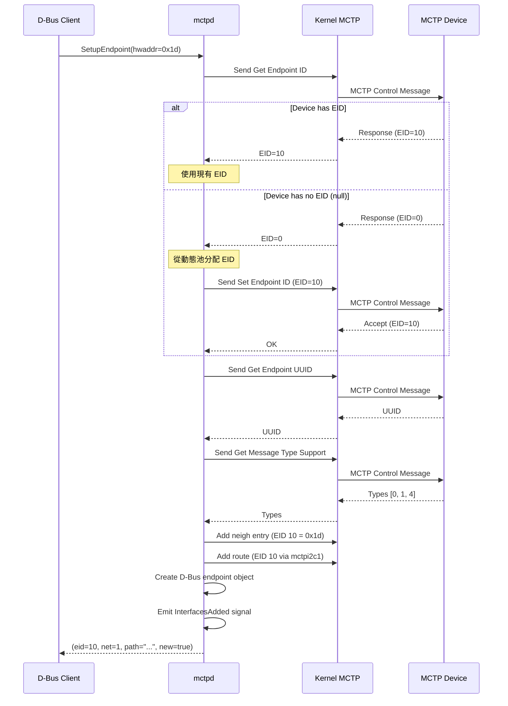
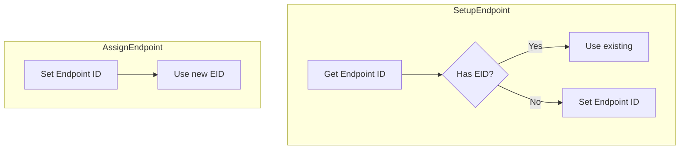
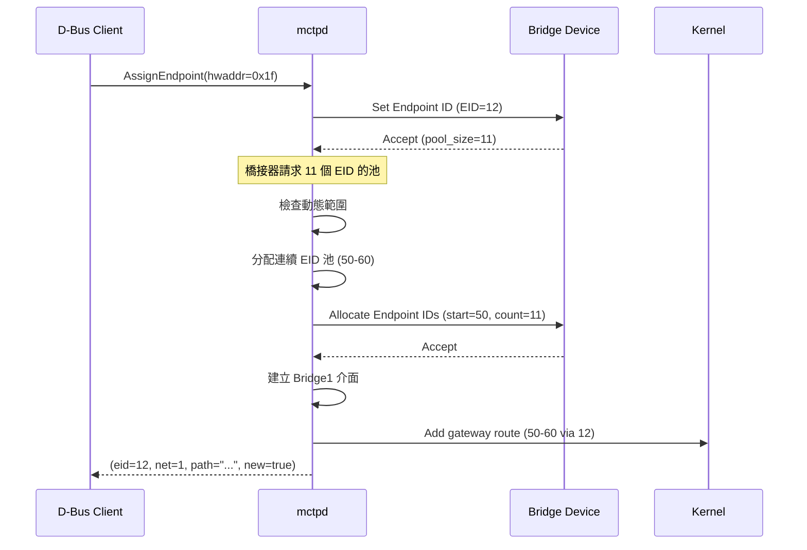
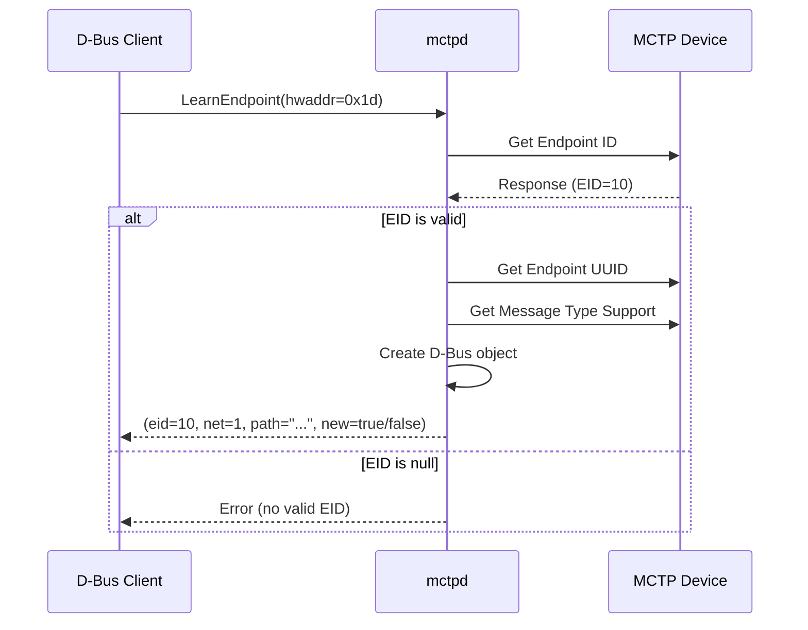
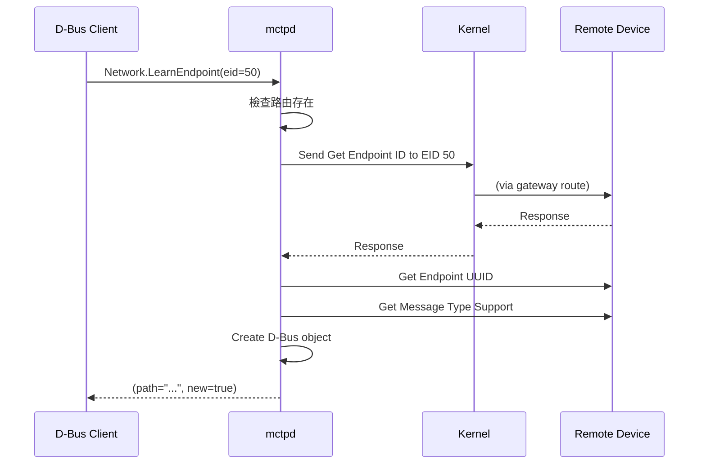
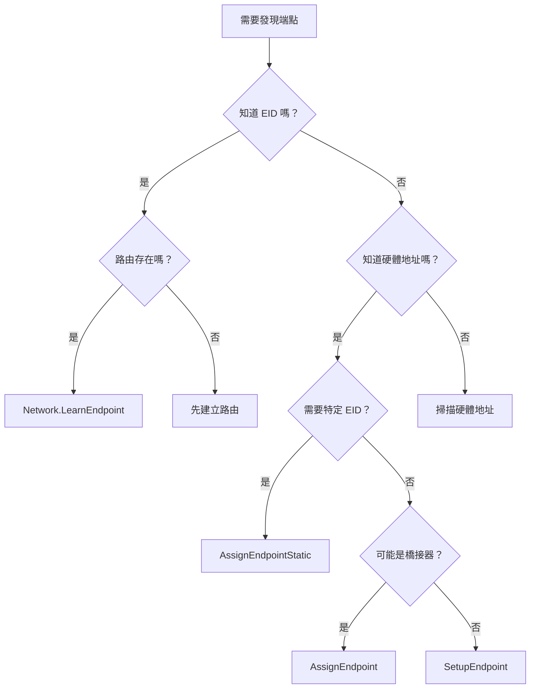

# 端點發現 (Endpoint Discovery)

本文詳細說明 mctpd 的端點發現流程和各種發現方法。

---

## 發現方法概述

mctpd 提供多種端點發現方法：

| 方法 | 介面 | 位置 | 適用場景 |
|------|------|------|----------|
| SetupEndpoint | BusOwner1 | Interface | 一般發現（最常用） |
| AssignEndpoint | BusOwner1 | Interface | 橋接器、強制分配 |
| AssignEndpointStatic | BusOwner1 | Interface | 靜態 EID 配置 |
| LearnEndpoint | BusOwner1 | Interface | 已有 EID 的端點 |
| LearnEndpoint | Network1 | Network | 可路由的端點 |

---

## SetupEndpoint 流程

最常用的端點發現方法。

### 流程圖



### 使用方式

```bash
busctl call au.com.codeconstruct.MCTP1 \
    /au/com/codeconstruct/mctp1/interfaces/mctpi2c1 \
    au.com.codeconstruct.MCTP.BusOwner1 \
    SetupEndpoint ay 1 0x1d
```

### 回傳值

| 欄位 | 類型 | 說明 |
|------|------|------|
| EID | byte | 端點 EID |
| NetworkId | int32 | 網路 ID |
| Path | string | D-Bus 物件路徑 |
| New | boolean | 是否為新分配的 EID |

---

## AssignEndpoint 流程

總是分配新 EID，不查詢現有 EID。

### 與 SetupEndpoint 的差異



### 橋接器處理

AssignEndpoint 可以處理橋接器的 EID 池請求：



### 使用方式

```bash
# 適用於橋接器
busctl call au.com.codeconstruct.MCTP1 \
    /au/com/codeconstruct/mctp1/interfaces/mctpi2c1 \
    au.com.codeconstruct.MCTP.BusOwner1 \
    AssignEndpoint ay 1 0x1f
```

---

## AssignEndpointStatic 流程

分配指定的靜態 EID。

### 使用場景

- 需要固定 EID 對應的環境
- 與現有系統配置相容
- 手動 EID 規劃

### 使用方式

```bash
# 將 EID 20 分配給 I2C 地址 0x1d
busctl call au.com.codeconstruct.MCTP1 \
    /au/com/codeconstruct/mctp1/interfaces/mctpi2c1 \
    au.com.codeconstruct.MCTP.BusOwner1 \
    AssignEndpointStatic ayy 1 0x1d 20
```

### 錯誤情況

| 錯誤 | 原因 |
|------|------|
| EID 衝突 | 指定的 EID 已被其他端點使用 |
| EID 不匹配 | 端點已有不同的 EID |

---

## LearnEndpoint (Interface) 流程

僅查詢現有 EID，不分配新 EID。

### 流程



### 使用場景

- 端點已由其他 bus owner 分配 EID
- 不想改變端點的現有 EID
- 發現預配置的端點

### 使用方式

```bash
busctl call au.com.codeconstruct.MCTP1 \
    /au/com/codeconstruct/mctp1/interfaces/mctpi2c1 \
    au.com.codeconstruct.MCTP.BusOwner1 \
    LearnEndpoint ay 1 0x1d
```

> [!WARNING]
> LearnEndpoint 不適用於橋接器，因為無法獲取 EID 池資訊。

---

## LearnEndpoint (Network) 流程

透過 EID 查詢網路中的端點。

### 與 Interface LearnEndpoint 的差異

| 特性 | Interface.LearnEndpoint | Network.LearnEndpoint |
|------|-------------------------|----------------------|
| 輸入 | 硬體地址 | EID |
| 需求 | 直接連接 | 路由存在 |
| 用途 | 新端點 | 橋接下游端點 |

### 流程



### 使用場景

- 發現橋接下游的端點
- 驗證可路由端點的存在

### 使用方式

```bash
busctl call au.com.codeconstruct.MCTP1 \
    /au/com/codeconstruct/mctp1/networks/1 \
    au.com.codeconstruct.MCTP.Network1 \
    LearnEndpoint y 50
```

---

## 發現多個端點

### 批次發現腳本

```bash
#!/bin/bash
# discover-endpoints.sh

INTERFACE="mctpi2c1"

# 掃描 I2C 地址範圍
for addr in $(seq 0x10 0x30); do
    hex_addr=$(printf "0x%02x" $addr)
    
    result=$(busctl call au.com.codeconstruct.MCTP1 \
        /au/com/codeconstruct/mctp1/interfaces/$INTERFACE \
        au.com.codeconstruct.MCTP.BusOwner1 \
        SetupEndpoint ay 1 $hex_addr 2>/dev/null)
    
    if [ $? -eq 0 ]; then
        eid=$(echo $result | cut -d' ' -f2)
        echo "Found device at $hex_addr -> EID $eid"
    fi
done
```

### 發現橋接下游端點

```bash
#!/bin/bash
# discover-bridged-endpoints.sh

# 假設橋接器 EID 12，池範圍 50-60
BRIDGE_EID=12
POOL_START=50
POOL_END=60

for eid in $(seq $POOL_START $POOL_END); do
    result=$(busctl call au.com.codeconstruct.MCTP1 \
        /au/com/codeconstruct/mctp1/networks/1 \
        au.com.codeconstruct.MCTP.Network1 \
        LearnEndpoint y $eid 2>/dev/null)
    
    if [ $? -eq 0 ]; then
        echo "Found bridged endpoint: EID $eid"
    fi
done
```

---

## 監聽端點事件

### 使用 busctl monitor

```bash
# 監聽所有端點新增/移除事件
busctl monitor au.com.codeconstruct.MCTP1
```

### 使用 Python

```python
import dbus
from dbus.mainloop.glib import DBusGMainLoop
from gi.repository import GLib

DBusGMainLoop(set_as_default=True)
bus = dbus.SystemBus()

def on_interfaces_added(path, interfaces):
    if 'xyz.openbmc_project.MCTP.Endpoint' in interfaces:
        eid = interfaces['xyz.openbmc_project.MCTP.Endpoint']['EID']
        print(f"Endpoint added: EID {eid} at {path}")

def on_interfaces_removed(path, interfaces):
    if 'xyz.openbmc_project.MCTP.Endpoint' in interfaces:
        print(f"Endpoint removed: {path}")

bus.add_signal_receiver(
    on_interfaces_added,
    signal_name='InterfacesAdded',
    dbus_interface='org.freedesktop.DBus.ObjectManager',
    bus_name='au.com.codeconstruct.MCTP1'
)

bus.add_signal_receiver(
    on_interfaces_removed,
    signal_name='InterfacesRemoved',
    dbus_interface='org.freedesktop.DBus.ObjectManager',
    bus_name='au.com.codeconstruct.MCTP1'
)

print("Listening for endpoint events...")
loop = GLib.MainLoop()
loop.run()
```

---

## 選擇發現方法



---

## 相關文件

- [InterfaceAPI](InterfaceAPI.md) - BusOwner1 方法詳解
- [NetworkAPI](NetworkAPI.md) - Network1 方法詳解
- [BridgeMode](BridgeMode.md) - 橋接器發現

---

[← 返回首頁](Home.md)
