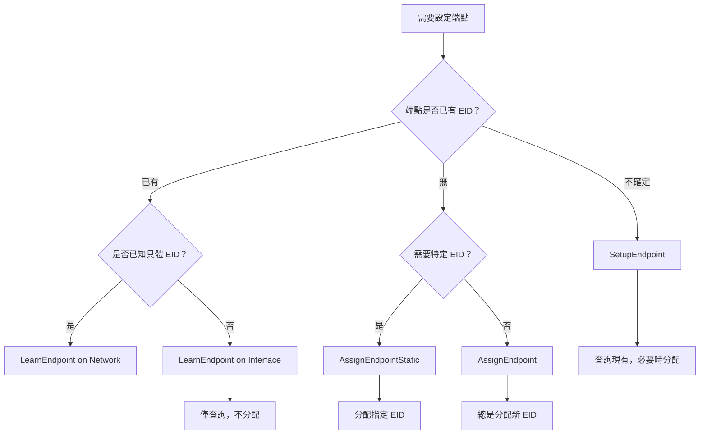

# MCTP 介面 API (Interface API)

本文說明 mctpd 的 MCTP 介面相關 D-Bus 介面：`Interface1` 和 `BusOwner1`。

---

## 物件路徑

```
/au/com/codeconstruct/mctp1/interfaces/<interface-name>
```

**範例**：
- `/au/com/codeconstruct/mctp1/interfaces/mctpi2c1`
- `/au/com/codeconstruct/mctp1/interfaces/mctpi2c2`

---

## au.com.codeconstruct.MCTP.Interface1

所有 MCTP 介面物件都實作此介面，提供介面的基本屬性。

### 介面定義

```
NAME                                 TYPE      SIGNATURE RESULT/VALUE FLAGS
au.com.codeconstruct.MCTP.Interface1 interface -         -            -
.NetworkId                           property  u         1            emits-change
.Role                                property  s         "BusOwner"   emits-change writable
```

### 屬性

#### NetworkId

| 項目 | 值 |
|------|-----|
| **型別** | `u` (uint32) |
| **存取** | 唯讀 |
| **訊號** | PropertyChanged |

此介面所屬的 MCTP 網路 ID。

**讀取範例**：

```bash
$ busctl get-property au.com.codeconstruct.MCTP1 \
    /au/com/codeconstruct/mctp1/interfaces/mctpi2c1 \
    au.com.codeconstruct.MCTP.Interface1 NetworkId
u 1
```

#### Role

| 項目 | 值 |
|------|-----|
| **型別** | `s` (string) |
| **存取** | 讀寫（有條件） |
| **訊號** | PropertyChanged |

介面在 MCTP 網路中的角色。

**可能的值**：

| 值 | 說明 |
|-----|------|
| `"BusOwner"` | 此介面是匯流排擁有者 |
| `"Endpoint"` | 此介面是普通端點 |
| `"Unknown"` | 尚未配置 |

**寫入限制**：
- 只有當 Role 為 `"Unknown"` 時才能寫入
- 一旦設定為 `"BusOwner"` 或 `"Endpoint"`，不可更改

**讀取範例**：

```bash
$ busctl get-property au.com.codeconstruct.MCTP1 \
    /au/com/codeconstruct/mctp1/interfaces/mctpi2c1 \
    au.com.codeconstruct.MCTP.Interface1 Role
s "BusOwner"
```

**寫入範例**（僅當 Role 為 Unknown 時）：

```bash
$ busctl set-property au.com.codeconstruct.MCTP1 \
    /au/com/codeconstruct/mctp1/interfaces/mctpi2c1 \
    au.com.codeconstruct.MCTP.Interface1 Role s "BusOwner"
```

---

## au.com.codeconstruct.MCTP.BusOwner1

當介面的 Role 為 `"BusOwner"` 時，該介面物件會額外實作此介面，提供 bus-owner 操作方法。

### 介面定義

```
NAME                                 TYPE      SIGNATURE RESULT/VALUE FLAGS
au.com.codeconstruct.MCTP.BusOwner1  interface -         -            -
.AssignEndpoint                      method    ay        yisb         -
.AssignEndpointStatic                method    ayy       yisb         -
.LearnEndpoint                       method    ay        yisb         -
.SetupEndpoint                       method    ay        yisb         -
```

### 方法

#### SetupEndpoint

最常用的端點設定方法。查詢端點的現有 EID，若無則分配新的。

| 項目 | 值 |
|------|-----|
| **輸入** | `ay` - 硬體地址（byte array） |
| **輸出** | `yisb` - (EID, 網路ID, 路徑, 是否新分配) |

**流程**：
1. 發送 Get Endpoint ID 命令
2. 如果端點有有效 EID，使用現有 EID
3. 如果端點無 EID，分配新 EID 並發送 Set Endpoint ID
4. 查詢 UUID 和支援的訊息類型
5. 建立路由和鄰居條目
6. 建立 D-Bus 物件

**使用範例**：

```bash
# 設定 I2C 地址 0x1d 的端點
$ busctl call au.com.codeconstruct.MCTP1 \
    /au/com/codeconstruct/mctp1/interfaces/mctpi2c1 \
    au.com.codeconstruct.MCTP.BusOwner1 \
    SetupEndpoint ay 1 0x1d
yisb 10 1 "/au/com/codeconstruct/mctp1/networks/1/endpoints/10" true
```

**輸出說明**：
- `y 10` - 分配的 EID
- `i 1` - 網路 ID
- `s "..."` - 端點 D-Bus 物件路徑
- `b true` - 這是新分配的 EID

#### AssignEndpoint

總是分配新的 EID，不查詢現有 EID。

| 項目 | 值 |
|------|-----|
| **輸入** | `ay` - 硬體地址（byte array） |
| **輸出** | `yisb` - (EID, 網路ID, 路徑, 是否新分配) |

**與 SetupEndpoint 的差異**：
- 不查詢端點現有 EID
- 總是發送 Set Endpoint ID 命令
- 如果端點已知，回傳 `new = false`

**使用範例**：

```bash
$ busctl call au.com.codeconstruct.MCTP1 \
    /au/com/codeconstruct/mctp1/interfaces/mctpi2c1 \
    au.com.codeconstruct.MCTP.BusOwner1 \
    AssignEndpoint ay 1 0x1d
yisb 10 1 "/au/com/codeconstruct/mctp1/networks/1/endpoints/10" true
```

**橋接器處理**：
- 如果 Set Endpoint ID 回應表明是橋接器（請求 EID 池）
- mctpd 會嘗試從動態範圍分配連續的 EID 池
- 使用 Allocate Endpoint IDs 命令傳遞池資訊

#### AssignEndpointStatic

分配指定的靜態 EID。

| 項目 | 值 |
|------|-----|
| **輸入** | `ayy` - 硬體地址 + 指定 EID |
| **輸出** | `yisb` - (EID, 網路ID, 路徑, 是否新分配) |

**使用範例**：

```bash
# 將 EID 20 分配給 I2C 地址 0x1d 的端點
$ busctl call au.com.codeconstruct.MCTP1 \
    /au/com/codeconstruct/mctp1/interfaces/mctpi2c1 \
    au.com.codeconstruct.MCTP.BusOwner1 \
    AssignEndpointStatic ayy 1 0x1d 20
yisb 20 1 "/au/com/codeconstruct/mctp1/networks/1/endpoints/20" true
```

**錯誤情況**：
- 如果端點已有不同的 EID，呼叫失敗
- 如果指定的 EID 已被其他端點使用，呼叫失敗

#### LearnEndpoint

僅查詢端點的現有 EID，不分配新 EID。

| 項目 | 值 |
|------|-----|
| **輸入** | `ay` - 硬體地址（byte array） |
| **輸出** | `yisb` - (EID, 網路ID, 路徑, 是否新發現) |

**與 SetupEndpoint 的差異**：
- 不發送 Set Endpoint ID
- 如果端點無有效 EID，呼叫失敗
- 適用於端點已有 EID 的情況

**使用範例**：

```bash
$ busctl call au.com.codeconstruct.MCTP1 \
    /au/com/codeconstruct/mctp1/interfaces/mctpi2c1 \
    au.com.codeconstruct.MCTP.BusOwner1 \
    LearnEndpoint ay 1 0x1d
yisb 10 1 "/au/com/codeconstruct/mctp1/networks/1/endpoints/10" false
```

> [!WARNING]
> LearnEndpoint 不適合用於橋接器端點，因為無法提供 EID 池資訊。橋接器應使用 AssignEndpoint。

---

## 硬體地址格式

硬體地址格式取決於傳輸類型：

### I2C/SMBus

- 長度：1 byte
- 格式：7-bit I2C slave address
- 範例：`0x1d`, `0x50`

```bash
# ay 1 0x1d 表示：
# ay = byte array
# 1 = 陣列長度
# 0x1d = I2C 地址
busctl call ... SetupEndpoint ay 1 0x1d
```

### 其他傳輸

其他傳輸類型可能有不同的地址長度和格式。

---

## 方法選擇指南



### 建議使用場景

| 方法 | 使用場景 |
|------|----------|
| **SetupEndpoint** | 一般端點發現，適用於大多數情況 |
| **AssignEndpoint** | 橋接器設定，或需要確保新 EID |
| **AssignEndpointStatic** | 需要特定 EID 對應（如靜態配置） |
| **LearnEndpoint** | 端點已有 EID，僅需發現（如橋接下游） |

---

## 錯誤處理

### 常見錯誤

| 錯誤 | 說明 | 解決方案 |
|------|------|----------|
| `org.freedesktop.DBus.Error.Failed` | 通用錯誤 | 檢查日誌詳情 |
| `No response` | 端點無回應 | 檢查硬體連接 |
| `EID conflict` | EID 衝突 | 使用其他 EID 或 AssignEndpoint |

### 超時處理

mctpd 會等待 `message_timeout_ms` 後放棄（程式碼預設 250ms，出廠配置檔設為 30ms）。

---

## 程式範例

### C/sd-bus

```c
#include <systemd/sd-bus.h>

int setup_endpoint(sd_bus *bus, uint8_t hwaddr) {
    sd_bus_message *reply = NULL;
    sd_bus_error error = SD_BUS_ERROR_NULL;
    uint8_t eid;
    int32_t net;
    const char *path;
    int new_endpoint;
    
    int r = sd_bus_call_method(
        bus,
        "au.com.codeconstruct.MCTP1",
        "/au/com/codeconstruct/mctp1/interfaces/mctpi2c1",
        "au.com.codeconstruct.MCTP.BusOwner1",
        "SetupEndpoint",
        &error,
        &reply,
        "ay", 1, &hwaddr);
    
    if (r < 0)
        return r;
    
    r = sd_bus_message_read(reply, "yisb", &eid, &net, &path, &new_endpoint);
    
    printf("EID: %d, Net: %d, Path: %s, New: %d\n", eid, net, path, new_endpoint);
    
    sd_bus_message_unref(reply);
    return 0;
}
```

### Python/dbus

```python
import dbus

bus = dbus.SystemBus()
proxy = bus.get_object(
    'au.com.codeconstruct.MCTP1',
    '/au/com/codeconstruct/mctp1/interfaces/mctpi2c1'
)
iface = dbus.Interface(proxy, 'au.com.codeconstruct.MCTP.BusOwner1')

# SetupEndpoint with I2C address 0x1d
hwaddr = dbus.Array([0x1d], signature='y')
result = iface.SetupEndpoint(hwaddr)

eid, net, path, new = result
print(f"EID: {eid}, Net: {net}, Path: {path}, New: {new}")
```

---

## 相關文件

- [DBusOverview](DBusOverview.md) - D-Bus 介面總覽
- [NetworkAPI](NetworkAPI.md) - Network1 介面
- [EndpointAPI](EndpointAPI.md) - 端點介面
- [EndpointDiscovery](EndpointDiscovery.md) - 端點發現流程

---

[← 返回首頁](Home.md)
