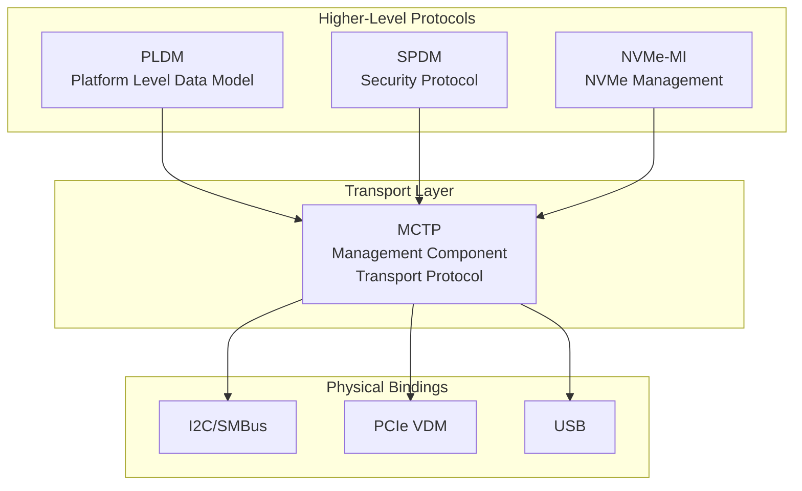

# MCTP 協議概述 (MCTP Overview)

本文介紹 MCTP（Management Component Transport Protocol）協議的基本概念，基於 DMTF DSP0236 規範。

---

## 什麼是 MCTP？

**MCTP**（Management Component Transport Protocol）是由 [DMTF](https://www.dmtf.org/) 定義的標準化傳輸協議，用於平台管理子系統內智慧硬體元件之間的通訊。

### 設計目標

| 目標 | 說明 |
|------|------|
| **媒體獨立** | 可在多種實體傳輸層上運行（I2C、PCIe、USB、Serial） |
| **低開銷** | 簡化的協議設計，適合嵌入式系統和 BMC 韌體 |
| **標準化** | 提供一致的傳輸層給各種管理協議（PLDM、SPDM、NVMe-MI） |
| **可擴展** | 支援多種訊息類型和自定義供應商訊息 |

### 主要特點

- 🔗 **無連接協議**：類似 UDP，不保證順序和可靠性
- 📦 **訊息分片**：大訊息自動分片傳輸，接收端重組
- 🏷️ **訊息標籤**：用於請求/回應配對
- 🆔 **端點識別**：使用 8-bit EID 識別端點

---

## 核心概念

### 端點識別碼（EID）

EID（Endpoint ID）是 MCTP 網路中用於識別端點的 8-bit 地址：

```
┌─────────────────────────────────────────────────────────────────┐
│                        EID 地址空間                             │
├──────────────┬──────────────────────────────────────────────────┤
│    0x00      │ Null EID（未分配）                               │
│    0x01      │ 廣播 EID                                         │
│  0x02-0x07   │ 保留                                             │
│  0x08-0xFE   │ 可分配給端點的 EID 範圍                          │
│    0xFF      │ 廣播（所有端點）                                 │
└──────────────┴──────────────────────────────────────────────────┘
```

> [!NOTE]
> mctpd 的預設動態 EID 分配範圍是 8-254（`dynamic_eid_range = [8, 254]`）。

### 網路識別碼（Network ID）

在 Linux 核心 MCTP 實作中，引入了 **Network ID** 概念來區分不同的 MCTP 網路：

- 每個 MCTP 介面可以屬於不同的網路
- 允許相同 EID 在不同網路中使用
- 擴展了單一網路 255 個端點的限制

```
┌─────────────────────────────────────────────────────────────────┐
│                        MCTP 網路架構                            │
├─────────────────────────────────────────────────────────────────┤
│                                                                 │
│  ┌─────────────────────────┐  ┌─────────────────────────────┐  │
│  │      Network 1          │  │        Network 2            │  │
│  │                         │  │                             │  │
│  │  mctpi2c1 (EID: 8)      │  │  mctpi2c2 (EID: 8)          │  │
│  │     │                   │  │     │                       │  │
│  │     ├── Device EID: 10  │  │     ├── Device EID: 10      │  │
│  │     └── Device EID: 11  │  │     └── Device EID: 12      │  │
│  │                         │  │                             │  │
│  └─────────────────────────┘  └─────────────────────────────┘  │
│                                                                 │
│  兩個網路可以有相同的 EID，透過 Network ID 區分                 │
│                                                                 │
└─────────────────────────────────────────────────────────────────┘
```

### 端點角色

MCTP 端點可以具有以下角色：

| 角色 | 說明 |
|------|------|
| **Bus Owner** | 匯流排擁有者，負責分配 EID、管理網路 |
| **Endpoint** | 普通端點，接受 bus owner 分配的 EID |
| **Bridge** | 橋接器，連接兩個 MCTP 網路，可擁有下游 EID 池 |

```
┌─────────────────────────────────────────────────────────────────┐
│                      Bus Owner (BMC)                            │
│                        EID: 8                                   │
└────────────────────────────┬────────────────────────────────────┘
                             │
            ┌────────────────┼────────────────┐
            │                │                │
      ┌─────▼─────┐    ┌─────▼─────┐    ┌─────▼─────┐
      │ Endpoint  │    │ Endpoint  │    │  Bridge   │
      │ EID: 10   │    │ EID: 11   │    │ EID: 12   │
      │           │    │           │    │ Pool:     │
      │           │    │           │    │ 50-60     │
      └───────────┘    └───────────┘    └─────┬─────┘
                                              │
                            ┌─────────────────┼─────────────────┐
                            │                 │                 │
                      ┌─────▼─────┐     ┌─────▼─────┐     ┌─────▼─────┐
                      │ Endpoint  │     │ Endpoint  │     │ Endpoint  │
                      │ EID: 50   │     │ EID: 51   │     │ EID: 52   │
                      └───────────┘     └───────────┘     └───────────┘
```

---

## MCTP 訊息結構

### 封包格式

```
┌──────────────────────────────────────────────────────────────────┐
│                    MCTP Transport Header                         │
├──────────┬──────────┬──────────┬──────────┬──────────────────────┤
│ Version  │   Dest   │  Source  │   Msg    │                      │
│ (4 bits) │   EID    │   EID    │  Tag     │   Payload            │
│          │ (8 bits) │ (8 bits) │ (8 bits) │                      │
├──────────┴──────────┴──────────┴──────────┤                      │
│ Flags:                                     │                      │
│ • SOM (Start of Message)                   │                      │
│ • EOM (End of Message)                     │                      │
│ • Packet Sequence                          │                      │
│ • Tag Owner                                │                      │
└────────────────────────────────────────────┴──────────────────────┘
```

### 訊息類型

MCTP 支援多種訊息類型：

| 類型碼 | 訊息類型 | 說明 |
|--------|----------|------|
| 0x00 | Control Messages | MCTP 控制協議訊息 |
| 0x01 | PLDM | Platform Level Data Model |
| 0x02 | NC-SI | Network Controller Sideband Interface |
| 0x03 | Ethernet | MCTP over Ethernet |
| 0x04 | NVMe-MI | NVMe Management Interface |
| 0x05 | SPDM | Security Protocol and Data Model |
| 0x7E | Vendor Defined (PCI) | 供應商定義（PCI VID） |
| 0x7F | Vendor Defined (IANA) | 供應商定義（IANA ID） |

---

## MCTP 控制協議

MCTP 控制協議（Message Type 0x00）用於網路管理和端點發現：

### 控制命令

| 命令碼 | 命令名稱 | 說明 |
|--------|----------|------|
| 0x01 | Set Endpoint ID | 設定端點 EID |
| 0x02 | Get Endpoint ID | 查詢端點 EID |
| 0x03 | Get Endpoint UUID | 查詢端點 UUID |
| 0x04 | Get MCTP Version Support | 查詢支援的 MCTP 版本 |
| 0x05 | Get Message Type Support | 查詢支援的訊息類型 |
| 0x06 | Get Vendor Defined Msg Support | 查詢供應商定義訊息支援 |
| 0x07 | Resolve Endpoint ID | 解析 EID |
| 0x08 | Allocate Endpoint IDs | 分配 EID 池（給橋接器） |
| 0x0C | Prepare for Endpoint Discovery | 準備端點發現 |
| 0x0D | Endpoint Discovery | 執行端點發現 |
| 0x0E | Discovery Notify | 發現通知 |

### Set Endpoint ID 操作類型

| 操作 | 說明 |
|------|------|
| Set EID | 設定端點的 EID |
| Force EID | 強制設定，即使端點已有 EID |
| Reset EID | 重置為 Null EID |
| Set Discovered | 標記為已發現狀態 |

---

## 傳輸綁定

MCTP 支援多種實體傳輸層：

### I2C/SMBus 綁定（DSP0237）

```
┌─────────────────────────────────────────────────────────────────┐
│                    MCTP over I2C/SMBus                          │
├─────────────────────────────────────────────────────────────────┤
│                                                                 │
│  ┌───────────────────────────────────────────────────────────┐ │
│  │  I2C Frame                                                 │ │
│  │                                                            │ │
│  │  ┌─────────┬─────────┬───────┬─────────┬────────────────┐ │ │
│  │  │  Slave  │ Command │ Byte  │  Source │                │ │ │
│  │  │  Addr   │  Code   │ Count │  Slave  │  MCTP Packet   │ │ │
│  │  │ (7-bit) │ (0x0F)  │       │  Addr   │                │ │ │
│  │  └─────────┴─────────┴───────┴─────────┴────────────────┘ │ │
│  │                                                            │ │
│  └───────────────────────────────────────────────────────────┘ │
│                                                                 │
│  Linux 驅動程式：mctp-i2c（介面名稱：mctpi2c*）                 │
│  MTU 範圍：68-254 bytes                                         │
│                                                                 │
└─────────────────────────────────────────────────────────────────┘
```

### PCIe VDM 綁定（DSP0238）

```
┌─────────────────────────────────────────────────────────────────┐
│                    MCTP over PCIe VDM                           │
├─────────────────────────────────────────────────────────────────┤
│                                                                 │
│  使用 PCIe Vendor Defined Messages (VDM) 傳輸 MCTP               │
│                                                                 │
│  • 硬體地址：PCIe BDF (Bus:Device.Function)                      │
│  • 定義於 DMTF DSP0238                                           │
│                                                                 │
└─────────────────────────────────────────────────────────────────┘
```

### USB 綁定（DSP0283）

```
┌─────────────────────────────────────────────────────────────────┐
│                    MCTP over USB                                │
├─────────────────────────────────────────────────────────────────┤
│                                                                 │
│  使用 USB 端點傳輸 MCTP 訊息                                      │
│                                                                 │
│  • 定義於 DMTF DSP0283                                           │
│                                                                 │
└─────────────────────────────────────────────────────────────────┘
```

---

## MCTP 在 OpenBMC 中的角色



### 典型使用場景

1. **平台管理**：BMC 透過 MCTP/PLDM 與 CPU、GPU、存儲設備通訊
2. **安全認證**：使用 MCTP/SPDM 進行設備身份驗證
3. **NVMe 管理**：透過 MCTP/NVMe-MI 管理 NVMe SSD
4. **電源管理**：與電源供應器通訊

---

## DMTF 規範參考

| 規範編號 | 名稱 | 說明 |
|----------|------|------|
| DSP0236 | MCTP Base Specification | MCTP 基礎規範 |
| DSP0237 | MCTP SMBus/I2C Transport Binding | I2C 傳輸綁定 |
| DSP0238 | MCTP PCIe VDM Transport Binding | PCIe 傳輸綁定 |
| DSP0239 | MCTP IDs and Codes | 訊息類型和代碼定義 |
| DSP0283 | MCTP USB Transport Binding | USB 傳輸綁定 |

---

## 相關文件

- [KernelStack](KernelStack.md) - Linux 核心 MCTP 堆疊
- [Architecture](Architecture.md) - 系統架構
- [EndpointDiscovery](EndpointDiscovery.md) - 端點發現流程

---

[← 返回首頁](Home.md)
