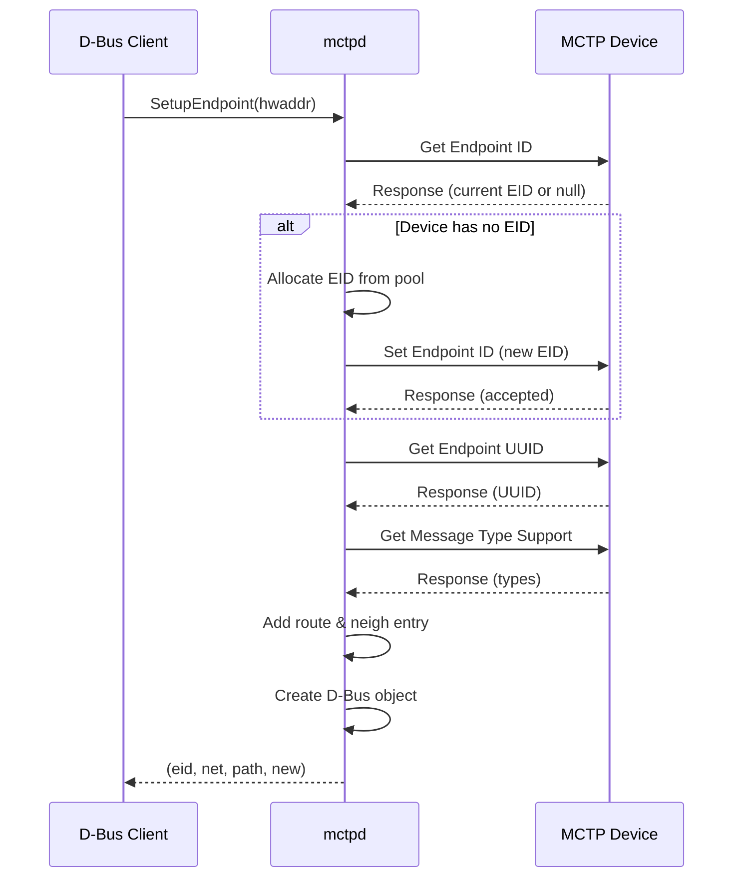

# mctpd 守護程式 (mctpd Daemon)

`mctpd` 是 MCTP 控制協議的守護程式，負責端點發現、EID 分配和 D-Bus 介面服務。

---

## 概述

`mctpd` 是 CodeConstruct/mctp 專案的核心元件，提供以下功能：

| 功能              | 說明                               |
| ----------------- | ---------------------------------- |
| **MCTP 控制協議** | 實作 DSP0236 定義的控制命令        |
| **EID 分配**      | 作為 bus-owner 分配 EID 給遠端端點 |
| **端點發現**      | 發現和列舉 MCTP 網路中的端點       |
| **D-Bus 服務**    | 透過 D-Bus 暴露端點資訊和控制介面  |
| **路由管理**      | 自動設定 MCTP 路由和鄰居表         |

---

## 運作模式

mctpd 支援兩種運作模式：

### Bus-Owner 模式

```
┌─────────────────────────────────────────────────────────────────┐
│                    Bus-Owner Mode                                │
├─────────────────────────────────────────────────────────────────┤
│                                                                 │
│  mctpd 作為 bus owner：                                         │
│                                                                 │
│  • 分配 EID 給遠端端點（SetupEndpoint, AssignEndpoint）          │
│  • 管理動態 EID 池                                               │
│  • 處理橋接器的 EID 池請求                                       │
│  • 發送 Set Endpoint ID 控制命令                                 │
│                                                                 │
│  配置：mode = "bus-owner"                                        │
│                                                                 │
└─────────────────────────────────────────────────────────────────┘
```

### Endpoint 模式

```
┌─────────────────────────────────────────────────────────────────┐
│                    Endpoint Mode                                 │
├─────────────────────────────────────────────────────────────────┤
│                                                                 │
│  mctpd 作為 endpoint：                                          │
│                                                                 │
│  • 接受外部 bus owner 的 EID 分配                                │
│  • 回應 Get Endpoint ID、Get Endpoint UUID 等查詢               │
│  • 參與端點發現流程（Prepare/Endpoint Discovery）                │
│  • 不會主動分配 EID                                              │
│                                                                 │
│  配置：mode = "endpoint"                                         │
│                                                                 │
└─────────────────────────────────────────────────────────────────┘
```

---

## 命令行選項

```bash
mctpd [OPTIONS]
```

| 選項                       | 說明                                    |
| -------------------------- | --------------------------------------- |
| `-c FILE`, `--config FILE` | 指定配置檔案（預設：`/etc/mctpd.conf`） |
| `-v`, `--verbose`          | 啟用詳細日誌輸出                        |

### 使用範例

```bash
# 使用預設配置啟動
mctpd

# 使用指定配置檔案
mctpd -c /path/to/mctpd.conf

# 詳細模式
mctpd -v
```

---

## 配置檔案

mctpd 使用 TOML 格式的配置檔案。預設路徑：`/etc/mctpd.conf`

### 完整配置範例

```toml
# mctpd 運作模式
mode = "bus-owner"

# MCTP 協議設定
[mctp]
# 程式碼硬編碼預設 250，出廠配置檔設為 30
message_timeout_ms = 30

# 可選：指定 UUID（通常自動取得系統 UUID）
# uuid = "21f0f554-7f7c-4211-9ca1-6d0f000ea9e7"

# Bus-owner 模式設定
[bus-owner]
dynamic_eid_range = [8, 254]
max_pool_size = 15
# endpoint_poll_ms 目前在 upstream 中尚未實作（僅有 TODO 註解）
```

### 配置選項說明

#### 全域設定

| 選項   | 類型   | 預設值        | 說明                                    |
| ------ | ------ | ------------- | --------------------------------------- |
| `mode` | string | `"bus-owner"` | 運作模式：`"bus-owner"` 或 `"endpoint"` |

#### [mctp] 區段

| 選項                 | 類型    | 預設值                        | 說明                       |
| -------------------- | ------- | ----------------------------- | -------------------------- |
| `message_timeout_ms` | integer | 250（程式碼）/ 30（出廠配置） | MCTP 訊息逾時（毫秒）      |
| `uuid`               | string  | 系統 UUID                     | 端點 UUID（RFC 4122 格式） |

#### [bus-owner] 區段

| 選項                | 類型    | 預設值     | 說明                                                                                     |
| ------------------- | ------- | ---------- | ---------------------------------------------------------------------------------------- |
| `dynamic_eid_range` | array   | `[8, 254]` | 動態 EID 分配範圍                                                                        |
| `max_pool_size`     | integer | 15         | 橋接器最大 EID 池大小                                                                    |
| `endpoint_poll_ms`  | integer | —          | ❓ **尚未實作**：upstream 中僅有 TODO 註解（`mctpd.c` line ~4985），此選項目前不會被解析 |

---

## MCTP 控制協議實作

mctpd 實作以下 MCTP 控制協議命令：

### 作為請求發送者（Bus-Owner）

| 命令                     | 說明                |
| ------------------------ | ------------------- |
| Set Endpoint ID          | 分配 EID 給遠端端點 |
| Get Endpoint ID          | 查詢端點當前 EID    |
| Get Endpoint UUID        | 查詢端點 UUID       |
| Get Message Type Support | 查詢支援的訊息類型  |
| Allocate Endpoint IDs    | 分配 EID 池給橋接器 |

### 作為回應者（兩種模式）

| 命令                           | 說明                   |
| ------------------------------ | ---------------------- |
| Get Endpoint ID                | 回報本機 EID           |
| Get Endpoint UUID              | 回報本機 UUID          |
| Get MCTP Version Support       | 回報支援的 MCTP 版本   |
| Get Message Type Support       | 回報支援的訊息類型     |
| Get Vendor Defined Msg Support | 回報供應商定義訊息支援 |

### 僅 Endpoint 模式

| 命令                           | 說明                      |
| ------------------------------ | ------------------------- |
| Set Endpoint ID                | 接受 bus owner 分配的 EID |
| Prepare for Endpoint Discovery | 準備發現流程              |
| Endpoint Discovery             | 執行發現流程              |

---

## D-Bus 服務

mctpd 提供完整的 D-Bus 服務：

```
服務名稱：au.com.codeconstruct.MCTP1
根物件：/au/com/codeconstruct/mctp1
```

### 物件樹結構

```
/au/com/codeconstruct/mctp1
├── interfaces/
│   ├── mctpi2c1          (au.com.codeconstruct.MCTP.Interface1)
│   │                     (au.com.codeconstruct.MCTP.BusOwner1, if bus-owner)
│   └── mctpi2c2          ...
└── networks/
    └── 1/
        └── endpoints/
            ├── 8         (xyz.openbmc_project.MCTP.Endpoint)
            │             (xyz.openbmc_project.Common.UUID)
            │             (au.com.codeconstruct.MCTP.Endpoint1)
            ├── 10        ...
            └── 11        ...
```

### 主要 D-Bus 介面

| 介面                                   | 說明                   |
| -------------------------------------- | ---------------------- |
| `au.com.codeconstruct.MCTP1`           | 頂層介面，訊息類型註冊 |
| `au.com.codeconstruct.MCTP.Interface1` | MCTP 介面屬性          |
| `au.com.codeconstruct.MCTP.BusOwner1`  | Bus-owner 操作方法     |
| `au.com.codeconstruct.MCTP.Network1`   | 網路層操作             |
| `xyz.openbmc_project.MCTP.Endpoint`    | OpenBMC 標準端點介面   |
| `xyz.openbmc_project.Common.UUID`      | 端點 UUID              |
| `au.com.codeconstruct.MCTP.Endpoint1`  | 端點控制方法           |
| `au.com.codeconstruct.MCTP.Bridge1`    | 橋接器 EID 池資訊      |

詳細 D-Bus API 說明請參閱：

- [DBusOverview](DBusOverview.md) - D-Bus 介面總覽
- [InterfaceAPI](InterfaceAPI.md) - Interface1 / BusOwner1
- [NetworkAPI](NetworkAPI.md) - Network1
- [EndpointAPI](EndpointAPI.md) - Endpoint / Endpoint1
- [BridgeAPI](BridgeAPI.md) - Bridge1

---

## 端點發現流程

### SetupEndpoint 流程



> **逐步說明：**
>
> 1. **Client 呼叫 SetupEndpoint**：某個程式（例如 pldmd）透過 D-Bus 告訴 mctpd：「請幫我設定這個硬體位址（hwaddr）的 MCTP 端點」。硬體位址就像網路 MAC 位址，用來識別實體裝置。
> 2. **mctpd 詢問裝置的 EID**：mctpd 對裝置發送 `Get Endpoint ID` 命令，問它：「你有沒有已經分配好的 EID（Endpoint ID）？」EID 是 MCTP 網路中每個端點的唯一編號，類似 IP 位址。
> 3. **裝置回應目前的 EID**：裝置告訴 mctpd 自己是否已有 EID。如果裝置是全新的或剛重啟，可能沒有 EID（回傳 null）。
> 4. **（條件分支）裝置沒有 EID 的情況**：如果裝置還沒有 EID，mctpd 會從自己的 EID 池中分配一個新的編號，然後用 `Set Endpoint ID` 命令告訴裝置：「你的 EID 是 X」。裝置回應「OK，已接受」。
> 5. **查詢裝置 UUID**：mctpd 再問裝置：「你的 UUID 是什麼？」UUID 是一個全球唯一的識別碼，用來確保即使 EID 改變，也能辨識出是同一個裝置。
> 6. **查詢支援的訊息類型**：mctpd 問裝置：「你支援哪些 MCTP 訊息類型？」例如，Type 1 = PLDM、Type 4 = VDPCI（Vendor Defined PCI）。這決定了後續哪些上層協議可以和這個裝置通訊。
> 7. **建立路由和鄰居表**：mctpd 在 Linux kernel 中建立 MCTP 路由（route）和鄰居（neighbour）記錄，就像設定網路的路由表一樣——告訴 kernel「要和 EID X 通訊，走這條實體路徑」。
> 8. **建立 D-Bus 物件**：mctpd 在 D-Bus 上建立一個代表這個端點的物件（例如 `/au/com/codeconstruct/mctp1/networks/1/endpoints/8`），讓其他程式（如 pldmd）可以透過 D-Bus 查詢這個端點的資訊。
> 9. **回傳結果給 Client**：mctpd 把結果回傳給呼叫者，包含：分配的 EID、網路編號（net）、D-Bus 物件路徑、以及這是否是新發現的端點。

### AssignEndpoint vs SetupEndpoint vs LearnEndpoint

| 方法                     | 說明                         |
| ------------------------ | ---------------------------- |
| **SetupEndpoint**        | 查詢現有 EID，若無則分配新的 |
| **AssignEndpoint**       | 總是分配新 EID               |
| **AssignEndpointStatic** | 指定特定 EID                 |
| **LearnEndpoint**        | 僅查詢，不分配 EID           |

---

## 連接狀態管理

mctpd 追蹤端點的連接狀態：

### 連接狀態

```
┌─────────────────────────────────────────────────────────────────┐
│                    Endpoint Connectivity                         │
├─────────────────────────────────────────────────────────────────┤
│                                                                 │
│  正常狀態                                                        │
│  • 端點回應正常                                                  │
│  • D-Bus Connectivity 屬性顯示正常                               │
│                                                                 │
│  降級狀態（degraded）                                            │
│  • 端點無回應                                                    │
│  • mctpd 啟動恢復程序                                            │
│  • 定期輪詢嘗試重新連接                                          │
│                                                                 │
└─────────────────────────────────────────────────────────────────┘
```

### 端點恢復

當端點無回應時，mctpd 會：

1. 標記端點為 degraded
2. 定期發送 Get Endpoint ID 嘗試恢復
3. 驗證回應的 UUID 是否匹配
4. 若恢復成功，更新連接狀態

---

## Systemd 整合

### 服務定義

```ini
# /lib/systemd/system/mctpd.service
[Unit]
Description=MCTP control protocol daemon
Wants=mctp-local.target
After=mctp-local.target

[Service]
Type=dbus
BusName=au.com.codeconstruct.MCTP1
ExecStart=/usr/sbin/mctpd

[Install]
WantedBy=mctp.target
```

### 相關 Target

```ini
# /lib/systemd/system/mctp.target
[Unit]
Description=MCTP infrastructure active
Wants=mctp-local.target

[Install]
WantedBy=multi-user.target
```

### 啟動順序

```
multi-user.target
    └── mctp.target
        ├── mctp-local.target
        │   └── mctp-local-setup.service (if exists)
        └── mctpd.service
```

---

## 日誌與除錯

### 查看日誌

```bash
# 透過 journalctl
journalctl -u mctpd -f

# 詳細模式啟動
mctpd -v
```

### 常見日誌訊息

```
# 發現新端點
mctpd[1234]: Found endpoint EID 10 on mctpi2c1

# EID 分配
mctpd[1234]: Assigned EID 10 to device at hwaddr 0x1d

# 端點 UUID
mctpd[1234]: Endpoint 10 UUID: 12345678-1234-1234-1234-123456789abc

# 連接問題
mctpd[1234]: Endpoint 10 not responding, marking degraded

# 恢復
mctpd[1234]: Endpoint 10 recovered
```

---

## 建構選項

### Meson 選項

| 選項                           | 類型    | 預設值 | 說明                                 |
| ------------------------------ | ------- | ------ | ------------------------------------ |
| `tests`                        | boolean | true   | 啟用測試                             |
| `unsafe-recover-nil-uuid`      | boolean | false  | 允許 nil UUID 恢復（開發用）         |
| `unsafe-writable-connectivity` | boolean | false  | 允許寫入 Connectivity 屬性（開發用） |

```bash
# 禁用測試（減少相依性）
meson setup obj -Dtests=false

# 開發選項
meson setup obj -Dunsafe-recover-nil-uuid=true
```

### 相依性

| 相依       | 版本    | 說明               |
| ---------- | ------- | ------------------ |
| libsystemd | ≥247    | sd-bus 和 sd-event |
| meson      | ≥0.59.0 | 建構系統           |

---

## 常見問題

### mctpd 無法啟動

1. 檢查 libsystemd 版本
2. 確認配置檔案語法正確
3. 檢查 D-Bus 權限

### 無法發現端點

1. 確認 MCTP 介面已啟用（`mctp link show`）
2. 確認硬體連接正常
3. 檢查 I2C 地址是否正確

### D-Bus 連線失敗

1. 確認 mctpd 正在運行
2. 檢查 D-Bus 配置
3. 確認服務名稱正確

---

## 相關文件

- [Configuration](Configuration.md) - 配置指南
- [DBusOverview](DBusOverview.md) - D-Bus 介面總覽
- [EndpointDiscovery](EndpointDiscovery.md) - 端點發現
- [SystemdIntegration](SystemdIntegration.md) - Systemd 整合
- [SourceCodeWalkthrough](SourceCodeWalkthrough.md) - mctpd 完整呼叫鏈走讀

---

[← 返回首頁](Home.md)
