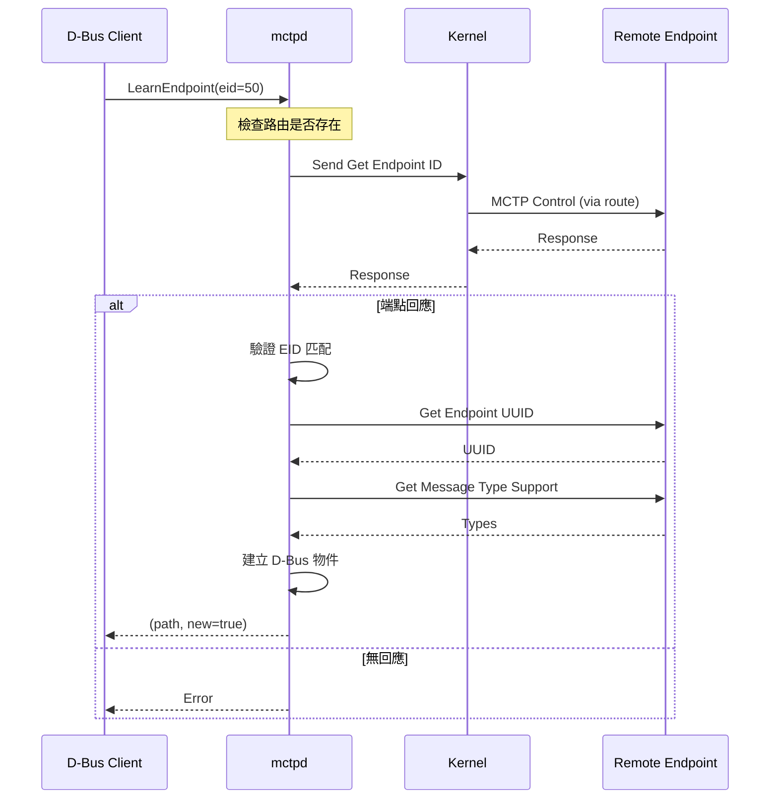

# 網路 API (Network API)

本文說明 mctpd 的 MCTP 網路 D-Bus 介面：`Network1`。

---

## 物件路徑

```
/au/com/codeconstruct/mctp1/networks/<network-id>
```

**範例**：

- `/au/com/codeconstruct/mctp1/networks/1`
- `/au/com/codeconstruct/mctp1/networks/2`

---

## au.com.codeconstruct.MCTP.Network1

網路物件實作此介面，提供網路層的操作。

### 介面定義

```
NAME                                TYPE      SIGNATURE RESULT/VALUE FLAGS
au.com.codeconstruct.MCTP.Network1  interface -         -            -
.LearnEndpoint                      method    y         sb           -
.LocalEIDs                          property  ay        1 8          const
```

---

## 屬性

### LocalEIDs

| 項目     | 值                    |
| -------- | --------------------- |
| **型別** | `ay` (array of bytes) |
| **存取** | 唯讀                  |
| **訊號** | const（不變）         |

此網路中分配給本機的 EID 列表。

**讀取範例**：

```bash
$ busctl get-property au.com.codeconstruct.MCTP1 \
    /au/com/codeconstruct/mctp1/networks/1 \
    au.com.codeconstruct.MCTP.Network1 LocalEIDs
ay 1 8
```

**輸出說明**：

- `ay` - byte array 型別
- `1` - 陣列長度
- `8` - 本機 EID

**多個本機 EID 範例**：

```bash
$ busctl get-property ... LocalEIDs
ay 2 8 9
```

---

## 方法

### LearnEndpoint

透過 EID 發現已存在於網路中的端點。不同於 Interface1.LearnEndpoint（使用硬體地址），此方法使用 EID。

| 項目     | 值                            |
| -------- | ----------------------------- |
| **輸入** | `y` - 目標 EID (byte)         |
| **輸出** | `sb` - (物件路徑, 是否新發現) |

**用途**：

- 發現橋接下游的端點
- 端點 EID 已由其他 bus owner 分配
- 驗證路由可達的端點

**使用範例**：

```bash
# 發現 EID 50 的端點
$ busctl call au.com.codeconstruct.MCTP1 \
    /au/com/codeconstruct/mctp1/networks/1 \
    au.com.codeconstruct.MCTP.Network1 \
    LearnEndpoint y 50
sb "/au/com/codeconstruct/mctp1/networks/1/endpoints/50" true
```

**輸出說明**：

- `s "..."` - 端點 D-Bus 物件路徑
- `b true` - 這是新發現的端點

**與 Interface BusOwner1.LearnEndpoint 的差異**：

| 特性 | Network1.LearnEndpoint | BusOwner1.LearnEndpoint |
| ---- | ---------------------- | ----------------------- |
| 輸入 | EID (byte)             | 硬體地址 (byte array)   |
| 需求 | 路由必須存在           | 透過介面直接通訊        |
| 用途 | 橋接下游端點           | 直接連接端點            |

---

## 流程說明

### LearnEndpoint 流程



> **逐步說明：**
>
> 1. **Client 用 EID 呼叫 LearnEndpoint**：注意輸入是 EID=50（不是硬體位址），這是 Network 層級的呼叫，用於發現「已知 EID 但不知硬體位址」的端點（通常在橋接器後方）。
> 2. **檢查路由**：mctpd 先確認 kernel 中有通往 EID 50 的路由。如果沒有路由（例如橋接器尚未設定），就無法通訊。
> 3. **透過路由發送控制訊息**：mctpd 透過 kernel 發送 `Get Endpoint ID` 給 EID 50。封包會經由 gateway route 透過橋接器轉發到下游裝置。
> 4. **（分支 A）端點回應**：如果裝置有回應，mctpd 會驗證 EID 是否匹配，然後查詢 UUID 和支援的訊息類型，最後建立 D-Bus 物件。
> 5. **（分支 B）無回應**：如果裝置沒回應（可能不存在或斷線），mctpd 回傳錯誤給 Client。

### 使用場景

#### 橋接下游端點發現

當有 MCTP 橋接器時，下游端點的 EID 可能由橋接器分配。使用 LearnEndpoint 可以發現這些端點：

```bash
# 假設橋接器 EID 12 管理 EID 50-60

# 1. 確保路由存在
# （通常 AssignEndpoint 會建立閘道路由）

# 2. 發現下游端點
for eid in {50..60}; do
    busctl call au.com.codeconstruct.MCTP1 \
        /au/com/codeconstruct/mctp1/networks/1 \
        au.com.codeconstruct.MCTP.Network1 \
        LearnEndpoint y $eid 2>/dev/null && echo "Found EID $eid"
done
```

#### 端點存在驗證

```bash
# 驗證 EID 10 是否可達
result=$(busctl call au.com.codeconstruct.MCTP1 \
    /au/com/codeconstruct/mctp1/networks/1 \
    au.com.codeconstruct.MCTP.Network1 \
    LearnEndpoint y 10 2>&1)

if [ $? -eq 0 ]; then
    echo "Endpoint 10 is reachable"
else
    echo "Endpoint 10 not found or unreachable"
fi
```

---

## 前置條件

### LearnEndpoint 需求

1. **路由必須存在**：必須有到達目標 EID 的路由
2. **端點必須可達**：網路連接正常
3. **端點必須回應**：Get Endpoint ID 成功

### 建立路由

如果路由不存在，需要先使用 `mctp` 命令建立：

```bash
# 直接路由
mctp route add 50 via mctpi2c1

# 閘道路由（透過橋接器）
mctp route add 50 gw 12
```

---

## 錯誤處理

### 常見錯誤

| 錯誤       | 原因                    | 解決方案     |
| ---------- | ----------------------- | ------------ |
| 無路由     | 沒有到達目標 EID 的路由 | 新增路由     |
| 無回應     | 端點無回應或不存在      | 檢查連接     |
| EID 不匹配 | 回應的 EID 與請求不符   | 檢查端點配置 |

---

## 程式範例

### Python/dbus

```python
import dbus

bus = dbus.SystemBus()
proxy = bus.get_object(
    'au.com.codeconstruct.MCTP1',
    '/au/com/codeconstruct/mctp1/networks/1'
)
network = dbus.Interface(proxy, 'au.com.codeconstruct.MCTP.Network1')

# 讀取本機 EID
props = dbus.Interface(proxy, 'org.freedesktop.DBus.Properties')
local_eids = props.Get('au.com.codeconstruct.MCTP.Network1', 'LocalEIDs')
print(f"Local EIDs: {list(local_eids)}")

# 發現 EID 50
try:
    path, is_new = network.LearnEndpoint(dbus.Byte(50))
    print(f"Found: {path}, New: {is_new}")
except dbus.exceptions.DBusException as e:
    print(f"Not found: {e}")
```

### C/sd-bus

```c
#include <systemd/sd-bus.h>

int learn_endpoint(sd_bus *bus, uint8_t eid) {
    sd_bus_message *reply = NULL;
    sd_bus_error error = SD_BUS_ERROR_NULL;
    const char *path;
    int is_new;

    int r = sd_bus_call_method(
        bus,
        "au.com.codeconstruct.MCTP1",
        "/au/com/codeconstruct/mctp1/networks/1",
        "au.com.codeconstruct.MCTP.Network1",
        "LearnEndpoint",
        &error,
        &reply,
        "y", eid);

    if (r < 0) {
        fprintf(stderr, "Failed: %s\n", error.message);
        return r;
    }

    r = sd_bus_message_read(reply, "sb", &path, &is_new);
    printf("Path: %s, New: %d\n", path, is_new);

    sd_bus_message_unref(reply);
    return 0;
}
```

---

## 相關文件

- [DBusOverview](DBusOverview.md) - D-Bus 介面總覽
- [InterfaceAPI](InterfaceAPI.md) - Interface1 / BusOwner1
- [EndpointAPI](EndpointAPI.md) - 端點介面
- [BridgeMode](BridgeMode.md) - 橋接模式

---

[← 返回首頁](Home.md)
