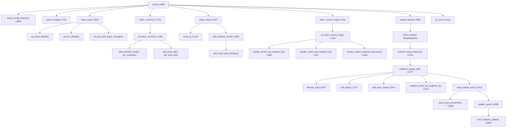
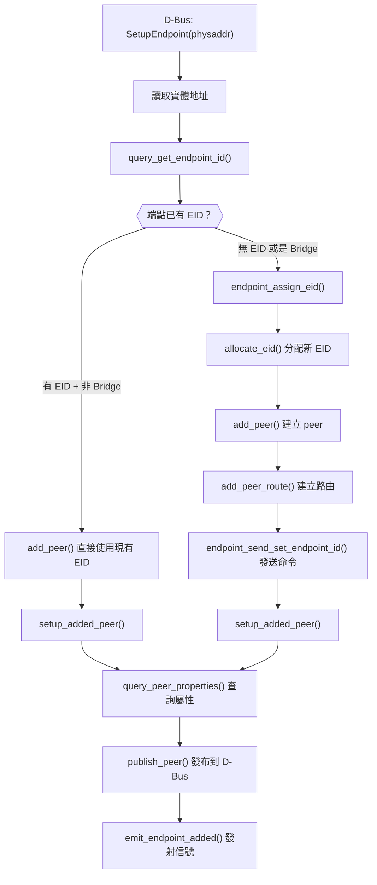

# mctpd Source Code 深度走讀

## 概述

本文件深入追蹤 mctpd（MCTP Bus Owner 守護程式）的主要程式碼流程，從 `main()` 到端點發現與 D-Bus 發布的完整呼叫鏈。mctpd 是 OpenBMC 中 MCTP 協定的核心服務，負責管理 MCTP 網路介面、端點探索、EID 分配和 D-Bus 物件發布。

> ⚠️ **簡化說明**：本文件聚焦於主要邏輯流程，省略了部分錯誤處理、日誌輸出和邊界條件。行號基於 source code 目錄 `src/`。完整實作請參閱 source code。

---

## 原始碼檔案總覽

| 檔案                                                  | 行數  | 核心職責                                                         |
| ----------------------------------------------------- | ----- | ---------------------------------------------------------------- |
| [`mctpd.c`](../../src/mctp/src/mctpd.c)               | 5070  | 守護程式核心：main、事件循環、控制命令處理、端點管理、D-Bus 介面 |
| [`mctp.c`](../../src/mctp/src/mctp.c)                 | 1447  | CLI 工具：`mctp link`/`addr`/`route`/`neigh` 管理                |
| [`mctp-netlink.c`](../../src/mctp/src/mctp-netlink.c) | ~1000 | Netlink 操作封裝：介面查詢、路由/鄰居管理、監聽變更              |
| [`mctp-netlink.h`](../../src/mctp/src/mctp-netlink.h) | ~200  | Netlink 操作 API 定義                                            |
| [`mctp-ops.c`](../../src/mctp/src/mctp-ops.c)         | ~250  | MCTP socket 操作封裝                                             |
| [`mctp-ops.h`](../../src/mctp/src/mctp-ops.h)         | ~50   | Socket 操作 API                                                  |
| [`mctp-util.c`](../../src/mctp/src/mctp-util.c)       | ~150  | 通用工具函式（hex dump、fd 操作等）                              |
| [`mctp.h`](../../src/mctp/src/mctp.h)                 | 113   | 核心資料結構定義（sockaddr_mctp、AF_MCTP 等）                    |

---

## 核心資料結構

理解 mctpd 程式碼的關鍵，在於先搞懂四個核心 struct：

### ctx — 全域上下文

📍 [`mctpd.c`](../../src/mctp/src/mctpd.c) L211-251

```c
struct ctx {
    sd_event *event;           // systemd 事件循環
    sd_bus *bus;               // D-Bus 連線

    mctp_nl *nl;               // Netlink 操作物件
    enum endpoint_role default_role;  // BMC 的預設角色（bus-owner/endpoint）

    struct peer **peers;       // 所有已知端點的動態陣列
    size_t num_peers;

    struct net **nets;         // 所有網路（一個 net = 一組 EID 空間）
    size_t num_nets;

    mctp_eid_t dyn_eid_min;   // 動態 EID 分配範圍
    mctp_eid_t dyn_eid_max;
    uint64_t mctp_timeout;    // MCTP 回應超時（微秒）
    uint8_t uuid[16];         // BMC 的 UUID
};
```

### peer — 端點

📍 [`mctpd.c`](../../src/mctp/src/mctpd.c) L140-209

```c
struct peer {
    uint32_t net;             // 所屬網路 ID
    mctp_eid_t eid;           // Endpoint ID
    dest_phys phys;           // 實體地址（ifindex + hwaddr）

    enum { REMOTE, LOCAL } state;  // 是遠端裝置還是本地 BMC
    bool published;           // 是否已發布到 D-Bus
    char *path;               // D-Bus 物件路徑

    uint8_t *message_types;   // 支援的 MCTP Message Types
    uint8_t *uuid;            // 端點 UUID
    uint32_t mtu;             // MTU 大小

    uint8_t pool_size;        // Bridge 的 EID pool 大小
    uint8_t pool_start;       // Bridge 的 EID pool 起始
    struct ctx *ctx;          // 反向引用全域上下文
};
```

### link — 網路介面

📍 [`mctpd.c`](../../src/mctp/src/mctpd.c) L126-140

```c
struct link {
    enum discovery_state discovered;  // 介面探索狀態
    bool published;                   // 是否已發布到 D-Bus
    int ifindex;                      // Linux 介面索引
    enum endpoint_role role;          // 此介面的角色

    char *path;                // D-Bus 物件路徑
    sd_bus_slot *slot_iface;   // D-Bus vtable slot
    sd_bus_slot *slot_busowner; // Bus Owner vtable slot
    struct ctx *ctx;           // 反向引用
};
```

### net — MCTP 網路

```c
struct net {
    uint32_t net;              // 網路 ID
    struct link **links;       // 此網路包含的介面
    size_t num_links;
    char *path;                // D-Bus 物件路徑
};
```

---

## 完整呼叫鏈總覽



> **逐步說明：**
>
> 1. **啟動**：`main()` 依序呼叫設定預設值、解析配置檔、初始化 D-Bus 和事件循環
> 2. **監聽**：`listen_monitor()` 註冊 Netlink 監聽器，即時追蹤介面和 EID 變化
> 3. **網路初始化**：`setup_nets()` 掃描系統上所有 MCTP 介面，建立 net/link 結構
> 4. **控制訊息**：`listen_control_msg()` 開啟 MCTP control socket，接收其他端點的控制命令
> 5. **D-Bus 服務**：`request_dbus()` 請求 well-known name，開始接受 D-Bus 方法呼叫
> 6. **端點探索**：當外部程式呼叫 `SetupEndpoint` 時，mctpd 分配 EID、建立路由、查詢屬性、發布 D-Bus 物件
>
> **白話總結**：mctpd 就像辦公大樓的「門衛」——開門（初始化）→ 註冊訪客系統（D-Bus）→ 監控大門（Netlink）→ 接收新訪客（控制訊息）→ 發身分證（EID）→ 登記到花名冊（D-Bus 發布）。

---

## 階段一：啟動與初始化

### main() — 入口點

📍 [`mctpd.c`](../../src/mctp/src/mctpd.c) L4990-5069

```c
int main(int argc, char **argv)
{
    struct ctx ctxi = { 0 }, *ctx = &ctxi;

    setup_config_defaults(ctx);    // 1. 設定預設值
    setup_ctrl_cmd_defaults(ctx);  // 2. 設定控制命令預設回應
    mctp_ops_init();               // 3. 初始化 socket 操作

    parse_args(ctx, argc, argv);   // 4. 解析命令列參數
    parse_config(ctx);             // 5. 解析 TOML 配置檔

    ctx->nl = mctp_nl_new(false);  // 6. 建立 Netlink 物件

    setup_bus(ctx);                // 7. 建立 D-Bus + 事件循環
    listen_monitor(ctx);           // 8. 監聽 Netlink 變更
    setup_nets(ctx);               // 9. 初始化所有 MCTP 網路
    listen_control_msg(ctx, MCTP_NET_ANY);  // 10. 監聽 MCTP 控制訊息
    request_dbus(ctx);             // 11. 請求 D-Bus 服務名稱

    sd_event_loop(ctx->event);     // 12. 進入事件循環（永久運行）

    // 清理資源（正常不會到這裡）
    free_links(ctx); free_peers(ctx); free_nets(ctx);
    free_config(ctx); mctp_nl_close(ctx->nl);
}
```

**關鍵點**：

| 步驟 | 行號  | 說明                                                                            |
| ---- | ----- | ------------------------------------------------------------------------------- |
| 7    | L5021 | D-Bus 必須在 `setup_nets()` **之前**設定，因為建立介面時需要同時建立 D-Bus 物件 |
| 8    | L5028 | 監聽必須在 `setup_nets()` **之前**啟動，避免漏掉初始化期間的介面變更            |
| 11   | L5047 | 在所有設定完成**之後**才請求 D-Bus name，因為客戶端可能立即發送請求             |

### setup_bus() — D-Bus 與事件循環初始化

📍 [`mctpd.c`](../../src/mctp/src/mctpd.c) L3942-4007

```c
static int setup_bus(struct ctx *ctx)
{
    sd_event_default(&ctx->event);   // ← 建立預設事件循環

    // 註冊 SIGTERM/SIGINT 信號處理
    sd_event_add_signal(ctx->event, NULL, SIGTERM, NULL, NULL);
    sd_event_add_signal(ctx->event, NULL, SIGINT, NULL, NULL);

    sd_bus_default(&ctx->bus);       // ← 連接系統 D-Bus
    sd_bus_attach_event(ctx->bus, ctx->event, ...);  // ← 將 D-Bus 附加到事件循環

    sd_bus_add_object_manager(ctx->bus, NULL, MCTP_DBUS_PATH);
    sd_bus_add_object_vtable(ctx->bus, NULL, MCTP_DBUS_PATH,
                             MCTP_DBUS_NAME, mctp_base_vtable, ctx);
}
```

**設計意義**：使用 `sd_event` + `sd_bus` 的組合，讓 D-Bus 訊息處理、Netlink 監聽、MCTP socket I/O 全部在同一個事件循環中運行，避免多執行緒複雜度。

---

## 階段二：配置解析

### parse_config() — TOML 配置檔解析

📍 [`mctpd.c`](../../src/mctp/src/mctpd.c) L4732-4793

配置檔路徑：`/etc/mctpd.conf`（TOML 格式）

```
解析流程：
1. 開啟 TOML 檔案
2. parse_config_mctp() — 解析 [mctp] 區段
   - uuid：BMC 的 UUID
   - message_timeout_ms：MCTP 回應超時
3. parse_config_bus_owner() — 解析 [bus_owner] 區段
   - mode：角色（bus-owner / endpoint）
   - eid_range：動態 EID 分配範圍
   - max_pool_size：Bridge pool 最大值
```

**設計意義**：所有運行時行為都可透過配置檔調整，不需重新編譯。

---

## 階段三：網路初始化

### setup_nets() — 掃描系統 MCTP 介面

📍 [`mctpd.c`](../../src/mctp/src/mctpd.c) L4519-4545

```c
static int setup_nets(struct ctx *ctx)
{
    int *ifs = mctp_nl_if_list(ctx->nl, &num_ifs);  // ← 透過 Netlink 列舉所有 MCTP 介面
    for (size_t i = 0; i < num_ifs; i++) {
        add_interface_local(ctx, ifs[i]);  // ← 為每個介面建立 link/net 結構
    }
}
```

### add_interface_local() → add_interface() → add_net()

這組函式建立 mctpd 的內部世界模型：

```
add_interface_local(ifindex):
  1. 透過 Netlink 查詢此介面的 net ID
  2. add_net(net_id) — 若 net 不存在則建立
  3. add_interface(ifindex) — 建立 link 結構
     a. 從配置決定介面角色（bus-owner / endpoint）
     b. 建立 D-Bus interface 物件
     c. 如果是 bus-owner，加掛 bus_link_owner_vtable（含 SetupEndpoint 方法）
     d. emit_interface_added() — 發射 InterfacesAdded 信號
  4. 為此介面的所有本地 EID 建立 LOCAL peer
```

**白話總結**：就像開店前巡視場地——查看有幾個入口（介面），每個入口屬於哪條街（net），然後為每個入口掛上接待台（D-Bus vtable）。

---

## 階段四：Netlink 監聽

### listen_monitor() → cb_listen_monitor()

📍 [`mctpd.c`](../../src/mctp/src/mctpd.c) L1280-1377

mctpd 向核心註冊 Netlink RTNL 監聽，即時追蹤以下變更：

| 事件類型              | 處理函式                                           | 說明                |
| --------------------- | -------------------------------------------------- | ------------------- |
| `MCTP_NL_ADD_LINK`    | `add_interface_local()`                            | 新的 MCTP 介面出現  |
| `MCTP_NL_DEL_LINK`    | `del_interface()`                                  | 介面被移除          |
| `MCTP_NL_CHANGE_NET`  | `add_interface_local()` + `change_net_interface()` | 介面的 net ID 改變  |
| `MCTP_NL_CHANGE_NAME` | `rename_interface()`                               | 介面名稱改變        |
| `MCTP_NL_ADD_EID`     | `add_local_eid()`                                  | 新的本地 EID 被加入 |
| `MCTP_NL_DEL_EID`     | `del_local_eid()`                                  | 本地 EID 被移除     |

**設計意義**：mctpd 不需要輪詢核心狀態，而是透過 Netlink 監聽**被動接收**變更通知。這是 Linux 網路子系統的標準模式。

---

## 階段五：控制訊息處理

### listen_control_msg() → cb_listen_control_msg()

📍 [`mctpd.c`](../../src/mctp/src/mctpd.c) L1148-1234

mctpd 開啟一個 MCTP socket（Type = 0，即控制訊息），當收到其他端點的控制請求時：

```c
switch (ctrl_msg->command_code) {
case MCTP_CTRL_CMD_SET_ENDPOINT_ID:       // ← 被動分配 EID
    handle_control_set_endpoint_id();
case MCTP_CTRL_CMD_GET_ENDPOINT_ID:       // ← 查詢 BMC 的 EID
    handle_control_get_endpoint_id();
case MCTP_CTRL_CMD_GET_ENDPOINT_UUID:     // ← 查詢 BMC 的 UUID
    handle_control_get_endpoint_uuid();
case MCTP_CTRL_CMD_GET_MESSAGE_TYPE_SUPPORT:  // ← 查詢支援的 Message Types
    handle_control_get_message_type_support();
case MCTP_CTRL_CMD_PREPARE_ENDPOINT_DISCOVERY:  // ← 準備端點探索
    handle_control_prepare_endpoint_discovery();
case MCTP_CTRL_CMD_ENDPOINT_DISCOVERY:    // ← 端點探索（回報已知端點）
    handle_control_endpoint_discovery();
}
```

**白話總結**：這是 mctpd 的「被動模式」——等待外部裝置主動來詢問或要求分配。與階段六的「主動模式」互補。

---

## 階段六：端點探索（主動模式）

### method_setup_endpoint() — D-Bus 觸發的主動探索

📍 [`mctpd.c`](../../src/mctp/src/mctpd.c) L2524-2642

這是 mctpd **最重要的函式之一**，由外部程式（如 pldmd）透過 D-Bus 呼叫觸發：



> **逐步說明：**
>
> 1. **讀取實體地址**（L2541-2553）：從 D-Bus 呼叫中讀取 `physaddr`（如 I2C 地址）
> 2. **查詢端點 EID**（L2562）：先問端點「你有 EID 嗎？」（Get Endpoint ID）
> 3. **決策路徑**（L2589-2621）：
>    - 已有 EID → 直接使用（避免不必要的重新分配）
>    - 無 EID 或需重新配置 → `endpoint_assign_eid()` 分配新 EID
> 4. **分配 EID**（L2077-2188）：
>    a. `allocate_eid()` — 從動態範圍找一個未使用的 EID
>    b. `add_peer()` — 在 peers 陣列中建立新的 peer 結構
>    c. `add_peer_route()` — 透過 Netlink 建立 kernel route（**必須在 Set EID 之前**）
>    d. `endpoint_send_set_endpoint_id()` — 發送 MCTP 控制命令告訴端點新 EID
> 5. **設定 peer**（L2912-2942）：
>    a. `query_peer_properties()` — 查詢 Message Types 和 UUID
>    b. `publish_peer()` — 建立 D-Bus 物件並發射 `InterfacesAdded` 信號
>
> **白話總結**：就像辦公大樓的門衛處理新訪客——確認身分（Get EID）→ 發門禁卡（Set EID）→ 登記到門禁系統（add_peer）→ 設定通行路線（route）→ 登記到訪客名冊（D-Bus publish）。

---

## 階段七：D-Bus 介面與物件發布

### publish_peer() — 發布端點到 D-Bus

📍 [`mctpd.c`](../../src/mctp/src/mctpd.c) L2999-3034

```c
static int publish_peer(struct peer *peer)
{
    // D-Bus 路徑：/au/com/codeconstruct/mctp1/networks/{net}/endpoints/{eid}
    asprintf(&peer->path, "%s/networks/%d/endpoints/%d",
             MCTP_DBUS_PATH, peer->net, peer->eid);

    // 掛載 OpenBMC 標準介面
    sd_bus_add_object_vtable(bus, ..., peer->path,
        MCTP_DBUS_IFACE_ENDPOINT,   // xyz.openbmc_project.MCTP.Endpoint
        bus_endpoint_obmc_vtable, peer);

    // 掛載 CodeConstruct 擴充介面
    sd_bus_add_object_vtable(bus, ..., peer->path,
        CC_MCTP_DBUS_IFACE_ENDPOINT,  // au.com.codeconstruct.MCTP.Endpoint1
        bus_endpoint_cc_vtable, peer);

    // 如果有 UUID，掛載 UUID 介面
    if (peer->uuid)
        sd_bus_add_object_vtable(bus, ..., peer->path,
            OPENBMC_IFACE_COMMON_UUID,    // xyz.openbmc_project.Common.UUID
            bus_endpoint_uuid_vtable, peer);

    emit_endpoint_added(peer);  // ← 發射 InterfacesAdded 信號
}
```

### D-Bus vtable 定義的屬性

每個端點 D-Bus 物件暴露以下屬性：

| 介面                                  | 屬性                    | 說明                                       |
| ------------------------------------- | ----------------------- | ------------------------------------------ |
| `xyz.openbmc_project.MCTP.Endpoint`   | `NetworkId`             | 網路 ID                                    |
|                                       | `EID`                   | Endpoint ID                                |
|                                       | `SupportedMessageTypes` | 支援的 Message Types（如 PLDM=1）          |
| `au.com.codeconstruct.MCTP.Endpoint1` | `Connectivity`          | 連線狀態（Available/Degraded/Unavailable） |
|                                       | `SetMTU`                | 設定 MTU 方法                              |
|                                       | `Remove`                | 移除端點方法                               |
|                                       | `Recover`               | 恢復端點方法                               |
| `xyz.openbmc_project.Common.UUID`     | `UUID`                  | 端點 UUID                                  |

---

## 重要設計模式

### 1. 單一事件循環（Single Event Loop）

```
mctpd 使用 sd_event 事件循環，將所有 I/O 源統一管理：
- Netlink socket（介面/路由/EID 變更）
- MCTP control socket（控制命令）
- D-Bus（外部方法呼叫）
- 信號（SIGTERM/SIGINT）

全部在單一執行緒中處理，避免多執行緒同步問題。
```

### 2. Route-Before-Set-EID（先建路由再分配 EID）

```
endpoint_assign_eid() 中，add_peer_route() 在 endpoint_send_set_endpoint_id() 之前執行。
原因：端點收到 Set Endpoint ID 後可能立即開始通訊，
如果此時 kernel 還沒有路由，訊息會被丟棄。
```

### 3. Physaddr 一致性（Physical Address Identity）

```
mctpd 用實體地址（ifindex + hwaddr）作為端點的唯一識別：
- find_peer_by_phys() — 用實體地址查找 peer
- 即使 EID 改變，同一實體地址仍對應同一端點
- 這解決了「EID 被重新分配」的問題
```

### 4. 延遲釋放（Deferred Free）

```c
// dfree() L449：在「下一個」事件循環迭代中釋放記憶體
// 避免在 callback 中釋放正在使用的物件
static void *dfree(void *ptr) {
    sd_event_add_defer(ctx->event, &src, defer_free_handler, ptr);
    sd_event_source_set_enabled(src, SD_EVENT_ONESHOT);
}
```

### 5. Bridge Pool 管理

```
當端點回報自己是 Bridge（ep_type 包含 BRIDGE flag），mctpd 會：
1. 分配一段連續的 EID 範圍（pool）給它
2. Bridge 再用 Allocate Endpoint IDs 命令分配給下游端點
3. 這實現了 MCTP 的階層式 EID 管理
```

---

## 下一步

- 了解 [MCTP 協定概述](MCTPOverview.md) 理解 MCTP 基本概念
- 查看 [端點探索](EndpointDiscovery.md) 了解探索流程細節
- 閱讀 [D-Bus 介面](EndpointAPI.md) 了解完整 D-Bus API
- 參考 [核心架構](Architecture.md) 了解 Kernel Stack 搭配

---

> 📖 **Source Code**：[CodeConstruct/mctp](https://github.com/CodeConstruct/mctp)
