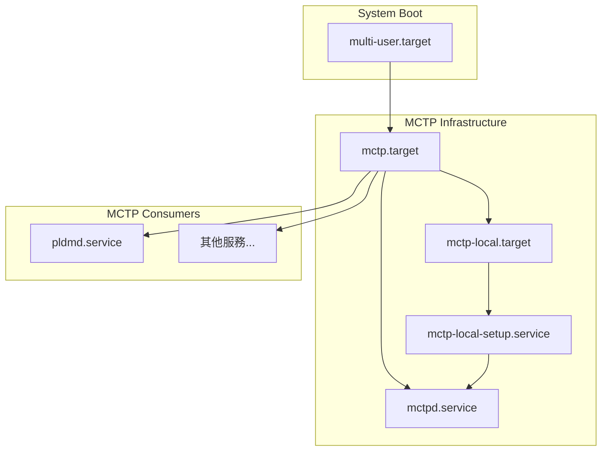

# Systemd 整合 (Systemd Integration)

本文說明如何將 mctpd 與 systemd 整合，包含服務定義、target 配置和啟動順序。

---

## 服務檔案

### mctpd.service

mctpd 的 systemd 服務定義：

```ini
# /lib/systemd/system/mctpd.service
[Unit]
Description=MCTP control protocol daemon
Wants=mctp-local.target
After=mctp-local.target

[Service]
Type=dbus
BusName=au.com.codeconstruct.MCTP1
ExecStart=/usr/sbin/mctpd

[Install]
WantedBy=mctp.target
```

**說明**：

| 欄位                      | 說明                                               |
| ------------------------- | -------------------------------------------------- |
| `Type=dbus`               | D-Bus 啟動類型，當服務取得 bus name 後視為啟動完成 |
| `BusName`                 | mctpd 的 D-Bus 服務名稱                            |
| `After=mctp-local.target` | 等待本地 MCTP 設定完成後才啟動                     |
| `WantedBy=mctp.target`    | 作為 mctp.target 的依賴                            |

### mctp.target

MCTP 基礎設施的 target：

```ini
# /lib/systemd/system/mctp.target
[Unit]
Description=MCTP infrastructure active
Wants=mctp-local.target

[Install]
WantedBy=multi-user.target
```

**說明**：

- 表示 MCTP 基礎設施已就緒
- 其他需要 MCTP 的服務可以 `After=mctp.target`

---

## 啟動順序



> **逐步說明：**
>
> 這張圖展示 MCTP 相關服務在 systemd 中的啟動順序：
>
> 1. **multi-user.target**：系統正常開機完成後的目標。
> 2. **mctp.target**：所有 MCTP 基礎設施就緒的「里程碑」。其他需要 MCTP 的服務（如 pldmd）都等待這個 target。
> 3. **mctp-local.target**：本地 MCTP 設定完成的「里程碑」。
> 4. **mctp-local-setup.service**：（由平台廠商提供）負責設定 MCTP 介面、分配本地 EID 等。這個服務必須先完成，mctpd 才能啟動。
> 5. **mctpd.service**：MCTP 控制協議守護程式，在本地設定完成後啟動。
> 6. **pldmd.service 和其他服務**：在 `mctp.target` 就緒後才啟動，確保 MCTP 通訊已可用。
>
> **白話總結**：啟動順序是「先設定硬體 → 再啟動 mctpd → 最後啟動上層服務」，就像蓋房子要先打地基（硬體設定）、再蓋結構（mctpd）、最後裝潢入住（pldmd 等）。

### 啟動階段

1. **mctp-local-setup.service**（可選，由平台提供）
   - 設定本地 MCTP 介面
   - 分配本地 EID
   - 設定 bus-owner 地址

2. **mctp-local.target**（專案已附帶於 `conf/mctp-local.target`）
   - 表示本地 MCTP 堆疊已配置

3. **mctpd.service**
   - 啟動 MCTP 控制協議守護程式
   - 開始提供 D-Bus 服務

4. **mctp.target**
   - 表示 MCTP 基礎設施完全就緒

---

## 本地設定服務

雖然 mctp-local-setup.service 不包含在專案中，但通常需要一個平台特定的設定腳本：

> [!NOTE]
> `mctp-local.target` 已包含在專案的 `conf/` 目錄中，但 `mctp-local-setup.service` 需要由各平台自行提供。

### mctp-local-setup.service 範例

```ini
# /lib/systemd/system/mctp-local-setup.service
[Unit]
Description=MCTP local stack setup
Before=mctp-local.target
BindsTo=mctp-local.target

[Service]
Type=oneshot
RemainAfterExit=yes
ExecStart=/usr/libexec/mctp-local-setup

[Install]
WantedBy=mctp-local.target
```

### 設定腳本範例

```bash
#!/bin/bash
# /usr/libexec/mctp-local-setup

# 等待 MCTP 介面出現
while [ ! -e /sys/class/net/mctpi2c1 ]; do
    sleep 0.1
done

# 啟用介面
mctp link set mctpi2c1 up

# 設定網路 ID
mctp link set mctpi2c1 network 1

# 設定 bus-owner 地址（I2C slave address）
mctp link set mctpi2c1 bus-owner 0x10

# 分配本地 EID
mctp address add 8 dev mctpi2c1

echo "MCTP local setup complete"
```

---

## 安裝服務

### 手動安裝

```bash
# 複製服務檔案
sudo cp conf/mctpd.service /lib/systemd/system/
sudo cp conf/mctp.target /lib/systemd/system/

# 重新載入 systemd
sudo systemctl daemon-reload

# 啟用服務
sudo systemctl enable mctpd.service
sudo systemctl enable mctp.target
```

### 使用 Meson 安裝

服務檔案位於 `conf/` 目錄，但預設不安裝：

```bash
# 手動複製
sudo cp obj/../conf/mctpd.service /lib/systemd/system/
```

---

## 服務管理

### 啟動服務

```bash
# 啟動 mctpd
sudo systemctl start mctpd

# 啟動完整 MCTP 堆疊
sudo systemctl start mctp.target
```

### 停止服務

```bash
sudo systemctl stop mctpd
```

### 重啟服務

```bash
sudo systemctl restart mctpd
```

### 查看狀態

```bash
$ sudo systemctl status mctpd
● mctpd.service - MCTP control protocol daemon
     Loaded: loaded (/lib/systemd/system/mctpd.service; enabled)
     Active: active (running)
   Main PID: 1234 (mctpd)
      Tasks: 1 (limit: 4915)
     Memory: 1.2M
     CGroup: /system.slice/mctpd.service
             └─1234 /usr/sbin/mctpd
```

### 查看日誌

```bash
# 即時日誌
sudo journalctl -u mctpd -f

# 最近日誌
sudo journalctl -u mctpd --since "5 minutes ago"

# 啟動以來的日誌
sudo journalctl -u mctpd -b
```

---

## D-Bus 啟動

mctpd 使用 `Type=dbus`，表示：

1. systemd 等待服務取得 D-Bus bus name
2. 一旦 `au.com.codeconstruct.MCTP1` 可用，服務視為啟動完成
3. 其他依賴此服務的服務可以開始

### D-Bus 配置（可選）

如果需要額外的 D-Bus 政策：

```xml
<!-- conf/mctpd-dbus.conf -->
<?xml version="1.0"?> <!--*-nxml-*-->
<!DOCTYPE busconfig PUBLIC "-//freedesktop//DTD D-BUS Bus Configuration 1.0//EN"
        "http://www.freedesktop.org/standards/dbus/1.0/busconfig.dtd">
<busconfig>
 <policy user="root">
  <allow own="au.com.codeconstruct.MCTP1"/>
  <allow send_destination="au.com.codeconstruct.MCTP1"/>
  <allow receive_sender="au.com.codeconstruct.MCTP1"/>
 </policy>
</busconfig>
```

> [!NOTE]
> 此檔案已包含在專案的 `conf/mctpd-dbus.conf` 中，可安裝至 `/etc/dbus-1/system.d/`。

---

## OpenBMC 整合

在 OpenBMC 中，這些服務通常由 Yocto recipe 安裝：

### Recipe 設定

```bitbake
# 安裝 systemd 服務
SYSTEMD_SERVICE:${PN} = "mctpd.service"
SYSTEMD_AUTO_ENABLE = "enable"
```

### 相依性

```bitbake
DEPENDS += "systemd"
RDEPENDS:${PN} += "libsystemd"
```

---

## 疑難排解

### 服務無法啟動

```bash
# 查看詳細錯誤
sudo journalctl -u mctpd -n 50

# 常見問題：
# - 配置檔案錯誤
# - D-Bus 權限問題
# - libsystemd 版本不足
```

### D-Bus 名稱衝突

```bash
# 檢查是否有其他程序佔用 bus name
busctl list | grep MCTP
```

### 啟動順序問題

```bash
# 檢查相依性
systemctl list-dependencies mctpd.service

# 確認 target 狀態
systemctl status mctp-local.target
```

---

## 相關文件

- [MctpdDaemon](MctpdDaemon.md) - mctpd 守護程式
- [Configuration](Configuration.md) - 配置指南
- [QuickStart](QuickStart.md) - 快速入門

---

[← 返回首頁](Home.md)
