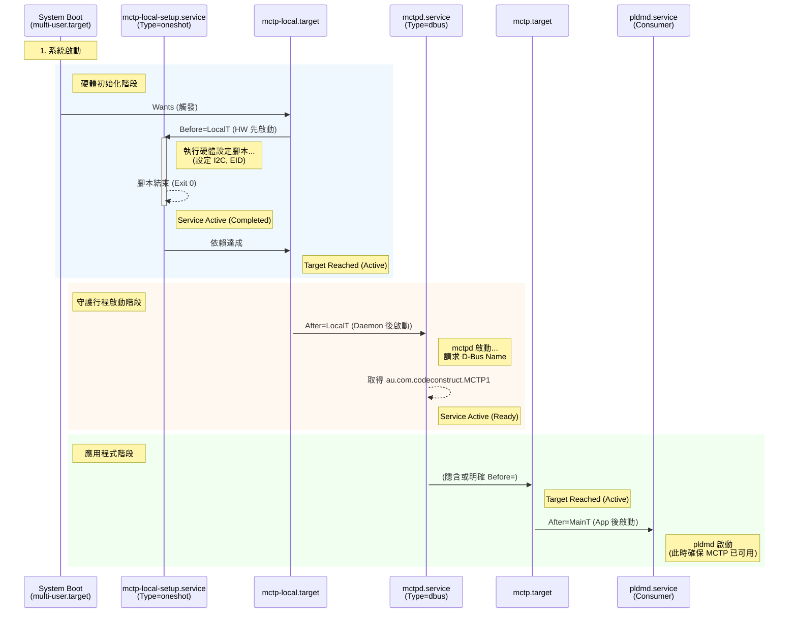

# Systemd 整合 (Systemd Integration)

本文說明如何將 mctpd 與 systemd 整合，包含服務定義、target 配置和啟動順序。

---

## 服務檔案

### mctpd.service

mctpd 的 systemd 服務定義：

```ini
# /lib/systemd/system/mctpd.service
[Unit]
Description=MCTP control protocol daemon
Wants=mctp-local.target
After=mctp-local.target

[Service]
Type=dbus
BusName=au.com.codeconstruct.MCTP1
ExecStart=/usr/sbin/mctpd

[Install]
WantedBy=mctp.target
```

**說明**：

| 欄位                      | 說明                                               |
| ------------------------- | -------------------------------------------------- |
| `Type=dbus`               | D-Bus 啟動類型，當服務取得 bus name 後視為啟動完成 |
| `BusName`                 | mctpd 的 D-Bus 服務名稱                            |
| `After=mctp-local.target` | 等待本地 MCTP 設定完成後才啟動                     |
| `WantedBy=mctp.target`    | 作為 mctp.target 的依賴                            |

### mctp.target

MCTP 基礎設施的 target：

```ini
# /lib/systemd/system/mctp.target
[Unit]
Description=MCTP infrastructure active
Wants=mctp-local.target

[Install]
WantedBy=multi-user.target
```

**說明**：

- 表示 MCTP 基礎設施已就緒
- 其他需要 MCTP 的服務可以 `After=mctp.target`

---

## 啟動順序與完成狀態 (Start Order vs. Active State)

Systemd 的依賴管理核心在於區分「啟動指令發出 (Start Job)」與「服務就緒 (Active State)」。正確理解兩者的區別，是避免依賴問題（如 pldmd 啟動失敗）的關鍵。

### 重要觀念：啟動 vs. 完成

| 階段                    | 定義                                                          | Systemd 指令對應                                                                      |
| :---------------------- | :------------------------------------------------------------ | :------------------------------------------------------------------------------------ |
| **啟動順序 (Ordering)** | 決定 Systemd **何時發出啟動指令**。                           | `After=`, `Before=`                                                                   |
| **完成狀態 (Active)**   | 決定 Systemd **何時判定該服務已就緒**，解除對後續依賴的阻塞。 | `Type=oneshot` (腳本結束)<br>`Type=dbus` (Bus Name 出現)<br>`Type=notify` (sd_notify) |

> [!IMPORTANT]
> **為什麼 Type 很重要？**
> 若服務配置為 `Type=simple` (預設)，Systemd 會在發出 fork 指令後**立即**視為完成 (Active)。若後續服務真的需要該服務完全初始化（例如 socket 綁定或 DBus 註冊完畢），就可能發生 Race Condition。因此 mctpd 使用 `Type=dbus` 至關重要，這保證了後續依賴者啟動時，MCTP D-Bus 服務絕對可用。

### 時序圖解

以下時序圖展示了從 Systemd 啟動到上層應用可用的完整流程，清楚標示了「等待」發生的時刻與「就緒」的條件：



### 依賴鏈解析

1.  **硬體設定 (HW Setup)**：
    - `mctp-local-setup.service` (`Type=oneshot`) 必須執行完畢（Exit code 0），Systemd 才會認為它 "Active"。
    - `mctp-local.target` 等待 setup 完成後，狀態轉為 "Reached"。
    - **意義**：確保在啟動 daemon 之前，硬體介面（如 I2C）已經存在且設定正確。

2.  **守護行程 (Daemon)**：
    - `mctpd.service` 設定了 `After=mctp-local.target`，所以直到 Target Reached 才會被執行啟動指令。
    - 關鍵點：`Type=dbus`。Systemd 會**一直等待**直到 D-Bus 上出現 `au.com.codeconstruct.MCTP1` 這個名稱，才將 `mctpd.service` 標記為 "Active"。
    - **意義**：確保當依賴它的服務啟動時，呼叫 D-Bus 方法不會失敗。

3.  **上層應用 (Consumer)**：
    - `pldmd` 等服務設定 `After=mctp.target`。
    - **安全建議**：為了確保絕對安全，建議檢查 `mctpd.service` 是否有 `Before=mctp.target`，或者讓 Consumer 直接 `After=mctpd.service`。若僅依賴 Target，需確認 Target 與 Service 間有明確的 Ordering 關係，否則理論上 `mctp.target` 可能在 `mctpd` 還在初始化的微小時間窗口內就 Reached 了。

---

## 本地設定服務

雖然 mctp-local-setup.service 不包含在專案中，但通常需要一個平台特定的設定腳本：

> [!NOTE]
> `mctp-local.target` 已包含在專案的 `conf/` 目錄中，但 `mctp-local-setup.service` 需要由各平台自行提供。

### mctp-local-setup.service 範例

```ini
# /lib/systemd/system/mctp-local-setup.service
[Unit]
Description=MCTP local stack setup
Before=mctp-local.target
BindsTo=mctp-local.target

[Service]
Type=oneshot
RemainAfterExit=yes
ExecStart=/usr/libexec/mctp-local-setup

[Install]
WantedBy=mctp-local.target
```

### 設定腳本範例

```bash
#!/bin/bash
# /usr/libexec/mctp-local-setup

# 等待 MCTP 介面出現
while [ ! -e /sys/class/net/mctpi2c1 ]; do
    sleep 0.1
done

# 啟用介面
mctp link set mctpi2c1 up

# 設定網路 ID
mctp link set mctpi2c1 network 1

# 設定 bus-owner 地址（I2C slave address）
mctp link set mctpi2c1 bus-owner 0x10

# 分配本地 EID
mctp address add 8 dev mctpi2c1

echo "MCTP local setup complete"
```

---

## 安裝服務

### 手動安裝

```bash
# 複製服務檔案
sudo cp conf/mctpd.service /lib/systemd/system/
sudo cp conf/mctp.target /lib/systemd/system/

# 重新載入 systemd
sudo systemctl daemon-reload

# 啟用服務
sudo systemctl enable mctpd.service
sudo systemctl enable mctp.target
```

### 使用 Meson 安裝

服務檔案位於 `conf/` 目錄，但預設不安裝：

```bash
# 手動複製
sudo cp obj/../conf/mctpd.service /lib/systemd/system/
```

---

## 服務管理

### 啟動服務

```bash
# 啟動 mctpd
sudo systemctl start mctpd

# 啟動完整 MCTP 堆疊
sudo systemctl start mctp.target
```

### 停止服務

```bash
sudo systemctl stop mctpd
```

### 重啟服務

```bash
sudo systemctl restart mctpd
```

### 查看狀態

```bash
$ sudo systemctl status mctpd
● mctpd.service - MCTP control protocol daemon
     Loaded: loaded (/lib/systemd/system/mctpd.service; enabled)
     Active: active (running)
   Main PID: 1234 (mctpd)
      Tasks: 1 (limit: 4915)
     Memory: 1.2M
     CGroup: /system.slice/mctpd.service
             └─1234 /usr/sbin/mctpd
```

### 查看日誌

```bash
# 即時日誌
sudo journalctl -u mctpd -f

# 最近日誌
sudo journalctl -u mctpd --since "5 minutes ago"

# 啟動以來的日誌
sudo journalctl -u mctpd -b
```

---

## D-Bus 啟動

mctpd 使用 `Type=dbus`，表示：

1. systemd 等待服務取得 D-Bus bus name
2. 一旦 `au.com.codeconstruct.MCTP1` 可用，服務視為啟動完成
3. 其他依賴此服務的服務可以開始

### D-Bus 配置（可選）

如果需要額外的 D-Bus 政策：

```xml
<!-- conf/mctpd-dbus.conf -->
<?xml version="1.0"?> <!--*-nxml-*-->
<!DOCTYPE busconfig PUBLIC "-//freedesktop//DTD D-BUS Bus Configuration 1.0//EN"
        "http://www.freedesktop.org/standards/dbus/1.0/busconfig.dtd">
<busconfig>
 <policy user="root">
  <allow own="au.com.codeconstruct.MCTP1"/>
  <allow send_destination="au.com.codeconstruct.MCTP1"/>
  <allow receive_sender="au.com.codeconstruct.MCTP1"/>
 </policy>
</busconfig>
```

> [!NOTE]
> 此檔案已包含在專案的 `conf/mctpd-dbus.conf` 中，可安裝至 `/etc/dbus-1/system.d/`。

---

## OpenBMC 整合

在 OpenBMC 中，這些服務通常由 Yocto recipe 安裝：

### Recipe 設定

```bitbake
# 安裝 systemd 服務
SYSTEMD_SERVICE:${PN} = "mctpd.service"
SYSTEMD_AUTO_ENABLE = "enable"
```

### 相依性

```bitbake
DEPENDS += "systemd"
RDEPENDS:${PN} += "libsystemd"
```

---

## 疑難排解

### 服務無法啟動

```bash
# 查看詳細錯誤
sudo journalctl -u mctpd -n 50

# 常見問題：
# - 配置檔案錯誤
# - D-Bus 權限問題
# - libsystemd 版本不足
```

### D-Bus 名稱衝突

```bash
# 檢查是否有其他程序佔用 bus name
busctl list | grep MCTP
```

### 啟動順序問題

```bash
# 檢查相依性
systemctl list-dependencies mctpd.service

# 確認 target 狀態
systemctl status mctp-local.target
```

---

## 依賴分析與除錯 (Dependency Analysis & Troubleshooting)

### 反向依賴樹 (Reverse Dependency Tree)

當我們想知道「如果不啟動 `mctp-local.target`，會有誰受到影響？」時，可以使用 `systemctl list-dependencies --reverse` 指令。這有助於理解服務在系統中的影響範圍。

```bash
root@bmc:~# systemctl list-dependencies mctp-local.target --reverse
mctp-local.target
● ├─mctpd.service
● └─mctp.target
●   └─multi-user.target
```

**解讀：**

1.  **`mctpd.service`**：依賴 `mctp-local.target`（需要本地硬體就緒）。
2.  **`mctp.target`**：也依賴 `mctp-local.target`（基礎設施包含本地部分）。
3.  **`multi-user.target`**：最終依賴 `mctp.target`，代表系統完全啟動包含 MCTP 功能。

### 重要指令比較：`cat` vs `systemctl cat`

在 OpenBMC 環境中，這是最容易讓人困惑的地方。**永遠優先使用 `systemctl cat`**，而非直接 `cat` 檔案。

| 指令                                    | 顯示內容                                                    | 適用場景                             |
| :-------------------------------------- | :---------------------------------------------------------- | :----------------------------------- |
| `cat /lib/systemd/system/mctpd.service` | 僅顯示**最原始的 Unit 檔案**內容。                          | 檢視上游原始碼定義。                 |
| `systemctl cat mctpd.service`           | 顯示**原始檔案 + 所有 Drop-in 設定 (`.conf`)** 的最終結果。 | **除錯、確認實際運作行為（推薦）。** |

#### 為什麼輸出不同？

Systemd 允許透過 `mctpd.service.d/*.conf` 目錄下的檔案來「增補」設定，而不需要修改原始檔案。這在 OpenBMC 的 Yocto 架構中非常常見（例如：由不同 Layer 注入特定的平台設定）。

**範例分析：**

```ini
# systemctl cat mctpd.service 的輸出範例

# 1. 原始定義 (來自 /lib/systemd/system/mctpd.service)
[Unit]
Description=MCTP control protocol daemon
Wants=mctp-local.target
After=mctp-local.target

# ... (省略) ...

# 2. 增補設定 A (來自 setup-local-eid.conf)
# 這裡注入了對 Entity Manager 的依賴！
[Unit]
After=xyz.openbmc_project.EntityManager.service
Requires=xyz.openbmc_project.EntityManager.service

[Service]
ExecStartPre=-/usr/libexec/mctp/mctp-config

# 3. 增補設定 B (來自 wantedby.conf)
# 這裡定義了 pldmd 需要它
[Install]
WantedBy=pldmd.service
```

> [!WARNING]
> **隱藏的依賴陷阱**
> 如果只看原始檔案，你永遠不會知道 `mctpd` 其實依賴 `EntityManager`。這就是為什麼「直接 cat 檔案」可能導致除錯方向錯誤的主因。

---

## 相關文件

- [MctpdDaemon](MctpdDaemon.md) - mctpd 守護程式
- [Configuration](Configuration.md) - 配置指南
- [QuickStart](QuickStart.md) - 快速入門

---

[← 返回首頁](Home.md)
