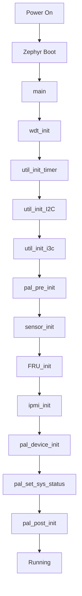

# Architecture（系統架構）

本文說明 OpenBIC 的整體系統架構、軟體堆疊設計，以及 yv4-sd 平台的架構特點。

---

## 系統架構總覽

OpenBIC 採用**分層式架構**設計，將平台特定程式碼與通用程式碼分離：

```
┌─────────────────────────────────────────────────────────────────┐
│                        Application Layer                        │
│  ┌─────────────┐ ┌─────────────┐ ┌─────────────┐               │
│  │ Platform    │ │ IPMI/PLDM   │ │ Sensor      │               │
│  │ Specific    │ │ Handlers    │ │ Polling     │               │
│  │ (plat_*)    │ │             │ │             │               │
│  └─────────────┘ └─────────────┘ └─────────────┘               │
├─────────────────────────────────────────────────────────────────┤
│                         Service Layer                           │
│  ┌──────────┐ ┌──────────┐ ┌──────────┐ ┌──────────┐          │
│  │  MCTP    │ │  PLDM    │ │  IPMI    │ │  IPMB    │          │
│  └──────────┘ └──────────┘ └──────────┘ └──────────┘          │
├─────────────────────────────────────────────────────────────────┤
│                           HAL Layer                             │
│  ┌──────────┐ ┌──────────┐ ┌──────────┐ ┌──────────┐          │
│  │  GPIO    │ │  I2C     │ │  I3C     │ │  SPI     │          │
│  └──────────┘ └──────────┘ └──────────┘ └──────────┘          │
├─────────────────────────────────────────────────────────────────┤
│                         Zephyr RTOS                             │
│  ┌──────────────────────────────────────────────────────────┐  │
│  │  Kernel • Threads • IPC • Device Drivers • Logging       │  │
│  └──────────────────────────────────────────────────────────┘  │
├─────────────────────────────────────────────────────────────────┤
│                      Hardware (AST1030)                         │
│  ┌──────────────────────────────────────────────────────────┐  │
│  │  ARM Cortex-M4F • Flash • SRAM • Peripherals             │  │
│  └──────────────────────────────────────────────────────────┘  │
└─────────────────────────────────────────────────────────────────┘
```

---

## 軟體堆疊

### 1. Zephyr RTOS 層

OpenBIC 基於 **Zephyr RTOS** 構建，使用 CMSIS RTOS API 作為 RTOS 包裝層，實現 RTOS 無關設計：

```c
// prj.conf 配置
CONFIG_CMSIS_RTOS_V2=y
CONFIG_NUM_PREEMPT_PRIORITIES=56
CONFIG_HEAP_MEM_POOL_SIZE=32768
```

**主要使用的 Zephyr 功能：**

| 功能 | 說明 |
|------|------|
| **Kernel** | 線程管理、排程 |
| **I2C/I3C** | 通訊介面驅動 |
| **GPIO** | 通用輸入輸出 |
| **SPI/Flash** | 儲存存取 |
| **Logging** | 日誌記錄 |
| **Shell** | 除錯命令列 |

### 2. HAL（硬體抽象層）

HAL 層提供與硬體交互的抽象介面：

| 模組 | 檔案 | 說明 |
|------|------|------|
| GPIO | `hal_gpio.c/h` | GPIO 初始化、讀寫、中斷 |
| I2C | `hal_i2c.c/h` | I2C master 操作 |
| I2C Target | `hal_i2c_target.c/h` | I2C slave 模式 |
| I3C | `hal_i3c.c/h` | I3C 操作、DAA |
| JTAG | `hal_jtag.c/h` | JTAG 介面 |
| PECI | `hal_peci.c/h` | Platform Environment Control Interface |
| WDT | `hal_wdt.c/h` | 看門狗計時器 |

### 3. Service（服務層）

服務層實現核心通訊協議和功能：

```
common/service/
├── mctp/          # MCTP 傳輸協議
├── pldm/          # PLDM 平台管理
├── ipmi/          # IPMI 命令處理
├── ipmb/          # IPMB 通訊
├── sensor/        # 感測器框架
├── host/          # Host 介面
├── apml/          # AMD APML
└── usb/           # USB 裝置
```

### 4. Device（裝置驅動層）

支援多種感測器和裝置驅動：

```
common/dev/
├── tmp75.c        # 溫度感測器
├── isl69259.c     # VR 電壓調節器
├── ina233.c       # 電流/功率監控
├── nvme.c         # NVMe 溫度
├── pmic.c         # PMIC 控制
├── eeprom.c       # EEPROM 存取
└── ...            # 更多驅動
```

### 5. Application（應用層 - 平台特定）

平台特定程式碼位於 `meta-facebook/yv4-sd/`：

```
meta-facebook/yv4-sd/
├── CMakeLists.txt
├── prj.conf
├── boards/
└── src/
    ├── ipmi/           # 平台 IPMI 處理
    ├── lib/            # 平台工具函數
    └── platform/       # 平台特定實作
        ├── plat_init.c
        ├── plat_gpio.c
        ├── plat_mctp.c
        ├── plat_pldm.c
        ├── plat_sensor_table.c
        └── ...
```

---

## 系統啟動流程



### main() 函數說明

```c
void main(void)
{
    printf("Hello, welcome to %s %s\n", PLATFORM_NAME, PROJECT_NAME);

    wdt_init();           // 看門狗初始化
    util_init_timer();    // 計時器初始化
    util_init_I2C();      // I2C 初始化
    util_init_i3c();      // I3C 初始化
    pal_pre_init();       // 平台預初始化（GPIO、SCU、I3C HUB）
    sensor_init();        // 感測器框架初始化
    FRU_init();           // FRU 初始化
    ipmi_init();          // IPMI 服務初始化
    pal_device_init();    // 平台裝置初始化
    pal_set_sys_status(); // 設定系統狀態
    pal_post_init();      // 平台後初始化（MCTP、PCC、KCS）
}
```

---

## yv4-sd 平台架構

### 硬體拓撲

```
                          ┌─────────────────┐
                          │       BMC       │
                          │   (OpenBMC)     │
                          └────────┬────────┘
                                   │ I2C/I3C
                                   │ MCTP/PLDM
                          ┌────────▼────────┐
                          │     SD BIC      │◄──────┐
                          │   (AST1030)     │       │
                          └────────┬────────┘       │
                                   │                │
              ┌────────────────────┼────────────────┤
              │                    │                │
     ┌────────▼────────┐  ┌────────▼────────┐      │
     │     FF BIC      │  │     WF BIC      │      │
     │   (I3C Hub)     │  │   (I3C Hub)     │      │
     └─────────────────┘  └─────────────────┘      │
                                                    │
     ┌──────────────────────────────────────────────┤
     │                                              │
┌────▼────┐  ┌─────────┐  ┌─────────┐  ┌──────────▼──────────┐
│  Host   │  │ Sensors │  │   VR    │  │       CPLD          │
│  CPU    │  │         │  │         │  │                     │
└─────────┘  └─────────┘  └─────────┘  └─────────────────────┘
```

### 通訊介面

| 介面 | 用途 | 對象 |
|------|------|------|
| **I2C Bus 0** | 感測器讀取 | 溫度、電壓監控 |
| **I2C Bus 2** | BMC 通訊 | IPMB/MCTP |
| **I2C Bus 4** | VR 控制 | 電壓調節器 |
| **I3C Bus 0** | BMC/Host | MCTP over I3C |
| **I3C Hub** | FF/WF BIC | I3C 擴展 |
| **KCS** | Host 通訊 | POST Code |
| **eSPI** | Host 通訊 | 虛擬線 |

### Slot 配置

SD BIC 透過 ADC 電壓偵測 Slot 位置，分配對應的 Endpoint ID (EID)：

| Slot | 電壓範圍 | EID |
|------|----------|-----|
| Slot 1 | < 0.15V | SLOT1_EID |
| Slot 2 | 0.15V ~ 0.45V | SLOT2_EID |
| Slot 3 | 0.45V ~ 0.75V | SLOT3_EID |
| Slot 4 | 0.75V ~ 1.05V | SLOT4_EID |
| ... | ... | ... |
| Slot 8 | > 1.875V | SLOT8_EID |

---

## 線程架構

OpenBIC 運行多個線程處理不同任務：

| 線程 | 優先級 | 功能 |
|------|--------|------|
| **sensor_poll** | 中 | 感測器週期性讀取 |
| **IPMI_handler** | 高 | IPMI 訊息處理 |
| **IPMB_TX** | 高 | IPMB 發送 |
| **IPMB_RX** | 高 | IPMB 接收 |
| **mctp_rx** | 高 | MCTP 訊息接收 |
| **pldm_wait_resp_to** | 中 | PLDM 回應超時監控 |

---

## 訊息流程

### PLDM 訊息流程

```
┌──────────┐    ┌──────────┐    ┌──────────┐    ┌──────────┐
│   BMC    │    │   MCTP   │    │   PLDM   │    │ Handler  │
└────┬─────┘    └────┬─────┘    └────┬─────┘    └────┬─────┘
     │               │               │               │
     │ MCTP Packet   │               │               │
     │──────────────►│               │               │
     │               │ mctp_msg_recv │               │
     │               │──────────────►│               │
     │               │               │ pldm_cmd_hdlr │
     │               │               │──────────────►│
     │               │               │               │
     │               │               │◄──────────────│
     │               │◄──────────────│ Response      │
     │◄──────────────│               │               │
     │               │               │               │
```

### IPMI 訊息流程

```
┌──────────┐    ┌──────────┐    ┌──────────┐    ┌──────────┐
│   BMC    │    │   IPMB   │    │   IPMI   │    │ Handler  │
└────┬─────┘    └────┬─────┘    └────┬─────┘    └────┬─────┘
     │               │               │               │
     │ IPMB Request  │               │               │
     │──────────────►│               │               │
     │               │ notify_ipmi   │               │
     │               │──────────────►│               │
     │               │               │ ipmi_cmd_hdlr │
     │               │               │──────────────►│
     │               │               │               │
     │               │               │◄──────────────│
     │               │◄──────────────│ Response      │
     │◄──────────────│               │               │
     │               │               │               │
```

---

## 相關文件

- [QuickStart](QuickStart.md) - 開發環境設置
- [CodeOrganization](CodeOrganization.md) - 程式碼組織
- [MCTPOverview](MCTPOverview.md) - MCTP 協議
- [PLDMOverview](PLDMOverview.md) - PLDM 協議
- [PlatformInit](PlatformInit.md) - 平台初始化細節

---

*返回 [Home](Home.md)*
