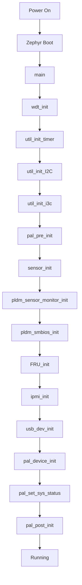

# PlatformInit（平台初始化流程）

本文說明 OpenBIC yv4-sd 平台的初始化流程與各子系統的啟動順序。

---

## 初始化流程概述



---

## main() 函數

```c
// common/service/main.c
void main(void)
{
    printf("Hello, welcome to %s %s %x%x.%x.%x\n", 
           PLATFORM_NAME, PROJECT_NAME, 
           BIC_FW_YEAR_MSB, BIC_FW_YEAR_LSB, 
           BIC_FW_WEEK, BIC_FW_VER);

    wdt_init();              // 看門狗初始化
    util_init_timer();       // 計時器初始化
    util_init_I2C();         // I2C 初始化
    util_init_i3c();         // I3C 初始化
    pal_pre_init();          // 平台預初始化
    sensor_init();           // 感測器框架
#ifdef ENABLE_PLDM_SENSOR
    pldm_sensor_monitor_init();
#endif
#ifdef ENABLE_PLDM
    pldm_smbios_init_structures();
#endif
    FRU_init();              // FRU 初始化
    ipmi_init();             // IPMI 服務
#ifdef CONFIG_USB
    usb_dev_init();          // USB 裝置
#endif
    pal_device_init();       // 平台裝置
    pal_set_sys_status();    // 系統狀態
    pal_post_init();         // 平台後初始化
}
```

---

## pal_pre_init()

平台預初始化，在核心服務啟動前執行：

```c
// plat_init.c
void pal_pre_init()
{
    const struct device *gpio_dev;
    gpio_dev = device_get_binding("GPIO0_A_D");
    
    // GPIO 初始化
    gpio_init(NULL);
    gpio_pin_configure(gpio_dev, 26,
        GPIO_INPUT | GPIO_INT_DEBOUNCE);  // Fast prochot
    
    // SCU 配置
    scu_init(scu_cfg, sizeof(scu_cfg) / sizeof(SCU_CFG));
    aspeed_print_sysrst_info();

    // I2C Target 初始化
    for (int index = 0; index < MAX_TARGET_NUM; index++) {
        if (I2C_TARGET_ENABLE_TABLE[index])
            i2c_target_control(
                index, 
                (struct _i2c_target_config *)&I2C_TARGET_CONFIG_TABLE[index],
                1);
    }

    // 平台配置初始化 (Slot 偵測)
    init_platform_config();

    // I3C Master 初始化
    I3C_MSG i3c_msg = { 0 };
    i3c_msg.bus = I3C_BUS_HUB;
    i3c_msg.target_addr = I3C_ADDR_HUB;

    // 重置 DAA
    for (int i = 0; i < 2; i++) {
        i3c_brocast_ccc(&i3c_msg, I3C_CCC_RSTDAA, I3C_BROADCAST_ADDR);
    }

    // 設定靜態地址為動態地址
    i3c_brocast_ccc(&i3c_msg, I3C_CCC_SETAASA, I3C_BROADCAST_ADDR);

    // I3C HUB 初始化
    i3c_attach(&i3c_msg);
    init_i3c_hub_type();
    uint16_t i3c_hub_type = get_i3c_hub_type();

    if (i3c_hub_type == P3H2840_DEVICE_INFO) {
        p3h284x_i3c_mode_only_init(&i3c_msg, p3h284x_cmd_initial, 
                                    P3H284X_CMD_INITIAL_SIZE);
    } else {
        rg3mxxb12_i3c_mode_only_init(&i3c_msg, rg3mxxb12_cmd_initial, 
                                      RG3MXXB12_CMD_INITIAL_SIZE);
    }

    // 初始化工作佇列
    init_vr_event_work();
    init_throttle_work_q();
    init_fastprochot_work_q();
    init_event_work();
    init_pmic_event_work();
    init_post_timeout_event_work();
    init_plat_worker(K_PRIO_PREEMPT(2));

    // 初始化 PLDM 感測器表
    plat_init_pldm_sensor_table();
}
```

---

## SCU 配置

系統控制單元配置：

```c
// plat_init.c
SCU_CFG scu_cfg[] = {
    // 多功能 pin 配置
    { 0x7e6e2610, 0x04020000 },
    { 0x7e6e2618, 0x00c30000 },
    
    // 啟用 GPIOD4 Debounce Timer#2 (throttle)
    { 0x7e780040, 0x10000000 },
    
    // 設定 Debounce Timer#2 為 2500us
    { 0x7e780054, 0x0001e848 },
};
```

---

## pal_post_init()

平台後初始化，在核心服務啟動後執行：

```c
// plat_init.c
void pal_post_init()
{
    // MCTP 初始化
    plat_mctp_init();
    
    // PCC (Platform Communication Channel) 初始化
    pcc_init();
    
    // KCS 初始化
    kcs_init();
    
    // 載入 PLDM State Effecter 表
    pldm_load_state_effecter_table(PLAT_PLDM_MAX_STATE_EFFECTER_IDX);
    pldm_assign_gpio_effecter_id(PLAT_EFFECTER_ID_GPIO_HIGH_BYTE);
    
    // 啟動 SETAASA 線程 (I3C DAA 維護)
    start_setaasa();
    
    // 啟動 DIMM 資訊收集
    start_get_dimm_info_thread();
    
    // 設定 BIC Ready 信號
    set_sys_ready_pin(BIC_READY_R);
    
    // 重置 USB HUB
    reset_usb_hub();

    // AC Lost 處理
    if (is_ac_lost()) {
        // 清除 VR 故障位元
        plat_pldm_sensor_clear_vr_fault(ADDR_VR_CPU0, I2C_BUS4, 2);
        plat_pldm_sensor_clear_vr_fault(ADDR_VR_CPU1, I2C_BUS4, 2);
        plat_pldm_sensor_clear_vr_fault(ADDR_VR_PVDD11, I2C_BUS4, 1);
    }
}
```

---

## pal_set_sys_status()

設定系統狀態：

```c
// plat_init.c
void pal_set_sys_status()
{
    // 設定 DC 電源狀態
    set_DC_status(PWRGD_CPU_LVC3);
    set_DC_on_delayed_status();
    
    // 設定 POST 狀態
    set_post_status(FM_BIOS_POST_CMPLT_BIC_N);
    
    // 設定開機裝置存在狀態
    set_bootdrive_exist_status();
    
    // 同步 BMC Ready 信號
    sync_bmc_ready_pin();
    
    // APML 初始化
    apml_init();

    // 如果 POST 已完成，執行額外操作
    if (get_post_status()) {
        apml_recovery();
        set_tsi_threshold();
        disable_mailbox_completion_alert();
        enable_alert_signal();
        read_cpuid();
    }
}
```

---

## pal_device_init()

平台裝置初始化：

```c
// plat_init.c
void pal_device_init()
{
    // 啟動 PMIC 錯誤監控線程
    start_monitor_pmic_error_thread();
    
    // 啟動 PROCHOT 感測器監控線程
    start_monitor_prochot_sensor_thread();
}
```

---

## 工作佇列初始化

### VR 事件工作佇列

```c
// plat_isr.c
void init_vr_event_work()
{
    for (int i = 0; i < ARRAY_SIZE(vr_event_work_item); i++) {
        if (!vr_event_work_item[i].is_init) {
            k_work_init_delayable(&vr_event_work_item[i].add_vr_sel_work,
                                   add_vr_alert_sel_work_handler);
            vr_event_work_item[i].is_init = true;
        }
    }
}
```

### Throttle 工作佇列

```c
#define SYS_THROTTLE_WORKQ_STACK_SIZE 1024
#define SYS_THROTTLE_WORKQ_PRIORITY K_PRIO_PREEMPT(2)

K_THREAD_STACK_DEFINE(sys_throttle_workq_stack, SYS_THROTTLE_WORKQ_STACK_SIZE);
struct k_work_q sys_throttle_work_q;

void init_throttle_work_q(void)
{
    k_work_queue_start(&sys_throttle_work_q, 
                        sys_throttle_workq_stack,
                        SYS_THROTTLE_WORKQ_STACK_SIZE, 
                        SYS_THROTTLE_WORKQ_PRIORITY,
                        NULL);
}
```

### Fast PROCHOT 工作佇列

```c
void init_fastprochot_work_q(void)
{
    k_work_queue_start(&fast_prochot_work_q, 
                        fast_prochot_workq_stack,
                        FAST_PROCHOT_WORKQ_STACK_SIZE, 
                        FAST_PROCHOT_WORKQ_PRIORITY,
                        NULL);
}
```

---

## 初始化時序圖

```
Time ─────────────────────────────────────────────────────────────────►

Phase 1: Hardware Init
├── wdt_init()              ~1ms
├── util_init_timer()       ~1ms
├── util_init_I2C()         ~10ms
└── util_init_i3c()         ~5ms

Phase 2: Pre-Init (pal_pre_init)
├── gpio_init()             ~5ms
├── scu_init()              ~1ms
├── i2c_target_control()    ~10ms
├── init_platform_config()  ~20ms (ADC 讀取)
├── I3C DAA                 ~50ms
├── I3C HUB init           ~30ms
└── work queue init         ~5ms

Phase 3: Service Init
├── sensor_init()           ~10ms
├── pldm_sensor_init()      ~5ms
├── FRU_init()              ~20ms (EEPROM 讀取)
└── ipmi_init()             ~5ms

Phase 4: Post-Init (pal_post_init)
├── plat_mctp_init()        ~20ms
├── pcc_init()              ~5ms
├── kcs_init()              ~5ms
└── pldm_effecter_init()    ~10ms

Phase 5: Status Init (pal_set_sys_status)
├── DC/POST status          ~5ms
├── sync BMC ready          ~5ms
└── apml_init()             ~10ms

Total: ~250ms (電源開啟到就緒)
```

---

## 相關文件

- [Architecture](Architecture.md) - 系統架構
- [YV4SDPlatform](YV4SDPlatform.md) - 平台概述
- [SlotDetection](SlotDetection.md) - Slot 偵測
- [PowerManagement](PowerManagement.md) - 電源管理

---

*返回 [Home](Home.md)*
