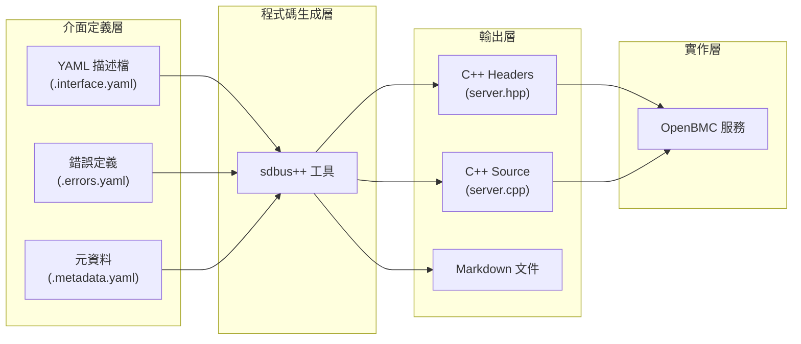
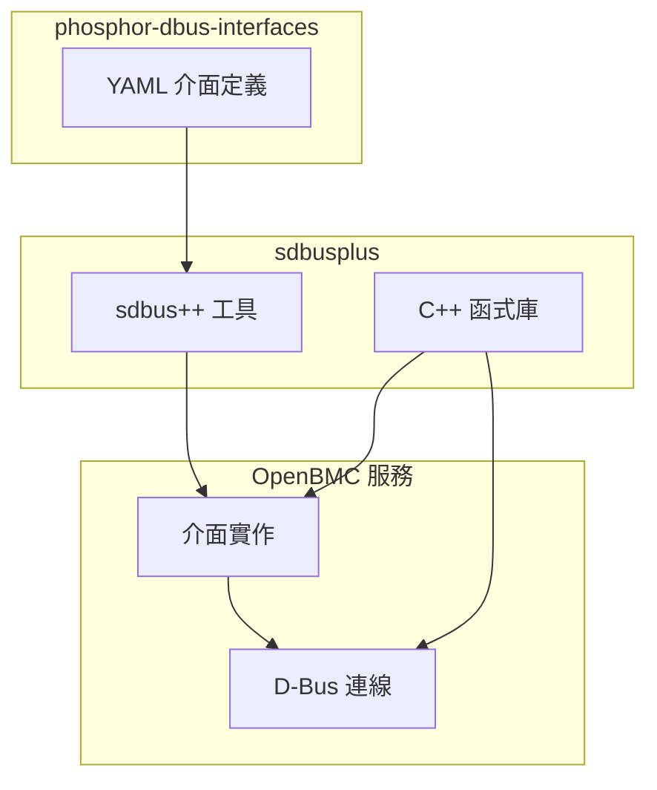

# Architecture - 系統架構

本文件說明 phosphor-dbus-interfaces 的整體架構設計與核心概念。

---

## 📐 架構概述

phosphor-dbus-interfaces 採用 **YAML 定義驅動** 的架構模式，將介面定義與程式碼實作完全分離：



---

## 🎯 設計原則

### 1. 介面與實作分離

介面定義（YAML）與具體實作（各服務程式碼）完全分離：

| 層級 | 專案 | 職責 |
|------|------|------|
| 定義層 | phosphor-dbus-interfaces | 定義 D-Bus 契約 |
| 綁定層 | sdbusplus | 生成 C++ 綁定 |
| 實作層 | 各服務（dbus-sensors, phosphor-state-manager...） | 實作介面邏輯 |

### 2. 命名空間組織

所有介面按功能分類組織在階層式命名空間中：

```
xyz.openbmc_project
├── Sensor        # 感測器相關
├── State         # 狀態管理
├── Inventory     # 硬體清單
├── Control       # 控制功能
├── Logging       # 日誌記錄
├── Network       # 網路設定
├── Software      # 軟體管理
└── ...
```

### 3. 版本相容性

透過介面版本控制維護向後相容：
- 新增屬性時使用 `default` 值
- 避免移除或修改現有介面成員
- 不相容變更時建立新介面

### 4. 硬體獨立性

介面設計抽象化，不綁定特定硬體：
- 使用通用的感測器介面，支援各種類型
- 狀態介面適用於不同的主機架構
- 清單介面可描述任意硬體元件

---

## 📁 目錄結構

```
phosphor-dbus-interfaces/
├── yaml/
│   ├── xyz/
│   │   └── openbmc_project/
│   │       ├── Sensor/
│   │       │   ├── Value.interface.yaml
│   │       │   ├── Threshold/
│   │       │   │   ├── Warning.interface.yaml
│   │       │   │   └── Critical.interface.yaml
│   │       │   └── ...
│   │       ├── State/
│   │       │   ├── Host.interface.yaml
│   │       │   ├── Chassis.interface.yaml
│   │       │   ├── BMC.interface.yaml
│   │       │   └── README.md
│   │       └── ...
│   └── org/
│       └── freedesktop/
│           └── ...
├── gen/
│   ├── meson.build
│   └── regenerate-meson
├── meson.build
├── meson.options
├── requirements.md
└── README.md
```

### 檔案類型

| 副檔名 | 說明 |
|--------|------|
| `.interface.yaml` | D-Bus 介面定義（methods, properties, signals） |
| `.errors.yaml` | 錯誤/例外定義 |
| `.metadata.yaml` | 錯誤的附加元資料 |
| `.events.yaml` | 事件日誌定義 |
| `README.md` | 特定命名空間的說明文件 |

---

## 🔄 程式碼生成流程

### 1. YAML 定義

開發者在 `yaml/` 目錄下建立介面定義：

```yaml
# yaml/xyz/openbmc_project/Example/MyInterface.interface.yaml
description: >
    範例介面說明

properties:
    - name: Status
      type: string
      description: 目前狀態

methods:
    - name: GetInfo
      description: 取得資訊
      returns:
          - name: info
            type: string
```

### 2. 執行 sdbus++

透過 meson 建置系統自動調用：

```bash
meson builddir && ninja -C builddir
```

或手動執行：

```bash
sdbus++ interface server-header xyz.openbmc_project.Example.MyInterface > \
    xyz/openbmc_project/Example/MyInterface/server.hpp
```

### 3. 生成程式碼

生成的 C++ 類別包含：
- 虛擬函式供實作覆寫
- D-Bus 屬性的 getter/setter
- 訊號發送方法
- D-Bus introspection 資料

---

## 🔗 與 sdbusplus 的關係



| 元件 | 來源 | 功能 |
|------|------|------|
| YAML 定義 | phosphor-dbus-interfaces | 介面契約描述 |
| sdbus++ 工具 | sdbusplus | 程式碼生成器 |
| C++ 函式庫 | sdbusplus | D-Bus 通訊基礎設施 |
| 服務實作 | 各專案 | 業務邏輯實作 |

---

## 📊 介面分類總覽

### 核心介面類別

| 類別 | 命名空間 | 說明 | 主要實作者 |
|------|----------|------|------------|
| 感測器 | `Sensor` | 溫度、電壓、風扇轉速等 | dbus-sensors |
| 狀態 | `State` | BMC/Host/Chassis 狀態 | phosphor-state-manager |
| 清單 | `Inventory` | 硬體元件資訊 | entity-manager |
| 控制 | `Control` | 電源、風扇控制 | 各控制服務 |
| 日誌 | `Logging` | 錯誤事件記錄 | phosphor-logging |
| 網路 | `Network` | 網路設定 | phosphor-networkd |
| 軟體 | `Software` | 韌體更新 | phosphor-bmc-code-mgmt |
| 物件映射 | `ObjectMapper` | D-Bus 物件查詢 | phosphor-objmgr |

### 通用介面

| 介面 | 說明 |
|------|------|
| `Association` | 物件關聯定義 |
| `Common` | 通用錯誤類型 |
| `Object.Delete` | 物件刪除功能 |
| `Object.Enable` | 物件啟用/停用 |

---

## 🔍 延伸閱讀

- [YAML 介面格式](YAMLFormat.md) - 詳細的 YAML 語法說明
- [命名空間總覽](Namespaces.md) - 完整的命名空間結構
- [程式碼生成](CodeGeneration.md) - sdbus++ 工具使用方式
- [介面設計規範](Requirements.md) - 設計最佳實踐

---

*最後更新：2025-12-19*
