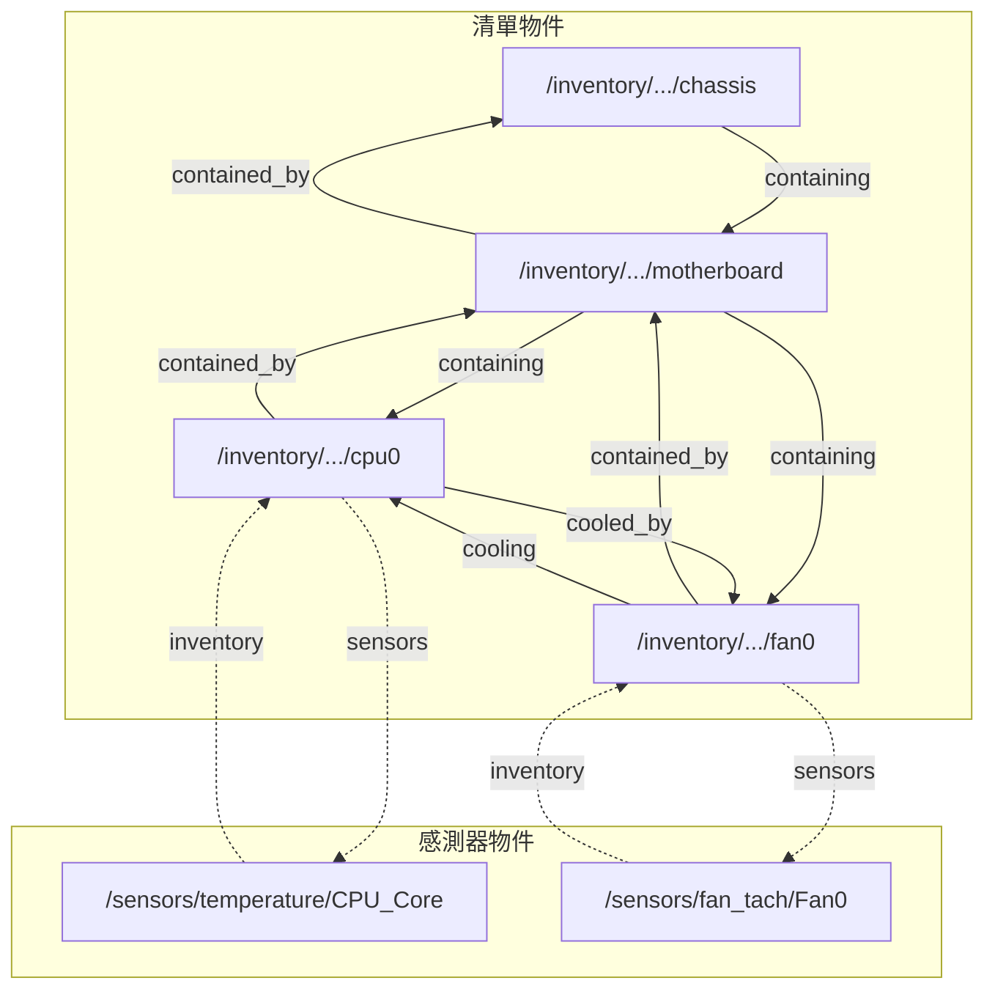

# Associations - 關聯機制

本文件說明 phosphor-dbus-interfaces 中的關聯（Association）機制。

---

## 📋 概述

關聯是 OpenBMC 中連結 D-Bus 物件的機制，允許建立物件之間的邏輯關係。這些關係透過 ObjectMapper 揭露，便於導航和查詢相關物件。

### 關聯類型

| 類型 | 說明 | 範例 |
|------|------|------|
| **Peer Association** | 對等關聯，連結同一實體的不同表示 | inventory ↔ control |
| **Directed Association** | 有向關聯，表示主從/包含關係 | containing → contained_by |

---

## 🔗 關聯運作方式

### 基本概念

當一個物件定義關聯時，會在 D-Bus 上建立額外的子路徑：

```
原始物件: /xyz/openbmc_project/inventory/system/chassis/motherboard/cpu0
關聯路徑: /xyz/openbmc_project/inventory/system/chassis/motherboard/cpu0/sensors
```

關聯路徑實作 `xyz.openbmc_project.Association` 介面，其 `endpoints` 屬性包含被關聯物件的路徑列表。

### 雙向關聯

關聯總是雙向的。當定義一個關聯時，反向關聯會自動建立：

```
cpu0/sensors → [sensor1, sensor2]  (正向)
sensor1/inventory → [cpu0]         (反向)
sensor2/inventory → [cpu0]         (反向)
```

---

## 📐 在 YAML 中定義關聯

### 語法

```yaml
associations:
    - name: association_name
      description: >
          關聯說明
      reverse_name: reverse_association_name
      required_endpoint_interfaces:
          - xyz.openbmc_project.Some.Interface
```

### 欄位說明

| 欄位 | 說明 |
|------|------|
| `name` | 正向關聯名稱 |
| `description` | 關聯說明 |
| `reverse_name` | 反向關聯名稱 |
| `required_endpoint_interfaces` | 端點必須實作的介面（至少一個） |

---

## 📋 命名規範

### Peer Association 命名

對等關聯使用階層名稱：

```yaml
# 連結 inventory 和 control 版本的同一實體
associations:
    - name: inventory
      reverse_name: control
```

### Directed Association 命名

有向關聯使用動詞分詞時態：

| 方向 | 時態 | 範例 |
|------|------|------|
| 正向（主動） | 現在分詞 (-ing) | containing, cooling, powering |
| 反向（被動） | 過去分詞 (-ed) | contained_by, cooled_by, powered_by |

文法驗證規則：
- 「{Primary} is {primary_association} {Secondary}」應為正確句子
- 「{Secondary} is {secondary_association} {Primary}」應為正確句子

### 範例

```yaml
associations:
    - name: containing
      description: >
          Links to items physically contained within this item.
      reverse_name: contained_by
      required_endpoint_interfaces:
          - xyz.openbmc_project.Inventory.Item
```

驗證：
- ✅ "Chassis is **containing** CPU" 
- ✅ "CPU is **contained_by** Chassis"

---

## 🔄 常見關聯模式

### 硬體清單關聯

| 關聯 | 反向關聯 | 說明 |
|------|----------|------|
| `containing` | `contained_by` | 物理包含關係 |
| `powered_by` | `powering` | 供電關係 |
| `cooled_by` | `cooling` | 冷卻關係 |
| `identified_by` | `identifying` | 識別 LED 關聯 |
| `fault_identified_by` | `fault_identifying` | 故障 LED 關聯 |

### 感測器關聯

| 關聯 | 反向關聯 | 說明 |
|------|----------|------|
| `sensors` | `inventory` | 感測器與硬體清單項目 |
| `monitoring` | `monitored_by` | 監控關係 |

### 軟體關聯

| 關聯 | 反向關聯 | 說明 |
|------|----------|------|
| `functional` | `software_version` | 功能中的軟體版本 |
| `updateable` | `software` | 可更新的軟體 |

---

## 💻 實作關聯

### 使用 AssociationDefinitions 介面

在 D-Bus 上，關聯透過設定 `xyz.openbmc_project.Association.Definitions` 介面的 `Associations` 屬性來建立：

```cpp
// 定義關聯：(正向名稱, 反向名稱, 端點路徑)
std::vector<std::tuple<std::string, std::string, std::string>> associations;
associations.emplace_back("sensors", "inventory", 
    "/xyz/openbmc_project/sensors/temperature/CPU_Core");

// 設定屬性
server.Associations(associations);
```

### 使用 busctl 查詢

```bash
# 查看物件的關聯定義
busctl get-property xyz.openbmc_project.EntityManager \
    /xyz/openbmc_project/inventory/system/chassis/motherboard/cpu0 \
    xyz.openbmc_project.Association.Definitions Associations

# 查看特定關聯的端點
busctl get-property xyz.openbmc_project.ObjectMapper \
    /xyz/openbmc_project/inventory/system/chassis/motherboard/cpu0/sensors \
    xyz.openbmc_project.Association endpoints
```

---

## 📊 關聯視覺化



---

## ✏️ 文件中記錄關聯

### 兩端都要記錄

如果介面 A 文件中定義了到介面 B 的關聯，介面 B 也必須記錄反向關聯：

```yaml
# Sensor/Value.interface.yaml
associations:
    - name: inventory
      description: >
          Sensors may implement an 'inventory' to 'sensors' association
          with the inventory item related to it.
      reverse_name: sensors
      required_endpoint_interfaces:
          - xyz.openbmc_project.Inventory.Item
```

```yaml
# Inventory/Item.interface.yaml
associations:
    - name: sensors
      description: >
          Sensors may implement an 'inventory' to 'sensors' association
          with the inventory item related to it.
      reverse_name: inventory
      required_endpoint_interfaces:
          - xyz.openbmc_project.Sensor.Value
```

---

## ⚠️ 設計注意事項

### 不要在關聯名稱中編碼類型

❌ **錯誤**: `powered_processor`
✅ **正確**: `powering`

### 使用動詞分詞時態

❌ **錯誤**: `power`, `contain`
✅ **正確**: `powering`, `containing`

### 保持對稱性

確保正向和反向關聯都有意義且文法正確。

---

## 🔍 透過 ObjectMapper 查詢關聯

```bash
# 取得與 cpu0 相關的所有感測器
busctl call xyz.openbmc_project.ObjectMapper \
    /xyz/openbmc_project/ObjectMapper \
    xyz.openbmc_project.ObjectMapper \
    GetAssociatedSubTreePaths sias \
    "/xyz/openbmc_project/inventory/system/chassis/motherboard/cpu0/sensors" \
    "/" 0 0

# 取得特定介面的關聯端點
busctl call xyz.openbmc_project.ObjectMapper \
    /xyz/openbmc_project/ObjectMapper \
    xyz.openbmc_project.ObjectMapper \
    GetAssociatedSubTree ooias \
    "/xyz/openbmc_project/inventory/system/chassis/motherboard/cpu0/sensors" \
    "/xyz/openbmc_project/sensors" 0 1 "xyz.openbmc_project.Sensor.Value"
```

---

## 🔍 延伸閱讀

- [ObjectMapper 文件](https://github.com/openbmc/docs/blob/master/architecture/object-mapper.md#associations) - 官方關聯說明
- [ObjectMapperInterface](ObjectMapperInterface.md) - 關聯查詢方法
- [InventoryInterfaces](InventoryInterfaces.md) - 清單項目關聯

---

*最後更新：2025-12-19*
