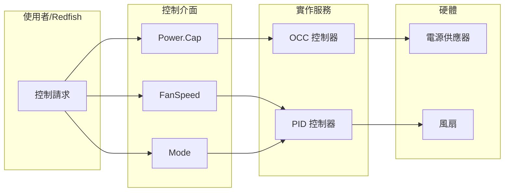

# Control Interfaces - 控制介面

本文件說明 `xyz.openbmc_project.Control` 命名空間下的控制介面。

---

## 📋 概述

控制介面用於管理系統的各種控制功能，包括電源管理、風扇控制、服務管理等。

### 主要控制介面

| 介面 | 說明 |
|------|------|
| `xyz.openbmc_project.Control.Power.Cap` | 電源上限控制 |
| `xyz.openbmc_project.Control.Power.Throttle` | 電源節流控制 |
| `xyz.openbmc_project.Control.FanSpeed` | 風扇轉速控制（RPM） |
| `xyz.openbmc_project.Control.FanPwm` | 風扇 PWM 控制 |
| `xyz.openbmc_project.Control.Mode` | 模式控制 |
| `xyz.openbmc_project.Control.Service` | 服務控制 |
| `xyz.openbmc_project.Control.Boot.Mode` | 開機模式控制 |
| `xyz.openbmc_project.Control.Boot.Source` | 開機來源控制 |

---

## ⚡ xyz.openbmc_project.Control.Power.Cap

電源上限控制介面，用於限制系統最大功耗。

### 屬性

| 屬性 | 型別 | 說明 |
|------|------|------|
| `PowerCap` | `uint32` | 電源上限值（瓦特） |
| `PowerCapEnable` | `boolean` | 是否啟用電源上限 |
| `MinPowerCapValue` | `uint32` | 最小可設定值 |
| `MaxPowerCapValue` | `uint32` | 最大可設定值 |
| `MinSoftPowerCapValue` | `uint32` | 最小軟上限值（可能無法保證） |
| `ExceptionAction` | `enum[ExceptionActions]` | 超限例外動作 |
| `CorrectionTime` | `uint64` | 修正時間限制（微秒） |
| `SamplingPeriod` | `uint64` | 取樣週期（微秒） |

### ExceptionActions 列舉

| 值 | 說明 |
|----|------|
| `NoAction` | 不採取動作 |
| `HardPowerOff` | 硬關機並記錄事件 |
| `LogEventOnly` | 僅記錄事件 |
| `Oem` | OEM 定義動作 |

### 使用範例

```bash
# 設定電源上限為 500W
busctl set-property xyz.openbmc_project.Settings \
    /xyz/openbmc_project/control/host0/power_cap \
    xyz.openbmc_project.Control.Power.Cap PowerCap u 500

# 啟用電源上限
busctl set-property xyz.openbmc_project.Settings \
    /xyz/openbmc_project/control/host0/power_cap \
    xyz.openbmc_project.Control.Power.Cap PowerCapEnable b true

# 查詢目前設定
busctl get-property xyz.openbmc_project.Settings \
    /xyz/openbmc_project/control/host0/power_cap \
    xyz.openbmc_project.Control.Power.Cap PowerCap
```

---

## 🌊 xyz.openbmc_project.Control.Power.Throttle

電源節流控制介面。

### 屬性

| 屬性 | 型別 | 說明 |
|------|------|------|
| `Throttled` | `boolean` | 是否正在節流 |
| `ThrottleCauses` | `array[enum[ThrottleReasons]]` | 節流原因列表 |

### ThrottleReasons 列舉

| 值 | 說明 |
|----|------|
| `PowerLimit` | 達到電源限制 |
| `ThermalLimit` | 達到溫度限制 |
| `ClockLimit` | 達到時脈限制 |
| `Unknown` | 未知原因 |

---

## 🌀 xyz.openbmc_project.Control.FanSpeed

風扇轉速控制介面（以 RPM 為單位）。

### 屬性

| 屬性 | 型別 | 說明 |
|------|------|------|
| `Target` | `uint64` | 目標轉速（RPM） |

### 使用範例

```bash
# 設定風扇目標轉速
busctl set-property xyz.openbmc_project.FanSensor \
    /xyz/openbmc_project/control/fanpwm/Fan0 \
    xyz.openbmc_project.Control.FanSpeed Target t 8000
```

---

## 📊 xyz.openbmc_project.Control.FanPwm

風扇 PWM（脈寬調變）控制介面。

### 屬性

| 屬性 | 型別 | 說明 |
|------|------|------|
| `Target` | `uint64` | 目標 PWM 值（0-255 或百分比，依實作而定） |

---

## 🔧 xyz.openbmc_project.Control.Mode

通用模式控制介面。

### 屬性

| 屬性 | 型別 | 說明 |
|------|------|------|
| `Manual` | `boolean` | 是否為手動模式 |

> [!NOTE]
> 此介面常用於風扇控制，當 `Manual` 為 `true` 時，PID 控制器會暫停，允許手動設定風扇速度。

### 使用範例

```bash
# 切換到手動風扇控制模式
busctl set-property xyz.openbmc_project.FanSensor \
    /xyz/openbmc_project/control/fanpwm \
    xyz.openbmc_project.Control.Mode Manual b true
```

---

## 🔄 xyz.openbmc_project.Control.Service

systemd 服務控制介面。

### 屬性

| 屬性 | 型別 | 說明 |
|------|------|------|
| `ServiceName` | `string` | systemd 服務名稱 |
| `ServiceState` | `enum[State]` | 服務狀態 |
| `ServiceEnabled` | `boolean` | 是否啟用服務 |

### 方法

| 方法 | 說明 |
|------|------|
| `Restart()` | 重啟服務 |

---

## 💾 xyz.openbmc_project.Control.Boot.Mode

開機模式控制介面。

### 屬性

| 屬性 | 型別 | 說明 |
|------|------|------|
| `BootMode` | `enum[Mode]` | 開機模式 |

### Mode 列舉

| 值 | 說明 |
|----|------|
| `Regular` | 一般開機 |
| `Safe` | 安全模式 |
| `Setup` | BIOS 設定 |

---

## 💿 xyz.openbmc_project.Control.Boot.Source

開機來源控制介面。

### 屬性

| 屬性 | 型別 | 說明 |
|------|------|------|
| `BootSource` | `enum[Source]` | 開機來源 |

### Source 列舉

| 值 | 說明 |
|----|------|
| `Default` | 預設開機順序 |
| `Network` | 網路開機 |
| `Disk` | 硬碟開機 |
| `RemovableMedia` | 可卸除媒體開機 |

---

## 🖥️ 其他控制介面

### xyz.openbmc_project.Control.Host.NMI

非遮罩中斷（NMI）控制。

| 方法 | 說明 |
|------|------|
| `NMI()` | 向主機發送 NMI |

### xyz.openbmc_project.Control.Processor.ErrorConfig

處理器錯誤配置。

| 屬性 | 型別 | 說明 |
|------|------|------|
| `ResetOnError` | `boolean` | 錯誤時是否重置 |

### xyz.openbmc_project.Control.TPM.Policy

TPM 策略控制。

| 屬性 | 型別 | 說明 |
|------|------|------|
| `TPMEnable` | `boolean` | 是否啟用 TPM |

---

## 📍 常見控制物件路徑

| 路徑 | 說明 |
|------|------|
| `/xyz/openbmc_project/control/host0/power_cap` | 電源上限設定 |
| `/xyz/openbmc_project/control/host0/boot` | 開機設定 |
| `/xyz/openbmc_project/control/fanpwm` | 風扇 PWM 控制 |
| `/xyz/openbmc_project/control/thermal` | 熱管理控制 |

---

## 🔗 控制流程示意



---

## 🔍 延伸閱讀

- [StateInterfaces](StateInterfaces.md) - 狀態管理與控制的關係
- [SensorInterfaces](SensorInterfaces.md) - 監控與控制整合
- [phosphor-pid-control](https://github.com/openbmc/phosphor-pid-control) - PID 風扇控制實作

---

*最後更新：2025-12-19*
