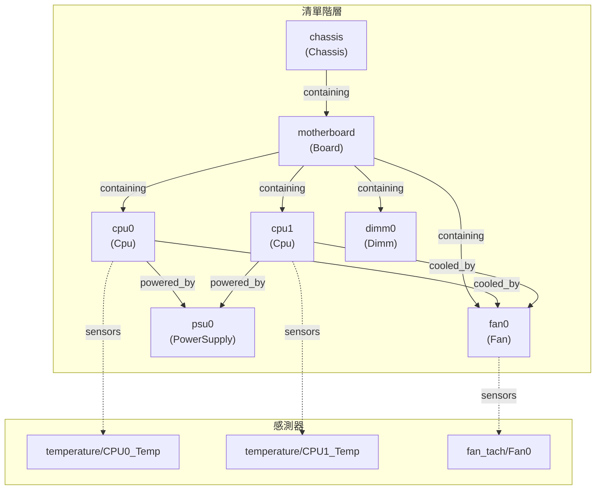

# Inventory Interfaces - 硬體清單介面

本文件說明 `xyz.openbmc_project.Inventory` 命名空間下的硬體清單介面。

---

## 📋 概述

硬體清單介面用於描述系統中的硬體元件資訊，包括 CPU、記憶體、主機板、風扇等。這些介面主要由 [entity-manager](../entity-manager/Home.md) 專案管理和填充。

### 核心介面

| 介面 | 說明 |
|------|------|
| `xyz.openbmc_project.Inventory.Item` | 基礎清單項目 |
| `xyz.openbmc_project.Inventory.Manager` | 清單管理器 |

### 項目類型介面

| 介面 | 說明 |
|------|------|
| `xyz.openbmc_project.Inventory.Item.Cpu` | CPU 處理器 |
| `xyz.openbmc_project.Inventory.Item.Dimm` | 記憶體模組 |
| `xyz.openbmc_project.Inventory.Item.Board` | 電路板 |
| `xyz.openbmc_project.Inventory.Item.Chassis` | 機箱 |
| `xyz.openbmc_project.Inventory.Item.Fan` | 風扇 |
| `xyz.openbmc_project.Inventory.Item.PowerSupply` | 電源供應器 |
| `xyz.openbmc_project.Inventory.Item.Bmc` | BMC 自身 |

### 裝飾器介面

| 介面 | 說明 |
|------|------|
| `xyz.openbmc_project.Inventory.Decorator.Asset` | 資產資訊（序號、製造商等） |
| `xyz.openbmc_project.Inventory.Decorator.Revision` | 版本資訊 |
| `xyz.openbmc_project.Inventory.Decorator.Replaceable` | 可更換指示 |
| `xyz.openbmc_project.Inventory.Decorator.LocationCode` | 位置代碼 |

---

## 📍 物件路徑結構

清單物件位於 `/xyz/openbmc_project/inventory` 路徑下：

```
/xyz/openbmc_project/inventory/
└── system/
    ├── chassis/
    │   └── motherboard/
    │       ├── cpu0
    │       ├── cpu1
    │       ├── dimm0
    │       ├── dimm1
    │       ├── fan0
    │       ├── fan1
    │       └── psu0
    └── bmc
```

---

## 📦 xyz.openbmc_project.Inventory.Item

所有清單項目的基礎介面。

### 屬性

| 屬性 | 型別 | 說明 |
|------|------|------|
| `PrettyName` | `string` | 人類可讀的項目名稱 |
| `Present` | `boolean` | 項目是否存在/安裝 |

### 關聯

| 關聯名稱 | 反向名稱 | 說明 |
|----------|----------|------|
| `containing` | `contained_by` | 包含其他項目 |
| `contained_by` | `containing` | 被其他項目包含 |
| `cooled_by` | `cooling` | 被風扇冷卻 |
| `powered_by` | `powering` | 由電源供應 |
| `sensors` | `inventory` | 相關感測器 |
| `identified_by` | `identifying` | 識別 LED 群組 |
| `fault_identified_by` | `fault_identifying` | 故障 LED 群組 |
| `monitored_by` | `monitoring` | 被感測器監控 |
| `protected_by` | `protecting` | 受保護機制保護 |
| `authenticated_by` | `authenticating` | 認證來源 |

### 使用範例

```bash
# 查詢項目是否存在
busctl get-property xyz.openbmc_project.Inventory.Manager \
    /xyz/openbmc_project/inventory/system/chassis/motherboard/cpu0 \
    xyz.openbmc_project.Inventory.Item Present

# 取得項目名稱
busctl get-property xyz.openbmc_project.Inventory.Manager \
    /xyz/openbmc_project/inventory/system/chassis/motherboard/cpu0 \
    xyz.openbmc_project.Inventory.Item PrettyName
```

---

## 🔧 xyz.openbmc_project.Inventory.Manager

清單管理器介面，用於批次通知清單變更。

### 方法

| 方法 | 說明 |
|------|------|
| `Notify(dict[object_path, dict[string, dict[string, variant]]])` | 通知多個物件的介面和屬性變更 |

### 路徑

必須實作於 `/xyz/openbmc_project/inventory`。

> [!IMPORTANT]
> 任何實作 `Inventory.Item` 介面的服務，必須在 `/xyz/openbmc_project/inventory` 路徑實作 `org.freedesktop.DBus.ObjectManager` 介面。

---

## 💾 項目類型介面

### xyz.openbmc_project.Inventory.Item.Cpu

CPU 處理器資訊。

| 屬性 | 型別 | 說明 |
|------|------|------|
| `Socket` | `size` | 插槽編號 |
| `Family` | `string` | CPU 系列 |
| `ThreadCount` | `size` | 執行緒數量 |
| `CoreCount` | `size` | 核心數量 |
| `MaxSpeedInMhz` | `uint32` | 最高時脈速度 |

### xyz.openbmc_project.Inventory.Item.Dimm

記憶體模組資訊。

| 屬性 | 型別 | 說明 |
|------|------|------|
| `MemorySizeInKB` | `size` | 記憶體大小（KB） |
| `MemoryType` | `enum[Type]` | 記憶體類型 |
| `MemorySpeedInMhz` | `uint32` | 記憶體速度 |
| `MemoryDataWidth` | `uint16` | 資料位寬 |
| `MemoryDeviceLocator` | `string` | 裝置位置標識 |

### xyz.openbmc_project.Inventory.Item.Board

電路板資訊。

| 屬性 | 型別 | 說明 |
|------|------|------|
| 繼承 `Item` 屬性 | | |

### xyz.openbmc_project.Inventory.Item.Fan

風扇資訊。

| 屬性 | 型別 | 說明 |
|------|------|------|
| 繼承 `Item` 屬性 | | |

關聯：
- `cooling` → 被此風扇冷卻的項目

### xyz.openbmc_project.Inventory.Item.PowerSupply

電源供應器資訊。

| 屬性 | 型別 | 說明 |
|------|------|------|
| 繼承 `Item` 屬性 | | |

關聯：
- `powering` → 由此電源供電的項目

---

## 🏷️ 裝飾器介面

裝飾器介面為清單項目添加額外資訊。

### xyz.openbmc_project.Inventory.Decorator.Asset

資產管理資訊。

| 屬性 | 型別 | 說明 |
|------|------|------|
| `Manufacturer` | `string` | 製造商 |
| `Model` | `string` | 型號 |
| `PartNumber` | `string` | 料號 |
| `SerialNumber` | `string` | 序號 |
| `BuildDate` | `string` | 製造日期 |
| `SparePartNumber` | `string` | 備用料號 |

### xyz.openbmc_project.Inventory.Decorator.Revision

版本資訊。

| 屬性 | 型別 | 說明 |
|------|------|------|
| `Version` | `string` | 版本字串 |

### xyz.openbmc_project.Inventory.Decorator.Replaceable

可更換指示。

| 屬性 | 型別 | 說明 |
|------|------|------|
| `FieldReplaceable` | `boolean` | 是否可現場更換 (FRU) |
| `HotPluggable` | `boolean` | 是否支援熱插拔 |

### xyz.openbmc_project.Inventory.Decorator.LocationCode

位置代碼。

| 屬性 | 型別 | 說明 |
|------|------|------|
| `LocationCode` | `string` | 位置識別碼 |

---

## 🔗 關聯階層示意



---

## 📊 使用範例

### 列出所有清單項目

```bash
# 透過 ObjectManager 取得所有清單物件
busctl call xyz.openbmc_project.Inventory.Manager \
    /xyz/openbmc_project/inventory \
    org.freedesktop.DBus.ObjectManager \
    GetManagedObjects
```

### 查詢 CPU 資訊

```bash
# 取得 CPU0 的核心數
busctl get-property xyz.openbmc_project.Inventory.Manager \
    /xyz/openbmc_project/inventory/system/chassis/motherboard/cpu0 \
    xyz.openbmc_project.Inventory.Item.Cpu CoreCount

# 取得 CPU0 的序號
busctl get-property xyz.openbmc_project.Inventory.Manager \
    /xyz/openbmc_project/inventory/system/chassis/motherboard/cpu0 \
    xyz.openbmc_project.Inventory.Decorator.Asset SerialNumber
```

### 透過 ObjectMapper 查詢

```bash
# 查詢所有 CPU 項目
busctl call xyz.openbmc_project.ObjectMapper \
    /xyz/openbmc_project/ObjectMapper \
    xyz.openbmc_project.ObjectMapper \
    GetSubTree sias "/xyz/openbmc_project/inventory" 0 1 \
    "xyz.openbmc_project.Inventory.Item.Cpu"
```

---

## 🔍 延伸閱讀

- [entity-manager Wiki](../entity-manager/Home.md) - 硬體配置管理
- [SensorInterfaces](SensorInterfaces.md) - 感測器與清單項目關聯
- [Associations](Associations.md) - 關聯機制詳解

---

*最後更新：2025-12-19*
