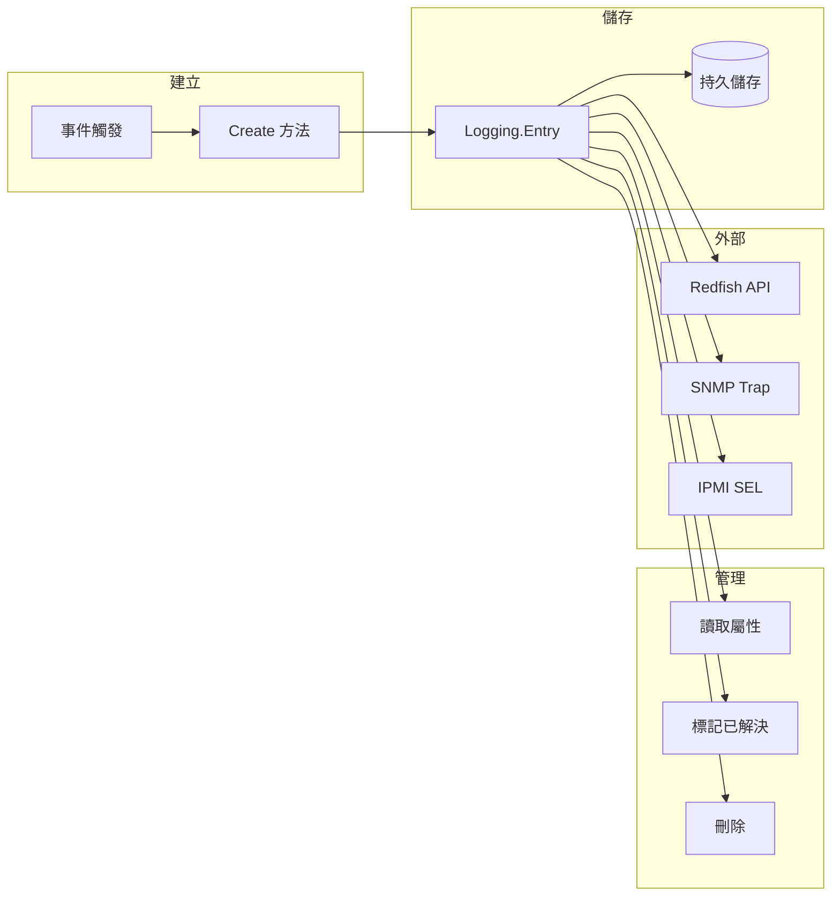

# Logging Interfaces - 日誌介面

本文件說明 `xyz.openbmc_project.Logging` 命名空間下的日誌介面。

---

## 📋 概述

日誌介面用於記錄和管理系統事件及錯誤。這些介面主要由 [phosphor-logging](https://github.com/openbmc/phosphor-logging) 專案實作。

### 核心介面

| 介面 | 說明 |
|------|------|
| `xyz.openbmc_project.Logging.Entry` | 日誌條目 |
| `xyz.openbmc_project.Logging.Create` | 建立日誌 |
| `xyz.openbmc_project.Logging.Internal.Manager` | 內部日誌管理 |

---

## 📍 物件路徑

| 路徑 | 說明 |
|------|------|
| `/xyz/openbmc_project/logging` | 日誌服務根路徑 |
| `/xyz/openbmc_project/logging/entry/<id>` | 個別日誌條目 |

---

## 📝 xyz.openbmc_project.Logging.Entry

日誌條目介面，描述單一事件/錯誤記錄。

### 屬性

| 屬性 | 型別 | 說明 |
|------|------|------|
| `Id` | `uint32` | 日誌條目 ID |
| `Timestamp` | `uint64` | 建立時間戳（毫秒，自 1970 年起） |
| `Severity` | `enum[Level]` | 嚴重等級 |
| `Message` | `string` | 錯誤訊息描述 |
| `EventId` | `string` | 事件識別碼（實作定義） |
| `AdditionalData` | `dict[string, string]` | 附加資訊（鍵值對） |
| `Resolution` | `string` | 建議的解決方案 |
| `Resolved` | `boolean` | 是否已解決 |
| `ServiceProviderNotify` | `enum[Notify]` | 服務提供者通知狀態 |
| `UpdateTimestamp` | `uint64` | 最後更新時間戳 |

### Level 列舉（嚴重等級）

| 值 | 說明 | 優先順序 |
|----|------|----------|
| `Emergency` | 系統無法使用 | 最高 |
| `Alert` | 需要立即處理 | |
| `Critical` | 嚴重狀況 | |
| `Error` | 錯誤狀況 | |
| `Warning` | 警告狀況 | |
| `Notice` | 異常但非錯誤 | |
| `Informational` | 一般資訊 | |
| `Debug` | 除錯資訊 | 最低 |

### Notify 列舉

| 值 | 說明 |
|----|------|
| `NotSupported` | 不支援服務提供者通知 |
| `Notify` | 應通知服務提供者 |
| `Inhibit` | 不應通知服務提供者 |

### 方法

| 方法 | 說明 |
|------|------|
| `GetEntry()` | 取得原始日誌檔案的檔案描述符 |

### 使用範例

```bash
# 列出所有日誌條目
busctl call xyz.openbmc_project.Logging \
    /xyz/openbmc_project/logging \
    org.freedesktop.DBus.ObjectManager \
    GetManagedObjects

# 讀取特定日誌條目
busctl get-property xyz.openbmc_project.Logging \
    /xyz/openbmc_project/logging/entry/1 \
    xyz.openbmc_project.Logging.Entry Severity

# 讀取錯誤訊息
busctl get-property xyz.openbmc_project.Logging \
    /xyz/openbmc_project/logging/entry/1 \
    xyz.openbmc_project.Logging.Entry Message

# 讀取附加資料
busctl get-property xyz.openbmc_project.Logging \
    /xyz/openbmc_project/logging/entry/1 \
    xyz.openbmc_project.Logging.Entry AdditionalData

# 標記日誌為已解決
busctl set-property xyz.openbmc_project.Logging \
    /xyz/openbmc_project/logging/entry/1 \
    xyz.openbmc_project.Logging.Entry Resolved b true
```

---

## ➕ xyz.openbmc_project.Logging.Create

日誌建立介面，用於新增日誌條目。

### 方法

| 方法 | 說明 |
|------|------|
| `Create(string message, enum[Level] severity, dict[string, string] additionalData)` | 建立新日誌條目 |
| `CreateWithFFDCFiles(string message, enum[Level] severity, dict[string, string] additionalData, array[struct[...]] ffdc)` | 建立附帶 FFDC 檔案的日誌 |

### 使用範例

```bash
# 建立一筆警告日誌
busctl call xyz.openbmc_project.Logging \
    /xyz/openbmc_project/logging \
    xyz.openbmc_project.Logging.Create \
    Create ssa{ss} "Temperature threshold exceeded" \
    "xyz.openbmc_project.Logging.Entry.Level.Warning" \
    2 "SENSOR_NAME" "CPU0_Temp" "READING" "95"
```

---

## 🗑️ xyz.openbmc_project.Object.Delete

刪除日誌條目（通用介面，非 Logging 專屬）。

### 方法

| 方法 | 說明 |
|------|------|
| `Delete()` | 刪除此物件 |

### 使用範例

```bash
# 刪除日誌條目 1
busctl call xyz.openbmc_project.Logging \
    /xyz/openbmc_project/logging/entry/1 \
    xyz.openbmc_project.Object.Delete \
    Delete
```

---

## 🗃️ AdditionalData 常見鍵值

`AdditionalData` 屬性包含錯誤的附加上下文資訊：

| 鍵 | 說明 | 範例值 |
|----|------|--------|
| `MESSAGE` | 詳細訊息 | `Sensor reading out of range` |
| `SENSOR_NAME` | 感測器名稱 | `CPU0_Temp` |
| `READING` | 讀數值 | `105` |
| `THRESHOLD` | 閾值 | `95` |
| `_PID` | 程序 ID | `1234` |
| `ERRNO` | 錯誤碼 | `5` |
| `PATH` | 相關路徑 | `/xyz/openbmc_project/sensors/...` |
| `CALLOUT_INVENTORY_PATH` | 相關硬體清單路徑 | `/xyz/openbmc_project/inventory/...` |

---

## 📊 日誌生命週期



---

## 🔗 與其他系統整合

### Redfish EventLog

日誌透過 bmcweb 映射到 Redfish EventLog 資源：

| D-Bus 屬性 | Redfish 屬性 |
|------------|--------------|
| `Id` | `Id` |
| `Timestamp` | `Created` |
| `Severity` | `Severity` |
| `Message` | `Message` |
| `Resolved` | `Resolved` |

### IPMI SEL

日誌可映射到 IPMI System Event Log (SEL)：
- phosphor-ipmi-host 提供 SEL 命令處理
- 日誌條目可轉換為 SEL 記錄格式

---

## ⚠️ 錯誤類型定義

錯誤類型在 `.errors.yaml` 檔案中定義：

```yaml
# xyz/openbmc_project/Sensor/Threshold.errors.yaml
- name: CriticalHigh
  description: Sensor value crossed the critical high threshold.
- name: CriticalLow
  description: Sensor value crossed the critical low threshold.
- name: WarningHigh
  description: Sensor value crossed the warning high threshold.
- name: WarningLow
  description: Sensor value crossed the warning low threshold.
```

詳見 [Errors](Errors.md)。

---

## 📈 日誌管理最佳實踐

1. **設定適當的嚴重等級**
   - 使用 `Error` 或更高等級表示需要關注的問題
   - 使用 `Informational` 記錄一般操作

2. **提供有意義的 AdditionalData**
   - 包含足夠的上下文資訊以便除錯
   - 使用標準化的鍵名

3. **定期清理舊日誌**
   - 設定日誌保留策略
   - 刪除已解決的舊日誌

4. **使用 Resolved 屬性**
   - 問題解決後標記為已解決
   - 便於追蹤問題狀態

---

## 🔍 延伸閱讀

- [phosphor-logging](https://github.com/openbmc/phosphor-logging) - 日誌服務實作
- [Errors](Errors.md) - 錯誤定義格式
- [SensorInterfaces](SensorInterfaces.md) - 感測器閾值與日誌關聯

---

*最後更新：2025-12-19*
