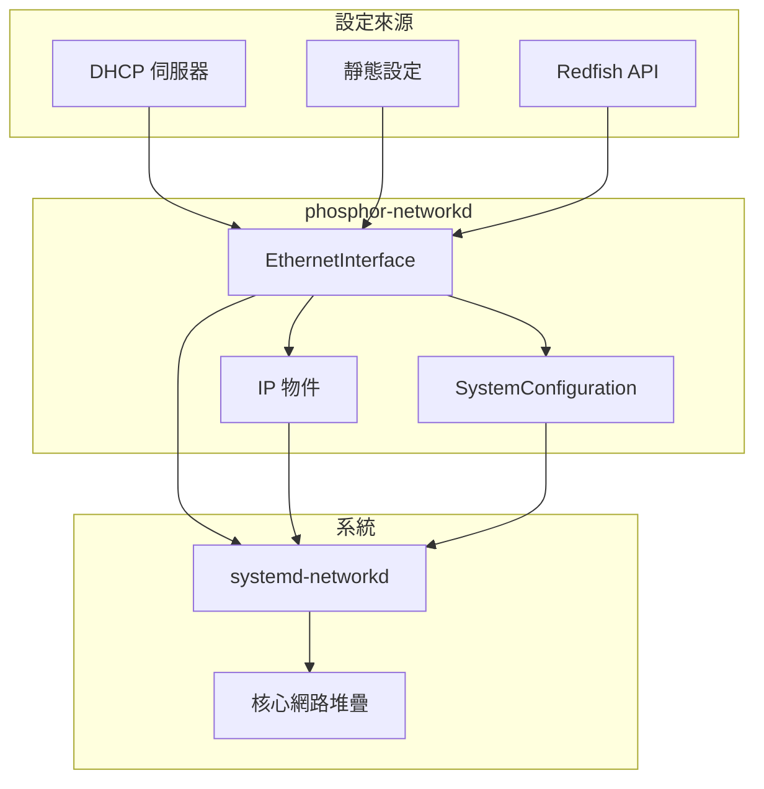

# Network Interfaces - 網路介面

本文件說明 `xyz.openbmc_project.Network` 命名空間下的網路設定介面。

---

## 📋 概述

網路介面用於設定和管理 BMC 的網路功能。這些介面主要由 [phosphor-networkd](https://github.com/openbmc/phosphor-networkd) 專案實作。

### 核心介面

| 介面 | 說明 |
|------|------|
| `xyz.openbmc_project.Network.EthernetInterface` | 乙太網路介面 |
| `xyz.openbmc_project.Network.IP` | IP 位址設定 |
| `xyz.openbmc_project.Network.IP.Create` | 建立 IP 位址 |
| `xyz.openbmc_project.Network.Neighbor` | 鄰居/ARP 設定 |
| `xyz.openbmc_project.Network.VLAN` | VLAN 設定 |
| `xyz.openbmc_project.Network.MACAddress` | MAC 位址 |
| `xyz.openbmc_project.Network.SystemConfiguration` | 系統網路設定 |

---

## 📍 物件路徑

| 路徑 | 說明 |
|------|------|
| `/xyz/openbmc_project/network` | 網路服務根路徑 |
| `/xyz/openbmc_project/network/config` | 系統網路設定 |
| `/xyz/openbmc_project/network/eth0` | 乙太網路介面 0 |
| `/xyz/openbmc_project/network/eth0/ipv4/<id>` | IPv4 位址 |
| `/xyz/openbmc_project/network/eth0/ipv6/<id>` | IPv6 位址 |

---

## 🌐 xyz.openbmc_project.Network.EthernetInterface

乙太網路介面設定。

### 屬性

| 屬性 | 型別 | 說明 |
|------|------|------|
| `InterfaceName` | `string` | 介面名稱（如 eth0） |
| `LinkLocalAutoConf` | `enum[LinkLocalConf]` | 本地鏈結自動設定 |
| `DHCPEnabled` | `enum[DHCPConf]` | DHCP 啟用狀態 |
| `IPv6AcceptRA` | `boolean` | 是否接受 IPv6 路由器通告 |
| `NTPServers` | `array[string]` | NTP 伺服器列表 |
| `Nameservers` | `array[string]` | DNS 伺服器列表 |
| `StaticNameServers` | `array[string]` | 靜態 DNS 伺服器 |
| `LinkUp` | `boolean` | 鏈路是否連接（唯讀） |
| `NICEnabled` | `boolean` | 網路介面是否啟用 |
| `Speed` | `uint32` | 連線速度（Mbps） |
| `AutoNeg` | `boolean` | 是否自動協商 |
| `MTU` | `size` | 最大傳輸單元 |

### LinkLocalConf 列舉

| 值 | 說明 |
|----|------|
| `fallback` | 僅當無其他設定時使用 |
| `both` | IPv4 和 IPv6 都使用 |
| `v4` | 僅 IPv4 |
| `v6` | 僅 IPv6 |
| `none` | 不使用本地鏈結 |

### DHCPConf 列舉

| 值 | 說明 |
|----|------|
| `both` | IPv4 和 IPv6 都使用 DHCP |
| `v4` | 僅 IPv4 使用 DHCP |
| `v6` | 僅 IPv6 使用 DHCP |
| `none` | 不使用 DHCP |

### 使用範例

```bash
# 查詢 DHCP 狀態
busctl get-property xyz.openbmc_project.Network \
    /xyz/openbmc_project/network/eth0 \
    xyz.openbmc_project.Network.EthernetInterface DHCPEnabled

# 設定為靜態 IP（停用 DHCP）
busctl set-property xyz.openbmc_project.Network \
    /xyz/openbmc_project/network/eth0 \
    xyz.openbmc_project.Network.EthernetInterface DHCPEnabled s \
    "xyz.openbmc_project.Network.EthernetInterface.DHCPConf.none"

# 查詢連線狀態
busctl get-property xyz.openbmc_project.Network \
    /xyz/openbmc_project/network/eth0 \
    xyz.openbmc_project.Network.EthernetInterface LinkUp
```

---

## 📌 xyz.openbmc_project.Network.IP

IP 位址設定介面。

### 屬性

| 屬性 | 型別 | 說明 |
|------|------|------|
| `Address` | `string` | IP 位址 |
| `Gateway` | `string` | 預設閘道 |
| `Origin` | `enum[AddressOrigin]` | 位址來源 |
| `PrefixLength` | `byte` | 前綴長度（CIDR） |
| `Type` | `enum[IP.Protocol]` | IP 協定版本 |

### AddressOrigin 列舉

| 值 | 說明 |
|----|------|
| `Static` | 靜態設定 |
| `DHCP` | DHCP 取得 |
| `LinkLocal` | 本地鏈結 |
| `SLAAC` | 無狀態自動設定 |

### Protocol 列舉

| 值 | 說明 |
|----|------|
| `IPv4` | IPv4 協定 |
| `IPv6` | IPv6 協定 |

---

## ➕ xyz.openbmc_project.Network.IP.Create

IP 位址建立介面。

### 方法

| 方法 | 說明 |
|------|------|
| `IP(enum[Protocol] type, string address, byte prefixLength, string gateway)` | 建立新 IP 位址 |

### 使用範例

```bash
# 新增靜態 IPv4 位址
busctl call xyz.openbmc_project.Network \
    /xyz/openbmc_project/network/eth0 \
    xyz.openbmc_project.Network.IP.Create \
    IP ssys \
    "xyz.openbmc_project.Network.IP.Protocol.IPv4" \
    "192.168.1.100" \
    24 \
    "192.168.1.1"
```

---

## 🏷️ xyz.openbmc_project.Network.MACAddress

MAC 位址設定。

### 屬性

| 屬性 | 型別 | 說明 |
|------|------|------|
| `MACAddress` | `string` | MAC 位址（格式：XX:XX:XX:XX:XX:XX） |

### 使用範例

```bash
# 查詢 MAC 位址
busctl get-property xyz.openbmc_project.Network \
    /xyz/openbmc_project/network/eth0 \
    xyz.openbmc_project.Network.MACAddress MACAddress

# 設定 MAC 位址
busctl set-property xyz.openbmc_project.Network \
    /xyz/openbmc_project/network/eth0 \
    xyz.openbmc_project.Network.MACAddress MACAddress s \
    "00:11:22:33:44:55"
```

---

## 🎯 xyz.openbmc_project.Network.VLAN

VLAN 設定介面。

### 屬性

| 屬性 | 型別 | 說明 |
|------|------|------|
| `Id` | `uint32` | VLAN ID |

---

## ⚙️ xyz.openbmc_project.Network.SystemConfiguration

系統級別網路設定。

### 屬性

| 屬性 | 型別 | 說明 |
|------|------|------|
| `HostName` | `string` | 主機名稱 |
| `DefaultGateway` | `string` | 預設 IPv4 閘道 |
| `DefaultGateway6` | `string` | 預設 IPv6 閘道 |

### 使用範例

```bash
# 設定主機名稱
busctl set-property xyz.openbmc_project.Network \
    /xyz/openbmc_project/network/config \
    xyz.openbmc_project.Network.SystemConfiguration HostName s \
    "bmc-server01"

# 設定預設閘道
busctl set-property xyz.openbmc_project.Network \
    /xyz/openbmc_project/network/config \
    xyz.openbmc_project.Network.SystemConfiguration DefaultGateway s \
    "192.168.1.1"
```

---

## 🏘️ xyz.openbmc_project.Network.Neighbor

鄰居/ARP 表設定。

### 屬性

| 屬性 | 型別 | 說明 |
|------|------|------|
| `IPAddress` | `string` | 鄰居 IP 位址 |
| `MACAddress` | `string` | 鄰居 MAC 位址 |
| `State` | `enum[State]` | 狀態 |

---

## 📊 網路設定流程



---

## 🔧 常用操作

### 查看網路設定

```bash
# 列出所有網路介面
busctl tree xyz.openbmc_project.Network

# 查看 eth0 的所有屬性
busctl introspect xyz.openbmc_project.Network \
    /xyz/openbmc_project/network/eth0
```

### 設定靜態 IP

```bash
# 1. 停用 DHCP
busctl set-property xyz.openbmc_project.Network \
    /xyz/openbmc_project/network/eth0 \
    xyz.openbmc_project.Network.EthernetInterface DHCPEnabled s \
    "xyz.openbmc_project.Network.EthernetInterface.DHCPConf.none"

# 2. 新增靜態 IP
busctl call xyz.openbmc_project.Network \
    /xyz/openbmc_project/network/eth0 \
    xyz.openbmc_project.Network.IP.Create \
    IP ssys \
    "xyz.openbmc_project.Network.IP.Protocol.IPv4" \
    "192.168.1.100" 24 "192.168.1.1"
```

### 設定 DNS

```bash
# 設定 DNS 伺服器
busctl set-property xyz.openbmc_project.Network \
    /xyz/openbmc_project/network/eth0 \
    xyz.openbmc_project.Network.EthernetInterface StaticNameServers as \
    2 "8.8.8.8" "8.8.4.4"
```

---

## 🔍 延伸閱讀

- [phosphor-networkd](https://github.com/openbmc/phosphor-networkd) - 網路服務實作
- [bmcweb](https://github.com/openbmc/bmcweb) - Redfish 網路資源映射

---

*最後更新：2025-12-19*
