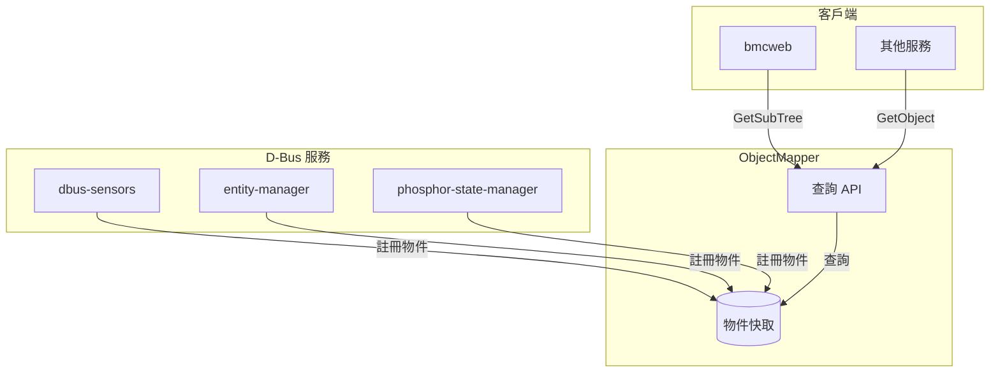

# ObjectMapper Interface - 物件映射器介面

本文件說明 `xyz.openbmc_project.ObjectMapper` 介面。

---

## 📋 概述

ObjectMapper 是 OpenBMC 的核心服務，提供 D-Bus 物件和服務的查詢功能。它追蹤所有 D-Bus 物件、它們實作的介面，以及提供這些介面的服務。

### 服務資訊

| 項目 | 值 |
|------|-----|
| 服務名稱 | `xyz.openbmc_project.ObjectMapper` |
| 物件路徑 | `/xyz/openbmc_project/ObjectMapper` |
| 實作專案 | [phosphor-objmgr](https://github.com/openbmc/phosphor-objmgr) |

---

## 🔍 方法總覽

| 方法 | 說明 |
|------|------|
| `GetObject` | 取得指定路徑的服務和介面 |
| `GetAncestors` | 取得祖先物件 |
| `GetSubTree` | 取得子樹中的物件 |
| `GetSubTreePaths` | 取得子樹中的路徑 |
| `GetAssociatedSubTree` | 取得關聯的子樹物件 |
| `GetAssociatedSubTreePaths` | 取得關聯的子樹路徑 |
| `GetAssociatedSubTreeById` | 依 ID 取得關聯的子樹 |
| `GetAssociatedSubTreePathsById` | 依 ID 取得關聯的子樹路徑 |

---

## 📖 GetObject

取得指定路徑的服務和介面資訊。

### 簽名

```
GetObject(string path, array[string] interfaces) -> dict[string, array[string]]
```

### 參數

| 參數 | 型別 | 說明 |
|------|------|------|
| `path` | `string` | 要查詢的物件路徑 |
| `interfaces` | `array[string]` | 用於過濾的介面列表（空陣列表示不過濾） |

### 回傳

`dict[string, array[string]]` - 服務名稱到實作介面列表的映射

### 錯誤

| 錯誤 | 說明 |
|------|------|
| `xyz.openbmc_project.Common.Error.ResourceNotFound` | 找不到指定路徑 |

### 使用範例

```bash
# 查詢溫度感測器物件
busctl call xyz.openbmc_project.ObjectMapper \
    /xyz/openbmc_project/ObjectMapper \
    xyz.openbmc_project.ObjectMapper \
    GetObject sas "/xyz/openbmc_project/sensors/temperature/CPU_Core" 0

# 輸出範例：
# a{sas} 1 "xyz.openbmc_project.HwmonTempSensor" 2 "xyz.openbmc_project.Sensor.Value" "xyz.openbmc_project.Sensor.Threshold.Warning"
```

---

## 📂 GetSubTree

取得指定路徑子樹中的所有物件。

### 簽名

```
GetSubTree(string subtree, int32 depth, array[string] interfaces) 
    -> dict[string, dict[string, array[string]]]
```

### 參數

| 參數 | 型別 | 說明 |
|------|------|------|
| `subtree` | `string` | 子樹根路徑 |
| `depth` | `int32` | 最大搜尋深度（0 = 無限制） |
| `interfaces` | `array[string]` | 用於過濾的介面列表 |

### 回傳

`dict[string, dict[string, array[string]]]` - 路徑到（服務到介面列表映射）的映射

### 使用範例

```bash
# 取得所有溫度感測器
busctl call xyz.openbmc_project.ObjectMapper \
    /xyz/openbmc_project/ObjectMapper \
    xyz.openbmc_project.ObjectMapper \
    GetSubTree sias "/xyz/openbmc_project/sensors/temperature" 0 1 \
    "xyz.openbmc_project.Sensor.Value"

# 取得所有感測器（任何類型）
busctl call xyz.openbmc_project.ObjectMapper \
    /xyz/openbmc_project/ObjectMapper \
    xyz.openbmc_project.ObjectMapper \
    GetSubTree sias "/xyz/openbmc_project/sensors" 0 1 \
    "xyz.openbmc_project.Sensor.Value"
```

---

## 📜 GetSubTreePaths

取得指定路徑子樹中的所有物件路徑。

### 簽名

```
GetSubTreePaths(string subtree, int32 depth, array[string] interfaces) 
    -> array[string]
```

### 參數

| 參數 | 型別 | 說明 |
|------|------|------|
| `subtree` | `string` | 子樹根路徑 |
| `depth` | `int32` | 最大搜尋深度（0 = 無限制） |
| `interfaces` | `array[string]` | 用於過濾的介面列表 |

### 回傳

`array[string]` - 路徑陣列

### 使用範例

```bash
# 取得所有實作 Sensor.Value 的路徑
busctl call xyz.openbmc_project.ObjectMapper \
    /xyz/openbmc_project/ObjectMapper \
    xyz.openbmc_project.ObjectMapper \
    GetSubTreePaths sias "/" 0 1 "xyz.openbmc_project.Sensor.Value"
```

---

## 🌳 GetAncestors

取得指定路徑的所有祖先物件。

### 簽名

```
GetAncestors(string path, array[string] interfaces) 
    -> dict[string, dict[string, array[string]]]
```

### 參數

| 參數 | 型別 | 說明 |
|------|------|------|
| `path` | `string` | 要查詢的路徑 |
| `interfaces` | `array[string]` | 用於過濾的介面列表 |

### 使用範例

```bash
# 取得 CPU0 的祖先物件
busctl call xyz.openbmc_project.ObjectMapper \
    /xyz/openbmc_project/ObjectMapper \
    xyz.openbmc_project.ObjectMapper \
    GetAncestors sas \
    "/xyz/openbmc_project/inventory/system/chassis/motherboard/cpu0" 0
```

---

## 🔗 GetAssociatedSubTree

取得與指定關聯路徑相關的子樹物件。

### 簽名

```
GetAssociatedSubTree(
    object_path associatedPath,
    object_path subtree,
    int32 depth,
    array[string] interfaces
) -> dict[string, dict[string, array[string]]]
```

### 參數

| 參數 | 型別 | 說明 |
|------|------|------|
| `associatedPath` | `object_path` | 關聯端點所在路徑 |
| `subtree` | `object_path` | 子樹根路徑 |
| `depth` | `int32` | 最大搜尋深度 |
| `interfaces` | `array[string]` | 用於過濾的介面列表 |

### 使用範例

```bash
# 取得與 CPU0 關聯的感測器
busctl call xyz.openbmc_project.ObjectMapper \
    /xyz/openbmc_project/ObjectMapper \
    xyz.openbmc_project.ObjectMapper \
    GetAssociatedSubTree ooias \
    "/xyz/openbmc_project/inventory/system/chassis/motherboard/cpu0/sensors" \
    "/xyz/openbmc_project/sensors" 0 1 "xyz.openbmc_project.Sensor.Value"
```

---

## 🔑 GetAssociatedSubTreeById

依識別碼取得關聯的子樹物件。

### 簽名

```
GetAssociatedSubTreeById(
    string id,
    string objectPath,
    array[string] subtreeInterfaces,
    string association,
    array[string] endpointInterfaces
) -> dict[string, dict[string, array[string]]]
```

### 參數

| 參數 | 型別 | 說明 |
|------|------|------|
| `id` | `string` | D-Bus 路徑的葉節點名稱（識別碼） |
| `objectPath` | `string` | 起始搜尋路徑 |
| `subtreeInterfaces` | `array[string]` | 子樹介面過濾 |
| `association` | `string` | 關聯名稱 |
| `endpointInterfaces` | `array[string]` | 端點介面過濾 |

---

## 📊 使用情境

### 情境 1：找出提供特定介面的服務

```bash
# 找出誰提供 State.Host 介面
result=$(busctl call xyz.openbmc_project.ObjectMapper \
    /xyz/openbmc_project/ObjectMapper \
    xyz.openbmc_project.ObjectMapper \
    GetObject sas "/xyz/openbmc_project/state/host0" 1 \
    "xyz.openbmc_project.State.Host")
```

### 情境 2：列舉所有清單項目

```bash
# 取得所有硬體清單項目
busctl call xyz.openbmc_project.ObjectMapper \
    /xyz/openbmc_project/ObjectMapper \
    xyz.openbmc_project.ObjectMapper \
    GetSubTreePaths sias "/xyz/openbmc_project/inventory" 0 1 \
    "xyz.openbmc_project.Inventory.Item"
```

### 情境 3：找出 CPU 相關感測器

```bash
# 透過關聯找出 cpu0 的感測器
busctl call xyz.openbmc_project.ObjectMapper \
    /xyz/openbmc_project/ObjectMapper \
    xyz.openbmc_project.ObjectMapper \
    GetAssociatedSubTreePaths sias \
    "/xyz/openbmc_project/inventory/system/chassis/motherboard/cpu0/sensors" \
    "/" 0 0
```

---

## 🔄 訊號

ObjectMapper 也發出訊號通知物件變化：

| 訊號 | 說明 |
|------|------|
| `InterfacesAdded` | 當物件新增介面時 |
| `InterfacesRemoved` | 當物件移除介面時 |

這些是標準的 `org.freedesktop.DBus.ObjectManager` 訊號。

---

## 📐 架構圖



---

## 💡 最佳實踐

1. **使用介面過濾**
   - 總是提供介面過濾參數以減少回傳資料量
   - 使用空陣列會回傳所有介面

2. **設定適當深度**
   - 使用 depth=0 取得完整子樹
   - 使用較小的深度值可提升效能

3. **快取結果**
   - ObjectMapper 查詢可能較慢
   - 考慮快取常用查詢結果

4. **處理 ResourceNotFound**
   - 物件可能在服務重啟後消失
   - 總是處理找不到資源的情況

---

## 🔍 延伸閱讀

- [phosphor-objmgr](https://github.com/openbmc/phosphor-objmgr) - ObjectMapper 實作
- [Associations](Associations.md) - 關聯機制與 ObjectMapper 整合
- [Namespaces](Namespaces.md) - 了解路徑結構

---

*最後更新：2025-12-19*
