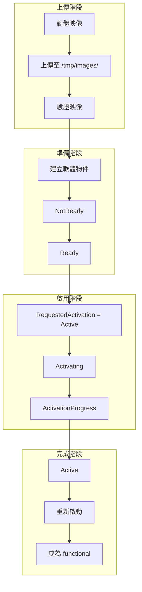

# Software Interfaces - 軟體更新介面

本文件說明 `xyz.openbmc_project.Software` 命名空間下的軟體管理介面。

---

## 📋 概述

軟體介面用於管理 BMC 和主機韌體的版本資訊與更新流程。這些介面主要由 [phosphor-bmc-code-mgmt](https://github.com/openbmc/phosphor-bmc-code-mgmt) 專案實作。

### 核心介面

| 介面 | 說明 |
|------|------|
| `xyz.openbmc_project.Software.Version` | 軟體版本資訊 |
| `xyz.openbmc_project.Software.Activation` | 軟體啟用狀態 |
| `xyz.openbmc_project.Software.ActivationProgress` | 啟用進度 |
| `xyz.openbmc_project.Software.ActivationBlocksTransition` | 啟用阻擋轉換 |
| `xyz.openbmc_project.Software.RedundancyPriority` | 冗餘優先順序 |

---

## 📍 物件路徑

| 路徑 | 說明 |
|------|------|
| `/xyz/openbmc_project/software` | 軟體管理根路徑 |
| `/xyz/openbmc_project/software/<id>` | 軟體版本物件 |
| `/xyz/openbmc_project/software/functional` | 功能關聯位置 |

---

## 📦 xyz.openbmc_project.Software.Version

軟體版本資訊介面。

### 屬性

| 屬性 | 型別 | 說明 |
|------|------|------|
| `Version` | `string` | 版本字串 |
| `Purpose` | `enum[VersionPurpose]` | 軟體用途 |

### VersionPurpose 列舉

| 值 | 說明 |
|----|------|
| `Unknown` | 未知用途 |
| `Other` | 其他用途 |
| `System` | 系統組合映像 |
| `BMC` | BMC 韌體 |
| `Host` | 主機韌體/BIOS |
| `Hypervisor` | 虛擬機管理器 |
| `PSU` | 電源供應器韌體 |

### 使用範例

```bash
# 列出所有軟體版本
busctl call xyz.openbmc_project.Software.BMC.Updater \
    /xyz/openbmc_project/software \
    org.freedesktop.DBus.ObjectManager \
    GetManagedObjects

# 查詢特定版本資訊
busctl get-property xyz.openbmc_project.Software.BMC.Updater \
    /xyz/openbmc_project/software/<id> \
    xyz.openbmc_project.Software.Version Version
```

---

## ⚡ xyz.openbmc_project.Software.Activation

軟體啟用狀態管理介面。

### 屬性

| 屬性 | 型別 | 說明 |
|------|------|------|
| `Activation` | `enum[Activations]` | 啟用狀態 |
| `RequestedActivation` | `enum[RequestedActivations]` | 請求的啟用狀態 |

### Activations 列舉

| 值 | 說明 |
|----|------|
| `NotReady` | 軟體還未準備好啟用 |
| `Invalid` | 軟體無效 |
| `Ready` | 軟體已準備好可以啟用 |
| `Activating` | 正在啟用中 |
| `Active` | 軟體已啟用 |
| `Failed` | 啟用失敗 |
| `Staged` | 軟體已暫存，待下次重啟啟用 |

### RequestedActivations 列舉

| 值 | 說明 |
|----|------|
| `None` | 無請求 |
| `Active` | 請求啟用此軟體版本 |

### 使用範例

```bash
# 查詢啟用狀態
busctl get-property xyz.openbmc_project.Software.BMC.Updater \
    /xyz/openbmc_project/software/<id> \
    xyz.openbmc_project.Software.Activation Activation

# 請求啟用軟體
busctl set-property xyz.openbmc_project.Software.BMC.Updater \
    /xyz/openbmc_project/software/<id> \
    xyz.openbmc_project.Software.Activation RequestedActivation s \
    "xyz.openbmc_project.Software.Activation.RequestedActivations.Active"
```

---

## 📊 xyz.openbmc_project.Software.ActivationProgress

啟用進度追蹤介面。

### 屬性

| 屬性 | 型別 | 說明 |
|------|------|------|
| `Progress` | `byte` | 進度百分比（0-100） |

### 使用範例

```bash
# 查詢啟用進度
busctl get-property xyz.openbmc_project.Software.BMC.Updater \
    /xyz/openbmc_project/software/<id> \
    xyz.openbmc_project.Software.ActivationProgress Progress
```

---

## 🔒 xyz.openbmc_project.Software.ActivationBlocksTransition

指示軟體啟用過程中是否阻擋狀態轉換。

此介面用於通知狀態管理器，在軟體更新期間不應執行主機或 BMC 的狀態轉換（如重啟）。

---

## 🔄 xyz.openbmc_project.Software.RedundancyPriority

冗餘優先順序介面，用於多版本軟體管理。

### 屬性

| 屬性 | 型別 | 說明 |
|------|------|------|
| `Priority` | `byte` | 優先順序（0 = 最高） |

### 說明

當系統支援多個軟體版本時，`Priority` 決定哪個版本在下次開機時使用：
- `0` = 主要版本，下次開機使用
- 更高數字 = 備用版本

---

## 📤 韌體更新流程



---

## 🔗 關聯

### functional 關聯

`/xyz/openbmc_project/software/functional` 路徑持有一個關聯，指向目前正在運行的軟體版本：

```bash
# 查詢目前運行的軟體版本
busctl get-property xyz.openbmc_project.ObjectMapper \
    /xyz/openbmc_project/software/functional/software_version \
    xyz.openbmc_project.Association endpoints
```

### updateable 關聯

軟體物件可以有 `updateable` 關聯，指向可更新的硬體清單項目。

---

## 📋 韌體相容性

### xyz.openbmc_project.Software.ExtendedVersion

擴展版本資訊。

| 屬性 | 型別 | 說明 |
|------|------|------|
| `ExtendedVersion` | `string` | 擴展版本字串 |

### xyz.openbmc_project.Software.MinimumVersion

最低版本要求。

| 屬性 | 型別 | 說明 |
|------|------|------|
| `MinimumVersion` | `string` | 最低支援版本 |

---

## 💻 命令列操作範例

### 透過 Redfish 更新韌體

```bash
# 上傳韌體
curl -k -X POST https://<bmc>/redfish/v1/UpdateService \
    -H "Content-Type: application/octet-stream" \
    --data-binary @firmware.tar -u root:0penBmc

# 查詢更新狀態
curl -k https://<bmc>/redfish/v1/UpdateService/FirmwareInventory \
    -u root:0penBmc
```

### 透過 D-Bus 操作

```bash
# 列出所有軟體版本
busctl tree xyz.openbmc_project.Software.BMC.Updater

# 刪除軟體版本（如果支援 Delete 介面）
busctl call xyz.openbmc_project.Software.BMC.Updater \
    /xyz/openbmc_project/software/<id> \
    xyz.openbmc_project.Object.Delete \
    Delete
```

---

## 🔍 延伸閱讀

- [phosphor-bmc-code-mgmt](https://github.com/openbmc/phosphor-bmc-code-mgmt) - 軟體管理實作
- [StateInterfaces](StateInterfaces.md) - 軟體更新與狀態管理
- [bmcweb](https://github.com/openbmc/bmcweb) - Redfish UpdateService

---

*最後更新：2025-12-19*
