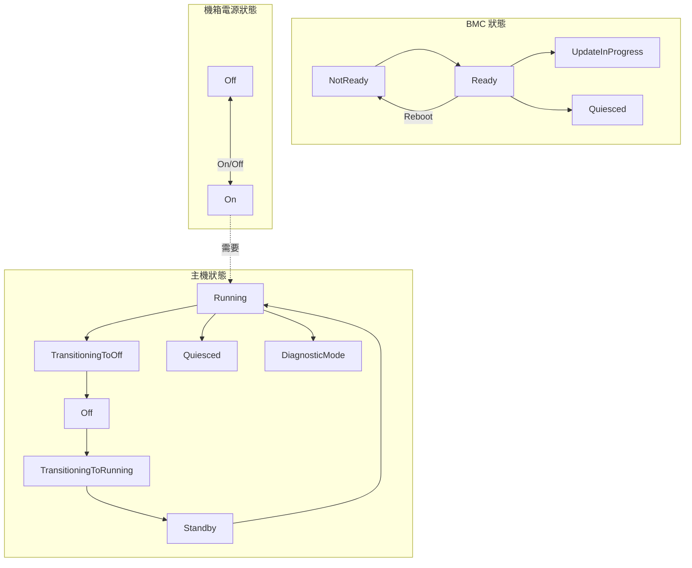

# State Interfaces - 狀態管理介面

本文件說明 `xyz.openbmc_project.State` 命名空間下的狀態管理介面。

---

## 📋 概述

狀態介面用於管理和監控 BMC、主機和機箱的運行狀態。這些介面主要由 [phosphor-state-manager](https://github.com/openbmc/phosphor-state-manager) 專案實作。

### 核心狀態介面

| 介面 | 說明 |
|------|------|
| `xyz.openbmc_project.State.BMC` | BMC 控制器狀態 |
| `xyz.openbmc_project.State.Host` | 主機系統狀態 |
| `xyz.openbmc_project.State.Chassis` | 機箱電源狀態 |
| `xyz.openbmc_project.State.Watchdog` | 看門狗計時器 |

### 輔助狀態介面

| 介面 | 說明 |
|------|------|
| `xyz.openbmc_project.State.Boot.Progress` | 開機進度 |
| `xyz.openbmc_project.State.OperatingSystem.Status` | 作業系統狀態 |
| `xyz.openbmc_project.State.ScheduledHostTransition` | 排程主機轉換 |

---

## 📍 物件路徑

| 路徑 | 說明 |
|------|------|
| `/xyz/openbmc_project/state/bmc0` | BMC 實例 0 |
| `/xyz/openbmc_project/state/host0` | 主機實例 0 |
| `/xyz/openbmc_project/state/chassis0` | 機箱實例 0 |

> [!NOTE]
> 單一系統通常使用實例 0。多主機或多機箱系統會從實例 1 開始編號，保留 0 作為整體系統操作。

---

## 🖥️ xyz.openbmc_project.State.BMC

BMC（基板管理控制器）狀態管理介面。

### 屬性

| 屬性 | 型別 | 說明 |
|------|------|------|
| `RequestedBMCTransition` | `enum[Transition]` | 請求的 BMC 狀態轉換 |
| `CurrentBMCState` | `enum[BMCState]` | 目前 BMC 狀態 |
| `LastRebootTime` | `uint64` | 上次重啟時間戳 |

### Transition 列舉

| 值 | 說明 |
|----|------|
| `None` | 無轉換請求 |
| `Reboot` | 請求重新開機 |
| `HardReboot` | 請求硬重開機 |

### BMCState 列舉

| 值 | 說明 |
|----|------|
| `Ready` | BMC 已就緒，所有服務已啟動 |
| `NotReady` | BMC 正在啟動中 |
| `UpdateInProgress` | 韌體更新中 |
| `Quiesced` | BMC 處於靜止狀態 |

### 使用範例

```bash
# 查詢 BMC 目前狀態
busctl get-property xyz.openbmc_project.State.BMC \
    /xyz/openbmc_project/state/bmc0 \
    xyz.openbmc_project.State.BMC CurrentBMCState

# 請求 BMC 重新啟動
busctl set-property xyz.openbmc_project.State.BMC \
    /xyz/openbmc_project/state/bmc0 \
    xyz.openbmc_project.State.BMC RequestedBMCTransition s \
    "xyz.openbmc_project.State.BMC.Transition.Reboot"
```

---

## 💻 xyz.openbmc_project.State.Host

主機系統狀態管理介面，控制伺服器主機的開關機。

### 屬性

| 屬性 | 型別 | 說明 |
|------|------|------|
| `RequestedHostTransition` | `enum[Transition]` | 請求的主機狀態轉換 |
| `CurrentHostState` | `enum[HostState]` | 目前主機狀態 |
| `AllowedHostTransitions` | `set[enum[Transition]]` | 允許的轉換操作（const） |
| `RestartCause` | `enum[RestartCause]` | 上次重啟原因 |

### Transition 列舉

| 值 | 說明 |
|----|------|
| `Off` | 關閉主機 |
| `On` | 開啟主機 |
| `Reboot` | 重新開機（冷重啟，機箱電源會關閉再開啟） |
| `GracefulWarmReboot` | 優雅暖重啟（通知主機關機後再重啟） |
| `ForceWarmReboot` | 強制暖重啟（不通知直接重啟，保持機箱電源） |

### HostState 列舉

| 值 | 說明 |
|----|------|
| `Off` | 主機韌體未運行 |
| `Running` | 主機韌體運行中 |
| `TransitioningToOff` | 正在轉換到關閉狀態 |
| `TransitioningToRunning` | 正在轉換到運行狀態 |
| `Standby` | 待機狀態（介於 Off 和 Running 之間） |
| `Quiesced` | 靜止狀態（主機已啟用但無回應） |
| `DiagnosticMode` | 診斷模式（正在收集除錯資訊） |

### RestartCause 列舉

| 值 | 說明 |
|----|------|
| `Unknown` | 原因不明 |
| `RemoteCommand` | 遠端命令觸發 |
| `ResetButton` | 重置按鈕觸發 |
| `PowerButton` | 電源按鈕觸發 |
| `WatchdogTimer` | 看門狗計時器到期 |
| `PowerPolicyAlwaysOn` | 電源策略：永遠開啟 |
| `PowerPolicyPreviousState` | 電源策略：恢復上次狀態 |
| `SoftReset` | 軟重置 |
| `ScheduledPowerOn` | 排程開機 |
| `HostCrash` | 主機當機自動重啟 |

### 使用範例

```bash
# 查詢主機目前狀態
busctl get-property xyz.openbmc_project.State.Host \
    /xyz/openbmc_project/state/host0 \
    xyz.openbmc_project.State.Host CurrentHostState

# 請求開啟主機
busctl set-property xyz.openbmc_project.State.Host \
    /xyz/openbmc_project/state/host0 \
    xyz.openbmc_project.State.Host RequestedHostTransition s \
    "xyz.openbmc_project.State.Host.Transition.On"

# 請求關閉主機
busctl set-property xyz.openbmc_project.State.Host \
    /xyz/openbmc_project/state/host0 \
    xyz.openbmc_project.State.Host RequestedHostTransition s \
    "xyz.openbmc_project.State.Host.Transition.Off"
```

---

## ⚡ xyz.openbmc_project.State.Chassis

機箱電源狀態管理介面。

### 屬性

| 屬性 | 型別 | 說明 |
|------|------|------|
| `RequestedPowerTransition` | `enum[Transition]` | 請求的電源狀態轉換 |
| `CurrentPowerState` | `enum[PowerState]` | 目前電源狀態 |
| `LastStateChangeTime` | `uint64` | 上次狀態變更時間戳 |

### Transition 列舉

| 值 | 說明 |
|----|------|
| `Off` | 關閉機箱電源 |
| `On` | 開啟機箱電源 |
| `PowerCycle` | 電源循環（關閉再開啟） |

### PowerState 列舉

| 值 | 說明 |
|----|------|
| `Off` | 電源關閉 |
| `On` | 電源開啟 |
| `TransitioningToOff` | 正在轉換到關閉 |
| `TransitioningToOn` | 正在轉換到開啟 |

### 使用範例

```bash
# 查詢機箱電源狀態
busctl get-property xyz.openbmc_project.State.Chassis \
    /xyz/openbmc_project/state/chassis0 \
    xyz.openbmc_project.State.Chassis CurrentPowerState

# 執行電源循環
busctl set-property xyz.openbmc_project.State.Chassis \
    /xyz/openbmc_project/state/chassis0 \
    xyz.openbmc_project.State.Chassis RequestedPowerTransition s \
    "xyz.openbmc_project.State.Chassis.Transition.PowerCycle"
```

---

## 🐕 xyz.openbmc_project.State.Watchdog

看門狗計時器介面，用於監控系統健康狀態。

### 屬性

| 屬性 | 型別 | 說明 |
|------|------|------|
| `Enabled` | `boolean` | 是否啟用 |
| `ExpireAction` | `enum[Action]` | 到期時執行的動作 |
| `Interval` | `uint64` | 計時間隔（毫秒） |
| `TimeRemaining` | `uint64` | 剩餘時間（毫秒） |
| `CurrentTimerUse` | `enum[TimerUse]` | 目前計時器用途 |
| `ExpiredTimerUse` | `enum[TimerUse]` | 到期時的計時器用途 |

### Action 列舉

| 值 | 說明 |
|----|------|
| `None` | 無動作 |
| `HardReset` | 硬重置 |
| `PowerOff` | 關閉電源 |
| `PowerCycle` | 電源循環 |

### 方法

| 方法 | 說明 |
|------|------|
| `ResetTimeRemaining(bool enableWatchdog)` | 重置計時器 |

---

## 🔄 狀態關係圖



---

## 🔀 Hard vs. Soft Power Off

| 類型 | 說明 | 操作方式 |
|------|------|----------|
| **Soft Power Off** | 通知主機進行優雅關機 | 設定 `Host.RequestedHostTransition = Off` |
| **Hard Power Off** | 直接切斷電源，不通知主機 | 設定 `Chassis.RequestedPowerTransition = Off` |

> [!TIP]
> 預設的主機關機或重啟請求會執行軟關機。如需冷重啟，應先對機箱執行 Off 轉換，再對主機執行 On 轉換。

---

## 🔗 多主機/多機箱系統

在複雜系統中的命名規則：

| 配置 | 編號規則 |
|------|----------|
| 單一系統 | `bmc0`, `host0`, `chassis0` |
| 多主機 | `host1`, `host2`, ... |
| 多機箱 | `chassis1`, `chassis2`, ... |

特殊規則：
- `bmc0`, `chassis0`, `host0` 若存在，代表整體系統操作
- 多主機系統中，這些實例 0 不會存在，避免歧義

---

## 🔍 延伸閱讀

- [phosphor-state-manager](https://github.com/openbmc/phosphor-state-manager) - 狀態管理實作
- [ControlInterfaces](ControlInterfaces.md) - 電源控制相關介面
- [LoggingInterfaces](LoggingInterfaces.md) - 狀態變更日誌記錄

---

*最後更新：2025-12-19*
