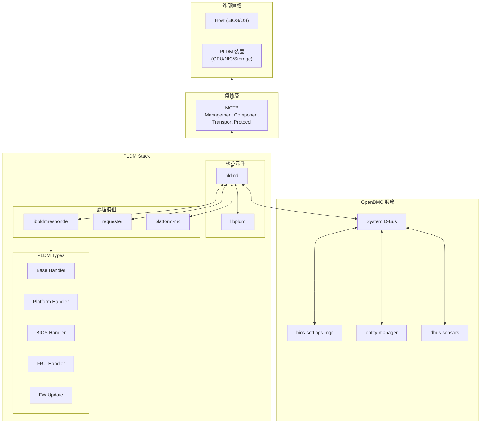
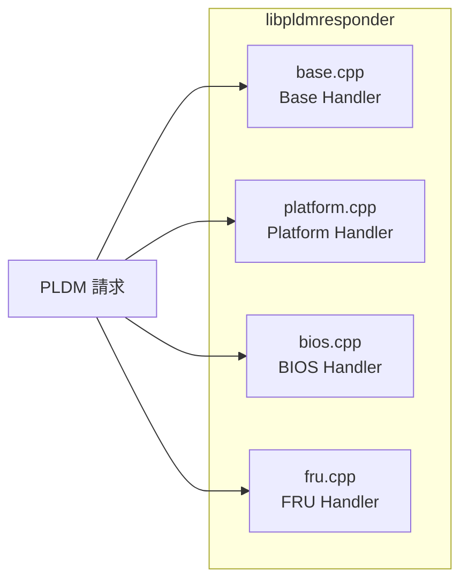
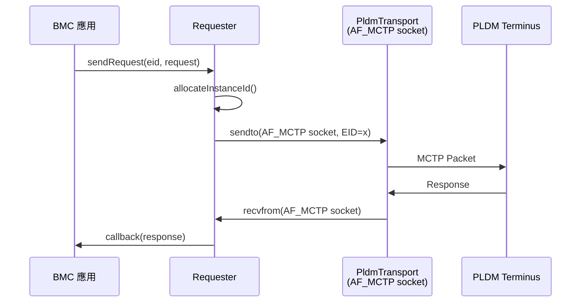
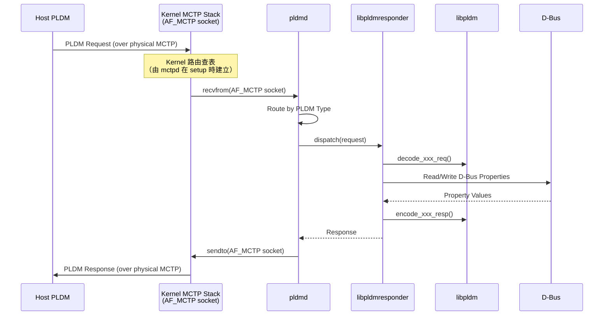
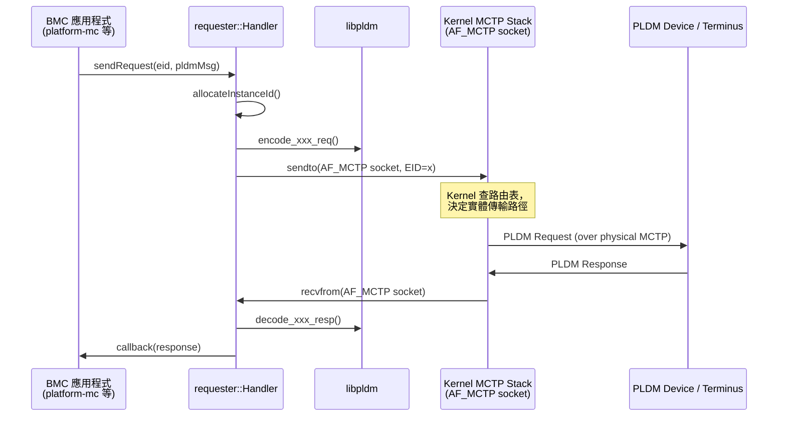

# PLDM 系統架構

本文件說明 OpenBMC PLDM 專案的整體系統架構與設計理念。

---

## 概述

OpenBMC PLDM 實現是一個模組化的 DMTF PLDM 規範實作，支援 BMC 同時作為 **PLDM Responder** 和 **PLDM Requester** 角色。

### 設計目標

1. **標準化通訊** - 遵循 DMTF PLDM 規範
2. **模組化架構** - 各 PLDM Type 獨立實作
3. **可擴充性** - 支援 OEM 自訂擴充
4. **D-Bus 整合** - 與 OpenBMC 元件互操作

---

## 高階架構



> **逐步說明：**
>
> 這張圖展示 PLDM 在 OpenBMC 中的整體架構：
>
> - **外部實體**（最上方）：Host（CPU/BIOS）和各種 PLDM 裝置（GPU、NIC、儲存裝置）。這些是 BMC 要管理的對象。
> - **傳輸層**：MCTP 提供底層通訊，PLDM 訊息裝在 MCTP 封包裡傳輸。
> - **PLDM Stack**（中間）：分為三層：
>   - **核心**：`pldmd`（守護程式）和 `libpldm`（編解碼函式庫）
>   - **處理模組**：`libpldmresponder`（回應請求）、`requester`（發送請求）、`platform-mc`（平台監控）
>   - **PLDM Types**：各種類型的具體 Handler
> - **OpenBMC 服務**（最下方）：透過 D-Bus 和其他 OpenBMC 服務互動，例如 entity-manager（硬體配置）、dbus-sensors（感測器）。
>
> **白話總結**：pldmd 是「中樞」，向上透過 MCTP 和裝置通訊，向下透過 D-Bus 和 OpenBMC 其他服務協作。

---

## 核心元件

### pldmd 守護程式

`pldmd` 是 PLDM 的中央守護程式，負責：

| 功能           | 說明                                 |
| -------------- | ------------------------------------ |
| **訊息路由**   | 接收 MCTP 訊息並分發給對應的 Handler |
| **處理註冊**   | 管理各 PLDM Type 的 Handler 註冊     |
| **請求管理**   | 追蹤 Instance ID 與請求/回應配對     |
| **D-Bus 介面** | 提供服務介面給其他 OpenBMC 元件      |

> ⚠️ **概念性說明**：以下 class 不存在於實際 source code。pldmd 是透過 `main()` 函式中的 `Invoker` + `CmdHandler` 實現訊息路由，並非封裝在單一 class 內。詳見 [Pldmd](Pldmd.md)。

```cpp
// 概念性簡化 — 實際實作請參考 pldmd/pldmd.cpp 中的 main()
class Pldmd {
    void registerHandler(PldmType type, Handler handler);
    void handleRequest(mctp_eid_t eid, Request request);
    Response sendRequest(mctp_eid_t eid, Request request);
};
```

---

### libpldm

`libpldm` 是獨立的 C 函式庫，提供：

- PLDM 訊息編碼/解碼 API
- PDR (Platform Descriptor Record) 結構操作
- BIOS 表格處理
- FRU 資料格式化

> **注意**: libpldm 是[獨立專案](https://github.com/openbmc/libpldm)，作為 subproject 使用。

---

### libpldmresponder

處理 BMC 作為 PLDM Responder 時的所有請求：



> **逐步說明：**
>
> 這張圖展示 `libpldmresponder` 內部的組成：它包含四個 Handler，各自處理不同的 PLDM Type：
>
> - **base.cpp**：Base Handler，處理基礎探索命令（像「你支援什麼？」）
> - **platform.cpp**：Platform Handler，處理平台監控命令（像「讀取溫度 Sensor」）
> - **bios.cpp**：BIOS Handler，處理 BIOS 配置命令（像「讀取開機模式」）
> - **fru.cpp**：FRU Handler，處理硬體資訊命令（像「讀取主機板序號」）
>
> 當 PLDM 請求進來時，根據它的 Type 被分發到對應的 Handler。

#### Handler 介面

> ⚠️ **簡化說明**：以下 handler 範例簡化了實際的函式簽名。實際的 handler 簽名為 `Response handler(pldm_tid_t tid, const pldm_msg* request, size_t reqMsgLen)`，包含 TID 參數。

```cpp
// 簡化編碼/解碼流程範例
Response getPLDMTypes(pldm_tid_t tid, const pldm_msg* request, size_t len) {
    // 1. 解碼請求 (使用 libpldm)
    // 2. 處理邏輯
    uint8_t types = getSupportedTypes();
    // 3. 編碼回應 (使用 libpldm)
    encode_get_types_resp(instanceId, PLDM_SUCCESS, types, response);
    return response;
}
```

---

### requester 模組

管理 BMC 作為 PLDM Requester 時的請求流程：

| 元件           | 檔案                          | 功能                   |
| -------------- | ----------------------------- | ---------------------- |
| Handler        | `handler.hpp`                 | 請求佇列管理與回應處理 |
| Request        | `request.hpp`                 | 請求封裝與重試邏輯     |
| MCTP Discovery | `mctp_endpoint_discovery.cpp` | PLDM 端點探索          |



> **逐步說明：**
>
> 1. **BMC 應用發起請求**：BMC 上的某個模組（如 platform-mc）想向遠端裝置發送 PLDM 請求。
> 2. **分配 Instance ID**：Requester 模組分配一個唯一的 Instance ID，用於之後匹配請求和回應。
> 3. **發送訊息**：透過 MCTP 傳輸層發送封包到遠端 PLDM Terminus。
> 4. **等待回應**：遠端 Terminus 處理後回傳 Response。
> 5. **回調通知**：Requester 收到 Response 後，透過 callback 通知原始呼叫者。
>
> **白話總結**：就像打電話——撥號（發送請求）→ 等對方接起（等待回應）→ 對方回答（回調）。

---

### platform-mc 模組

Platform Monitoring and Control 的 MC (Management Controller) 端實作：

| 元件                   | 說明                     |
| ---------------------- | ------------------------ |
| `terminus.cpp`         | PLDM Terminus 管理       |
| `terminus_manager.cpp` | 多 Terminus 生命週期管理 |
| `platform_manager.cpp` | PDR 與 Sensor 管理       |
| `sensor_manager.cpp`   | Sensor 讀取與事件處理    |
| `event_manager.cpp`    | PLDM 事件處理            |
| `numeric_sensor.cpp`   | 數值型 Sensor 實作       |

---

## 資料流

> **⚠️ 架構說明（重要）**
>
> 現代 OpenBMC（使用 `PLDM_TRANSPORT_WITH_AF_MCTP` 編譯選項，目前主流）中，`pldmd` **直接透過 Linux Kernel 的 `AF_MCTP` socket** 收發 PLDM 訊息，不需要任何中間 Daemon 轉發。
>
> `mctpd`（MCTP Bus-Owner Daemon）**不參與 PLDM 的 request/response 資料流**。它只負責 **Control Plane**：在 setup 階段分配 EID、建立 kernel route/neigh 表、發布 D-Bus 物件。資料流建立後，`mctpd` 就退到背景，不再涉入。
>
> ⚠️ 舊版 OpenBMC 曾使用 `mctp-demux-daemon`（`PLDM_TRANSPORT_WITH_MCTP_DEMUX`），該 daemon 才是真正的訊息中繼。現代架構已移除此 daemon，改為 kernel 直連。

### BMC 作為 Responder



> **逐步說明：**
>
> 這張圖展示 BMC 作為 Responder（回應者）時的現代架構流程：
>
> 1. **Host 發送 PLDM 請求**：Host 透過實體 MCTP 傳輸（如 I2C/PCIe）發送請求給 BMC。
> 2. **Kernel 路由**：Linux Kernel MCTP Stack 收到封包後，根據 `mctpd` 在 setup 時建立的 kernel route/neigh 表，將封包遞送給監聽對應 EID 的 socket（pldmd 的 AF_MCTP socket）。
> 3. **pldmd 直接收訊**：pldmd 透過 `recvfrom()` 從自己的 AF_MCTP socket 收到訊息，根據 PLDM Type 分發給對應 Handler。
> 4. **Handler 解碼請求**：用 libpldm 的 `decode_xxx_req()` 解碼請求內容。
> 5. **讀寫 D-Bus**：Handler 透過 D-Bus 讀取或寫入系統屬性（如讀取溫度、設定開機模式）。
> 6. **編碼並發送回應**：用 libpldm 的 `encode_xxx_resp()` 編碼後，透過 `sendto()` 直接回傳給 Kernel，Kernel 再轉發給 Host。
>
> **白話總結**：pldmd 像直撥電話——直接接通 kernel（不需要轉接手）→ 查資料（D-Bus）→ 組裝答案（編碼）→ 直接回覆（kernel 轉發）。

### BMC 作為 Requester



> **逐步說明：**
>
> 這張圖展示 BMC 作為 Requester（請求者）時的現代架構流程：
>
> 1. **BMC 應用發起請求**：BMC 的某個模組（如 platform-mc）想向遠端 PLDM Terminus 查詢資訊，呼叫 `requester::Handler::sendRequest()`。
> 2. **分配 Instance ID**：Requester 分配唯一的 Instance ID，用於之後配對請求和回應。
> 3. **編碼請求**：用 libpldm 的 `encode_xxx_req()` 將請求編碼成 PLDM 格式。
> 4. **直接發送到 Kernel**：透過 `sendto()` 呼叫 AF_MCTP socket，由 **Kernel MCTP Stack** 負責查路由表、進行實體傳輸——**不需要任何中間 daemon**。
> 5. **等待回應**：遠端 Terminus 處理後回傳 PLDM Response，Kernel 將其遞送回 Requester 的 socket。
> 6. **解碼並回調**：Requester 收到 Response，用 libpldm 解碼後，透過 callback 通知原始呼叫者。
>
> **與 Responder 的差異**：Responder 是「等別人問」，Requester 是「主動問別人」。兩者都直接操作 AF_MCTP socket，都經過 libpldm 做編解碼，都不需要中間 daemon 轉發。

---

## D-Bus 整合

PLDM 透過 D-Bus 與 OpenBMC 其他服務互動：

### 提供的服務

| 服務名稱                   | 物件路徑                    | 功能        |
| -------------------------- | --------------------------- | ----------- |
| `xyz.openbmc_project.PLDM` | `/xyz/openbmc_project/pldm` | PLDM 主服務 |

### 使用的介面

| 介面                                     | 用途            |
| ---------------------------------------- | --------------- |
| `xyz.openbmc_project.Inventory.Item`     | FRU 資料發布    |
| `xyz.openbmc_project.Sensor.Value`       | Sensor 數值發布 |
| `xyz.openbmc_project.BIOSConfig.Manager` | BIOS 配置       |
| `xyz.openbmc_project.State.Host`         | Host 狀態監控   |

---

## 目錄結構

```
pldm/
├── pldmd/                    # pldmd 守護程式主程式
├── libpldmresponder/         # PLDM Responder 處理函式庫
│   ├── base.cpp/hpp          # Base Type Handler
│   ├── platform.cpp/hpp      # Platform Type Handler
│   ├── bios.cpp/hpp          # BIOS Type Handler
│   ├── fru.cpp/hpp           # FRU Type Handler
│   └── pdr_*.hpp             # PDR 相關處理
├── requester/                # PLDM Requester 模組
│   ├── handler.hpp           # 請求處理器
│   ├── request.hpp           # 請求封裝
│   └── mctp_endpoint_discovery.cpp
├── platform-mc/              # Platform MC 實作
│   ├── manager.cpp/hpp       # 頂層 Manager (整合所有子系統)
│   ├── terminus.cpp/hpp      # Terminus 管理與 PDR 解析
│   ├── terminus_manager.cpp/hpp  # Terminus 探索與 TID 管理
│   ├── platform_manager.cpp/hpp  # PDR/FRU 拉取、Event 配置
│   ├── sensor_manager.cpp/hpp    # Per-TID Sensor 輪詢
│   ├── numeric_sensor.cpp/hpp    # 數值型 Sensor D-Bus 物件
│   ├── event_manager.cpp/hpp     # 事件處理
│   ├── dbus_impl_fru.cpp/hpp     # FRU D-Bus 介面
│   └── dbus_to_terminus_effecters.cpp/hpp  # D-Bus → Effecter 映射
├── fw-update/                # 韌體更新模組
├── host-bmc/                 # Host-BMC 通訊
├── softoff/                  # 軟關機功能
├── oem/                      # OEM 擴充
│   ├── ampere/               # Ampere OEM 實作
│   ├── ibm/                  # IBM OEM 實作
│   ├── meta/                 # Meta OEM 實作
│   └── nvidia/               # NVIDIA OEM 實作
├── configurations/           # 配置檔案
├── docs/                     # 官方文件
└── pldmtool/                 # 命令列工具
```

---

## 相關文件

- [PLDMOverview](PLDMOverview.md) - PLDM 協議詳細說明
- [CodeOrganization](CodeOrganization.md) - 程式碼組織深入說明
- [CodeFlows](CodeFlows.md) - 詳細程式碼流程
- [SourceCodeWalkthrough](SourceCodeWalkthrough.md) - pldmd 完整呼叫鏈走讀

---

_返回 [Home](Home.md)_
