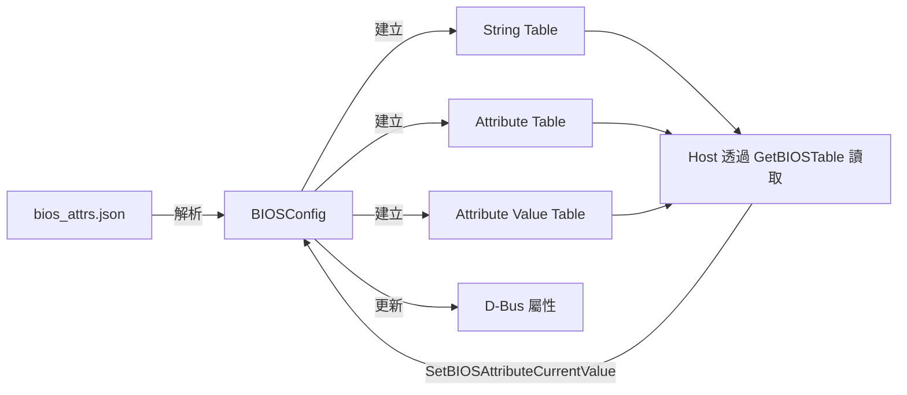
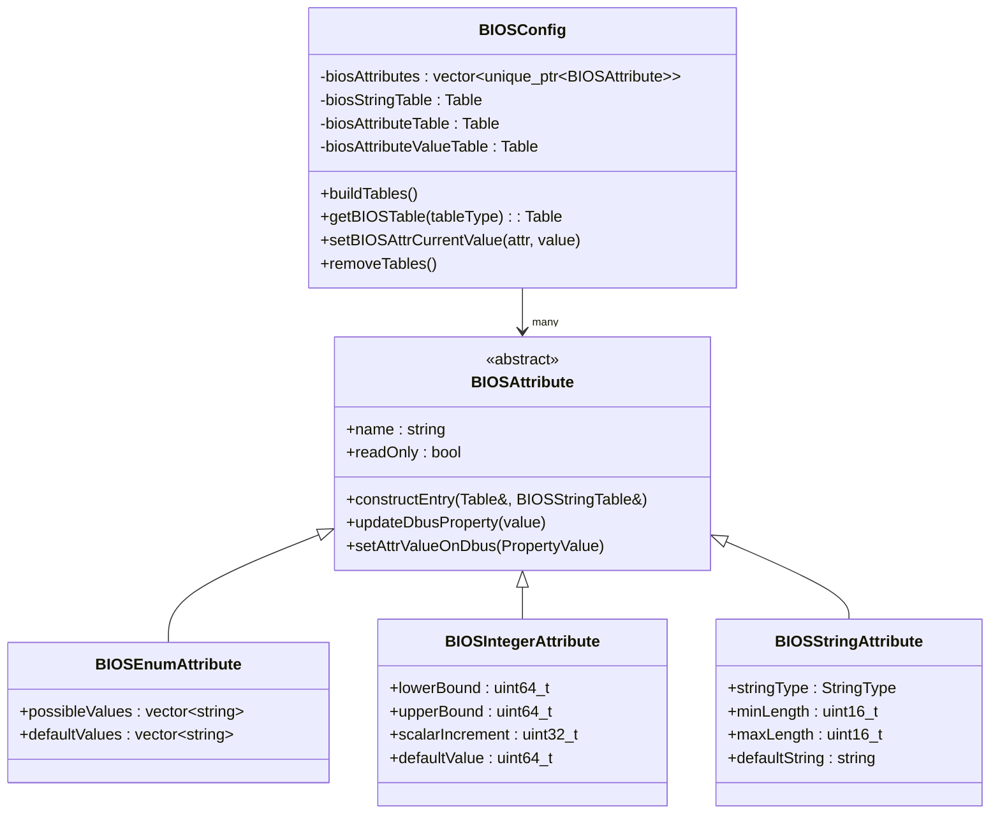
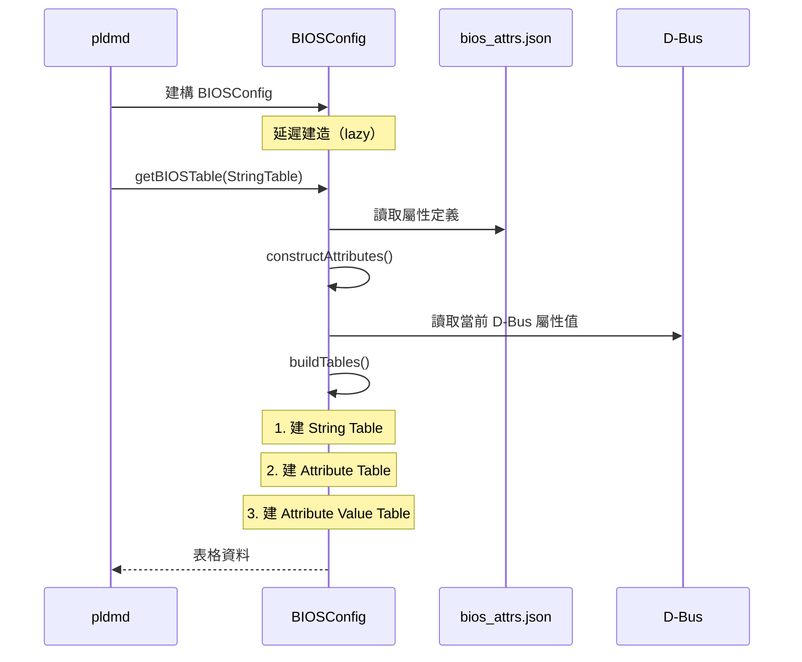

# BIOS 配置

本文件詳述 PLDM BIOS 屬性的配置方式、表格結構、和 D-Bus 整合。

---

## 概述

PLDM BIOS（Type 3）使用三張表格管理 BIOS 配置：

| 表格                      | ID  | 說明                         |
| ------------------------- | --- | ---------------------------- |
| **String Table**          | 0   | 所有字串的集中儲存           |
| **Attribute Table**       | 1   | 屬性定義（名稱、類型、約束） |
| **Attribute Value Table** | 2   | 屬性當前值                   |



> **逐步說明：**
>
> 1. **解析 JSON**：BIOSConfig 從 `bios_attrs.json` 讀取屬性定義。
> 2. **建立三張表格**：String Table、Attribute Table、Attribute Value Table。
> 3. **Host 讀取**：Host 透過 `GetBIOSTable` 命令讀取表格。
> 4. **Host 寫入**：Host 透過 `SetBIOSAttributeCurrentValue` 修改屬性，BIOSConfig 同步到 D-Bus。
>
> **白話總結**：BIOSConfig 是 BIOS 設定的「中間人」，從 JSON 建表，供 Host 讀寫，同步到 D-Bus。

---

## JSON 配置檔

BIOS 屬性透過 JSON 檔案定義：

```
oem/<vendor>/configurations/bios/
├── bios_attrs.json                    # 通用配置
└── <system_type>/
    └── bios_attrs.json                # 系統特定配置
```

### Enumeration 屬性

```json
{
  "attribute_type": "enum",
  "attribute_name": "BootMode",
  "possible_values": ["Legacy", "UEFI"],
  "default_values": ["UEFI"],
  "help_text": "Boot mode selection",
  "display_name": "Boot Mode",
  "dbus": {
    "object_path": "/xyz/openbmc_project/control/host0/boot",
    "interface": "xyz.openbmc_project.Control.Boot.Mode",
    "property_name": "BootMode",
    "property_type": "string",
    "property_values": [
      "xyz.openbmc_project.Control.Boot.Mode.Modes.Regular",
      "xyz.openbmc_project.Control.Boot.Mode.Modes.Safe"
    ]
  }
}
```

### Integer 屬性

```json
{
  "attribute_type": "integer",
  "attribute_name": "MemoryMirroring",
  "lower_bound": 0,
  "upper_bound": 100,
  "scalar_increment": 1,
  "default_value": 0,
  "display_name": "Memory Mirroring Percentage",
  "dbus": {
    "object_path": "/xyz/openbmc_project/bios",
    "interface": "xyz.openbmc_project.BIOSConfig.Attributes",
    "property_name": "MemoryMirroring",
    "property_type": "uint64_t"
  }
}
```

### String 屬性

```json
{
  "attribute_type": "string",
  "attribute_name": "AssetTag",
  "string_type": "ASCII",
  "minimum_string_length": 0,
  "maximum_string_length": 64,
  "default_string": "",
  "display_name": "Asset Tag"
}
```

---

## 類別架構



> **逐步說明（BIOS 屬性類別圖）：**
>
> 這張圖展示 BIOS 屬性的繼承體系（Template Method Pattern）：
>
> | 類別                      | 角色                                     | 主要成員                                                                                                                                                                                                                                             |
> | ------------------------- | ---------------------------------------- | ---------------------------------------------------------------------------------------------------------------------------------------------------------------------------------------------------------------------------------------------------- |
> | **BIOSAttribute**（抽象） | 所有 BIOS 屬性的共同介面                 | `name`（屬性名稱）、`readOnly`（唯讀旗標）、`constructEntry()`（在 Attribute Table 中建立條目）、`updateDbusProperty()`（同步到 D-Bus）                                                                                                              |
> | **BIOSEnumAttribute**     | 列舉型屬性（如 BootMode: Legacy / UEFI） | `possibleValues`（合法值列表）、`defaultValues`（預設值列表）。需要在 String Table 中為每個可能值建立字串條目。                                                                                                                                      |
> | **BIOSIntegerAttribute**  | 整數型屬性（如 Memory Mirroring: 0~100） | `lowerBound`（下限）、`upperBound`（上限）、`scalarIncrement`（步進值）、`defaultValue`（預設值）。                                                                                                                                                  |
> | **BIOSStringAttribute**   | 字串型屬性（如 AssetTag: "Server01"）    | `stringType`（ASCII/UTF-8 等）、`minLength`、`maxLength`、`defaultString`。                                                                                                                                                                          |
> | **BIOSConfig**            | 所有屬性的容器與管理者                   | 維護三張表格：`biosStringTable`、`biosAttributeTable`、`biosAttributeValueTable`，以及 `biosAttributes` 向量。`buildTables()` 是建表的入口，`getBIOSTable()` 提供給 Handler 讀取，`setBIOSAttrCurrentValue()` 負責接收 Host 寫入的變更並更新 D-Bus。 |
>
> **設計模式**：這是 **Strategy Pattern** 的實作。`BIOSConfig` 呼叫 `BIOSAttribute::constructEntry()`，由子類決定「如何在表格中建立自己的條目格式」，彼此互不干涉。
>
> **白話總結**：三種屬性都有「名字」、「能讀寫」的共同特性（父類），但 Enum 有可選清單、Integer 有範圍約束、String 有長度限制（各自的子類特性）。BIOSConfig 是「管理員」，持有所有屬性並負責建表給 Host 讀取。

---

## 表格建造流程



> **逐步說明：**
>
> 1. **建構 BIOSConfig**：pldmd 啟動時建立 BIOSConfig 物件，但不立即建表。
> 2. **延遲建造**：第一次收到 `GetBIOSTable` 請求時才觸發建表。
> 3. **建表流程**：讀取 JSON → 建立屬性物件 → 從 D-Bus 讀取當前值 → 依序建立 String Table、Attribute Table、Attribute Value Table。
>
> **重要**：使用「懶惰建造」模式，避免在沒人查詢時浪費資源。

---

## 系統特定配置

啟用：

```bash
meson setup build -Dsystem-specific-bios-json=enabled
```

PLDM 會從 Entity Manager 取得系統類型，然後載入對應目錄下的 `bios_attrs.json`。

---

## D-Bus 整合

### 提供的 D-Bus 介面

| 介面                                     | 物件路徑                                   | 說明          |
| ---------------------------------------- | ------------------------------------------ | ------------- |
| `xyz.openbmc_project.BIOSConfig.Manager` | `/xyz/openbmc_project/bios_config/manager` | BIOS 配置管理 |

### D-Bus 屬性

| 屬性                | 類型 | 說明                                       |
| ------------------- | ---- | ------------------------------------------ |
| `BaseBIOSTable`     | dict | 完整 BIOS 屬性表格                         |
| `PendingAttributes` | dict | 等待套用的變更                             |
| `ResetBIOSSettings` | enum | 重設 BIOS 設定（NoAction/FactoryDefaults） |

### 操作範例

```bash
# 查看 BIOS 屬性
$ busctl get-property xyz.openbmc_project.PLDM \
    /xyz/openbmc_project/bios_config/manager \
    xyz.openbmc_project.BIOSConfig.Manager \
    BaseBIOSTable

# 使用 pldmtool
$ pldmtool bios GetBIOSTable -t 0    # String Table
$ pldmtool bios GetBIOSTable -t 1    # Attribute Table
$ pldmtool bios GetBIOSTable -t 2    # Attribute Value Table
```

---

## 原始碼

| 檔案                             | 大小 | 說明             |
| -------------------------------- | ---- | ---------------- |
| `bios_config.cpp`                | 41KB | 建表核心邏輯     |
| `bios_config.hpp`                | 14KB | BIOSConfig 類別  |
| `bios_table.cpp/hpp`             | 25KB | 表格操作工具     |
| `bios_attribute.cpp/hpp`         | 5KB  | 屬性抽象基底類別 |
| `bios_enum_attribute.cpp/hpp`    | 13KB | Enum 屬性        |
| `bios_integer_attribute.cpp/hpp` | 10KB | Integer 屬性     |
| `bios_string_attribute.cpp/hpp`  | 9KB  | String 屬性      |

---

## 相關文件

- [LibpldmResponder](LibpldmResponder.md) - BIOS Handler
- [TypeBIOS](TypeBIOS.md) - BIOS Type 協議

---

_返回 [Home](Home.md)_
