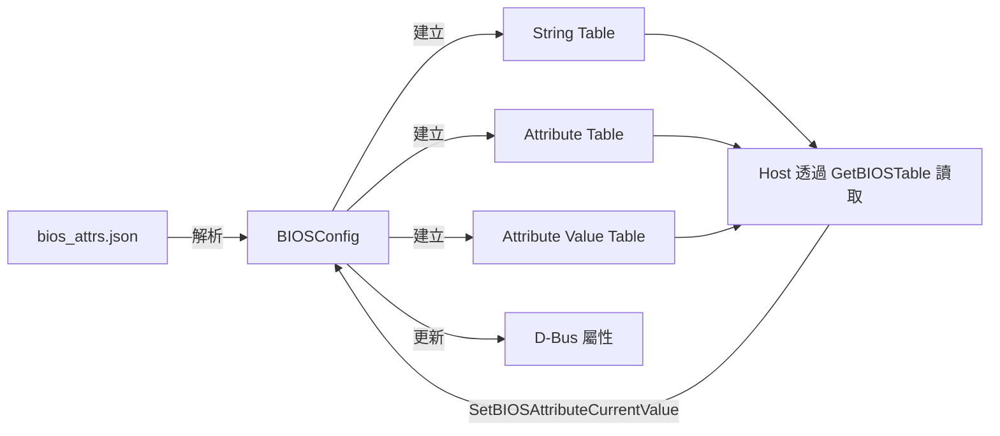
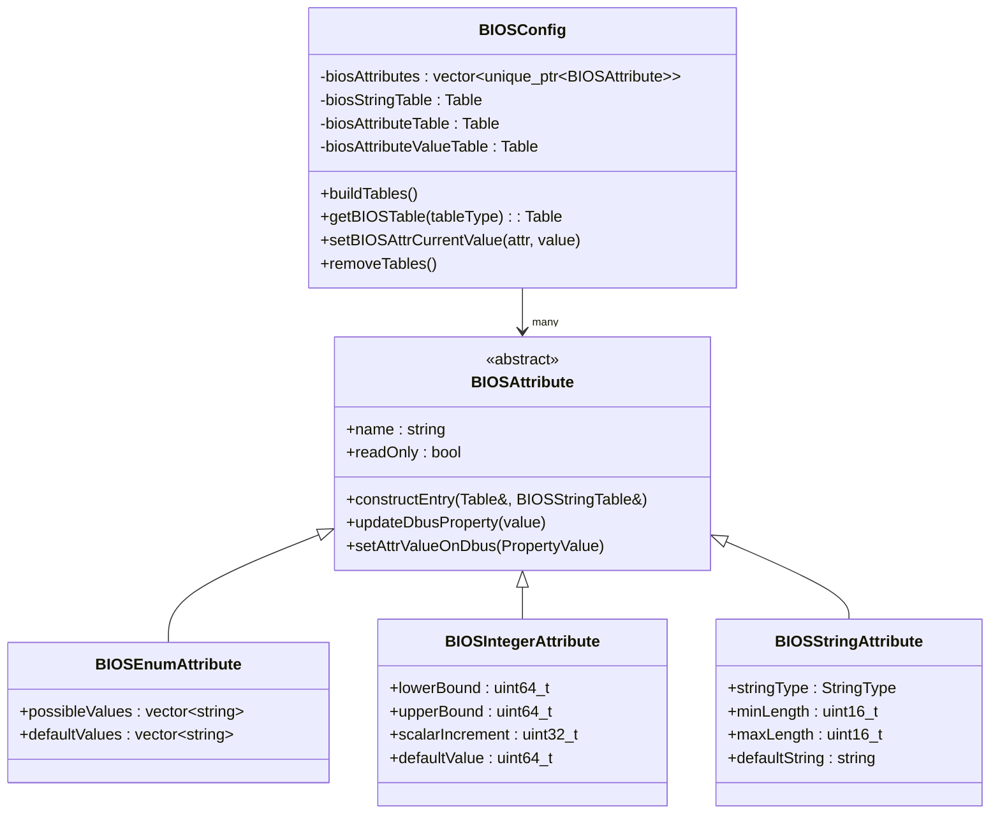
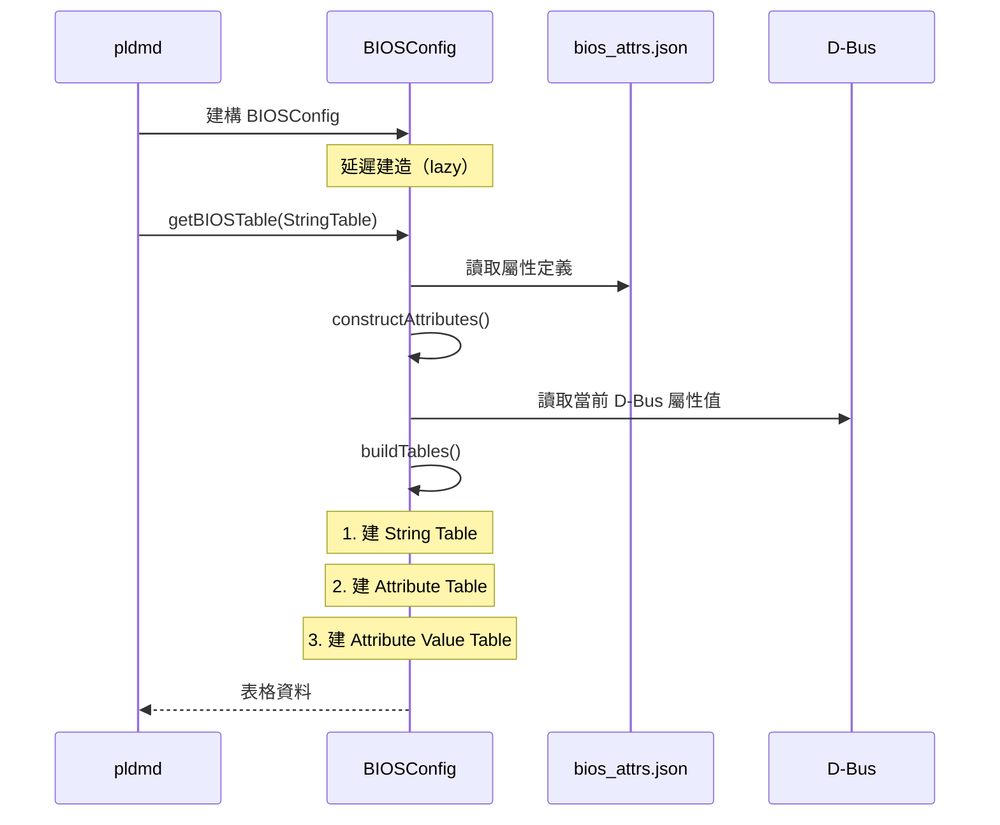

# BIOS 配置

本文件詳述 PLDM BIOS 屬性的配置方式、表格結構、和 D-Bus 整合。

---

## 概述

PLDM BIOS（Type 3）使用三張表格管理 BIOS 配置：

| 表格 | ID | 說明 |
|------|-----|------|
| **String Table** | 0 | 所有字串的集中儲存 |
| **Attribute Table** | 1 | 屬性定義（名稱、類型、約束） |
| **Attribute Value Table** | 2 | 屬性當前值 |



---

## JSON 配置檔

BIOS 屬性透過 JSON 檔案定義：

```
oem/<vendor>/configurations/bios/
├── bios_attrs.json                    # 通用配置
└── <system_type>/
    └── bios_attrs.json                # 系統特定配置
```

### Enumeration 屬性

```json
{
    "attribute_type": "enum",
    "attribute_name": "BootMode",
    "possible_values": ["Legacy", "UEFI"],
    "default_values": ["UEFI"],
    "help_text": "Boot mode selection",
    "display_name": "Boot Mode",
    "dbus": {
        "object_path": "/xyz/openbmc_project/control/host0/boot",
        "interface": "xyz.openbmc_project.Control.Boot.Mode",
        "property_name": "BootMode",
        "property_type": "string",
        "property_values": [
            "xyz.openbmc_project.Control.Boot.Mode.Modes.Regular",
            "xyz.openbmc_project.Control.Boot.Mode.Modes.Safe"
        ]
    }
}
```

### Integer 屬性

```json
{
    "attribute_type": "integer",
    "attribute_name": "MemoryMirroring",
    "lower_bound": 0,
    "upper_bound": 100,
    "scalar_increment": 1,
    "default_value": 0,
    "display_name": "Memory Mirroring Percentage",
    "dbus": {
        "object_path": "/xyz/openbmc_project/bios",
        "interface": "xyz.openbmc_project.BIOSConfig.Attributes",
        "property_name": "MemoryMirroring",
        "property_type": "uint64_t"
    }
}
```

### String 屬性

```json
{
    "attribute_type": "string",
    "attribute_name": "AssetTag",
    "string_type": "ASCII",
    "minimum_string_length": 0,
    "maximum_string_length": 64,
    "default_string": "",
    "display_name": "Asset Tag"
}
```

---

## 類別架構



---

## 表格建造流程



---

## 系統特定配置

啟用：
```bash
meson setup build -Dsystem-specific-bios-json=enabled
```

PLDM 會從 Entity Manager 取得系統類型，然後載入對應目錄下的 `bios_attrs.json`。

---

## D-Bus 整合

### 提供的 D-Bus 介面

| 介面 | 物件路徑 | 說明 |
|------|---------|------|
| `xyz.openbmc_project.BIOSConfig.Manager` | `/xyz/openbmc_project/bios_config/manager` | BIOS 配置管理 |

### D-Bus 屬性

| 屬性 | 類型 | 說明 |
|------|------|------|
| `BaseBIOSTable` | dict | 完整 BIOS 屬性表格 |
| `PendingAttributes` | dict | 等待套用的變更 |
| `ResetBIOSSettings` | enum | 重設 BIOS 設定（NoAction/FactoryDefaults） |

### 操作範例

```bash
# 查看 BIOS 屬性
$ busctl get-property xyz.openbmc_project.PLDM \
    /xyz/openbmc_project/bios_config/manager \
    xyz.openbmc_project.BIOSConfig.Manager \
    BaseBIOSTable

# 使用 pldmtool
$ pldmtool bios GetBIOSTable -t 0    # String Table
$ pldmtool bios GetBIOSTable -t 1    # Attribute Table
$ pldmtool bios GetBIOSTable -t 2    # Attribute Value Table
```

---

## 原始碼

| 檔案 | 大小 | 說明 |
|------|------|------|
| `bios_config.cpp` | 41KB | 建表核心邏輯 |
| `bios_config.hpp` | 14KB | BIOSConfig 類別 |
| `bios_table.cpp/hpp` | 25KB | 表格操作工具 |
| `bios_attribute.cpp/hpp` | 5KB | 屬性抽象基底類別 |
| `bios_enum_attribute.cpp/hpp` | 13KB | Enum 屬性 |
| `bios_integer_attribute.cpp/hpp` | 10KB | Integer 屬性 |
| `bios_string_attribute.cpp/hpp` | 9KB | String 屬性 |

---

## 相關文件

- [LibpldmResponder](LibpldmResponder.md) - BIOS Handler
- [TypeBIOS](TypeBIOS.md) - BIOS Type 協議

---

*返回 [Home](Home.md)*
