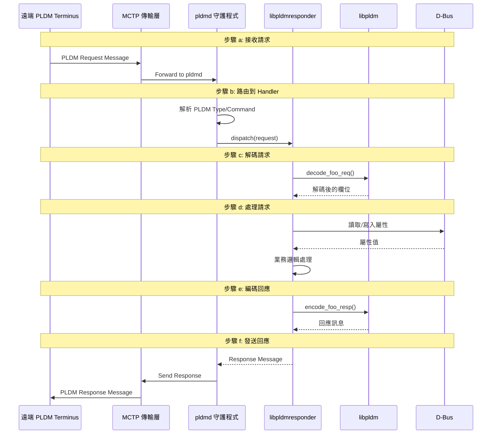
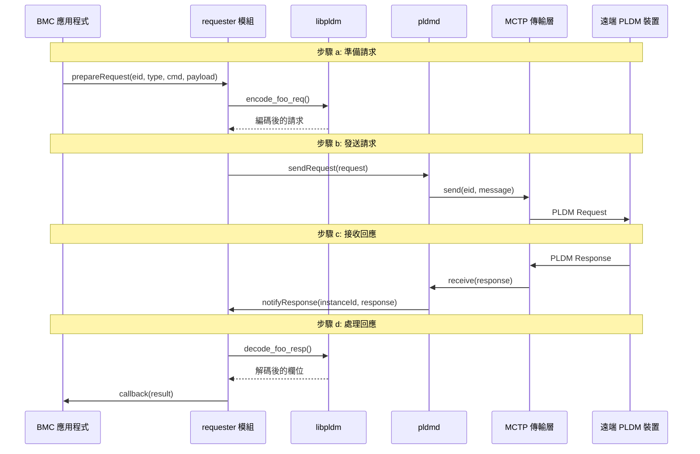
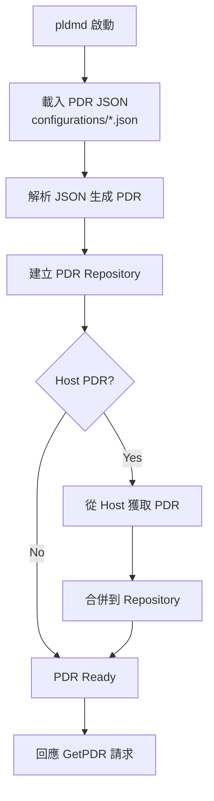
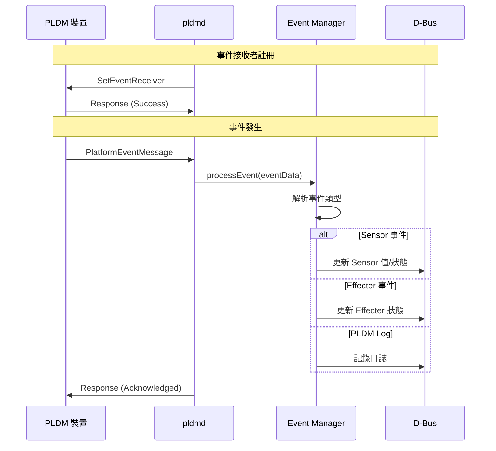

# 程式碼流程

本文件說明 OpenBMC PLDM 中的重要程式碼執行流程。

---

## BMC 作為 PLDM Responder

當 BMC 接收外部 PLDM 請求時的處理流程：

### 流程圖



### 詳細步驟

#### a) 接收 PLDM 請求

pldmd 透過 MCTP socket 接收傳入的 PLDM 訊息：

```cpp
// pldmd 接收訊息
void receiveMessage(mctp_eid_t eid, uint8_t* data, size_t len) {
    // 從 MCTP 傳輸層接收原始訊息
    // 驗證 PLDM 標頭
}
```

#### b) 路由到 Handler

根據 PLDM Type 和 Command Code 分發到對應的 Handler：

```cpp
// 訊息路由邏輯
void routeMessage(uint8_t pldmType, uint8_t cmdCode, Request& req) {
    auto handler = handlers[pldmType][cmdCode];
    if (handler) {
        response = handler(req, reqLen);
    }
}
```

#### c) 解碼請求

Handler 使用 libpldm API 解碼請求：

```cpp
// 範例：解碼 GetPDR 請求
int rc = decode_get_pdr_req(
    request, payloadLen,
    &recordHandle,
    &dataTransferHandle,
    &transferOpFlag,
    &requestCount,
    &recordChangeNumber
);
```

#### d) 處理請求

執行業務邏輯，可能涉及 D-Bus 操作：

```cpp
// 範例：讀取 Sensor 值
auto service = getService(objectPath, interface);
auto value = getProperty<double>(
    service, objectPath,
    "xyz.openbmc_project.Sensor.Value", "Value"
);
```

#### e) 編碼回應

使用 libpldm API 編碼回應訊息：

```cpp
// 範例：編碼 GetPDR 回應
int rc = encode_get_pdr_resp(
    instanceId,
    PLDM_SUCCESS,
    nextRecordHandle,
    nextDataTransferHandle,
    transferFlag,
    responseCount,
    recordData,
    recordDataLength,
    response
);
```

#### f) 發送回應

pldmd 將回應訊息傳回給請求者：

```cpp
// 發送回應
void sendResponse(mctp_eid_t eid, Response& resp) {
    mctp_send(eid, resp.data(), resp.size());
}
```

---

## BMC 作為 PLDM Requester

當 BMC 主動發送 PLDM 請求時的流程：

### 流程圖



### 詳細步驟

#### a) 準備請求訊息

應用程式使用 libpldm 編碼請求：

```cpp
// 準備 GetPLDMTypes 請求
std::vector<uint8_t> request(sizeof(pldm_msg_hdr));
auto msg = reinterpret_cast<pldm_msg*>(request.data());

encode_get_types_req(instanceId, msg);
```

#### b) 發送至遠端裝置

透過 requester 模組發送：

```cpp
// requester/handler.hpp
template <typename Callback>
void sendRequest(mctp_eid_t eid, Request request, Callback callback) {
    // 分配 Instance ID
    auto instanceId = instanceIdDb.next(eid);
    
    // 註冊回調
    responseCallbacks[eid][instanceId] = callback;
    
    // 發送請求
    pldmd->send(eid, request);
    
    // 設定超時
    startTimer(eid, instanceId, timeout);
}
```

#### c) 接收對應回應

pldmd 透過 Instance ID 匹配回應與請求：

```cpp
void handleResponse(mctp_eid_t eid, Response response) {
    // 解析 Instance ID
    auto instanceId = response[0] & 0x1F;
    
    // 查找對應的回調
    auto callback = responseCallbacks[eid][instanceId];
    
    // 執行回調
    callback(response);
    
    // 釋放 Instance ID
    instanceIdDb.free(eid, instanceId);
}
```

#### d) 解碼回應

應用程式解碼回應資料：

```cpp
// 解碼 GetPLDMTypes 回應
uint8_t completionCode;
std::vector<bitfield8_t> types(8);

int rc = decode_get_types_resp(
    response, responseLen,
    &completionCode,
    types.data()
);

if (completionCode == PLDM_SUCCESS) {
    // 處理支援的 Types
}
```

---

## PDR 載入流程

系統啟動時載入 PDR 的流程：



### PDR JSON 格式

```json
{
    "entries": [
        {
            "type": 11,
            "instance": 0,
            "container_id": 1,
            "entity_type": 45,
            "entity_instance": 0,
            "sensor_composite_count": 1,
            "possible_states": [
                {
                    "set_id": 1,
                    "state_ids": [1, 2]
                }
            ],
            "dbus": {
                "path": "/xyz/openbmc_project/state/host0",
                "interface": "xyz.openbmc_project.State.Host",
                "property_name": "CurrentHostState",
                "property_type": "string"
            }
        }
    ]
}
```

---

## 事件處理流程

PLDM 事件訊息的處理：



---

## 相關文件

- [Architecture](Architecture.md) - 系統架構
- [CodeOrganization](CodeOrganization.md) - 程式碼組織
- [PDRImplementation](PDRImplementation.md) - PDR 實作細節

---

*返回 [Home](Home.md)*
