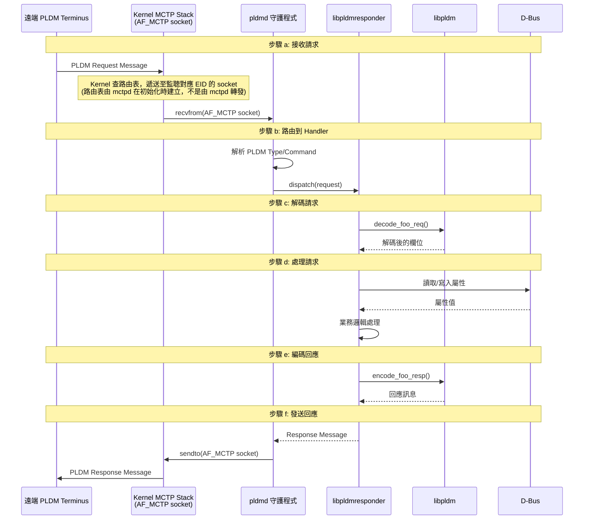
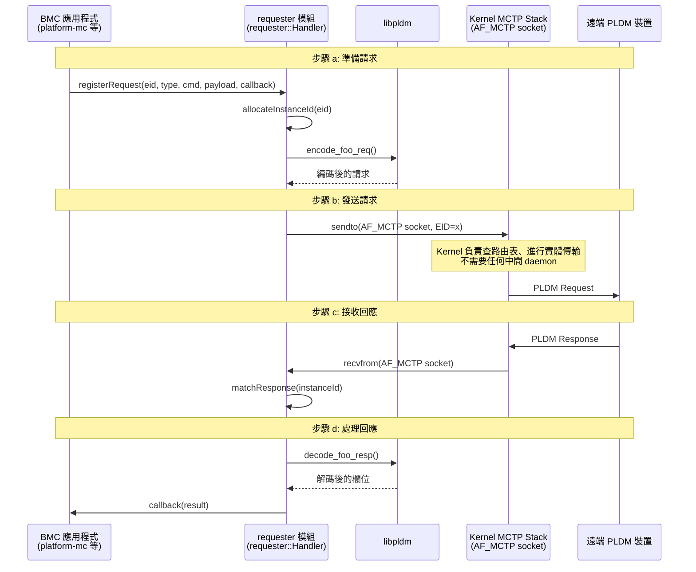
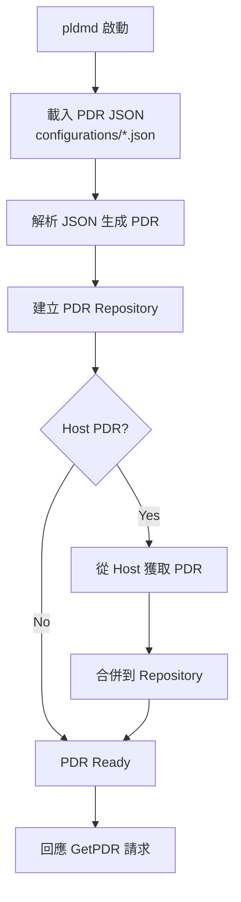
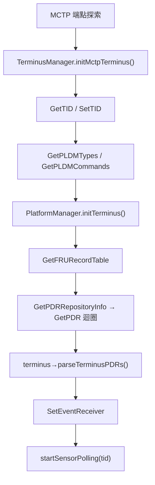
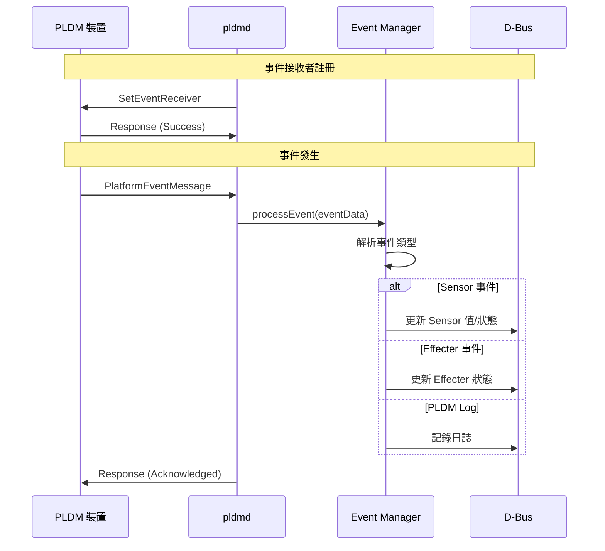

# 程式碼流程

本文件說明 OpenBMC PLDM 中的重要程式碼執行流程。

> ⚠️ **概念性說明**：本文件中的程式碼片段多為 **虛擬碼 (pseudo-code)**，用於說明流程概念。實際的函式名稱、參數和 API 可能與顯示的不同。實際實作請參考 upstream source code。
> 只有明確標註為「範例」或指定了檔案名的程式碼才從 source code 實際擷取。

---

## BMC 作為 PLDM Responder

當 BMC 接收外部 PLDM 請求時的處理流程：

### 流程圖



> **逐步說明：**
>
> 這張圖展示 BMC 作為 Responder（回應者）處理一筆 PLDM 請求的完整過程（現代 AF_MCTP 架構）：
>
> - **步驟 a：接收請求**——遠端裝置透過實體 MCTP 傳輸發送一筆 PLDM 請求給 BMC。**Kernel MCTP Stack** 根據路由表（由 `mctpd` 在初始化時建立）將封包遞送到 pldmd 的 `AF_MCTP` socket。
> - **步驟 b：路由到 Handler**——pldmd 解析 PLDM Type 和 Command，分發給對應的 Handler（像客服中心轉接到對的部門）。
> - **步驟 c：解碼請求**——Handler 用 libpldm 的 `decode_foo_req()` 將原始位元組解碼成有意義的欄位。
> - **步驟 d：處理請求**——Handler 執行業務邏輯，可能透過 D-Bus 讀取 Sensor 值、設定屬性等。
> - **步驟 e：編碼回應**——用 libpldm 的 `encode_foo_resp()` 將結果編碼成 PLDM 回應訊息。
> - **步驟 f：發送回應**——pldmd 透過 `sendto()` 直接寫入 AF_MCTP socket，Kernel 負責透過實體傳輸送回遠端。
>
> **白話總結**：接電話 → 轉接部門 → 聽懂問題 → 查資料 → 組裝答案 → 回覆客戶。

### 詳細步驟

#### a) 接收 PLDM 請求

pldmd 透過 MCTP socket 接收傳入的 PLDM 訊息：

```cpp
// 虛擬碼 — 實際實作為 processRxMsg() 在 pldmd/pldmd.cpp L110
void receiveMessage(mctp_eid_t eid, uint8_t* data, size_t len) {
    // 從 MCTP 傳輸層接收原始訊息
    // 驗證 PLDM 標頭
}
```

#### b) 路由到 Handler

根據 PLDM Type 和 Command Code 分發到對應的 Handler：

```cpp
// 虛擬碼 — 實際是透過 invoker.handle(tid, pldmType, cmd, request, reqLen)
// 內部使用 handlers.at(pldmType)->handle(tid, cmd, request, len)
void routeMessage(uint8_t pldmType, uint8_t cmdCode, Request& req) {
    auto handler = handlers[pldmType][cmdCode];
    if (handler) {
        response = handler(tid, req, reqLen);
    }
}
```

#### c) 解碼請求

Handler 使用 libpldm API 解碼請求：

```cpp
// 範例：解碼 GetPDR 請求
int rc = decode_get_pdr_req(
    request, payloadLen,
    &recordHandle,
    &dataTransferHandle,
    &transferOpFlag,
    &requestCount,
    &recordChangeNumber
);
```

#### d) 處理請求

執行業務邏輯，可能涉及 D-Bus 操作：

```cpp
// 範例：讀取 Sensor 值
auto service = getService(objectPath, interface);
auto value = getProperty<double>(
    service, objectPath,
    "xyz.openbmc_project.Sensor.Value", "Value"
);
```

#### e) 編碼回應

使用 libpldm API 編碼回應訊息：

```cpp
// 範例：編碼 GetPDR 回應
int rc = encode_get_pdr_resp(
    instanceId,
    PLDM_SUCCESS,
    nextRecordHandle,
    nextDataTransferHandle,
    transferFlag,
    responseCount,
    recordData,
    recordDataLength,
    response
);
```

#### f) 發送回應

pldmd 將回應訊息傳回給請求者：

```cpp
// 虛擬碼 — 實際回應透過 PldmTransport::sendMsg() 發送
void sendResponse(mctp_eid_t eid, Response& resp) {
    pldmTransport.sendMsg(eid, resp.data(), resp.size());
}
```

---

## BMC 作為 PLDM Requester

當 BMC 主動發送 PLDM 請求時的流程：

### 流程圖



> **逐步說明：**
>
> 這張圖展示 BMC 作為 Requester（請求者）主動發起請求的流程（現代 AF_MCTP 架構）：
>
> - **步驟 a：準備請求**——BMC 應用程式（如 platform-mc）呼叫 `requester::Handler::registerRequest()`，分配 Instance ID 後用 libpldm 的 `encode_foo_req()` 編碼請求。
> - **步驟 b：發送請求**——requester 透過 `sendto()` **直接寫入 AF_MCTP socket**，由 **Kernel MCTP Stack** 負責查路由表、進行實體傳輸——**不需要任何中間 daemon**。
> - **步驟 c：接收回應**——遠端裝置回傳 Response，Kernel 透過 `recvfrom()` 遞送回 requester 的 socket，根據 Instance ID 配對到對應的請求。
> - **步驟 d：處理回應**——requester 用 libpldm 的 `decode_foo_resp()` 解碼回應，透過 callback 通知原始呼叫者。
>
> **與 Responder 的差異**：Responder 是「接電話」（被動回答），Requester 是「打電話」（主動發問）。注意編解碼的方向相反：Requester 先編碼 request 再解碼 response，Responder 先解碼 request 再編碼 response。

### 詳細步驟

#### a) 準備請求訊息

應用程式使用 libpldm 編碼請求：

```cpp
// 準備 GetPLDMTypes 請求
std::vector<uint8_t> request(sizeof(pldm_msg_hdr));
auto msg = reinterpret_cast<pldm_msg*>(request.data());

encode_get_types_req(instanceId, msg);
```

#### b) 發送至遠端裝置

透過 requester 模組發送：

```cpp
// 虛擬碼 — 實際使用 requester::Handler::registerRequest() + coroutine
template <typename Callback>
void sendRequest(mctp_eid_t eid, Request request, Callback callback) {
    // 分配 Instance ID
    auto instanceId = instanceIdDb.next(eid);

    // 註冊回調
    responseCallbacks[eid][instanceId] = callback;

    // 發送請求
    pldmTransport.sendMsg(eid, request);

    // 設定超時
    startTimer(eid, instanceId, timeout);
}
```

#### c) 接收對應回應

pldmd 透過 Instance ID 匹配回應與請求：

```cpp
// 虛擬碼 — 實際的 Instance ID 是透過 unpack_pldm_header() 取得 hdrFields.instance
void handleResponse(mctp_eid_t eid, Response response) {
    // 解析 Instance ID（透過 PLDM header 解析）
    pldm_header_info hdrFields{};
    unpack_pldm_header(hdr, &hdrFields);
    auto instanceId = hdrFields.instance;

    // 查找對應的回調
    auto callback = responseCallbacks[eid][instanceId];

    // 執行回調
    callback(response);

    // 釋放 Instance ID
    instanceIdDb.free(eid, instanceId);
}
```

#### d) 解碼回應

應用程式解碼回應資料：

```cpp
// 解碼 GetPLDMTypes 回應
uint8_t completionCode;
std::vector<bitfield8_t> types(8);

int rc = decode_get_types_resp(
    response, responseLen,
    &completionCode,
    types.data()
);

if (completionCode == PLDM_SUCCESS) {
    // 處理支援的 Types
}
```

---

## PDR 載入流程

系統啟動時載入 PDR 的流程：



> **逐步說明：**
>
> 1. **pldmd 啟動**：守護程式起始化。
> 2. **載入 PDR JSON**：從 `configurations/*.json` 檔讀取 PDR 定義。這些 JSON 檔定義了 BMC 內部的 Sensor、Effecter 等硬體描述。
> 3. **解析並建立 Repository**：將 JSON 轉換成 PDR 資料結構，存入記憶體中的 Repository。
> 4. **（分支）Host PDR**：如果需要 Host 的 PDR（例如 CPU 的 Sensor 描述），則從 Host 取得並合併到 Repository 中。
> 5. **準備就緒**：Repository 建立完成，可以回應外部的 `GetPDR` 請求。
>
> **白話總結**：就像開店前準備「商品型錄」——先從配置檔讀取商品資訊，必要時從總公司（Host）拿更多資料，然後就可以回答客戶的查詢。

### platform-mc 端 PDR 拉取

當 BMC 作為 Requester 從遠端 Terminus 拉回 PDR 時：



> **逐步說明：**
>
> 這張圖展示 BMC 從遠端 Terminus 拉回 PDR 的完整流程：
>
> 1. **MCTP 端點探索**：mctpd 發現新的 MCTP 端點，通知 pldmd。
> 2. **初始化 Terminus**：TerminusManager 對新端點執行 `GetTID`（取得 Terminus ID）和 `GetPLDMTypes`（查詢支援的類型）。
> 3. **取得 FRU 資料**：先取得裝置的 FRU 資訊（型號、序號等）。
> 4. **拉取 PDR**：透過 `GetPDRRepositoryInfo` 和 `GetPDR` 命令迭代取得所有 PDR（平台描述記錄），了解裝置有哪些 Sensor 和 Effecter。
> 5. **解析 PDR**：將取得的 PDR 解析成內部資料結構（Sensor 物件等）。
> 6. **註冊事件接收者**：用 `SetEventReceiver` 告訴裝置：「有事件請通知我」。
> 7. **開始 Sensor 輪詢**：定期讀取裝置的 Sensor 值。
>
> **白話總結**：就像認識新同事——先問名字（TID）、再問會什麼（Types）、查履歷（FRU）、了解能力（PDR）、訂閱通知（SetEventReceiver）、開始合作（Polling）。

### PDR JSON 格式

```json
{
  "entries": [
    {
      "type": 11,
      "instance": 0,
      "container_id": 1,
      "entity_type": 45,
      "entity_instance": 0,
      "sensor_composite_count": 1,
      "possible_states": [
        {
          "set_id": 1,
          "state_ids": [1, 2]
        }
      ],
      "dbus": {
        "path": "/xyz/openbmc_project/state/host0",
        "interface": "xyz.openbmc_project.State.Host",
        "property_name": "CurrentHostState",
        "property_type": "string"
      }
    }
  ]
}
```

---

## 事件處理流程

PLDM 事件訊息的處理：



> **逐步說明：**
>
> 這張圖展示 PLDM 事件處理的完整流程：
>
> 1. **事件接收者註冊**：pldmd 用 `SetEventReceiver` 告訴裝置：「有事件請發給我（BMC）」。裝置確認接受。
> 2. **事件發生**：當裝置有事件發生（例如溫度超過閾值），它透過 `PlatformEventMessage` 主動通知 pldmd。
> 3. **解析事件類型**：Event Manager 判斷事件是什麼類型：
>    - **Sensor 事件**：更新 D-Bus 上的 Sensor 值或狀態（其他服務可以讀到）
>    - **Effecter 事件**：更新 Effecter 狀態（如風扇速度）
>    - **PLDM Log**：記錄事件日誌
> 4. **確認回應**：pldmd 發送 Response 給裝置，表示「我已收到事件」。
>
> **白話總結**：就像訂閱通知——先告訴裝置「有事情請通知我」，裝置就會在有狀況時主動通知 BMC，BMC 收到後更新系統狀態。

---

## 相關文件

- [Architecture](Architecture.md) - 系統架構
- [CodeOrganization](CodeOrganization.md) - 程式碼組織
- [PDRImplementation](PDRImplementation.md) - PDR 實作細節
- [SourceCodeWalkthrough](SourceCodeWalkthrough.md) - pldmd 完整呼叫鏈走讀

---

_返回 [Home](Home.md)_
