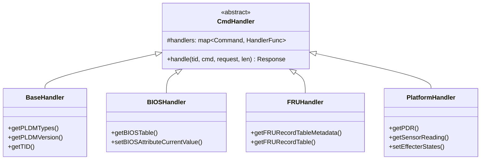
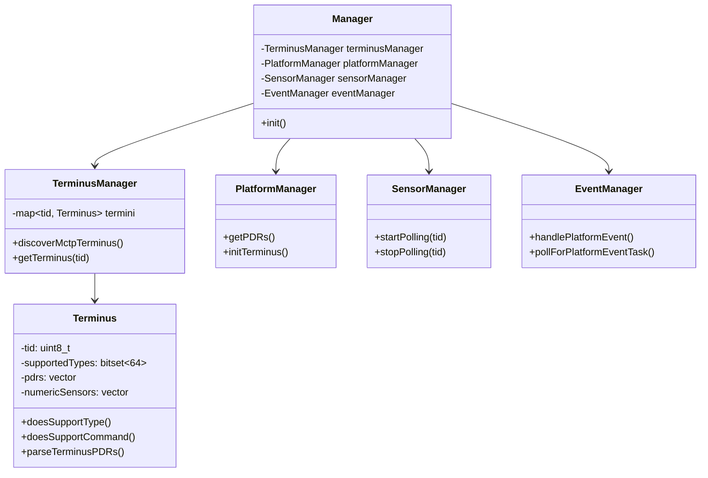

# 程式碼組織

本文件說明 OpenBMC PLDM 專案的程式碼組織結構與各模組職責。

---

## 目錄結構總覽

```
pldm/
├── pldmd/                    # PLDM 守護程式
├── libpldmresponder/         # Responder Handler 函式庫
├── requester/                # Requester 模組
├── platform-mc/              # Platform MC 實作
├── fw-update/                # 韌體更新
├── host-bmc/                 # Host-BMC 通訊
├── softoff/                  # 軟關機
├── oem/                      # OEM 擴充
│   ├── ampere/               # Ampere OEM
│   ├── ibm/                  # IBM OEM
│   ├── meta/                 # Meta OEM
│   └── nvidia/               # NVIDIA OEM
├── common/                   # 共用工具
├── configurations/           # 配置檔案
├── pldmtool/                 # CLI 工具
├── docs/                     # 文件
├── test/                     # 測試
├── subprojects/              # 子專案 (libpldm)
├── meson.build               # 建置定義
└── meson.options             # 建置選項
```

---

## 核心模組說明

### pldmd/

PLDM 守護程式主程式，負責：

- 初始化 PLDM 服務
- 設定 MCTP 傳輸
- 啟動事件迴圈

```
pldmd/
├── pldmd.cpp          # 主程式進入點
├── handler.hpp        # CmdHandler 基底類別
├── invoker.hpp        # Invoker 訊息分發器
├── dbus_impl_pdr.cpp/hpp  # PDR D-Bus 介面實作
├── oem_ibm.hpp        # IBM OEM 工廠類別
└── service_files/     # Systemd 服務檔案
```

---

### libpldmresponder/

PLDM Responder 處理函式庫，依 PLDM Type 組織：

```
libpldmresponder/
├── base.cpp/hpp                 # Base Type Handler (Type 0)
├── bios.cpp/hpp                 # BIOS Handler (Type 3)
├── bios_config.cpp/hpp          # BIOS 配置管理
├── bios_attribute.cpp/hpp       # BIOS 屬性基類
├── bios_enum_attribute.cpp/hpp  # Enum 屬性
├── bios_integer_attribute.cpp/hpp # Integer 屬性
├── bios_string_attribute.cpp/hpp  # String 屬性
├── bios_table.cpp/hpp           # BIOS 表格處理
├── fru.cpp/hpp                  # FRU Handler (Type 4)
├── fru_parser.cpp/hpp           # FRU JSON 解析
├── platform.cpp/hpp             # Platform Handler (Type 2)
├── platform_config.cpp/hpp      # Platform 配置
├── pdr.cpp/hpp                  # PDR 基礎
├── pdr_utils.cpp/hpp            # PDR 工具函式
├── pdr_state_sensor.hpp         # State Sensor PDR
├── pdr_state_effecter.hpp       # State Effecter PDR
├── pdr_numeric_effecter.hpp     # Numeric Effecter PDR
├── platform_state_sensor.hpp    # State Sensor 實作
├── platform_state_effecter.hpp  # State Effecter 實作
├── platform_numeric_effecter.hpp # Numeric Effecter 實作
├── event_parser.cpp/hpp         # 事件解析
├── oem_handler.hpp              # OEM Handler 介面
├── examples/                    # PDR JSON 範例
└── test/                        # 單元測試
```

> ⚠️ **簡化說明**：以下類別圖使用 `CmdHandler` 作為基底類別名稱（與 upstream `pldmd/handler.hpp` 一致）。實際的方法名稱和繼承關係已簡化，僅展示主要 PLDM command handler 的組織架構。



> **逐步說明（類別圖）：**
>
> 所有 PLDM 命令處理器都繼承自 `CmdHandler` 抽象基底類別：
>
> - **CmdHandler**：提供 `handle()` 方法和命令註冊表（`handlers` map）。
> - **BaseHandler**：處理 Type 0 命令（GetPLDMTypes、GetTID 等）。
> - **BIOSHandler**：處理 Type 3 命令（GetBIOSTable、SetBIOSAttribute 等）。
> - **FRUHandler**：處理 Type 4 命令（GetFRURecordTable 等）。
> - **PlatformHandler**：處理 Type 2 命令（GetPDR、GetSensorReading 等）。
>
> **白話總結**：這是「命令模式」的實作——每個 Handler 都知道如何處理自己類型的命令。

---

### requester/

BMC 作為 PLDM Requester 的實作：

```
requester/
├── handler.hpp                 # 請求處理器
├── request.hpp                 # 請求封裝
├── mctp_endpoint_discovery.cpp/hpp  # MCTP 端點探索
├── README.md                   # 模組說明
└── test/                       # 單元測試
```

#### 關鍵類別

```cpp
// handler.hpp - 請求處理器
template <class RequestInterface>
class Handler {
    // 管理請求佇列
    // 處理回應回調
    // Instance ID 追蹤
};

// request.hpp - 請求封裝
template <class RequestInterface>
class Request {
    // 封裝 PLDM 請求
    // 支援重試邏輯
    // 超時處理
};
```

---

### platform-mc/

Platform Monitoring and Control 的 MC 端實作：

```
platform-mc/
├── terminus.cpp/hpp              # PLDM Terminus 表示
├── terminus_manager.cpp/hpp      # Terminus 生命週期管理
├── platform_manager.cpp/hpp      # PDR 與平台資源管理
├── sensor_manager.cpp/hpp        # Sensor 讀取管理
├── event_manager.cpp/hpp         # 事件處理
├── numeric_sensor.cpp/hpp        # 數值型 Sensor
├── dbus_impl_fru.cpp/hpp         # FRU D-Bus 介面
├── dbus_to_terminus_effecters.cpp/hpp  # D-Bus to Effecter 映射
├── manager.cpp/hpp               # 模組主管理器
└── test/                         # 單元測試
```

#### 類別關係



> **逐步說明（類別圖）：**
>
> platform-mc 模組的類別關係：
>
> - **Manager**：頂層管理器，擁有四個子系統。
> - **TerminusManager**：管理所有 Terminus 的生命週期。
> - **Terminus**：儲存單一裝置的 PDR、Sensor、支援的 PLDM Types。
> - **PlatformManager**：負責 PDR/FRU 拉取和初始化。
> - **SensorManager**：負責 Sensor 輪詢。
> - **EventManager**：負責事件處理。
>
> **白話總結**：展示了「誰擁有誰」的關係——Manager 擁有所有子系統，TerminusManager 擁有所有 Terminus。

---

### fw-update/

韌體更新功能實作：

```
fw-update/
├── update_manager.cpp/hpp        # 更新流程管理
├── inventory_manager.cpp/hpp     # 韌體清單管理
├── device_updater.cpp/hpp        # 裝置更新器
├── package_parser.cpp/hpp        # 更新封包解析
├── activation.cpp/hpp            # 啟動管理
├── watch.cpp/hpp                 # 檔案監控 (inotify)
├── update.cpp/hpp                # 更新操作
├── firmware_inventory.cpp/hpp    # 韌體清單
├── firmware_inventory_manager.cpp/hpp  # 韌體清單管理器
├── aggregate_update_manager.cpp/hpp   # 聚合更新管理器
├── manager.hpp                   # 模組管理器
└── test/                         # 單元測試
```

---

### host-bmc/

Host-BMC 通訊與 PDR 交換：

```
host-bmc/
├── host_pdr_handler.cpp/hpp      # Host PDR 處理
├── dbus_to_event_handler.cpp/hpp # D-Bus 屬性變更轉事件
├── host_condition.cpp/hpp        # Host 狀態監控
├── utils.cpp/hpp                 # 工具函式
├── dbus/                         # D-Bus 介面定義
└── test/                         # 單元測試
```

---

### softoff/

PLDM 軟關機功能：

```
softoff/
├── main.cpp           # 進入點
├── softoff.cpp/hpp    # 軟關機實作
├── services/          # Systemd 服務定義
└── meson.build        # 建置定義
```

---

### oem/

OEM 廠商擴充目錄：

```
oem/
├── ampere/                   # Ampere OEM
│   └── oem_ampere.hpp        # Ampere 初始化
├── ibm/                      # IBM OEM
│   ├── libpldmresponder/     # OEM Handler
│   │   └── oem_*.cpp/hpp
│   ├── configurations/       # OEM 配置
│   │   └── bios/             # BIOS 屬性 JSON
│   └── pldmtool/             # OEM pldmtool 命令
├── meta/                     # Meta OEM
│   ├── oem_meta.cpp/hpp      # Meta OEM Handler
│   └── utils.cpp/hpp         # Meta 工具函式
└── nvidia/                   # NVIDIA OEM
    └── oem_nvidia.hpp        # NVIDIA 初始化
```

#### 新增 OEM 支援

1. 建立 `oem/<vendor>/` 目錄
2. 實作 OEM Handler 繼承 `oem_handler.hpp`
3. 在 `meson.options` 新增選項
4. 更新 `meson.build` 條件編譯

---

### pldmtool/

命令列診斷工具：

```

pldmtool/
├── pldmtool.cpp # 主程式
├── pldm_cmd_helper.cpp/hpp # 命令輔助函式
├── pldm_base_cmd.cpp/hpp # Base 命令
├── pldm_bios_cmd.cpp/hpp # BIOS 命令
├── pldm_fru_cmd.cpp/hpp # FRU 命令
├── pldm_platform_cmd.cpp/hpp # Platform 命令
├── pldm_fw_update_cmd.cpp/hpp # FW Update 命令
├── oem/ # OEM 命令
├── README.md # 使用說明
└── meson.build # 建置定義

```

---

## 命名慣例

| 類型     | 慣例        | 範例                 |
| -------- | ----------- | -------------------- |
| 檔案     | 小寫底線    | `pdr_utils.cpp`      |
| 類別     | PascalCase  | `TerminusManager`    |
| 函式     | camelCase   | `getSensorReading()` |
| 常數     | UPPER_SNAKE | `PLDM_SUCCESS`       |
| 命名空間 | 小寫        | `pldm::responder`    |

---

## 相關文件

- [CodeFlows](CodeFlows.md) - 程式碼執行流程
- [Architecture](Architecture.md) - 系統架構
- [SourceCodeWalkthrough](SourceCodeWalkthrough.md) - pldmd 完整呼叫鏈走讀

---

_返回 [Home](Home.md)_
