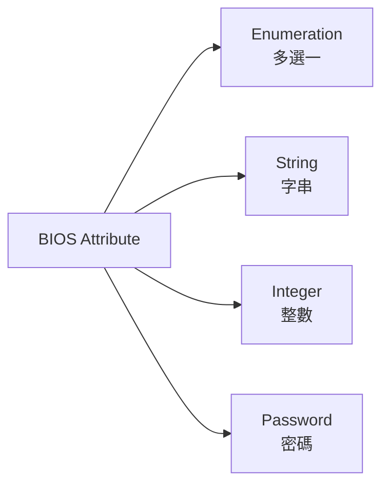
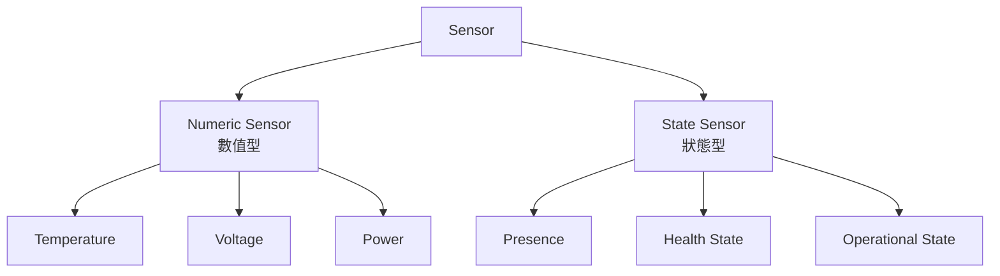
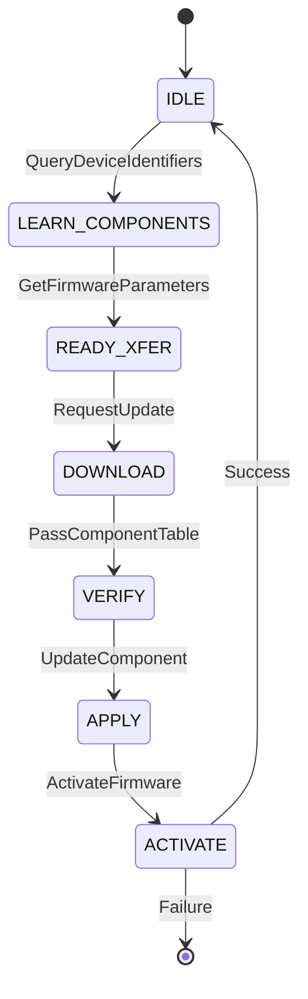

# DMTF PLDM 規範說明

本文件整理 DMTF 定義的 PLDM 相關規範，供開發者參考。

---

## 規範總覽

| 規範編號 | 名稱                     | 版本  | 發布日期 |
| -------- | ------------------------ | ----- | -------- |
| DSP0240  | PLDM Base Specification  | 1.1.0 | 2019-06  |
| DSP0245  | PLDM IDs and Codes       | 1.4.0 | 2024-05  |
| DSP0246  | PLDM for SMBIOS          | 1.0.0 | 2009-04  |
| DSP0247  | PLDM for BIOS Control    | 1.0.0 | 2009-04  |
| DSP0248  | PLDM for Platform M&C    | 1.3.0 | 2024-08  |
| DSP0257  | PLDM for FRU Data        | 1.0.0 | 2009-04  |
| DSP0267  | PLDM for Firmware Update | 1.2.0 | 2022-09  |

---

## DSP0240: PLDM Base Specification

### 概述

定義 PLDM 基礎架構，包含：

- PLDM 訊息格式
- Terminus 概念
- 錯誤處理機制
- 傳輸綁定

### Base Type 命令

| Command                     | Code | 說明                 |
| --------------------------- | ---- | -------------------- |
| SetTID                      | 0x01 | 設定 Terminus ID     |
| GetTID                      | 0x02 | 查詢自身 TID         |
| GetPLDMVersion              | 0x03 | 查詢 PLDM Type 版本  |
| GetPLDMTypes                | 0x04 | 查詢支援的 Types     |
| GetPLDMCommands             | 0x05 | 查詢 Type 支援的命令 |
| SelectPLDMVersion           | 0x06 | 選擇 PLDM 版本       |
| NegotiateTransferParameters | 0x07 | 協商傳輸參數         |
| MultipartSend               | 0x08 | 多段傳送             |
| MultipartReceive            | 0x09 | 多段接收             |

### 下載連結

- [DSP0240 1.1.0 (PDF)](https://www.dmtf.org/sites/default/files/standards/documents/DSP0240_1.1.0.pdf)

---

## DSP0245: PLDM IDs and Codes

### 概述

集中定義 PLDM 使用的所有 ID 和代碼：

- PLDM Type 代碼
- 命令代碼
- Completion Codes
- Entity Types
- State Sets
- Sensor/Effecter 類型

### PLDM Type Codes

| Type | 名稱            | 說明                      |
| ---- | --------------- | ------------------------- |
| 0x00 | Base            | 基礎通訊                  |
| 0x01 | SMBIOS          | SMBIOS 傳輸               |
| 0x02 | Platform M&C    | 平台監控控制              |
| 0x03 | BIOS Control    | BIOS 配置                 |
| 0x04 | FRU Data        | FRU 資料                  |
| 0x05 | Firmware Update | 韌體更新                  |
| 0x06 | RDE             | Redfish Device Enablement |
| 0x3F | OEM             | 廠商自訂                  |

### Entity Types (部分)

| Type ID | 名稱          |
| ------- | ------------- |
| 33      | System Board  |
| 35      | Memory Module |
| 45      | Processor     |
| 64      | Chassis       |
| 66      | Power Supply  |
| 135     | GPU           |
| 142     | NVMe Drive    |

### 下載連結

- [DSP0245 1.4.0 (PDF)](https://www.dmtf.org/sites/default/files/standards/documents/DSP0245_1.4.0.pdf)

---

## DSP0247: PLDM for BIOS Control

### 概述

定義 BMC 與 BIOS 之間的配置資料交換：

- BIOS 屬性表格 (String/Integer/Enum)
- 屬性值讀取與設定
- 屬性等待列表

### 主要表格

| 表格                  | 說明       |
| --------------------- | ---------- |
| String Table          | 字串對照表 |
| Attribute Table       | 屬性定義   |
| Attribute Value Table | 屬性當前值 |

### BIOS Type 命令

| Command                              | Code | 說明                 |
| ------------------------------------ | ---- | -------------------- |
| GetBIOSTable                         | 0x01 | 取得 BIOS 表格       |
| SetBIOSTable                         | 0x02 | 設定 BIOS 表格       |
| SetBIOSAttributeCurrentValue         | 0x07 | 設定屬性值           |
| GetBIOSAttributeCurrentValueByHandle | 0x08 | 依 Handle 取得屬性值 |

### 屬性類型

### 下載連結

- [DSP0247 1.0.0 (PDF)](https://www.dmtf.org/sites/default/files/standards/documents/DSP0247_1.0.0.pdf)

---

## DSP0248: PLDM for Platform M&C

### 概述

定義平台監控與控制功能：

- Platform Descriptor Records (PDR)
- Sensor 讀取與事件
- Effecter 設定
- 事件日誌

### PDR 類型

| PDR Type | 名稱                   |
| -------- | ---------------------- |
| 1        | Terminus Locator       |
| 2        | Numeric Sensor         |
| 4        | Numeric Sensor Init    |
| 9        | Numeric Effecter       |
| 11       | State Sensor           |
| 14       | State Effecter         |
| 15       | Entity Association     |
| 20       | FRU Record Set         |
| 22       | Compact Numeric Sensor |
| 26       | Sensor Auxiliary Names |
| 27       | Entity Auxiliary Names |

### Platform Type 命令

| Command                 | Code | 說明              |
| ----------------------- | ---- | ----------------- |
| SetEventReceiver        | 0x04 | 設定事件接收者    |
| GetSensorReading        | 0x11 | 讀取 Sensor       |
| SetNumericEffecterValue | 0x31 | 設定數值 Effecter |
| SetStateEffecterStates  | 0x39 | 設定狀態 Effecter |
| GetPDR                  | 0x51 | 取得 PDR          |
| PlatformEventMessage    | 0x0A | 平台事件訊息      |

### Sensor 類型

### 下載連結

- [DSP0248 1.3.0 (PDF)](https://www.dmtf.org/sites/default/files/standards/documents/DSP0248_1.3.0.pdf)

---

## DSP0267: PLDM for Firmware Update

### 概述

定義標準化韌體更新流程：

- 韌體封包格式
- 更新狀態機
- 元件識別

### 更新狀態機

### FW Update 命令

| Command                | Code | 說明         |
| ---------------------- | ---- | ------------ |
| QueryDeviceIdentifiers | 0x01 | 查詢裝置識別 |
| GetFirmwareParameters  | 0x02 | 取得韌體參數 |
| RequestUpdate          | 0x10 | 請求更新     |
| PassComponentTable     | 0x13 | 傳遞元件表   |
| UpdateComponent        | 0x14 | 更新元件     |
| ActivateFirmware       | 0x1A | 啟動韌體     |
| CancelUpdate           | 0x1D | 取消更新     |

### 下載連結

- [DSP0267 1.2.0 (PDF)](https://www.dmtf.org/sites/default/files/standards/documents/DSP0267_1.2.0.pdf)

---

## OpenBMC PLDM 規範實作狀態

| 規範                | 狀態      | 備註                                                              |
| ------------------- | --------- | ----------------------------------------------------------------- |
| DSP0240 (Base)      | ✅ 部分   | Responder 處理 GetTID/GetPLDMTypes/GetPLDMVersion/GetPLDMCommands |
| DSP0247 (BIOS)      | ✅ 完整   | 支援 IBM OEM 擴充                                                 |
| DSP0248 (Platform)  | ✅ 完整   | PDR/Sensor/Effecter                                               |
| DSP0257 (FRU)       | ✅ 完整   | 與 Entity Manager 整合                                            |
| DSP0267 (FW Update) | ✅ 完整   | 支援 D-Bus 與 inotify 觸發                                        |
| DSP0246 (SMBIOS)    | ❌ 未實作 | -                                                                 |

---

## 參考資源

- [DMTF PLDM 規範首頁](https://www.dmtf.org/standards/pldm)
- [DMTF 文件下載](https://www.dmtf.org/standards/published_documents)

---

_返回 [Home](Home.md)_
