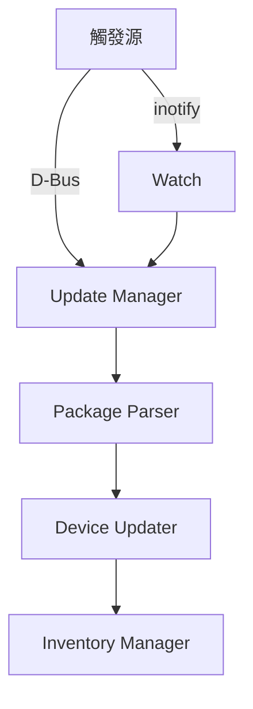

# 韌體更新模組

fw-update 模組實作 PLDM 韌體更新功能。

---

## 概述

| 項目 | 說明 |
|------|------|
| **位置** | `fw-update/` |
| **功能** | 韌體封包解析、更新流程管理 |

---

## 架構



---

## 更新觸發

### D-Bus 觸發

```bash
busctl call xyz.openbmc_project.PLDM /xyz/openbmc_project/pldm \
    xyz.openbmc_project.PLDM.FWUpdate StartUpdate s "/path/to/package"
```

### Inotify 觸發

```bash
# 啟用監控
meson setup build -Dfw-update-pkg-inotify=enabled

# 放入封包
cp firmware.pldm /tmp/images/
```

---

## 核心類別

| 類別 | 檔案 | 說明 |
|------|------|------|
| UpdateManager | `update_manager.cpp` | 更新流程控制 |
| DeviceUpdater | `device_updater.cpp` | 單裝置更新 |
| PackageParser | `package_parser.cpp` | 封包解析 |
| InventoryManager | `inventory_manager.cpp` | 韌體清單 |

---

## 相關文件

- [TypeFirmwareUpdate](TypeFirmwareUpdate.md) - 韌體更新 Type

---

*返回 [Home](Home.md)*
