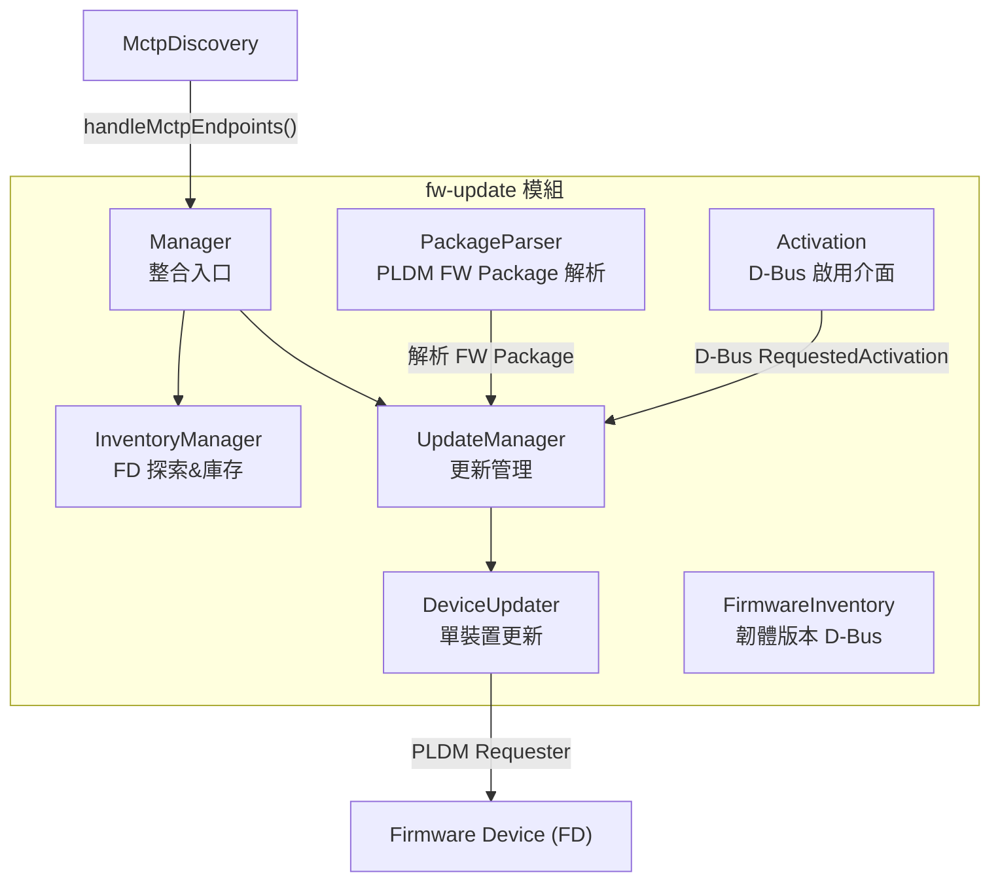
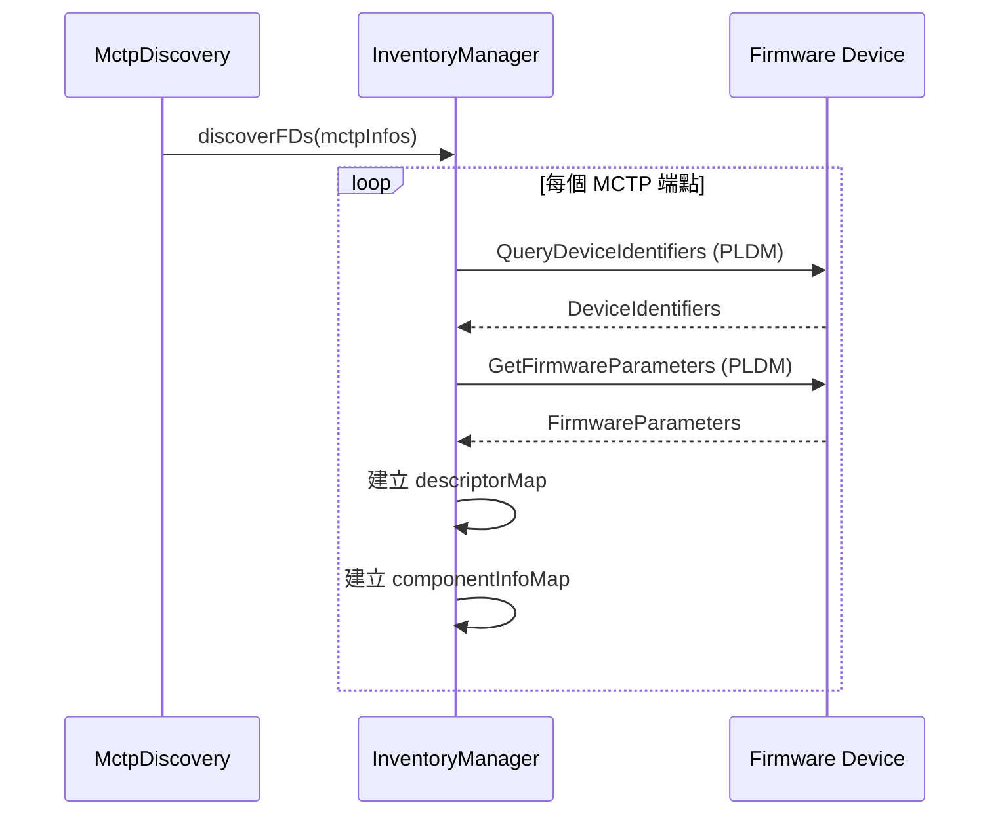
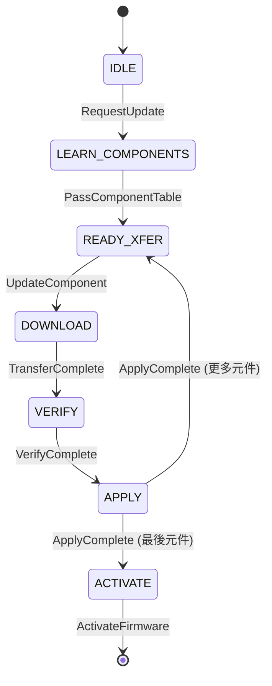
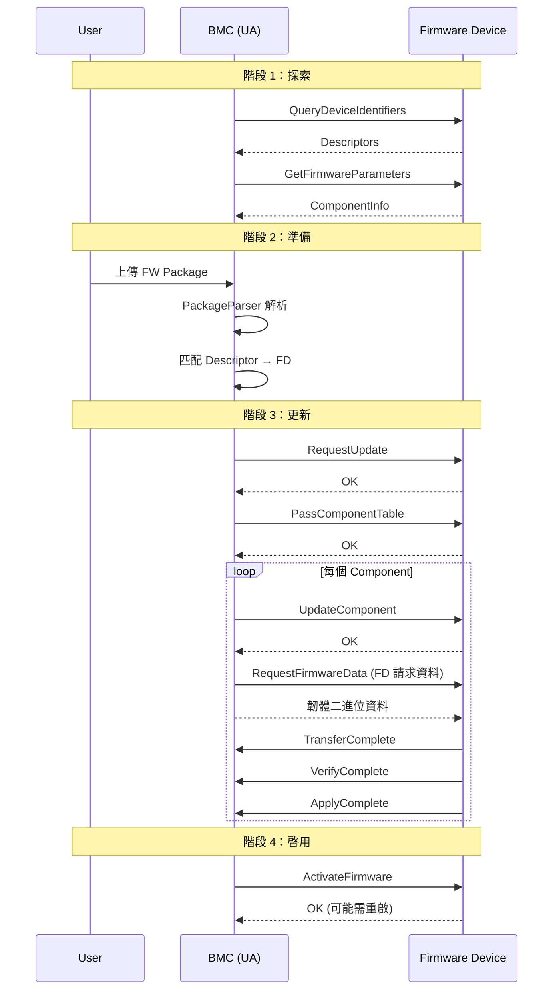

# Firmware Update 模組

Firmware Update 模組實作 PLDM Type 5（Firmware Update）規範，負責透過 PLDM 協議更新 MCTP 設備的韌體。

---

## 概述

| 項目         | 說明                                                              |
| ------------ | ----------------------------------------------------------------- |
| **位置**     | `fw-update/`                                                      |
| **規範**     | DSP0267 — PLDM for Firmware Update                                |
| **檔案數**   | 17 個                                                             |
| **核心類別** | `Manager`、`InventoryManager`、`UpdateManager`、`DeviceUpdater`   |
| **特殊路由** | pldmd 中 Type 5 繞過 Invoker，直接呼叫 `Manager::handleRequest()` |

---

## 架構



> **逐步說明：**
>
> 這張圖展示 fw-update 模組的架構：
>
> - **Manager**：整合入口，接收 MCTP 端點事件和 FW Update 命令。
> - **InventoryManager**：探索裝置能力，建立韌體庫存。
> - **UpdateManager**：管理更新流程。
> - **DeviceUpdater**：對單一裝置執行更新狀態機。
> - **PackageParser**：解析 FW Package 檔案。
> - **Activation**：透過 D-Bus 觸發更新。
>
> **白話總結**：就像一個「軟體更新中心」——探索裝置、解析更新包、執行更新、回報狀態。

---

## 角色定義（DSP0267）

| 角色 | 英文                    | 說明                        |
| ---- | ----------------------- | --------------------------- |
| UA   | Update Agent            | 更新代理（BMC 扮演此角色）  |
| FD   | Firmware Device         | 被更新的裝置（GPU、NIC 等） |
| FDP  | Firmware Device Package | 韌體更新包                  |

---

## 核心元件

### 1. Manager — 整合入口

```cpp
class Manager : public pldm::MctpDiscoveryHandlerIntf {
    // MCTP 端點事件
    void handleMctpEndpoints(const MctpInfos& mctpInfos) override {
        inventoryMgr.discoverFDs(mctpInfos);  // 探索 FW Devices
    }
    void handleRemovedMctpEndpoints(const MctpInfos& mctpInfos) override {
        inventoryMgr.removeFDs(mctpInfos);
    }

    // 處理 FW Update 命令（從 pldmd 直接呼叫）
    Response handleRequest(mctp_eid_t eid, Command command,
                          const pldm_msg* request, size_t reqMsgLen) {
        return updateManager.handleRequest(eid, command, request, reqMsgLen);
    }

private:
    DescriptorMap descriptorMap;           // FD 描述符
    DownstreamDescriptorMap downstreamDescriptorMap;
    ComponentInfoMap componentInfoMap;     // 元件資訊
    UpdateManager updateManager;          // 更新管理器
    InventoryManager inventoryMgr;         // 庫存管理器
};
```

### 2. InventoryManager — FD 探索

當 `MctpDiscovery` 發現新的 MCTP 端點時：



> **逐步說明：**
>
> 當 MCTP 發現新端點時，InventoryManager 對每個端點執行：
>
> 1. **QueryDeviceIdentifiers**：問裝置「你是誰？」（PCI VID/PID 等識別符）。
> 2. **GetFirmwareParameters**：問裝置「你的韌體狀態？」（當前版本、元件資訊）。
> 3. **建立映射表**：將裝置識別符和元件資訊儲存，供後續更新時匹配使用。
>
> **白話總結**：就像店員清點貨架——掃描每個裝置的「條碼」和「韌體版本」，建立庫存記錄。

### 3. DeviceUpdater — 單裝置更新

實作 DSP0267 定義的完整更新狀態機：



> **逐步說明（狀態機）：**
>
> IDLE → LEARN_COMPONENTS → READY_XFER → DOWNLOAD → VERIFY → APPLY → ACTIVATE。這與 TypeFirmwareUpdate.md 中的狀態機相同，但描述的是 BMC 端 DeviceUpdater 的實作。

### 4. PackageParser — FW Package 解析

解析 DSP0267 定義的 PLDM Firmware Update Package 格式：

```
+---------------------------+
| Package Header            |
|  - UUID                   |
|  - Package Version        |
|  - Device ID Records      |
+---------------------------+
| Component Image Info      |
|  - Classification         |
|  - Version                |
|  - Size, Offset           |
+---------------------------+
| Component Images          |
|  - Binary firmware data   |
+---------------------------+
| Package Header Checksum   |
+---------------------------+
```

### 5. Activation — D-Bus 啟用

透過 D-Bus `xyz.openbmc_project.Software.Activation` 介面啟動更新：

```bash
# 觸發更新（透過 D-Bus）
busctl set-property xyz.openbmc_project.PLDM \
  /xyz/openbmc_project/software/<hash> \
  xyz.openbmc_project.Software.Activation \
  RequestedActivation s \
  "xyz.openbmc_project.Software.Activation.RequestedActivations.Active"
```

---

## 更新完整流程



> **逐步說明：**
>
> 這張圖展示完整的韌體更新流程（從使用者視角）：
>
> 1. **探索**：BMC 查詢裝置識別和韌體參數。
> 2. **準備**：使用者上傳 FW Package，BMC 解析並匹配裝置。
> 3. **更新**：協商 → 傳輸 → 驗證 → 套用（每個 Component 重複）。
> 4. **啟用**：ActivateFirmware 後裝置可能重啟。
>
> **重要細節**：傳輸階段是「裝置主動拉資料」（`RequestFirmwareData`），不是 BMC 推送。

---

## 原始碼結構

| 檔案                                   | 大小  | 說明                                             |
| -------------------------------------- | ----- | ------------------------------------------------ |
| `manager.hpp`                          | 4.7KB | 模組入口，整合 InventoryMgr + UpdateMgr          |
| `inventory_manager.cpp/hpp`            | 27KB  | FD 探索和庫存管理                                |
| `device_updater.cpp/hpp`               | 37KB  | 單裝置更新狀態機                                 |
| `update_manager.cpp/hpp`               | 15KB  | 更新管理器                                       |
| ~~`aggregate_update_manager.cpp/hpp`~~ | —     | ❌ upstream 不存在（實隞名稱為 `UpdateManager`） |
| `package_parser.cpp/hpp`               | 12KB  | FW Package 解析器                                |
| `activation.cpp/hpp`                   | 5KB   | D-Bus 啟用介面                                   |
| `firmware_inventory.cpp/hpp`           | 8KB   | 韌體版本 D-Bus 物件                              |
| `firmware_inventory_manager.cpp/hpp`   | 7KB   | 韌體庫存管理                                     |
| `watch.cpp/hpp`                        | 3KB   | 檔案監視器                                       |

---

## 相關文件

- [TypeFirmwareUpdate](TypeFirmwareUpdate.md) - PLDM FW Update 協議詳細
- [Pldmd](Pldmd.md) - Type 5 的特殊路由
- [Requester](Requester.md) - 請求管理

---

_返回 [Home](Home.md)_
