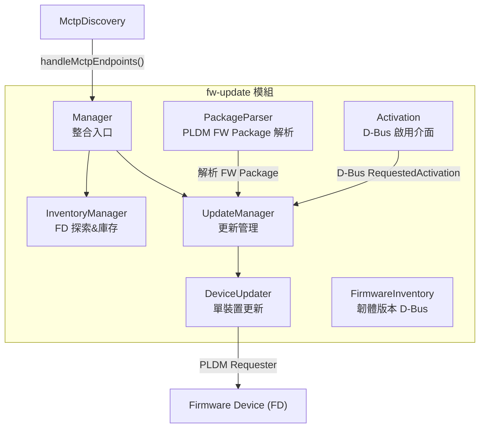
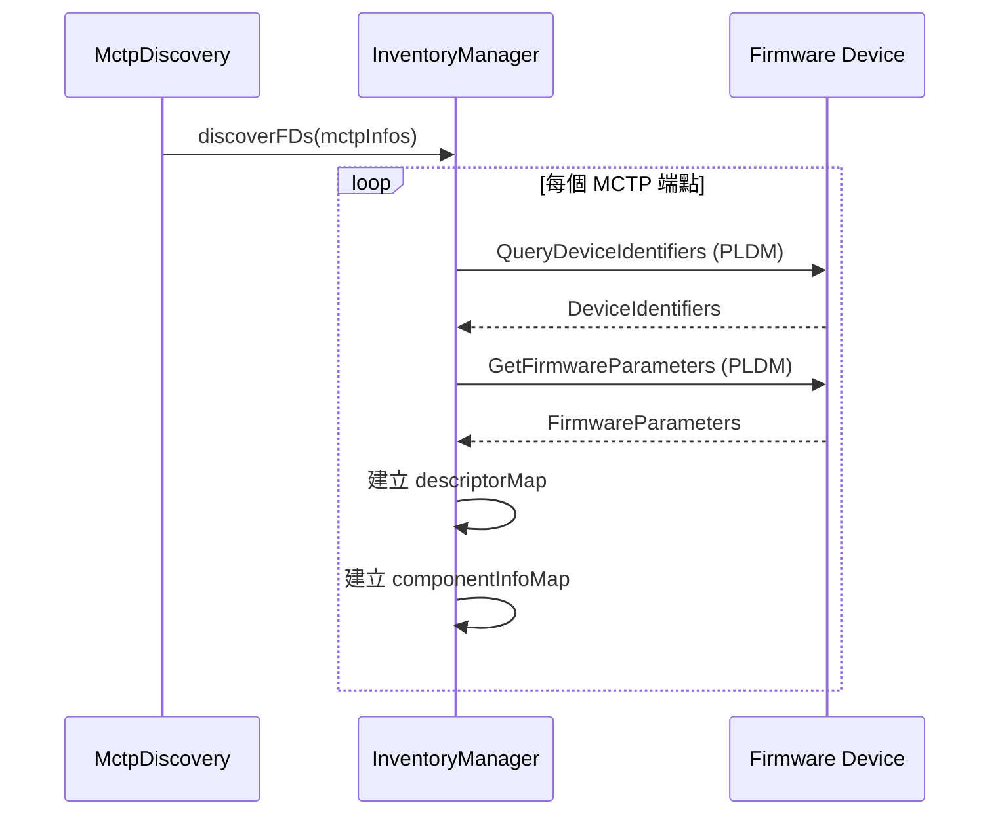
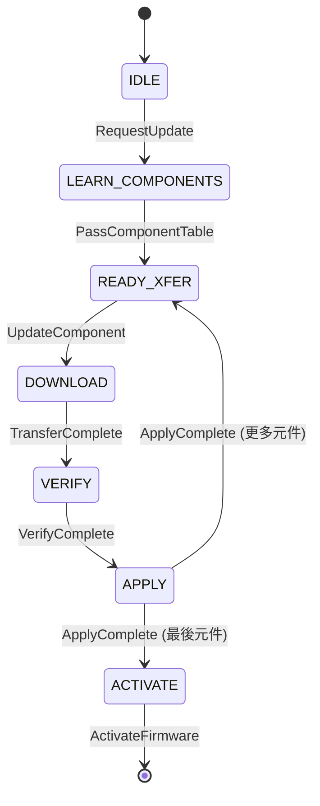
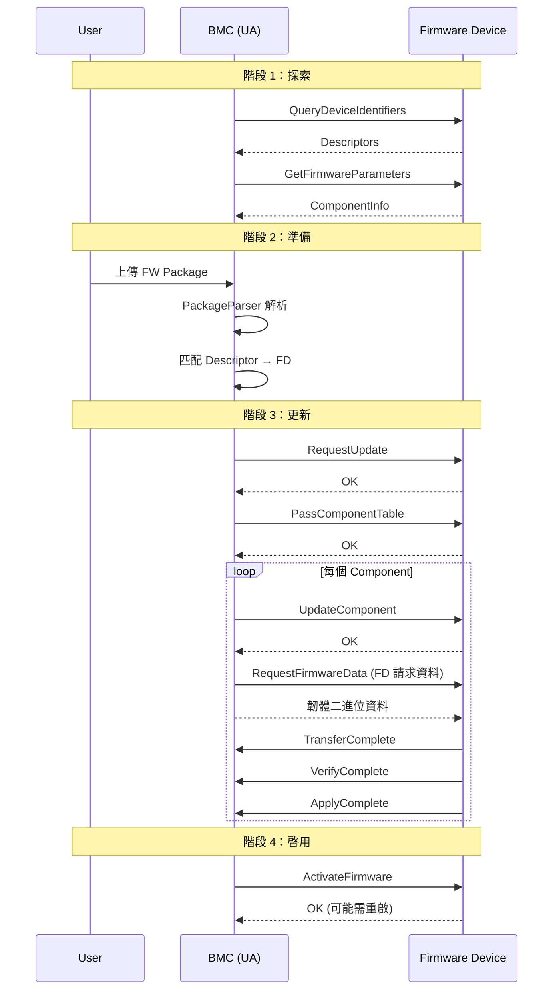

# Firmware Update 模組

Firmware Update 模組實作 PLDM Type 5（Firmware Update）規範，負責透過 PLDM 協議更新 MCTP 設備的韌體。

---

## 概述

| 項目         | 說明                                                              |
| ------------ | ----------------------------------------------------------------- |
| **位置**     | `fw-update/`                                                      |
| **規範**     | DSP0267 — PLDM for Firmware Update                                |
| **檔案數**   | 17 個                                                             |
| **核心類別** | `Manager`、`InventoryManager`、`UpdateManager`、`DeviceUpdater`   |
| **特殊路由** | pldmd 中 Type 5 繞過 Invoker，直接呼叫 `Manager::handleRequest()` |

---

## 架構



> **逐步說明（fw-update 架構圖）：**
>
> 這張圖展示 `fw-update` 模組內各元件的協作關係。箭頭表示「呼叫/觸發」，不是繼承關係。
>
> | 元件                  | 角色                | 觸發時機                                                                                                                                    |
> | --------------------- | ------------------- | ------------------------------------------------------------------------------------------------------------------------------------------- |
> | **MctpDiscovery**     | 外部事件源          | 當 mctpd 發現/移除 MCTP 端點時，呼叫 `handleMctpEndpoints()`                                                                                |
> | **Manager**           | 整合入口            | 同時實作 `MctpDiscoveryHandlerIntf`（接收端點事件）和 `pldmd` 的 Type 5 請求處理入口。是內外溝通的樞紐。                                    |
> | **InventoryManager**  | FD 探索與庫存管理   | 由 Manager 初始化，負責發送 `QueryDeviceIdentifiers` / `GetFirmwareParameters` 建立 `descriptorMap` 和 `componentInfoMap`，供後續適配使用。 |
> | **UpdateManager**     | 整體更新流程管理    | 由 Manager 操控，負責接收使用者觸發（D-Bus `RequestedActivation`）、協調 PackageParser 解析結果、建立多個 `DeviceUpdater` 實例。            |
> | **DeviceUpdater**     | 單一裝置更新狀態機  | 每個待更新的 FD 們有一個独立的 DeviceUpdater 實例。負責執行 DSP0267 定義的完整更新狀態機，透過 **PLDM Requester** 發送命令。                |
> | **PackageParser**     | FW Package 解析     | 解析出載入的 `.pldm` 韌體更新包，提取 DeviceIDRecord 和 ComponentImageInfo，提供給 UpdateManager 做精確適配。                               |
> | **Activation**        | D-Bus 啟用介面      | 暴露 `xyz.openbmc_project.Software.Activation` D-Bus 介面。使用者設定 `RequestedActivation = Active` 即可觸發更新流程。                     |
> | **FirmwareInventory** | 韌體版本 D-Bus 物件 | 將 FD 的韌體版本資訊發佈到 D-Bus，供其他服務（如 Redfish）查詢。                                                                            |
>
> **白話總結**：就像一個「韌體更新中心」——MctpDiscovery 就是門鈴（發現裝置），InventoryManager 負責清點貨架（建立庫存），PackageParser 負責解讀更新包，DeviceUpdater 負責發貨（執行更新），Activation 就是使用者按下的「確認鈕」。

---

## 角色定義（DSP0267）

| 角色 | 英文                    | 說明                        |
| ---- | ----------------------- | --------------------------- |
| UA   | Update Agent            | 更新代理（BMC 扮演此角色）  |
| FD   | Firmware Device         | 被更新的裝置（GPU、NIC 等） |
| FDP  | Firmware Device Package | 韌體更新包                  |

---

## 核心元件

### 1. Manager — 整合入口

```cpp
class Manager : public pldm::MctpDiscoveryHandlerIntf {
    // MCTP 端點事件
    void handleMctpEndpoints(const MctpInfos& mctpInfos) override {
        inventoryMgr.discoverFDs(mctpInfos);  // 探索 FW Devices
    }
    void handleRemovedMctpEndpoints(const MctpInfos& mctpInfos) override {
        inventoryMgr.removeFDs(mctpInfos);
    }

    // 處理 FW Update 命令（從 pldmd 直接呼叫）
    Response handleRequest(mctp_eid_t eid, Command command,
                          const pldm_msg* request, size_t reqMsgLen) {
        return updateManager.handleRequest(eid, command, request, reqMsgLen);
    }

private:
    DescriptorMap descriptorMap;           // FD 描述符
    DownstreamDescriptorMap downstreamDescriptorMap;
    ComponentInfoMap componentInfoMap;     // 元件資訊
    UpdateManager updateManager;          // 更新管理器
    InventoryManager inventoryMgr;         // 庫存管理器
};
```

### 2. InventoryManager — FD 探索

當 `MctpDiscovery` 發現新的 MCTP 端點時：



> **逐步說明（InventoryManager 探索流程）：**
>
> 這張圖展示當 MCTP 發現新端點時，`InventoryManager.discoverFDs()` 內部對每個端點所做的具體步驟。
>
> | 步驟 | 命令                       | 目的與說明                                                                                                                                                                                                            |
> | ---- | -------------------------- | --------------------------------------------------------------------------------------------------------------------------------------------------------------------------------------------------------------------- |
> | 1    | `discoverFDs(mctpInfos)`   | MctpDiscovery 將新發現的端點資訊（EID 列表）傳入。InventoryManager 逐一對每個 FD 發鴈 PLDM 請求。                                                                                                                     |
> | 2    | `QueryDeviceIdentifiers` → | 詢問 FD「你是什麼裝置？」FD 回傳 **DeviceIdentifiers**，包含一組描述符（如 PCI Vendor ID / Device ID，或 IANA Enterprise ID）。這些描述符是後續將 FW Package 中的 DeviceIDRecord 與實際 FD 做**精確比對**的依據。     |
> | 3    | `GetFirmwareParameters` →  | 詢問 FD「你的韌體狀態？」FD 回傳 **FirmwareParameters**，包含：`ActiveComponentVersionString`（目前活躍的版本）、`PendingComponentVersionString`（已下載但尚未啟用）、以及元件的 `capabilities`（支持哪些更新層面）。 |
> | 4    | 建立 `descriptorMap`       | 將 EID 對應的 Descriptors 映射存入 `descriptorMap`，供後續上傳 FW Package 時做精確比對。                                                                                                                              |
> | 5    | 建立 `componentInfoMap`    | 將 EID 對應的元件資訊映射存入 `componentInfoMap`，包含当前版本、元件分類等，供更新時判斷是否需要更新。                                                                                                                |
>
> **白話總結**：就像店員清點貨架——掃描每個裝置的「條碼」（QueryDeviceIdentifiers）和「韌體版本」（GetFirmwareParameters），建立庫存記錄，等使用者上傳更新包時再進行比對安排。

### 3. DeviceUpdater — 單裝置更新

實作 DSP0267 定義的完整更新狀態機：



> **逐步說明（狀態機）：**
>
> 這張圖描述的是 **BMC 端 `DeviceUpdater` 物件**所追蹤的 FD 狀態，以決定「現在應該發哪個命令」。狀態轉移的觸發者是 FD 主動送回的命令（如 `TransferComplete`），UA 只是被通知並推進狀態。
>
> > **與 TypeFirmwareUpdate.md 的差異**：[TypeFirmwareUpdate.md](TypeFirmwareUpdate.md) 中的狀態機是 **FD 的內部視角**（FD 本身在哪個狀態）；這張圖是 **UA（BMC）的外部視角**——`DeviceUpdater` 追蹤它「認為 FD 目前在哪個狀態」，以決定下一步動作。兩者狀態名稱相同，但驅動者不同。
>
> | 狀態                 | UA（DeviceUpdater）在此狀態的動作                                                                                                                                         | 觸發下一狀態的事件                                                                                                |
> | -------------------- | ------------------------------------------------------------------------------------------------------------------------------------------------------------------------- | ----------------------------------------------------------------------------------------------------------------- |
> | **IDLE**             | 初始狀態。等待 UpdateManager 呼叫 `startFirmwareUpdate()` 開始流程。                                                                                                      | `RequestUpdate` 成功，FD 進入 LEARN_COMPONENTS                                                                    |
> | **LEARN_COMPONENTS** | UA 已發送 `RequestUpdate`，等待 FD 確認。接著逐一發送 `PassComponentTable`，將 FW Package 中匹配的元件清單告知 FD。                                                       | `PassComponentTable` 成功，FD 進入 READY_XFER                                                                     |
> | **READY_XFER**       | UA 從待更新清單中取出下一個元件，發送 `UpdateComponent` 通知 FD 開始更新該元件。                                                                                          | `UpdateComponent` 成功，FD 進入 DOWNLOAD                                                                          |
> | **DOWNLOAD**         | UA **被動等待**。FD 會主動送來 `RequestFirmwareData(offset, length)` 索取韌體資料，UA 從 FW Package 中讀出對應位置的資料並回傳。此過程由 FD 主導，UA 只是「資料伺服器」。 | FD 送來 `TransferComplete`，UA 進入 VERIFY                                                                        |
> | **VERIFY**           | UA **靜待**。FD 內部正在進行 CRC 校驗或簽章驗證，UA 僅等待。此階段 UA 可選擇用 `GetStatus` 輪詢進度（但並非必須）。                                                       | FD 送來 `VerifyComplete`，UA 進入 APPLY                                                                           |
> | **APPLY**            | UA **靜待**。FD 正在將韌體寫入 Flash，UA 等待結果。若 `applyResult` 失敗，UA 需處理錯誤（中止或重試）。                                                                   | FD 送來 `ApplyComplete`：<br>• 還有更多元件 → UA 回到 READY_XFER，繼續下一個<br>• 最後一個元件 → UA 進入 ACTIVATE |
> | **ACTIVATE**         | 所有元件已套用完畢。UA 發送 `ActivateFirmware`，等待 FD 的 `EstimatedTimeForActivation` 回應，然後等待裝置重啟或啟動生效。                                                | `ActivateFirmware` 完成 → 進入終止狀態 `[*]`，DeviceUpdater 生命週期結束                                          |
>
> **白話總結**：UA 像「外送員」——先確認訂單（LEARN → READY_XFER）→ 等顧客（FD）自己來領貨（DOWNLOAD，FD 主動拉）→ 等顧客驗貨（VERIFY）→ 等顧客安裝（APPLY）→ 按電源鈕（ACTIVATE）。

### 4. PackageParser — FW Package 解析

解析 DSP0267 定義的 PLDM Firmware Update Package 格式：

```
+---------------------------+
| Package Header            |
|  - UUID                   |
|  - Package Version        |
|  - Device ID Records      |
+---------------------------+
| Component Image Info      |
|  - Classification         |
|  - Version                |
|  - Size, Offset           |
+---------------------------+
| Component Images          |
|  - Binary firmware data   |
+---------------------------+
| Package Header Checksum   |
+---------------------------+
```

### 5. Activation — D-Bus 啟用

透過 D-Bus `xyz.openbmc_project.Software.Activation` 介面啟動更新：

```bash
# 觸發更新（透過 D-Bus）
busctl set-property xyz.openbmc_project.PLDM \
  /xyz/openbmc_project/software/<hash> \
  xyz.openbmc_project.Software.Activation \
  RequestedActivation s \
  "xyz.openbmc_project.Software.Activation.RequestedActivations.Active"
```

---

## 更新完整流程



> **逐步說明（完整更新流程）：**
>
> 這張圖結合使用者（User）、BMC（UA）和 FD 三個角色，展示整個更新流程。
>
> ---
>
> **階段 1：探索——BMC 建立庫存**
>
> | 步驟                     | 說明                                                                                                        |
> | ------------------------ | ----------------------------------------------------------------------------------------------------------- |
> | `QueryDeviceIdentifiers` | BMC（InventoryManager）查詢 FD 的識別符（PCI VID/PID 等），建立 `descriptorMap`。                           |
> | `GetFirmwareParameters`  | BMC 查詢 FD 的韌體元件資訊，建立 `componentInfoMap`。這兩個步驟在**裝置上線時即自動執行**，不需使用者介入。 |
>
> ---
>
> **階段 2：準備——使用者觸發更新**
>
> | 步驟                  | 說明                                                                                                                                                              |
> | --------------------- | ----------------------------------------------------------------------------------------------------------------------------------------------------------------- |
> | 使用者上傳 FW Package | 使用者通過 D-Bus `RequestedActivation` 或 REST API 發起更新。BMC 將 FW Package 載入內存（或由 `watch.cpp` 監控檔案系統）。                                        |
> | PackageParser 解析    | `PackageParser` 解析包頭，提取 **DeviceIDRecords**（包含 Descriptor 用於比對 FD）和 **ComponentImageInfos**（包含各元件的版本、大小、偏移）。                     |
> | 匹配 Descriptor → FD  | UpdateManager 用 FW Package 的 DeviceIDRecord 與 `descriptorMap` 中對應 EID 的 Descriptors 做精確匹配，確認該包適用於哪些 FD，並建立對應的 `DeviceUpdater` 實例。 |
>
> ---
>
> **階段 3：更新——協商與傳輸（每個 Component 重複）**
>
> | 步驟                  | 命令                                    | 說明                                                                                                                                                                                                          |
> | --------------------- | --------------------------------------- | ------------------------------------------------------------------------------------------------------------------------------------------------------------------------------------------------------------- |
> | 協商開始              | `RequestUpdate` →                       | BMC 通知 FD 開始更新流程，傳遞 `maxTransferSize` 和 `numComponents`。                                                                                                                                         |
> |                       | `PassComponentTable` →                  | BMC 逐一列見將要更新的元件，FD 回應是否接受。                                                                                                                                                                 |
> | 單元件更新            | `UpdateComponent` →                     | BMC 指定此次更新的元件，包含版本與映像大小。                                                                                                                                                                  |
> | **傳輸（Pull 模式）** | ← `RequestFirmwareData(offset, length)` | ⚠️ **方向反轉**：是 **FD 主動向 BMC** 索取韌體資料，不是 BMC 主動推送。FD 用 `offset` + `length` 指定要的區段，BMC 從 FW Package 中讀出對應位置的資料并回傳。此設計使 FD 能依自身線速和 buffer 大小分批請求。 |
> | 傳輸完成              | ← `TransferComplete`                    | FD 完成所有資料索取後發出通知。                                                                                                                                                                               |
> | 驗證                  | ← `VerifyComplete`                      | FD 完成韌體完整性檢查（CRC-32 等）後發出通知。BMC 將為每個元件等待此事件。                                                                                                                                    |
> | 套用                  | ← `ApplyComplete`                       | FD 完成韌體寫入 Flash 後發出通知。若還有元件，BMC 從 `UpdateComponent` 重新開始。                                                                                                                             |
>
> ---
>
> **階段 4：啟用**
>
> | 步驟 | 命令                 | 說明                                                                   |
> | ---- | -------------------- | ---------------------------------------------------------------------- |
> | 啟用 | `ActivateFirmware` → | BMC 下令啟用新韌體。FD 回傳 `OK`，可能就此自行重啟或下次冷開機時生效。 |
>
> **重要設計要點**：傳輸階段是「裝置主動拉資料」（FD 發 `RequestFirmwareData`），而非 BMC 主動推送。這讓 FD 可以與自身的緩衝區大小匹配，避免溢位或起隱换環（throttling）問題。

---

## 原始碼結構

| 檔案                                 | 大小  | 說明                                    |
| ------------------------------------ | ----- | --------------------------------------- |
| `manager.hpp`                        | 4.7KB | 模組入口，整合 InventoryMgr + UpdateMgr |
| `inventory_manager.cpp/hpp`          | 27KB  | FD 探索和庫存管理                       |
| `device_updater.cpp/hpp`             | 37KB  | 單裝置更新狀態機                        |
| `update_manager.cpp/hpp`             | 15KB  | 更新管理器                              |
| `aggregate_update_manager.cpp/hpp`   | 6KB   | 聚合更新管理（管理多裝置聚合更新）      |
| `package_parser.cpp/hpp`             | 12KB  | FW Package 解析器                       |
| `activation.cpp/hpp`                 | 5KB   | D-Bus 啟用介面                          |
| `firmware_inventory.cpp/hpp`         | 8KB   | 韌體版本 D-Bus 物件                     |
| `firmware_inventory_manager.cpp/hpp` | 7KB   | 韌體庫存管理                            |
| `watch.cpp/hpp`                      | 3KB   | 檔案監視器                              |

---

## 相關文件

- [TypeFirmwareUpdate](TypeFirmwareUpdate.md) - PLDM FW Update 協議詳細
- [Pldmd](Pldmd.md) - Type 5 的特殊路由
- [Requester](Requester.md) - 請求管理

---

_返回 [Home](Home.md)_
