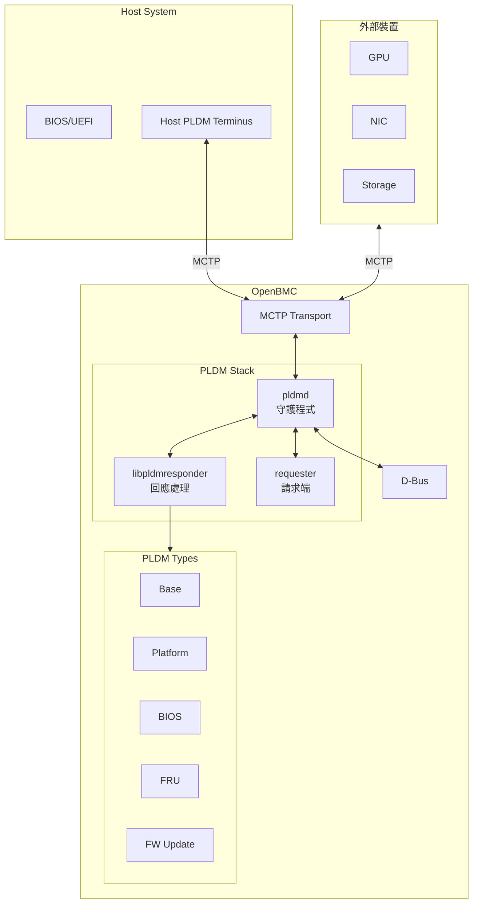

# OpenBMC PLDM Technical Wiki 🔧

歡迎來到 OpenBMC PLDM (Platform Level Data Model) 專案的技術文件 Wiki。

---

## 📖 什麼是 PLDM？

**PLDM (Platform Level Data Model)** 是由 DMTF (Distributed Management Task Force) 定義的一套標準化資料模型與訊息格式，用於平台管理功能。在 OpenBMC 中，PLDM 實現了 BMC 與 Host、其他管理控制器之間的標準化通訊協議。

### 核心特性

| 特性           | 說明                                                            |
| -------------- | --------------------------------------------------------------- |
| **標準化訊息** | 遵循 DMTF PLDM 規範，實現一致且可互操作的通訊                   |
| **模組化設計** | 支援多種 PLDM Types：Base、Platform、BIOS、FRU、Firmware Update |
| **可擴充性**   | 支援 OEM 自訂命令與功能擴充                                     |
| **整合性**     | 與 OpenBMC 其他元件無縫整合                                     |

---

## 📖 建議閱讀路徑

### 🚀 新手入門

1. [PLDMOverview](PLDMOverview.md) - 了解 PLDM 協議基礎
2. [Architecture](Architecture.md) - 認識系統架構
3. [DMTFSpecifications](DMTFSpecifications.md) - 參考 DMTF 規範

### 🔧 開發者路線

1. [Architecture](Architecture.md) - 系統設計
2. [CodeOrganization](CodeOrganization.md) - 程式碼結構
3. [CodeFlows](CodeFlows.md) - Requester/Responder 流程
4. [SourceCodeWalkthrough](SourceCodeWalkthrough.md) - pldmd 完整呼叫鏈走讀
5. 選擇對應的 Type 文件：
   - 平台監控：[TypePlatform](TypePlatform.md) → [PDRImplementation](PDRImplementation.md)
   - BIOS：[TypeBIOS](TypeBIOS.md) → [BIOSConfig](BIOSConfig.md)
   - 韌體更新：[TypeFirmwareUpdate](TypeFirmwareUpdate.md) → [FirmwareUpdate](FirmwareUpdate.md)
6. [Pldmd](Pldmd.md) - 守護程式詳解
7. [Pldmtool](Pldmtool.md) - 除錯工具

### 🔌 整合開發者

1. [HostBMC](HostBMC.md) - Host-BMC PDR 交換
2. [PlatformMC](PlatformMC.md) - Platform Management Controller
3. [OEMExtension](OEMExtension.md) - OEM 擴充開發

### 🔍 問題排查

1. [Troubleshooting](Troubleshooting.md) - 診斷問題
2. [Pldmtool](Pldmtool.md) - 使用 pldmtool 除錯

---

## 🗂️ 文件導覽

### 核心概念

| 文件                                              | 說明                         |
| ------------------------------------------------- | ---------------------------- |
| [Architecture](Architecture.md)                   | 系統架構與設計理念           |
| [PLDMOverview](PLDMOverview.md)                   | PLDM 協議概述與訊息格式      |
| [DMTFSpecifications](DMTFSpecifications.md)       | DMTF 規範詳細說明            |
| [CodeOrganization](CodeOrganization.md)           | 程式碼組織結構               |
| [CodeFlows](CodeFlows.md)                         | BMC Responder/Requester 流程 |
| [SourceCodeWalkthrough](SourceCodeWalkthrough.md) | pldmd main() 完整呼叫鏈走讀  |

---

### PLDM Types

| 文件                                        | Type Code | 說明                                 |
| ------------------------------------------- | --------- | ------------------------------------ |
| [TypeBase](TypeBase.md)                     | 0         | 基礎通訊與探索命令                   |
| [TypePlatform](TypePlatform.md)             | 2         | 平台監控與控制 (PDR/Sensor/Effecter) |
| [TypeBIOS](TypeBIOS.md)                     | 3         | BIOS 配置與屬性管理                  |
| [TypeFRU](TypeFRU.md)                       | 4         | FRU 資料讀取與格式                   |
| [TypeFirmwareUpdate](TypeFirmwareUpdate.md) | 5         | 韌體更新協議                         |
| [TypeOEM](TypeOEM.md)                       | 63        | OEM 廠商自訂擴充                     |

---

### 核心模組

| 文件                                    | 模組             | 說明                           |
| --------------------------------------- | ---------------- | ------------------------------ |
| [Pldmd](Pldmd.md)                       | pldmd            | PLDM 守護程式                  |
| [Pldmtool](Pldmtool.md)                 | pldmtool         | 命令列測試工具                 |
| [LibpldmResponder](LibpldmResponder.md) | libpldmresponder | PLDM 回應處理函式庫            |
| [PlatformMC](PlatformMC.md)             | platform-mc      | Platform Management Controller |
| [Requester](Requester.md)               | requester        | PLDM Requester 模組            |

---

### 功能模組

| 文件                                      | 說明                   |
| ----------------------------------------- | ---------------------- |
| [FirmwareUpdate](FirmwareUpdate.md)       | 韌體更新流程與實作     |
| [HostBMC](HostBMC.md)                     | Host-BMC PDR 交換機制  |
| [SoftOff](SoftOff.md)                     | 軟關機功能             |
| [PDRImplementation](PDRImplementation.md) | PDR 儲存庫與 JSON 配置 |

---

### 設定與參考

| 文件                                  | 說明                |
| ------------------------------------- | ------------------- |
| [BIOSConfig](BIOSConfig.md)           | BIOS 屬性 JSON 配置 |
| [OEMExtension](OEMExtension.md)       | OEM 擴充開發指南    |
| [Configuration](Configuration.md)     | 建置選項與設定      |
| [Troubleshooting](Troubleshooting.md) | 故障排除與除錯      |

---

## 🏗️ 系統架構概覽



> **逐步說明：**
>
> 這張圖展示 OpenBMC PLDM Stack 的完整架構：
>
> - **Host System**：Host BIOS/UEFI 作為 PLDM Terminus，透過 MCTP 與 BMC 通訊。
> - **OpenBMC**：pldmd 守護程式是核心，連接 libpldmresponder（回應處理）和 requester（請求端）。五種 PLDM Types 提供不同管理功能。D-Bus 是 OpenBMC 內部的通訊匯流排。
> - **外部裝置**：GPU、NIC、Storage 等也透過 MCTP 與 BMC 通訊。
>
> **白話總結**：這是整個 PLDM 系統的「鳥瞰圖」，展示 BMC 如何同時管理 Host 和外部裝置。

---

## 🚀 快速入門

### 建置 PLDM

```bash
# 使用 Meson 建置
meson setup build && meson compile -C build

# 執行單元測試
meson test -C build
```

### 使用 pldmtool

```bash
# 查詢支援的 PLDM Types
pldmtool base GetPLDMTypes

# 取得 TID
pldmtool base GetTID

# 查詢 PDR
pldmtool platform GetPDR -d 0
```

### 啟用 Verbose 模式

```bash
echo 'PLDMD_ARGS="--verbose"' > /etc/default/pldmd
systemctl restart pldmd
```

---

## 📚 DMTF 規範參考

| 規範                                                                                      | 版本  | 說明                     |
| ----------------------------------------------------------------------------------------- | ----- | ------------------------ |
| [DSP0240](https://www.dmtf.org/sites/default/files/standards/documents/DSP0240_1.1.0.pdf) | 1.1.0 | PLDM Base Specification  |
| [DSP0245](https://www.dmtf.org/sites/default/files/standards/documents/DSP0245_1.4.0.pdf) | 1.4.0 | PLDM IDs and Codes       |
| [DSP0247](https://www.dmtf.org/sites/default/files/standards/documents/DSP0247_1.0.0.pdf) | 1.0.0 | PLDM for BIOS Control    |
| [DSP0248](https://www.dmtf.org/sites/default/files/standards/documents/DSP0248_1.3.0.pdf) | 1.3.0 | PLDM for Platform M&C    |
| [DSP0267](https://www.dmtf.org/sites/default/files/standards/documents/DSP0267_1.2.0.pdf) | 1.2.0 | PLDM for Firmware Update |

---

## 🔗 相關連結

- [openbmc/pldm GitHub](https://github.com/openbmc/pldm)
- [openbmc/libpldm GitHub](https://github.com/openbmc/libpldm)
- [OpenBMC 官方文件](https://github.com/openbmc/docs)
- [DMTF PLDM 規範](https://www.dmtf.org/standards/pldm)

---

_最後更新：2025-12-19_
