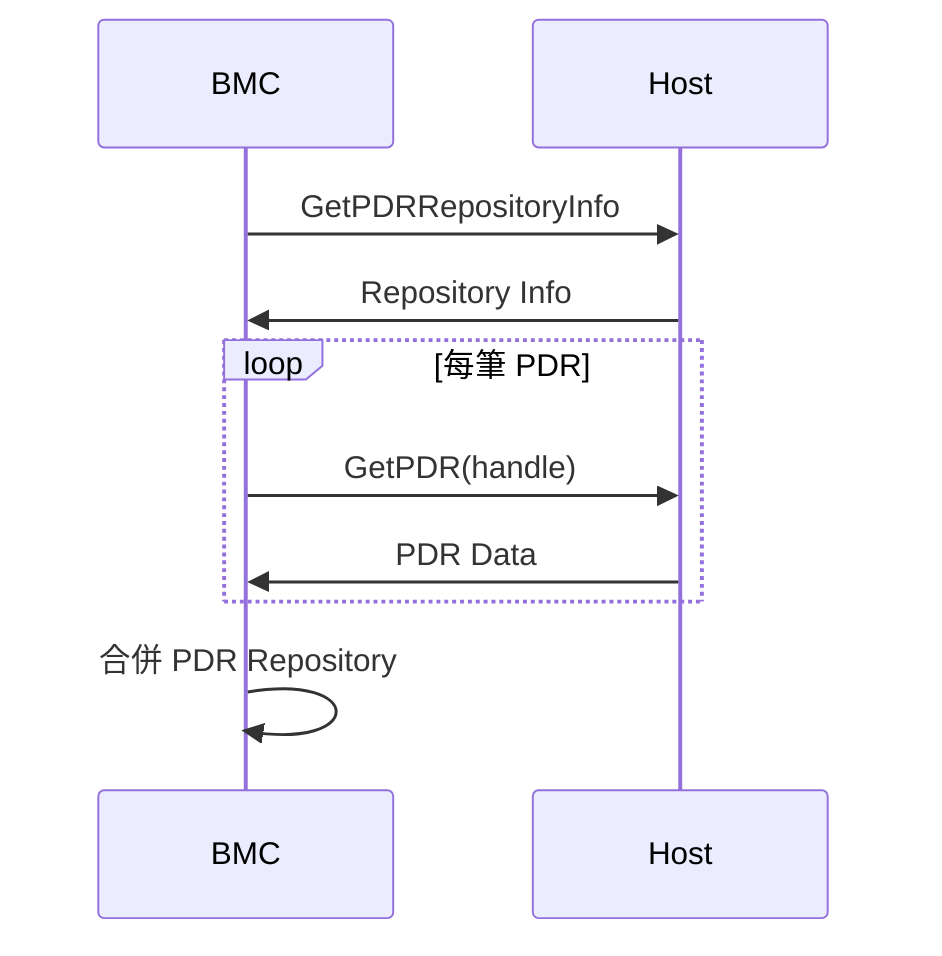
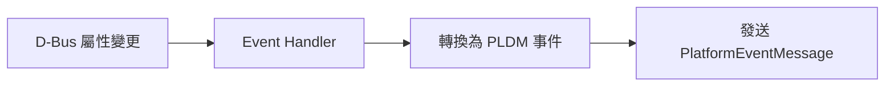

# Host-BMC 通訊

host-bmc 模組處理 BMC 與 Host 之間的 PLDM 通訊。

---

## 概述

| 項目 | 說明 |
|------|------|
| **位置** | `host-bmc/` |
| **功能** | Host PDR 交換、事件轉換 |

---

## 核心功能

### PDR 交換

BMC 從 Host 取得 PDR 並合併到本地儲存庫：

### D-Bus 事件轉換

監聽 D-Bus 屬性變更並轉換為 PLDM 事件：

---

## 原始碼

| 檔案 | 說明 |
|------|------|
| `host_pdr_handler.cpp/hpp` | Host PDR 處理 |
| `dbus_to_event_handler.cpp/hpp` | D-Bus 轉事件 |
| `host_condition.cpp/hpp` | Host 狀態監控 |

---

*返回 [Home](Home.md)*
