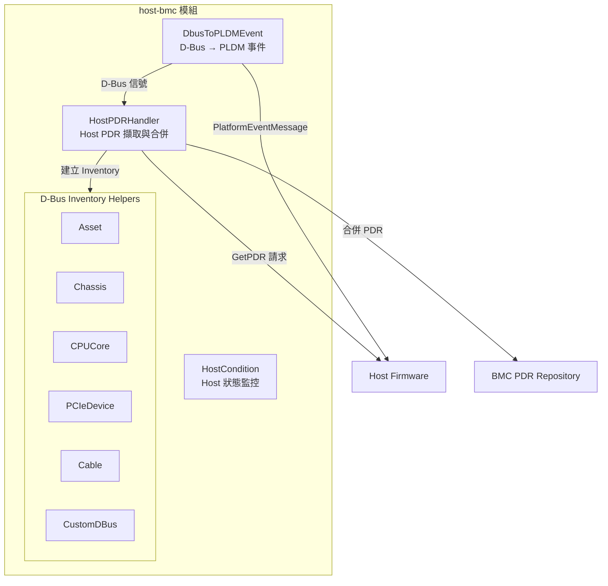
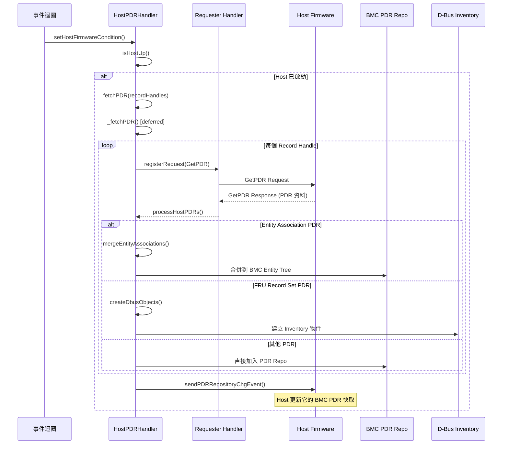
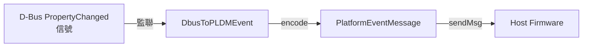

# Host-BMC 模組

Host-BMC 模組處理 BMC 與 Host Firmware（如 PHYP、x86 BIOS）之間的 PLDM 互動，是 OpenBMC PLDM 中最複雜的子系統之一。

---

## 概述

| 項目         | 說明                                                                   |
| ------------ | ---------------------------------------------------------------------- |
| **位置**     | `host-bmc/`                                                            |
| **核心類別** | `HostPDRHandler`                                                       |
| **功能**     | Host PDR 擷取與合併、D-Bus 事件轉換、FRU/Inventory 管理、Host 狀態感測 |
| **原始碼**   | `host_pdr_handler.cpp`（~46KB）、26 個 D-Bus helper 檔案               |

---

## 架構



> **逐步說明：**
>
> 這張圖展示 host-bmc 模組的架構：
>
> - **HostPDRHandler**：從 Host 拉取 PDR，合併到 BMC 的 PDR Repository，並建立 D-Bus Inventory 物件。
> - **DbusToPLDMEvent**：監聽 D-Bus 屬性變更，轉換為 PLDM 事件發給 Host（如 BMC Boot 狀態變更）。
> - **HostCondition**：監控 Host 是否已準備好進行 PLDM 通訊。
> - **D-Bus Inventory Helpers**：對應各種硬體型別（CPU、PCIe、Cable 等）的 D-Bus 物件建立工具。
>
> **白話總結**：host-bmc 是 BMC 和 Host 之間的「橋樑」——從 Host 拿硬體資訊，同時將 BMC 的狀態變更通知 Host。

---

## HostPDRHandler 深度分析

### 類別定義

```cpp
class HostPDRHandler {
public:
    // 從 Host 擷取 PDR
    void fetchPDR(PDRRecordHandles&& recordHandles);

    // 向 Host 發送 PDR Repository Change 事件
    void sendPDRRepositoryChgEvent(std::vector<uint8_t>&& pdrTypes,
                                    uint8_t eventDataFormat);

    // 查找 Host Sensor 資訊
    const pdr::SensorInfo& lookupSensorInfo(const SensorEntry& entry) const;

    // 處理 State Sensor Event
    int handleStateSensorEvent(const StateSensorEntry& entry,
                               pdr::EventState state);

    // 設定 Host Firmware 狀態（pldmd 啟動時呼叫）
    void setHostFirmwareCondition();
    bool isHostUp();

private:
    // 非同步 PDR 擷取
    void _fetchPDR(sdeventplus::source::EventBase& source);
    void processHostPDRs(mctp_eid_t eid, const pldm_msg* response, size_t len);
    void mergeEntityAssociations(const std::vector<uint8_t>& pdr, ...);

    // FRU 相關
    void createDbusObjects(const PDRList& fruRecordSetPDRs);
    void getFRURecordTableByRemote(const PDRList& fruRecordSetPDRs, uint16_t records);
    void setFRUDataOnDBus(const PDRList&, const std::vector<FruRecordDataFormat>&);
};
```

### PDR 擷取流程



> **逐步說明：**
>
> 這張圖展示 HostPDRHandler 從 Host 擷取 PDR 的完整流程：
>
> 1. **檢查 Host 狀態**：先確認 Host 已啟動，可以進行 PLDM 通訊。
> 2. **遍歷拉取 PDR**：對每個 Record Handle 發送 `GetPDR` 請求，根據 PDR 類型做不同處理：
>    - **Entity Association PDR**：合併到 BMC 的 Entity Tree（建立硬體層次關係）。
>    - **FRU Record Set PDR**：建立 D-Bus Inventory 物件（讓 OpenBMC 知道 Host 上有哪些硬體）。
>    - **其他 PDR**：直接加入 BMC 的 PDR Repository。
> 3. **通知 Host**：發送 `PDRRepositoryChgEvent`，告訴 Host：「BMC 的 PDR 已更新，請同步」。
>
> **白話總結**：就像合併兩家公司的資產清單——從 Host 拿全部硬體清單，依類型派發處理，最後通知雙方「清單已同步」。

### SensorEntry 結構

用來唯一識別 Host Sensor PDR：

```cpp
struct SensorEntry {
    pdr::TerminusID terminusID;  // Host 的 Terminus ID
    pdr::SensorID   sensorID;   // Sensor ID

    bool operator==(const SensorEntry& e) const;
    bool operator<(const SensorEntry& e) const;
};

using HostStateSensorMap = std::map<SensorEntry, pdr::SensorInfo>;
```

### TLPDRMap — Terminus Locator 映射

```cpp
using TerminusInfo = std::tuple<pdr::TerminusID, pdr::EID, pdr::TerminusValidity>;
using TLPDRMap = std::map<pdr::TerminusHandle, TerminusInfo>;
```

---

## D-Bus 事件轉換（`dbus_to_event_handler`）

`DbusToPLDMEvent` 監聽 D-Bus 屬性變更信號，並將其轉換為 PLDM `PlatformEventMessage` 發送給 Host：



> **逐步說明：**
>
> 這張圖展示 D-Bus 事件轉換為 PLDM 事件的流程：
>
> 1. **D-Bus 信號**：OpenBMC 中某個 D-Bus 屬性變更（例如 BMC Boot 狀態變成 "Ready"）。
> 2. **DbusToPLDMEvent 監聽到變更**：將 D-Bus 屬性值轉換為 PLDM 事件格式。
> 3. **編碼並發送給 Host**：透過 `PlatformEventMessage` 發送給 Host Firmware。
>
> **白話總結**：BMC 上的狀態變更必須「翻譯」成 PLDM 格式才能告訴 Host。DbusToPLDMEvent 就是這個「翻譯官」。

---

## D-Bus Inventory Helpers（`host-bmc/dbus/`）

每種硬體元件類型都有對應的 D-Bus helper：

| 檔案                     | D-Bus 介面                                         | 說明                |
| ------------------------ | -------------------------------------------------- | ------------------- |
| `asset.cpp/hpp`          | `xyz.openbmc_project.Inventory.Decorator.Asset`    | 資產資訊            |
| `availability.cpp/hpp`   | `xyz.openbmc_project.State.Decorator.Availability` | 可用性狀態          |
| `chassis.cpp/hpp`        | `xyz.openbmc_project.Inventory.Item.Chassis`       | 機殼                |
| `cpu_core.cpp/hpp`       | `xyz.openbmc_project.Inventory.Item.CpuCore`       | CPU 核心            |
| `pcie_device.cpp/hpp`    | `xyz.openbmc_project.Inventory.Item.PCIeDevice`    | PCIe 設備           |
| `pcie_slot.cpp/hpp`      | `xyz.openbmc_project.Inventory.Item.PCIeSlot`      | PCIe 插槽           |
| `cable.cpp/hpp`          | `xyz.openbmc_project.Inventory.Item.Cable`         | 線纜                |
| `inventory_item.cpp/hpp` | `xyz.openbmc_project.Inventory.Item`               | 通用庫存項目        |
| `custom_dbus.cpp/hpp`    | 多介面                                             | 自訂 D-Bus 物件管理 |

另有僅標頭定義的類型：`Board.hpp`、`Connector.hpp`、`FabricAdapter.hpp`、`Fan.hpp`、`Motherboard.hpp`、`Panel.hpp`、`PowerSupply.hpp`、`VRM.hpp`

---

## Host 狀態監控（`host_condition`）

`host_condition.cpp` 實作 D-Bus 介面，報告 Host 是否已準備好進行 PLDM 通訊。

---

## 原始碼結構

| 檔案                            | 大小     | 說明                          |
| ------------------------------- | -------- | ----------------------------- |
| `host_pdr_handler.cpp`          | 47KB     | Host PDR 處理核心（最大檔案） |
| `host_pdr_handler.hpp`          | 13KB     | HostPDRHandler 類別定義       |
| `dbus_to_event_handler.cpp/hpp` | 7KB      | D-Bus → PLDM 事件轉換         |
| `host_condition.cpp/hpp`        | 3KB      | Host 狀態監控                 |
| `utils.cpp/hpp`                 | 3KB      | Host-BMC 工具函式             |
| `dbus/`                         | 26 files | D-Bus Inventory helpers       |

---

## 相關文件

- [Pldmd](Pldmd.md) - pldmd 守護程式（啟動時呼叫 `setHostFirmwareCondition`）
- [PDRImplementation](PDRImplementation.md) - PDR Repository 與 Entity Association
- [TypePlatform](TypePlatform.md) - Platform Monitoring & Control 協議

---

_返回 [Home](Home.md)_
