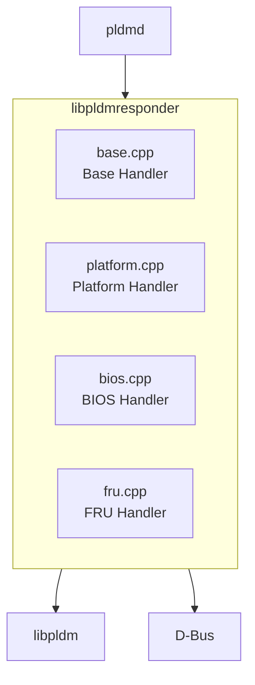

# libpldmresponder 函式庫

libpldmresponder 提供 PLDM Responder 的訊息處理函式。

---

## 概述

| 項目 | 說明 |
|------|------|
| **類型** | 靜態函式庫 |
| **語言** | C++ |
| **位置** | `libpldmresponder/` |

---

## 架構



---

## Handler 實作模式

```cpp
// 標準 Handler 簽名
Response Handler::handleCommand(const pldm_msg* request, size_t payloadLength) {
    // 1. 解碼請求
    decode_xxx_req(request, payloadLength, ...);
    
    // 2. 業務邏輯
    auto result = processRequest(...);
    
    // 3. 編碼回應
    Response response(sizeof(pldm_msg_hdr) + responseSize);
    encode_xxx_resp(instanceId, result, response.data());
    
    return response;
}
```

---

## 主要 Handler

| Handler | 檔案 | PLDM Type |
|---------|------|-----------|
| Base | `base.cpp` | Type 0 |
| Platform | `platform.cpp` | Type 2 |
| BIOS | `bios.cpp` | Type 3 |
| FRU | `fru.cpp` | Type 4 |

---

## PDR 處理

PDR 相關檔案：

| 檔案 | 說明 |
|------|------|
| `pdr.cpp/hpp` | PDR 基礎 |
| `pdr_utils.cpp/hpp` | 工具函式 |
| `pdr_state_sensor.hpp` | State Sensor PDR |
| `pdr_state_effecter.hpp` | State Effecter PDR |
| `pdr_numeric_effecter.hpp` | Numeric Effecter PDR |

---

## OEM 擴充

透過 `oem_handler.hpp` 介面擴充：

```cpp
class OemHandler {
public:
    virtual int setOemEffecter(...);
    virtual int processOemEvent(...);
    virtual void buildOemPDR(...);
};
```

---

*返回 [Home](Home.md)*
