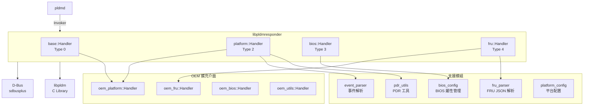
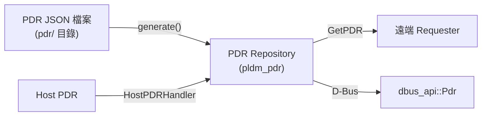
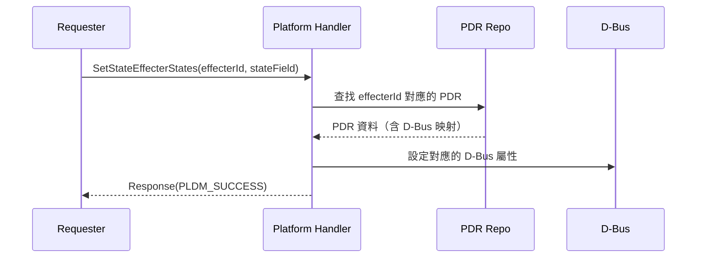
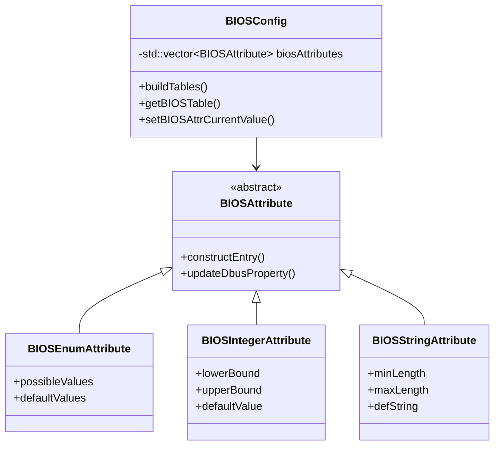

# libpldmresponder 函式庫

libpldmresponder 是 pldmd 的核心函式庫，提供所有 **PLDM Responder** 訊息處理功能——當 BMC 收到來自 Host 或其他 Terminus 的 PLDM 請求時，由此函式庫負責解碼、處理並生成回應。

---

## 概述

| 項目         | 說明                                                  |
| ------------ | ----------------------------------------------------- |
| **類型**     | 靜態函式庫（`libpldmresponder`）                      |
| **位置**     | `libpldmresponder/`                                   |
| **檔案數**   | 38 個（含 2 個子目錄）                                |
| **編譯選項** | `meson.options` 中 `libpldmresponder`（預設 enabled） |

---

## 架構



> **逐步說明：**
>
> 這張圖展示 libpldmresponder 的完整架構：
>
> - **核心 Handler**（4 個）：Base(Type 0)、Platform(Type 2)、BIOS(Type 3)、FRU(Type 4)，各自處理對應類型的 PLDM 命令。
> - **支援模組**：PDR 工具、事件解析、FRU JSON 解析、BIOS 配置、平台配置——為 Handler 提供輔助功能。
> - **OEM 擴充介面**：廠商可以插入自訂邏輯，不修改核心程式碼。
> - **底層依賴**：libpldm（編解碼）和 D-Bus（和 OpenBMC 互動）。
>
> **白話總結**：libpldmresponder 是「回應機器」，專門處理別人問 BMC 的請求。四個 Handler 各司其職，支援模組提供工具，OEM 留了擴充點。

---

## Handler 實作模式

所有 Handler 繼承自 `CmdHandler`（`pldmd/handler.hpp`），在建構時以 `handlers.emplace(COMMAND, func)` 註冊命令處理函式：

```cpp
// 標準 Handler 實作模式
class SomeHandler : public CmdHandler {
public:
    SomeHandler() {
        // 建構時註冊所有支援的命令
        handlers.emplace(PLDM_SOME_CMD,
            [this](pldm_tid_t tid, const pldm_msg* request, size_t len) {
                return this->handleSomeCmd(request, len);
            });
    }

    Response handleSomeCmd(const pldm_msg* request, size_t payloadLength) {
        // 1. 使用 libpldm 解碼請求
        decode_some_req(request, payloadLength, &field1, &field2);

        // 2. 執行業務邏輯（可能涉及 D-Bus 操作）
        auto result = processLogic(field1, field2);

        // 3. 使用 libpldm 編碼回應
        Response response(sizeof(pldm_msg_hdr) + responseSize);
        encode_some_resp(request->hdr.instance_id, PLDM_SUCCESS, ...,
                         reinterpret_cast<pldm_msg*>(response.data()));
        return response;
    }
};
```

---

## Base Handler（Type 0）

`base::Handler`（`base.hpp`/`base.cpp`）處理最基本的 PLDM 探索命令：

| 命令              | 代碼 | 說明                           |
| ----------------- | ---- | ------------------------------ |
| `GetPLDMTypes`    | 0x04 | 回報支援的 PLDM Type 列表      |
| `GetPLDMCommands` | 0x05 | 回報特定 Type 支援的命令列表   |
| `GetPLDMVersion`  | 0x03 | 回報特定 Type 的 PLDM 協議版本 |
| `GetTID`          | 0x02 | 回報本機 Terminus ID           |

> **面試重點**：`GetTID` 回應後會觸發 `_processSetEventReceiver()`，向 Host 發送 `SetEventReceiver` 命令。這是 PLDM 通訊建立的關鍵步驟——告訴 Host 將事件傳送給 BMC。

---

## Platform Handler（Type 2）

`platform::Handler`（`platform.hpp`/`platform.cpp`）是最複雜的 Handler，處理平台監控與控制。原始碼高達 **39KB**。

### 支援的命令

| 命令                      | 說明                              |
| ------------------------- | --------------------------------- |
| `GetPDR`                  | 讀取 Platform Descriptor Records  |
| `SetStateEffecterStates`  | 設定 State Effecter（如電源控制） |
| `GetStateSensorReadings`  | 讀取 State Sensor 值              |
| `SetNumericEffecterValue` | 設定 Numeric Effecter             |
| `GetNumericEffecterValue` | 讀取 Numeric Effecter 目前值      |
| `SetEventReceiver`        | 設定事件接收者                    |
| `PlatformEventMessage`    | 處理平台事件                      |

### PDR 管理

Platform Handler 負責建造和管理 PDR Repository：



> **逐步說明：**
>
> 這張圖展示 PDR Repository 的資料來源和用途：
>
> - **輸入 1：PDR JSON 檔**→ 透過 `generate()` 生成 PDR（BMC 本地的 Sensor/Effecter 描述）。
> - **輸入 2：Host PDR**→ 透過 HostPDRHandler 從 Host 拉取並合併。
> - **輸出 1**：透過 `GetPDR` 命令回應給遠端 Requester。
> - **輸出 2**：透過 D-Bus API 讓 OpenBMC 其他服務查詢。
>
> **白話總結**：PDR Repository 就像「硬體型錄」，從 JSON 和 Host 收集資料，供內外查詢使用。

PDR 生成相關的標頭檔：

| 檔案                       | 說明                              |
| -------------------------- | --------------------------------- |
| `pdr_state_sensor.hpp`     | 從 JSON 生成 State Sensor PDR     |
| `pdr_state_effecter.hpp`   | 從 JSON 生成 State Effecter PDR   |
| `pdr_numeric_effecter.hpp` | 從 JSON 生成 Numeric Effecter PDR |
| `pdr_utils.cpp/hpp`        | PDR 工具函式（Repo 操作、解碼）   |
| `pdr.cpp/hpp`              | PDR 基礎功能                      |

### 事件處理

Platform Handler 支援多種事件類型，且可透過 `registerEventHandlers()` 擴充：

```cpp
void registerEventHandlers(EventType eventId, EventHandlers handlers) {
    if (eventHandlersMap.contains(eventId)) {
        eventHandlersMap[eventId].insert(..., handlers.begin(), handlers.end());
    } else {
        eventHandlersMap.emplace(eventId, handlers);
    }
}
```

OEM 廠商可透過此介面註冊自定義 event class 的處理器。

### Effecter 操作

Effecter 的設定涉及 PDR → D-Bus 屬性映射：



> **逐步說明：**
>
> 這張圖展示設定 State Effecter 的流程：
>
> 1. **請求者發送 SetStateEffecterStates**：指定 Effecter ID 和想設定的狀態。
> 2. **查找 PDR**：Platform Handler 從 PDR Repository 查找這個 Effecter ID 對應哪個 D-Bus 屬性。
> 3. **設定 D-Bus 屬性**：將 PLDM 狀態轉換為 D-Bus 屬性值並寫入。
> 4. **回應成功**：回傳 PLDM_SUCCESS。
>
> **白話總結**：Effecter 是「控制旋鈕」，PDR 是「對照表」，告訴 Handler 轉某個旋鈕對應設定哪個 D-Bus 屬性。

---

## BIOS Handler（Type 3）

`bios::Handler`（`bios.hpp`/`bios.cpp`）管理 BIOS 配置屬性。

### 支援的命令

> **注意**：實隞 bios handler 只註冊以下 6 個命令，並非按表格類型拆分。

| 命令                                   | 說明                                                      |
| -------------------------------------- | --------------------------------------------------------- |
| `GetBIOSTable`                         | 取得 BIOS 表格（以 tableType 參數區分 String/Attr/Value） |
| `SetBIOSTable`                         | 設定 BIOS 表格                                            |
| `GetBIOSAttributeCurrentValueByHandle` | 依 Handle 取得屬性當前值                                  |
| `SetBIOSAttributeCurrentValue`         | 設定屬性當前值                                            |
| `GetDateTime`                          | 取得日期時間                                              |
| `SetDateTime`                          | 設定日期時間                                              |

> 已根據 `libpldmresponder/bios.cpp` L78-108 handler 註冊驗證。

### BIOS 屬性系統



> **逐步說明（類別圖）：**
>
> 這張圖展示 BIOS 屬性的繼承體系：
>
> - **BIOSAttribute**（抽象基底）：定義所有 BIOS 屬性的共同介面（`constructEntry()`、`updateDbusProperty()`）。
> - **BIOSEnumAttribute**：列舉型屬性（如 BootMode: Legacy/UEFI）。
> - **BIOSIntegerAttribute**：整數型屬性（如 MemorySize: 0-65535）。
> - **BIOSStringAttribute**：字串型屬性（如 AssetTag: "Server01"）。
> - **BIOSConfig**：管理所有 BIOSAttribute 的容器，負責建表和查詢。
>
> **白話總結**：三種屬性型別都是 BIOSAttribute 的「子類」，共享相同的介面但各有不同的處理邏輯。這是經典的「策略模式」。

相關檔案：

| 檔案                             | 大小 | 說明                                  |
| -------------------------------- | ---- | ------------------------------------- |
| `bios_config.cpp`                | 41KB | BIOS 配置管理核心（建表、D-Bus 整合） |
| `bios_config.hpp`                | 14KB | BIOS 配置類別定義                     |
| `bios_table.cpp/hpp`             | 25KB | BIOS 表格操作工具                     |
| `bios_enum_attribute.cpp/hpp`    | 13KB | 列舉型屬性                            |
| `bios_integer_attribute.cpp/hpp` | 10KB | 整數型屬性                            |
| `bios_string_attribute.cpp/hpp`  | 9KB  | 字串型屬性                            |
| `bios_attribute.cpp/hpp`         | 5KB  | 屬性抽象基底類別                      |

---

## FRU Handler（Type 4）

`fru::Handler`（`fru.hpp`/`fru.cpp`）管理 FRU（Field Replaceable Unit）資料。

### 支援的命令

| 命令                        | 說明                  |
| --------------------------- | --------------------- |
| `GetFRURecordTableMetadata` | 取得 FRU 表格的元資料 |
| `GetFRURecordTable`         | 讀取 FRU 記錄表       |
| `GetFRURecordByOption`      | 按條件查詢 FRU 記錄   |

### FRU 表格建造流程


> **逐步說明：**
>
> 這張圖展示 FRU 表格的建造流程：
>
> 1. **讀取 JSON 配置**：`fru_master.json` 定義了 D-Bus 屬性和 PLDM FRU 欄位的對應關係。
> 2. **FruParser 解析**：解析 JSON，建立映射表。
> 3. **讀取 D-Bus 屬性**：根據映射表從 D-Bus Inventory 讀取硬體資訊（製造商、型號等）。
> 4. **FruImpl 建造 FRU Table**：將讀取到的屬性組裝成 PLDM FRU Record Table 的二進位格式。
>
> **重要**：FRU Table 是「懶惰建造」的（lazily built），只有第一次收到 FRU 命令時才會觸發建造。

> **延遲建造**：FRU 表格是 lazily 建造的，只有在收到 FRU 命令或 GetPDR 命令時才會觸發。

**核心類別**：

- `FruImpl`：FRU 表格的建造和管理
- `fru::Handler`：繼承 `CmdHandler`，處理 PLDM FRU 命令
- `FruParser`：解析 JSON 配置，定義 D-Bus 物件路徑到 FRU 欄位的映射

---

## OEM 擴充介面

`oem_handler.hpp` 定義了 4 個 OEM 抽象介面，供各廠商實作（upstream 有 IBM 和 Ampere）：

### oem_platform::Handler

最重要的 OEM 介面，提供平台相關的擴充點：

| 方法                                               | 說明                 |
| -------------------------------------------------- | -------------------- |
| `getOemStateSensorReadingsHandler()`               | OEM Sensor 讀取      |
| `oemSetStateEffecterStatesHandler()`               | OEM Effecter 設定    |
| `buildOEMPDR()`                                    | 建造 OEM PDR         |
| `checkBMCState()`                                  | 檢查 BMC 狀態        |
| `processSetEventReceiver()`                        | 處理事件接收者設定   |
| `setSurvTimer()`                                   | 設定監控計時器       |
| `watchDogRunning()` / `resetWatchDogTimer()`       | Watchdog 管理        |
| `fetchLastBMCRecord()`                             | 取得最後一筆 BMC PDR |
| `handleBootTypesAtPowerOn()` / `...AtChassisOff()` | 開關機 Boot 屬性處理 |

### oem_fru::Handler

```cpp
class Handler : public CmdHandler {
    virtual int processOEMFRUTable(const std::vector<uint8_t>& fruData) = 0;
};
```

### oem_bios::Handler

```cpp
class Handler : public CmdHandler {
    virtual void processOEMBaseBiosTable(const BaseBIOSTable& biosTable) = 0;
};
```

### oem_utils::Handler

```cpp
class Handler : public CmdHandler {
    virtual int setCoreCount(const EntityAssociations& associations,
                             const EntityMaps entityMaps) = 0;
};
```

---

## 原始碼完整結構

| 檔案                            | 大小  | 說明                            |
| ------------------------------- | ----- | ------------------------------- |
| **Base**                        |       |                                 |
| `base.cpp/hpp`                  | 10KB  | Base Handler (Type 0)           |
| **Platform**                    |       |                                 |
| `platform.cpp`                  | 39KB  | Platform Handler 核心實作       |
| `platform.hpp`                  | 23KB  | Platform Handler 定義（592 行） |
| `platform_config.cpp/hpp`       | 8KB   | 平台配置處理                    |
| `platform_numeric_effecter.hpp` | 22KB  | Numeric Effecter 操作           |
| `platform_state_effecter.hpp`   | 6.4KB | State Effecter 操作             |
| `platform_state_sensor.hpp`     | 6.9KB | State Sensor 操作               |
| **BIOS**                        |       |                                 |
| `bios.cpp/hpp`                  | 17KB  | BIOS Handler (Type 3)           |
| `bios_config.cpp/hpp`           | 54KB  | BIOS 配置管理                   |
| `bios_table.cpp/hpp`            | 25KB  | BIOS 表格操作                   |
| `bios_*_attribute.*`            | ~45KB | 三種屬性類型                    |
| **FRU**                         |       |                                 |
| `fru.cpp/hpp`                   | 42KB  | FRU Handler (Type 4)            |
| `fru_parser.cpp/hpp`            | 11KB  | FRU JSON 解析                   |
| **PDR**                         |       |                                 |
| `pdr.cpp/hpp`                   | 2.5KB | PDR 基礎                        |
| `pdr_utils.cpp/hpp`             | 16KB  | PDR 工具函式                    |
| `pdr_state_sensor.hpp`          | 7.3KB | State Sensor PDR 生成           |
| `pdr_state_effecter.hpp`        | 6.9KB | State Effecter PDR 生成         |
| `pdr_numeric_effecter.hpp`      | 10KB  | Numeric Effecter PDR 生成       |
| **事件**                        |       |                                 |
| `event_parser.cpp/hpp`          | 11KB  | 事件 JSON 解析                  |
| **OEM**                         |       |                                 |
| `oem_handler.hpp`               | 6.7KB | OEM 擴充介面定義                |

---

## 相關文件

- [Pldmd](Pldmd.md) - pldmd 守護程式
- [TypePlatform](TypePlatform.md) - Platform Type 協議
- [TypeBIOS](TypeBIOS.md) - BIOS Type 協議
- [TypeFRU](TypeFRU.md) - FRU Type 協議
- [OEMExtension](OEMExtension.md) - OEM 擴充開發指南
- [PDRImplementation](PDRImplementation.md) - PDR 儲存庫與 JSON 配置

---

_返回 [Home](Home.md)_
