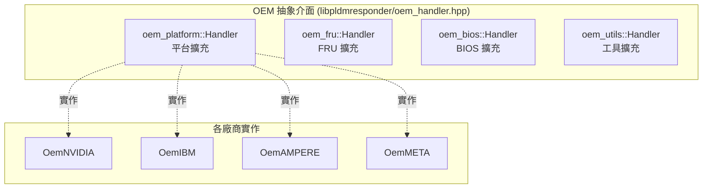

# OEM 擴充機制

PLDM 專案支援多家 OEM 廠商的擴充，透過抽象介面和編譯時條件式實現模組化設計。

---

## 概述

| OEM 廠商 | Meson 選項 | 原始碼目錄 | 類別 | 編譯巨集 |
|----------|-----------|-----------|------|---------|
| **NVIDIA** | `oem-nvidia` | `oem/nvidia/` | `OemNVIDIA` | `OEM_NVIDIA` |
| IBM | `oem-ibm` | `oem/ibm/` | `OemIBM` | `OEM_IBM` |
| Ampere | `oem-ampere` | `oem/ampere/` | `OemAMPERE` | `OEM_AMPERE` |
| Meta | `oem-meta` | `oem/meta/` | `OemMETA` | `OEM_META` |

---

## OEM 介面架構



---

## 四種 OEM 介面

### 1. oem_platform::Handler（最重要）

涵蓋最廣泛的平台擴充功能：

| 方法 | 說明 |
|------|------|
| `getOemStateSensorReadingsHandler()` | 讀取 OEM State Sensor |
| `oemSetStateEffecterStatesHandler()` | 設定 OEM State Effecter |
| `buildOEMPDR(Repo& repo)` | 建造 OEM PDR |
| `processSetEventReceiver()` | 處理事件接收者設定 |
| `checkBMCState()` | 檢查 BMC 狀態 |
| `watchDogRunning()` | Watchdog 是否運行 |
| `resetWatchDogTimer()` | 重設 Watchdog |
| `disableWatchDogTimer()` | 停用 Watchdog |
| `checkAndDisableWatchDog()` | 條件停用 Watchdog |
| `countSetEventReceiver()` | 計數 SetEventReceiver 次數 |
| `fetchLastBMCRecord(pldm_pdr*)` | 取得最後一筆 BMC PDR |
| `checkRecordHandleInRange(handle)` | 檢查是否為遠端 PDR handle |
| `updateOemDbusPaths(path)` | 更新 OEM D-Bus 路徑 |
| `setSurvTimer(tid, value)` | 設定監控計時器 |
| `handleBootTypesAtPowerOn()` | 開機時 Boot 屬性處理 |
| `handleBootTypesAtChassisOff()` | 關機時 Boot 屬性處理 |

### 2. oem_fru::Handler

```cpp
class Handler : public CmdHandler {
    virtual int processOEMFRUTable(const std::vector<uint8_t>& fruData) = 0;
};
```

### 3. oem_bios::Handler

```cpp
class Handler : public CmdHandler {
    virtual void processOEMBaseBiosTable(const BaseBIOSTable& biosTable) = 0;
};
```

### 4. oem_utils::Handler

```cpp
class Handler : public CmdHandler {
    virtual int setCoreCount(const EntityAssociations& associations,
                             const EntityMaps entityMaps) = 0;
};
```

---

## NVIDIA OEM 實作

### 檔案結構

```
oem/nvidia/
└── oem_nvidia.hpp     (76 行)
```

### 核心功能：Legacy CPER 事件相容

```cpp
class OemNVIDIA {
public:
    explicit OemNVIDIA(responder::platform::Handler* platformHandler,
                       platform_mc::Manager* platformManager) {
        createOemEventHandler(platformHandler, platformManager);
    }
private:
    void createOemEventHandler(...) {
        // 註冊 OEM event class 0xFA (legacy CPER)
        platformHandler->registerEventHandlers(
            PLDM_OEM_NVIDIA_LEGACY_CPER_EVENT_CLASS, {...});

        // 同時註冊 polled event handler
        platformManager->registerPolledEventHandler(
            PLDM_OEM_NVIDIA_LEGACY_CPER_EVENT_CLASS, {...});
    }
};
```

### 背景說明

| 項目 | 說明 |
|------|------|
| **Event Class 0xFA** | NVIDIA 在 DSP0248 v1.3.0 之前使用的自訂 CPER event class |
| **Event Class 0x07** | DSP0248 v1.3.0 標準化的 `PLDM_CPER_EVENT` |
| **向後相容** | `OemNVIDIA` 同時支援 0xFA 和 0x07，確保新舊韌體都能正常運作 |
| **CPER** | Common Platform Error Record（UEFI 標準的平台錯誤記錄格式） |

### 在 pldmd 中的註冊

```cpp
// pldmd.cpp 中的條件式初始化
#ifdef OEM_NVIDIA
    std::unique_ptr<pldm::oem_nvidia::OemNVIDIA> oemNVIDIA =
        std::make_unique<pldm::oem_nvidia::OemNVIDIA>(
            platformHandler.get(), platformManager.get());
#endif
```

---

## IBM OEM 實作（參考）

IBM OEM 是最完整的 OEM 實作，包含：

| 模組 | 說明 |
|------|------|
| `oem_ibm.hpp` | pldmd 整合工廠類別 |
| `oem_ibm_handler.cpp/hpp` | OEM Platform Handler |
| `host_lamp_test.cpp/hpp` | Host Lamp 測試功能 |
| `file_io.cpp/hpp` | PLDM File I/O（OEM 命令） |
| `pldmtool oem-ibm` | 專屬 pldmtool 子命令 |

---

## OEM Handler 的注入方式

OEM Handler 透過 setter 方法注入到各模組中：

```cpp
// pldmd.cpp 中
platformHandler->setOemPlatformHandler(oemHandler);
fruHandler->setOemPlatformHandler(oemHandler);
fruHandler->setOemFruHandler(oemFruHandler);
baseHandler->setOemPlatformHandler(oemHandler);
hostPDRHandler->setOemPlatformHandler(oemHandler);
hostPDRHandler->setOemUtilsHandler(oemUtilsHandler);
```

---

## 相關文件

- [LibpldmResponder](LibpldmResponder.md) - OEM 介面定義
- [Pldmd](Pldmd.md) - OEM 初始化流程
- [TypeOEM](TypeOEM.md) - OEM Type 協議說明

---

*返回 [Home](Home.md)*
